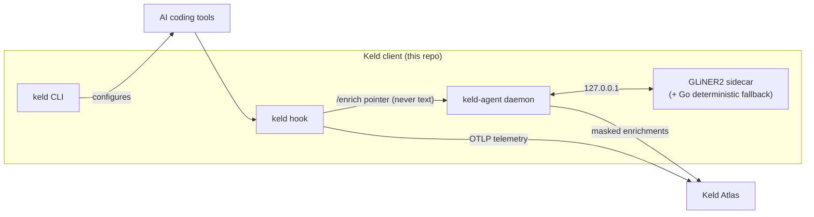

# Keld client — Agent & Contributor Guide

This repo is the **Keld client**: everything Keld runs on an engineer's own
machine. It has two jobs, and the second is the core of the project:

1. **Telemetry** — the `keld` CLI configures local AI coding tools (Claude Code,
   Codex, Gemini CLI) to emit usage telemetry to Keld Atlas.
2. **On-device enrichment** — the `keld-agent` daemon (+ its GLiNER2 sidecar)
   classifies each prompt **locally**, masks anything sensitive, and publishes to
   Atlas only the derived, masked signal. **Raw prompt text never leaves the
   machine.** This is the privacy-preserving intelligence the CLI installs.

Go single static binaries (`keld`, `keld-agent`) + an optional Python ML sidecar.
No runtime dependencies for the CLI itself.

## Architecture



**Two lanes, one privacy invariant.**
- **Telemetry (push):** the hook posts usage telemetry straight to Atlas. No
  daemon involvement.
- **Enrichment (local):** the hook fire-and-forgets a *pointer* (transcript path
  + prompt id — **never text**) to the daemon's loopback `/enrich`. The daemon's
  background worker resolves the text on-device, runs the enrichment pipeline,
  **masks**, and syncs to Atlas `/v1/enrichments`. The prompt text is read
  locally and never transmitted — masking is enforced Go-side before publish.

## The enrichment agent (`keld-agent`) — the core

`cmd/keld-agent` → `internal/agentcli` → `internal/agent/*`. Lifecycle:
`ingress` (loopback HTTP intake, per-user secret, bounded `queue`) → `resolve`
(read prompt text + tail recent prompts from the transcript) → `enrich`
(the pipeline) → `mask` → `publish` (Atlas). Panic-isolated per job; a readiness
gate holds work until the backend is up. Delivery is durable: the hook writes a
prompt *pointer* (never text) to the on-disk `spool` when the daemon is
unreachable, and the daemon drains it on startup + a periodic sweep.

**Enrichment pipeline (`internal/agent/enrich/`).** A staged registry of
extractors ("sweeps") run over a swappable `Model` backend, producing a `Profile`.
Single-flight (never fans out) so the shared model issues at most one inference at
a time. Two waves, up to 7 model calls per prompt:
- **Wave 1** (independent, committed as a batch): `task_type`, `sensitivity`
  (+ masked entity spans; hard span match overrides the classifier, e.g. an
  `api_key` ⇒ `secrets`), `domain` (+ entities), `activity_type`, `personal`,
  `function_guess` (12 business functions).
- **Wave 2** (conditioned on Wave-1 `function_guess`): `subcategory`.
- Label vocabularies live in `labels.go` (gated by `SchemaVersion` — bump it and
  re-run the eval when changing any vocab). Each classify is prefixed with a
  `Meta.Preamble()` (repo/branch/tool/recent prompts) so context informs the guess.

**Model backends.**
- `deterministic.go` — pure-Go, zero-dependency. Used **only when ML is disabled
  or no sidecar binary is present** (the daemon is fully functional without the
  sidecar). When ML is *enabled*, enrichment never silently degrades to it — see
  Delivery reliability.
- `sidecar/` — HTTP client to the GLiNER2 sidecar (`/classify`, `/extract`,
  `/entities`); used when the sidecar binary is provisioned and healthy. Model
  provisioning (`provision/`) fetches weights (`hf.go`) into `~/.keld/models`.
  Why a bundled sidecar over in-process ONNX: `docs/keld-agent-p2-onnx-decision.md`.

**Delivery reliability (never degrade, never wedge).** When ML is enabled,
enrichment always runs on GLiNER2 — an idle-evicted or restarting sidecar is
waited out (client wake + retry), never swapped for deterministic. Each job runs
under a deadline (`KELD_ENRICH_JOB_TIMEOUT`, default 30s) as a **child of the
daemon context**; on timeout the worker **cancels it**, which aborts the job's
in-flight sidecar calls (`Client.WithContext`) so an abandoned attempt is
reclaimed instead of leaking a retry loop that saturates the single-flight
sidecar. A timed-out job re-spools for a later retry, **bounded** by
`KELD_ENRICH_MAX_ATTEMPTS` (default 4) — an exhausted job is `spool.Quarantine`'d
to `spool/bad/` rather than retried forever. Atlas dedups on `dedup_key`, so a
late double-publish from a recovering attempt is harmless.

**Control plane.** Enrichment is governed per-org from Atlas
(`settings/`, `agentcfg/`); the daemon polls `GET /v1/enrichment-settings`
(`KELD_SETTINGS_POLL`). Remote overrides local; non-fatal if Atlas is unreachable.
See `docs/enrichment-settings.md`.

**Resource safety (the sidecar is a good citizen).** Single-flight + bounded
queue (503 backpressure); a **rate governor** (CPU-EWMA min-interval pacing) and a
**CPU thread scaler** (`torch.set_num_threads` capped to host load, default 50%
of cores); **memory eviction** (unload at ≤5% RAM, `malloc_trim` to return RSS,
reload on absolute headroom) and **idle eviction** (unload after inactivity,
reload on demand). `GET /metrics` exposes state/EWMA/threads/queue/counts. Full
mechanisms + load-test validation: **`sidecar/loadtest/README.md`**.

## The CLI (`keld`)

`cmd/keld` → `internal/cli`. Browser-based device-authorization login
(`internal/auth`), tool detection + config editing with summary/diff + backups
(`internal/tools`, `internal/diffview`), hook install (`internal/hook`). Commands:
top-level `login`/`logout`/`whoami`; the `keld signal` group
(`setup`/`status`/`doctor`/`uninstall`) for telemetry onboarding. Config paths via
`internal/paths` (`KELD_HOME`).

## Repo layout

```
cmd/keld/            CLI entrypoint
cmd/keld-agent/      enrichment daemon entrypoint
internal/
  agentcli/          keld-agent cobra commands (run/install/uninstall/...)
  agent/
    ingress/         loopback /enrich intake (auth + bounded queue)
    queue/           bounded, key-deduping job queue (backpressure)
    resolve/         read prompt text + recent-prompt tail from transcripts
    enrich/          the pipeline: extractors, passes, labels, mask, meta, router
      deterministic.go   pure-Go Model (default/fallback)
      sidecar/           HTTP client to the GLiNER2 sidecar
      eval/              enrichment quality eval harness
    provision/       model provisioning (weights → ~/.keld/models)
    publish/         build + POST masked enrichments to Atlas
    settings/ agentcfg/  per-org control-plane polling
    service/         OS service install (darwin/linux/windows)
    daemon/          wires it all together; spawns/superwises the sidecar
  spool/             durable on-disk pointer queue (hook fallback + re-spool/quarantine)
  auth/ cli/ tools/ diffview/ hook/ paths/ telemetry/ config/ console/ ...
sidecar/
  serve.py           entrypoint the daemon spawns (uvicorn on 127.0.0.1)
  app/
    main.py          FastAPI app: /classify /extract /entities /health /metrics;
                     lifespan wires governor + scaler + runner + memory watch
    governor.py      CPU-EWMA rate pacing         runner.py    single-flight runner
    cpuscale.py      host-load → torch threads    memwatch.py  eviction state machine
    metrics.py       /metrics payload             adapter.py   normalize model output
  loadtest/          smoke + soak load-test harness (see its README)
  keld-agent-sidecar.spec / build-freeze.sh   PyInstaller packaging
docs/                enrichment-settings.md, ONNX decision, superpowers/{specs,plans}
scripts/             install.sh / install.ps1, send-test-prompt.py, enrichments-sink.py
```

## Building & running

```bash
make build-binaries    # keld + keld-agent (Go)
make sidecar           # create the Python 3.12 sidecar venv (~/.keld/sidecar-venv) + wrapper
make install-linux     # build-binaries + sidecar + install the systemd --user service
make send-test-prompt  # push one test prompt to the running daemon
make uninstall-linux   # remove the service
```

## Testing

```bash
go test ./...          # Go unit tests (59 test files)

# Sidecar unit tests — standalone scripts (no pytest), via the sidecar venv:
cd sidecar
for f in app/test_*.py loadtest/test_*.py; do
  PYTHONPATH=. ~/.keld/sidecar-venv/bin/python "$f"; done

# Sidecar load tests (opt-in; load the real model, minutes-long):
cd sidecar
PYTHONPATH=. ~/.keld/sidecar-venv/bin/python -m loadtest smoke   # ~2-3 min
PYTHONPATH=. ~/.keld/sidecar-venv/bin/python -m loadtest soak --minutes 45 --live
```

## Conventions

- **Privacy is the invariant.** Raw prompt text is read on-device and must never
  be transmitted; the daemon publishes only masked labels + masked spans. Masking
  is enforced Go-side (`enrich/mask.go`) before publish; the sidecar returns raw
  spans and never publishes.
- **Config via env (`KELD_*`)**, resolved through `internal/config` /
  `internal/paths`; credentials/tokens/hook/manifest under `~/.keld` with
  user-only permissions.
- **CLI = single static Go binary**, no runtime deps. The sidecar is optional and
  isolated; the **deterministic backend is the permanent zero-dep fallback**.
- **Sidecar single-flight** (one inference at a time) is load protection, not an
  accident — don't fan out inference. RAM is handled by eviction, CPU by the
  governor + thread scaler (see `sidecar/loadtest/README.md`).
- **Schema versioning:** changing any enrichment vocabulary is contract-affecting
  — bump `enrich.SchemaVersion` and re-run the eval (`enrich/eval/`).

## Gotchas

- **The sidecar needs Python 3.12** (host default may be 3.14 without torch/gliner2
  wheels). Use the venv at `~/.keld/sidecar-venv` (`make sidecar`); run its tests
  with that interpreter, never the host python.
- **Sidecar tests are standalone scripts** (no pytest); each ends with a
  `__main__` runner that runs every `test_*` function.
- **Distribution packaging** freezes the sidecar with PyInstaller
  (`keld-agent-sidecar.spec`) into `keld-agent-sidecar`; the daemon resolves it
  beside `keld-agent` (flat or nested layout).
- **Managed tool settings** (e.g. Claude Code org/remote-managed `settings.json`)
  override user settings — if telemetry goes nowhere, check the managed OTLP
  endpoint.
- **Model provisioning** downloads ~1.9 GB on first ML enrichment; until then the
  deterministic backend runs.

## Design docs

Specs in `docs/superpowers/specs/`, plans in `docs/superpowers/plans/`; control
plane in `docs/enrichment-settings.md`; sidecar resource safety + load testing in
`sidecar/loadtest/README.md`.
