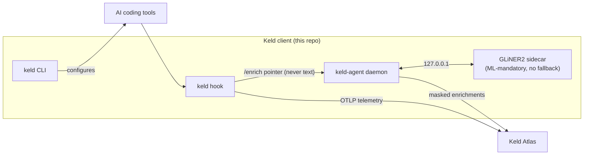

# Keld client — Agent & Contributor Guide

This repo is the **Keld client**: everything Keld runs on an engineer's own
machine. It has two jobs, and the second is the core of the project:

1. **Telemetry** — the `keld` CLI configures local AI coding tools (Claude Code,
   Codex, Gemini CLI) to emit usage telemetry to Keld Atlas.
2. **On-device enrichment** — the `keld-agent` daemon (+ its GLiNER2 sidecar)
   classifies each prompt **locally**, masks anything sensitive, and publishes to
   Atlas only the derived, masked signal. **Raw prompt text never leaves the
   machine.** This is the privacy-preserving intelligence the CLI installs.

Go single static binaries (`keld`, `keld-agent`) + an optional Python ML sidecar.
No runtime dependencies for the CLI itself.

## Architecture


```mermaid
flowchart LR
  Tools["AI coding tools"]
  subgraph Client["Keld client (this repo)"]
    CLI["keld CLI"]
    Hook["keld hook"]
    Agent["keld-agent daemon"]
    Sidecar["GLiNER2 sidecar<br/>(ML-mandatory, no fallback)"]
  end
  Atlas["Keld Atlas"]
  CLI -->|configures| Tools
  Tools --> Hook
  Hook -->|OTLP telemetry| Atlas
  Hook -->|"/enrich pointer (never text)"| Agent
  Agent <-->|127.0.0.1| Sidecar
  Agent -->|masked enrichments| Atlas
```

**Two lanes, one privacy invariant.**
- **Telemetry (push):** the hook posts usage telemetry straight to Atlas. No
  daemon involvement.
- **Enrichment (local):** the hook fire-and-forgets a *pointer* (transcript path
  + prompt id — **never text**) to the daemon's loopback `/enrich`. The daemon's
  background worker resolves the text on-device, runs the enrichment pipeline,
  **masks**, and syncs to Atlas `/v1/enrichments`. The prompt text is read
  locally and never transmitted — masking is enforced Go-side before publish.

## The enrichment agent (`keld-agent`) — the core

`cmd/keld-agent` → `internal/agentcli` → `internal/agent/*`. Lifecycle:
`ingress` (loopback HTTP intake, per-user secret, bounded `queue`) → `resolve`
(read prompt text + tail recent prompts from the transcript) → `enrich`
(the pipeline) → `mask` → `publish` (Atlas). Panic-isolated per job; a readiness
gate holds work until the backend is up. Delivery is durable: the hook writes a
prompt *pointer* (never text) to the on-disk `spool` when the daemon is
unreachable, and the daemon drains it on startup + a periodic sweep.

**Capture triggers.** Two triggers feed the same queue: the **command hook**
(`keld __hook --source <tool>`, wired by `keld setup`), and an on-device
**transcript watcher** (`internal/agent/watch/`) that tails the JSONL transcripts
Claude Code (all surfaces incl. the Desktop app), **Cowork**, and **Gemini** write to disk —
the hook-free path. The watcher synthesizes the same `spool.Pointer` the hook does
(never text) keyed on `promptId`; the queue dedups hook↔watcher overlap via a
recently-completed set (`queue.Complete`, marked only on a real publish so retries
and watcher fallbacks stay re-offerable). Sources: `~/.claude/projects` →
`claude_code`, the Cowork `local-agent-mode-sessions/**/.claude/projects` trees →
`cowork` (macOS), `~/.gemini/tmp/*/chats` → `gemini` (all platforms). Env: `KELD_WATCH` (default on), `KELD_WATCH_POLL` (default 5s),
`KELD_WATCH_BACKFILL` (default off = forward-only), `KELD_WATCH_ROOTS` (comma-separated
`source:dir`, default empty). macOS + Linux; Windows deferred.

**Cowork went VM-backed, and host-side capture cannot follow it.** Newer Claude
desktop builds run Cowork inside a VM (`vm_bundles/claudevm.bundle`) whose
transcripts live in the VM's disk image, not under `local-agent-mode-sessions`.
Nothing on the host can read them: no folder is shared and the VM's address does
not answer the host. Discovery therefore finds no *live* Cowork transcripts on
these machines — and because the pre-VM session directories are never cleaned up,
a root is still discovered, just permanently stale. `coworkHidden`
(`internal/agent/watch/roots.go`) detects that exact shape — VM images touched
within `coworkActiveWindow` while no Cowork `.jsonl` was written in the same
window — and logs one advisory line per daemon run, because the failure is
otherwise completely silent: Cowork just stops appearing in Atlas. It keys on
transcript **freshness**, not root existence, precisely so the stale-directory
machines are caught. Restoring capture needs a path the host can read (or an
in-VM emitter); `KELD_WATCH_ROOTS=cowork:<dir>` points the watcher at one the day
it exists.

**Watched-source telemetry (`internal/agent/promptlog`).** Cowork's own OTEL is
configured to Keld but its sandbox egress blocks `atlas.keld.co`, so the daemon
mirrors the transcript's events into OTLP logs+metrics host-side: the watcher's
per-line `observe` hook → `promptlog.Telemetry.Observe`, which emits `user_prompt`
/ `api_request` / `assistant_response` logs + `token.usage`/`cost.usage` metrics to
`/v1/logs` + `/v1/metrics`, matching the CLI's native OTEL schema. Identity
(`user.email`/`account_uuid`/`organization.id`) is recovered from the Cowork
session path/metadata. **Never emits prompt/response text.** Default source
`{cowork}` (Claude Code emits its own OTEL); `KELD_WATCH_TELEMETRY` (off/on),
`KELD_WATCH_TELEMETRY_SOURCES`. **Codex** and **Gemini** are covered via their own watcher roots
(`~/.codex/sessions` and `~/.gemini/tmp/*/chats`, sources codex and gemini) + specialized readers for enrichment
(TranscriptReader resolves user_message by session_id#ordinal for Codex, by message `id` for Gemini);
telemetry via their native OTEL (config completed in the tool adapters), not host-side promptlog.

**Enrichment pipeline (`internal/agent/enrich/`).** A staged registry of
extractors ("sweeps") run over a swappable `Model` backend, producing a `Profile`.
Single-flight (never fans out) so the shared model issues at most one inference at
a time. Two waves, up to 8 facets per prompt:
- **Wave 1** (independent, committed as a batch): `task_type` (the routing key for
  the Keld Inference Exchange — a 10-entry routing taxonomy: `summarization`,
  `translation`, `code_generation`, `information_extraction`, `classification`,
  `reasoning`, `question_answering`, `text_generation`, `rewriting`, `general`),
  `sensitivity` (+ masked entity spans; detects **concrete leaked data**, not
  topic — unions the GLiNER2 NER with a deterministic gitleaks credential layer
  and a placeholder gate, then rolls up to the highest-severity class: `ssn`⇒`phi`,
  `credit_card`⇒`pci`, `api_key`/`secret`⇒`secrets`, other personal id⇒`pii`),
  `domain` (+ entities), `activity_type`, `personal`, `function_guess`
  (12 business functions), `speech_act` (`command`/`question`/`statement`/
  `fragment`, classifies the prompt text only).
- **Wave 2** (conditioned on Wave-1 `function_guess`): `subcategory`.
- **`workstreams`** (`enrich/workstreams.go`) is the one pass that runs **no
  inference**: it asks the sidecar's `/analyze` for the deterministic dimensions
  of the hour of work ending at this prompt (project, branch, model,
  output_type, language, workflow, tooling), counted from tool-call metadata.
  It takes COORDINATES (transcript path + prompt id), never text, and publishes
  as `workstreams` — a map of dimension → `Labeled` (`share` becomes the
  confidence). It declares `ModelFree`+`AlwaysRun`, and is registered only when
  the daemon has an analysis backend (`enrich.WithWorkstreams`) **and** the
  source is one the analysis can read — `claude_code`/`cowork` only
  (`enrich.WorkstreamsEligible`): the analysis resolves a prompt by Claude-Code
  JSONL shape, so Codex/Gemini prompt ids 404, and registering it there would
  downgrade every one of their jobs to `"partial"` for a facet that was never
  obtainable. Callers with no backend (eval, localagent) are unchanged. A dimension the window could not
  attribute is **absent**, never present-with-an-empty-value; a failed analysis
  fails the pass (`pipeline_status:"partial"`) rather than publishing an empty
  set. Attribution needs **two** things, not one: the winning value's share is
  ≥ 0.50 **and** the window holds ≥ `window.MIN_EVIDENCE` (5) observations at
  that level. The second exists because a share is a ratio — one tool call
  gives share 1.0 by construction — and `evidence` is dropped on the way to the
  published enrichment, so nothing downstream can tell one observation from
  five hundred. Five is derived, not chosen: under the 0.50 floor read as a
  null hypothesis, `0.5**n` first falls below 5% at n=5, so below it no share
  distinguishes the window from a coin flip. Measured on the 572-window
  reference sample: 347 of 2927 attributed dimension slots become unattributed,
  330 of which were publishing at share 1.0 and 129 off a single observation.
  **Nothing from `/analyze` reaches Atlas except those dimensions.** In
  particular `inventory.named_terms` (proper nouns lifted from message text —
  real person names have been observed) is deliberately unmodelled on
  `sidecar.AnalyzeResult`: the field is dropped at the wire boundary, so it is
  structurally unforwardable no matter what the level is configured to do. That
  is what makes it safe for the level to be **on by default** (see the
  analysis-service bullet below).
- ⚠️ **`/analyze` is confined to `KELD_ANALYZE_ROOTS`.** The sidecar has **no
  auth** — `serve.py` binds 127.0.0.1 and that is the whole of it — which was
  adequate while every endpoint only processed text the caller already held.
  `/analyze` is the first that opens an **arbitrary filesystem path as the
  daemon's user** and returns content derived from it, so unconfined it is a
  confused deputy: on a multi-user host any other local user can POST a path
  under someone else's `~/.claude/projects` and read back their workspaces,
  branches and named terms. The path is therefore checked against an allowlist
  before the open — `os.path.realpath` on both sides, so neither `../` nor a
  symlink escapes — and anything outside answers **403** (not 404: a rejected
  path and an unresolvable one must stay distinguishable), counted as
  `analyze_rejected` in `/metrics`. The daemon sets the variable at spawn from
  `watch.AnalyzeRoots()` (`daemon/sidecarenv.go`), which is the **stable
  ancestors** of each layout plus `KELD_WATCH_ROOTS`, not `DiscoverRoots()`'s
  globbed leaves: session directories appear after the sidecar is spawned.
  Empty means **deny everything**; absent means the sidecar's own per-user
  defaults.
- **This is the client-side analysis and enrichment service, not a GLiNER2
  wrapper.** GLiNER2 was the first use case, not a precondition: the service
  starts and serves with no model loaded, and `/analyze` answers with the
  inference worker still `down` (pinned in `test_main.py` against the real
  `lifespan`). `/analyze`'s `named_terms` level is **on** by default
  (`KELD_TERMS=0` switches it off) and loads spaCy — ~619 MB, into the FastAPI
  parent, permanently, since the parent is never recycled. That coexists with
  GLiNER2 fine (~60 + ~619 + ~2740 MB against a 4096 MB budget); what did not
  was the **accounting** — see the parent-reserve bullet under Resource safety.
  The response carries `named_terms_status` (`ok` / `skipped:disabled` /
  `degraded:spacy_unavailable`), because an empty `named_terms` is otherwise
  not self-describing: a window that held no terms and a level that never ran
  look identical. `KELD_TERMS_MAX_LEN` (default 100k chars/message) restores
  spaCy's own per-document guard, which had been set to 20,000,000 — i.e.
  disabled; over-length messages are skipped by the NER pass, never cut, and
  the regex shapes still read them in full.
- **Classifiers score against readable label DESCRIPTIONS, not bare id strings**
  (the bi-encoder keys on token/semantic overlap — the label wording is
  load-bearing; e.g. `code_generation` scores against "software engineering").
- Label vocabularies live in `labels.go` (gated by `SchemaVersion`, currently **6**
  — bump it and re-run the eval when changing any vocab). Classify calls are
  prefixed with a context preamble (`Meta.PreambleCoding()`; `domain` uses the
  fuller `Meta.Preamble()`). **Facet-selective agentic augmentation:** agentic
  framework metadata helps `domain` but hurts `task_type`, so only `domain`
  augments with it — `task_type` and the others drop it.

**Model backends.** `ml_backend` (local, startup-only, `settings.Settings`)
selects one of three modes:
- **`"auto"`/`""` (default)** — Enrichment is **ML-only** for its full facet
  set: there is no deterministic *substitute* for the model's own facets. A
  reloading/evicted/not-yet-provisioned sidecar is waited out, never silently
  swapped for a lower-fidelity stand-in of the same facets — that swap is the
  thing this project forbids. `sidecar/` — HTTP client to the GLiNER2 sidecar
  (`/classify`, `/extract`, `/entities`); the sole `Model` implementation.
  Model provisioning (`provision/`) fetches weights (`hf.go`) into
  `~/.keld/models`. Why a bundled sidecar over in-process ONNX:
  `docs/keld-agent-p2-onnx-decision.md` (historical — see the superseded note
  at its top).
- **`"deterministic"`** — enrichment stays **on** and `Worker` runs with a
  `nil` `enrich.Model`. This is a *different* set of facets — the ones that
  need no model at all, e.g. credential detection (`CredentialSpans`, pure Go,
  no sidecar, no network) and the **workstream dimensions** the sidecar's
  `/analyze` derives from transcript coordinates — not a fallback for the
  model's facets.
  **The analysis service still runs; only the model is never loaded.** The
  sidecar is the client-side analysis-and-enrichment service in general
  (`/analyze`, `/match`, `/vocabulary`, `/classify`, `/extract`) and GLiNER2 is
  one capability it loads lazily on its first inference — so this mode starts
  the service (`deterministicBackend` → `sidecarService` + `go sup.Start`) and
  simply never issues an inference, which means the weights are never loaded
  and never even provisioned. Not starting it was a trap: `analyzerFor` came
  back nil, the workstreams pass never registered, and the mode published a
  single credential-derived facet.
  Its readiness gate therefore **polls service health** (`/health`), not model
  warmth — the model never warms here, so a warmth gate would hold every job
  forever, and a trivially-true gate would publish workstream-less profiles for
  every job that landed before the service came up. A service that never comes
  up **wedges** this mode (jobs queue/spool) rather than degrading: the same
  trade `"auto"` makes, and the same rule as *Delivery reliability* below.
  `wireEnrichment` returns the analyzer as its own value (derived from the
  service client, not from the `Model`) and threads it to `process`.
  `Settings.MLEnabled()` is false in this mode;
  `Settings.EnrichmentEnabled()` is true. The pipeline tolerates a nil `Model`:
  `enrich.runStage` skips any `Extractor` that needs a model and hasn't opted
  in via the `modelFreeExtractor` capability (mirroring `alwaysRunner`) —
  `SensitivityExtractor` is the one built-in that implements it, since its
  credential layer runs regardless of the model and its NER half is simply
  skipped when `ctx.Model == nil`. A skipped model-dependent pass fails
  cleanly (contributes to `pipeline_status:"partial"`, same idiom as a
  timed-out pass) rather than panicking through a nil interface call.
- **`"off"`** — enrichment is **disabled entirely**: no enrichment worker is
  started and `/enrich` accepts-and-discards (returns 202, never enqueues).
  Telemetry and client-events are unaffected.

**Delivery reliability (never degrade, never wedge).** When enrichment is
enabled, it always runs on GLiNER2 — there is no fallback to swap to. A sidecar
that isn't ready yet (not yet provisioned, restarting, mid-recycle, or the
supervisor couldn't bring it up at all) keeps the readiness gate **closed**:
jobs simply queue/spool until the sidecar is ready, they are never processed by
anything else. `ml_backend:"deterministic"` obeys the same rule against a
different definition of ready — the service answering `/health`, since it asks
for no inference.

**Deadlines are PER PASS, not per job** (`KELD_ENRICH_PASS_TIMEOUT`, default
30s). Per-pass is the only correct unit: a job issues 8-9 inferences, so a
job-wide budget meant one slow pass discarded *every pass that had already
succeeded* and re-spooled the whole job — the same work redone and re-discarded
until the attempt budget ran out. That amplification kept the sidecar in
permanent burst and was the driver behind the RAM-oscillation incident. Bounded
per pass, a slow pass costs exactly one facet: `runStage` reports it failed, the
other passes commit, and the profile publishes as `pipeline_status:"partial"`.
Progress is monotonic. Each pass deadline is a child of the job context (via
`enrich.WithJobContext`) and is bound to the backend through
`enrich.ContextModel` (`Client.WithModelContext`), so expiry aborts that pass's
in-flight sidecar call instead of leaving an orphan attempt consuming the
single-flight sidecar.

`KELD_ENRICH_JOB_TIMEOUT` (default **5m**) is now only a **wedge backstop** for a
job stuck outside a pass (resolve, publish). It must stay above
`passes x KELD_ENRICH_PASS_TIMEOUT` or it pre-empts the per-pass deadlines and
resurrects the discard-everything failure mode; a unit test pins that invariant.
A job that trips the backstop re-spools, **bounded** by
`KELD_ENRICH_MAX_ATTEMPTS` (default 4) — an exhausted job is
`spool.Quarantine`'d to `spool/bad/` rather than retried forever. Atlas dedups on
`dedup_key`, so a late double-publish from a recovering attempt is harmless.

**Adaptive input truncation (`enrich/lenstat`).** GLiNER2's transient activation
memory scales with sequence length, and gliner2's own `max_len` defaults to
`None` — *no truncation* — so one long prompt could allocate a multi-GB spike.
The daemon therefore tracks the streaming mean/variance of observed prompt
lengths (Welford; **lengths only, never text**, persisted to
`~/.keld/state/prompt-lengths.json`) and truncates at **mu + 2*sigma**, the window
that covers ~97.7% of that machine's prompts in full. It is clamped to
`[KELD_ENRICH_TOKEN_FLOOR (512), KELD_ENRICH_TOKEN_CEILING (768)]` and stays at
the liberal ceiling until `KELD_ENRICH_LEN_MIN_SAMPLE` (200) observations make the
estimate representative. The floor means the adaptive cap can only ever *widen*
the window; the ceiling is the memory budget expressed in tokens and is a hard
invariant, since mu+2*sigma knows nothing about RAM. The cap rides each request
as `max_len` (`Client.WithMaxLen` → sidecar → gliner2). Ceiling values are
**measured**, not estimated — see the table in `lenstat.go`; cost is superlinear
in both memory *and* latency, so raising it is not a free win. Credential
detection is unaffected (`creddetect.Detect` runs Go-side on the full text);
NER-derived PII sees only the window.

⚠️ **This is sized for chat-scale prompts and does NOT extend to agentic-workflow
payloads** (system prompt + work prompt + metadata, thousands of tokens). Three
things break: mu+2*sigma is meaningless on the resulting bimodal population; no
token cap both admits such a payload and fits the memory budget (measured
marginal cost exceeds 1 MB/token, so ~4000 tokens implies ~7 GB); and
head-truncation discards the work prompt when the system prompt leads. The fix is
segment-aware **windowed** inference — bounded peak regardless of payload length,
linear rather than superlinear cost — spec'd in
`docs/superpowers/specs/2026-07-24-agentic-scale-input-bounding.md`. Read it
before extending enrichment to agentic sources.

**Control plane.** Enrichment is governed per-org from Atlas
(`settings/`, `agentcfg/`); the daemon polls `GET /v1/enrichment-settings`
(`KELD_SETTINGS_POLL`). Remote overrides local; non-fatal if Atlas is unreachable.
See `docs/enrichment-settings.md`.

**Auth & self-heal.** Both client tokens are long-lived and revoke-only (no
TTL) — the CLI token (`~/.keld/auth.json`) and the org ingest token
(`~/.keld/hook.json`) — so normal background operation needs no re-auth. The
daemon reads the ingest token at startup but self-heals on a persistent
publish/settings `401`/`403`: it re-fetches the current ingest token via
`Onboarding` using the CLI token (`auth.Load`), live-swaps it into the shared
`creds.Token` (publish/settings/client-events all pick it up from there),
rewrites `hook.json`, and emits an `auth.refreshed` client-event.
Single-flight + cooldown (`KELD_REAUTH_COOLDOWN`, default 60s) turns a burst
of 401s into one re-onboard. Token-only: an endpoint change instead logs a
"restart to adopt" warning. If the CLI token itself is gone/revoked, the
daemon writes `~/.keld/reauth-required` and logs loudly; `keld signal
status`/`doctor` and `keld-agent status` surface it — recovery is `keld
login` then `keld-agent restart`. **Known limitation (v1):** a job that hits
the 401 mid-rotation isn't itself re-spooled (only the per-job timeout path
re-spools, bounded by `KELD_ENRICH_MAX_ATTEMPTS`); the daemon still recovers
forward for subsequent jobs — lossless re-spool of the 401'd job is a
documented follow-up.

**Client-events telemetry (`internal/agent/clientevents/`).** Separately from
enrichment, the daemon emits structured **operational** events about itself —
job retries/quarantines, sidecar crashes/fallback, publish failures, resource
pressure, lifecycle — batched and POSTed to `POST /v1/signal/client-events`
(`x-keld-ingest-token`, same header convention as publish/settings). This is
the first route under the **`/v1/signal/*`** convention: the namespace for new
client↔Atlas protocol routes going forward (`/v1/enrichments` and
`/v1/enrichment-settings` predate it and are not renamed as part of this — a
later coordinated migration). Governed per-org via a `client_telemetry` block
riding the existing `/v1/enrichment-settings` poll (default ON, independent of
the enrichment toggle). Events carry only ids + structured primitive metadata;
a Go-side **privacy redaction gate** (`clientevents/redact.go`) strips
absolute paths, drops non-primitive field types, and reduces errors to a
class+summary before anything is buffered — never raw prompt text, matching
the same invariant enrichment upholds for masked spans. Durable like
enrichment: batched + periodically flushed, retried via `internal/retry`, and
spooled to `~/.keld/spool/clientevents/` (bounded, drop-oldest) when Atlas is
unreachable. Full wire contract (envelope, event/code catalog, settings
defaults, redaction guarantee): **`docs/signal-client-events.md`**.

**Resource safety (the sidecar is a good citizen).** Single-flight + bounded
queue (503 backpressure); a **rate governor** (CPU-EWMA min-interval pacing) and a
**CPU thread scaler** (`torch.set_num_threads` capped to host load, default 50%
of cores). Inference itself runs in a separate **inference worker** child
process, not the long-lived FastAPI service — the service holds no model and
its own RSS stays flat regardless of uptime. The worker is **recycled** (killed
and respawned, reclaiming its heap via process exit — the only cross-platform
memory reset) on an **RSS ceiling** (`model_cost_mb + KELD_SIDECAR_RSS_MARGIN_MB`),
**memory pressure** (available RAM ≤ `KELD_SIDECAR_EVICT_AVAIL_PCT` — held down
until headroom returns), **idle** (`KELD_SIDECAR_IDLE_UNLOAD_S`, `<=0` disables),
a **hung-job timeout** (`KELD_SIDECAR_JOB_DEADLINE_S`), or a crash; it respawns
lazily on the next request.

**The guard must not sample under the inference lock.** `poll()` used to read the
worker's RSS while holding the same lock `call()` holds for an entire inference,
so it could only ever sample *between* jobs — right after the worker returned its
heap to the OS. Every in-flight spike was invisible: measured live, RSS
oscillated 2715MB → 5692MB against a 3409MB ceiling with `recycles == 0`. So the
guard now has two tiers:

- `observe_rss()` samples **without the lock** (reading RSS needs no lock; only
  mutating the worker does) and records `peak_rss_mb` for the current worker
  generation.
- The **RSS ceiling is a baseline-drift guard**, decided only when the lock is
  free (a mid-inference sample measures a transient spike, not drift, and
  recycling for it would kill a job to reclaim memory about to be freed anyway).
  The lock is taken **non-blocking** — waiting would stall the poll loop for a
  whole inference and pin every sample to a job boundary, i.e. the trough.
- A **hard limit** (`KELD_SIDECAR_MEM_BUDGET_MB` 4096 − `KELD_SIDECAR_PARENT_RESERVE_MB`
  150, or absolute `KELD_SIDECAR_RSS_HARD_MB`) is enforced on the lock-free
  sample and kills the worker **even mid-job** (`kills.hard`). Derived from the
  TOTAL budget, because that is the actual requirement; it never sits below
  `ceiling + KELD_SIDECAR_RSS_HARD_MARGIN_MB`, or an ordinary spike would become a
  mid-job kill. Prevention (bounded `max_len`) keeps peaks far below it, so this
  stays a backstop. Note it bounds *sustained* use: with a 1s poll a fast
  allocation can overshoot briefly before the kill lands.

**The parent's share of the budget is MEASURED, not assumed.** `hard_limit_mb()`
is `total budget − what the parent costs`, and "what the parent costs" was the
constant `KELD_SIDECAR_PARENT_RESERVE_MB` (150) — true only while the parent
held nothing but FastAPI. Once the `term` level's spaCy pipeline is resident
the parent is ~680 MB, so the worker's hard limit was computed ~470 MB too
generous: under-protection, arrived at silently, in the one direction that
matters. `WorkerManager.parent_reserve_mb()` now returns
`max(constant, high-water measured parent RSS)`, sampled lock-free by `poll()`.
**High-water, not live**: a limit tracking a live sample moves in both
directions, so a parent dip would relax the worker's limit with nothing about
the risk having changed — the same non-monotone failure the RSS guard already
had by sampling the trough. The parent is never recycled, so its cost is
monotone in fact and the peak is the honest summary. `max()` with the constant
keeps it strictly conservative against the old behaviour: an early sample can
never grant MORE headroom than before. The standing invariant is unchanged —
the hard limit never sits below `ceiling + KELD_SIDECAR_RSS_HARD_MARGIN_MB`.

**And the composition must be monotone too, which it was not.** A monotone
reserve does not give a monotone limit for free. `hard_limit_mb()` returned
`budget − reserve` whenever that came out above the ceiling and the
`ceiling + hard_margin` floor only when it did not, putting a **step
discontinuity** at `reserve == budget − ceiling`: measured at the delivered
defaults (model_cost 2385, ceiling 3409, budget 4096), parent 686 gave 3410 and
parent 688 gave **3921** — 2 MB of parent growth bought the worker 511 MB and
abandoned the budget without bound. The guard relaxed exactly when memory
pressure was highest, and spaCy's 619.6 MB sits one NER transient below that
edge, with the high-water latch making the crossing permanent. It is now
`max(budget − reserve, ceiling + hard_margin)`: monotone by construction, and
the floor is **unconditional** rather than a property of one branch — which is
also what fixes the invariant, since 3476.4 shipped against a required 3921.

**The honest consequence: at the delivered defaults the budget cannot be met.**
parent 619.6 + ceiling 3409 + margin 512 = **4540.6 MB** against a 4096 MB
budget. No hard limit satisfies both. The margin wins — a limit under
`ceiling + hard_margin` turns every ordinary transient spike into a mid-job
kill, a worse failure than overshooting a budget — and the overshoot is
**reported, not absorbed**: `budget_shortfall_mb()` surfaces in `/metrics`, and
`poll()` logs one loud line per **worker generation** (not per poll — a
once-a-second line is a flood operators filter out, which is the same as never
warning) naming every term and the levers. Which term gives —
`KELD_SIDECAR_MEM_BUDGET_MB`, `KELD_ENRICH_TOKEN_CEILING` /
`KELD_SIDECAR_RSS_MARGIN_MB`, or `KELD_TERMS=0` — is an operator's decision the
code must not make silently.

`GET /metrics` exposes a `worker` block (`state`/`worker_rss_mb`/**`peak_rss_mb`**/
`parent_rss_mb`/**`parent_reserve_mb`**/`model_cost_mb`/**`ceiling_mb`**/**`hard_limit_mb`**/
**`budget_shortfall_mb`**/`recycles`/
`kills` incl. `hard`) alongside governor EWMA/threads/queue/counts — the peak and
the limits it is judged against, because an instantaneous sample is exactly what
made the oscillation look healthy. Full mechanisms + load-test validation:
**`sidecar/loadtest/README.md`**.

**`KELD_SIDECAR_MAX_CHARS` (default 24000) is a tokenizer-cost guard, not the
memory bound.** Memory scales with *tokens*, and gliner2 truncates to `max_len`
only *after* tokenizing, so a char pre-clip still helps on a pathological paste —
but it must stay generous enough never to pre-empt the token cap. It previously
defaulted to 8000 (~1100 word tokens), which silently made it the real
constraint and rendered any larger token cap dead.

**Footprint caps are set at spawn, parent-side** (`daemon.go` → `sidecarEnv`),
inherited by the spawned worker child. The daemon injects `MALLOC_ARENA_MAX=2`
plus `OMP/MKL/OPENBLAS/NUMEXPR_NUM_THREADS=2` and `KELD_SIDECAR_MAX_THREADS=2`
(all set-if-absent, so an operator can override) — a cheap Linux-only baseline
footprint reducer, not the memory-safety mechanism itself (that's the worker
recycle above). Without the arena cap, glibc spawns a malloc arena per
allocating thread and each retains freed heap — RSS then balloons to ~2× the
model working set (measured 6.4 GB vs a ~2.6 GB working set on a 20-core host).
`MALLOC_ARENA_MAX` **must** be parent-set: glibc reads it when the child's
allocator initializes, before Python can set it for itself. The thread caps
also bound CPU to ≤2 cores.

## The CLI (`keld`)

`cmd/keld` → `internal/cli`. Browser-based device-authorization login
(`internal/auth`), tool detection + config editing with summary/diff + backups
(`internal/tools`, `internal/diffview`), hook install (`internal/hook`). Commands:
top-level `login`/`logout`/`whoami`; the `keld signal` group
(`setup`/`status`/`doctor`/`uninstall`) for telemetry onboarding. Config paths via
`internal/paths` (`KELD_HOME`).

**Machine interface (installer-/automation-driven onboarding).** `keld login` and
`keld signal setup` each take `--json`, emitting **NDJSON** on stdout (one event
object per line) instead of human text — the seam the native platform installers
drive to render the device code + setup progress in their own UI. `keld login
--json` emits `device_code` (immediately) then `authorized`/`error` (non-zero exit
on error); `--no-browser` suppresses the auto-open so the caller owns the link.
`keld signal setup --json` is non-interactive (implies `--yes`): a `tool` event per
tool (`configured`/`already_configured`/`skipped_conflict`) then `done`. Keep all
auth/setup logic Go-side behind the `onStart` (auth) and `SetupOpts.Emit` (setup)
seams — don't reimplement it in installer code; the human paths stay unchanged when
those seams are unset. `keld-agent install` is **TTY-aware** (`term.IsTerminal` —
`os.ModeCharDevice` is wrong because macOS launchd wires stdin to `/dev/null`):
in a terminal it runs login → setup → service install; headless it registers the
service only and prints the finish-setup commands, so a GUI installer's pages drive
`keld --json` instead of a hung, invisible interactive flow.

## Repo layout

```
cmd/keld/            CLI entrypoint
cmd/keld-agent/      enrichment daemon entrypoint
internal/
  agentcli/          keld-agent cobra commands (run/install/uninstall/...)
  agent/
    ingress/         loopback /enrich intake (auth + bounded queue)
    queue/           bounded, key-deduping job queue (backpressure)
    resolve/         read prompt text + recent-prompt tail from transcripts
    enrich/          the pipeline: extractors, passes, labels, mask, meta
      sidecar/           HTTP client to the GLiNER2 sidecar (the only Model)
      lenstat/           adaptive input truncation (mu+2sigma prompt-length stats)
      eval/              enrichment quality eval harness
    provision/       model provisioning (weights → ~/.keld/models)
    publish/         build + POST masked enrichments to Atlas
    settings/ agentcfg/  per-org control-plane polling
    service/         OS service install (darwin/linux/windows)
    daemon/          wires it all together; spawns/superwises the sidecar
  spool/             durable on-disk pointer queue (hook fallback + re-spool/quarantine)
  auth/ cli/ tools/ diffview/ hook/ paths/ telemetry/ config/ console/ ...
sidecar/
  serve.py           entrypoint the daemon spawns (uvicorn on 127.0.0.1)
  app/
    main.py          FastAPI app: /classify /extract /entities /health /metrics;
                     lifespan wires governor + scaler + runner + worker poll loop
    governor.py      CPU-EWMA rate pacing         runner.py       single-flight runner
    cpuscale.py      host-load → torch threads    worker.py       inference child (holds model)
    metrics.py       /metrics payload             worker_manager.py  spawn/recycle/dispatch
    adapter.py       normalize model output
  loadtest/          smoke + soak load-test harness (see its README)
  keld-agent-sidecar.spec / build-freeze.sh   PyInstaller packaging
docs/                enrichment-settings.md, ONNX decision, superpowers/{specs,plans}
scripts/             install.sh / install.ps1, send-test-prompt.py, enrichments-sink.py
```

## Building & running

```bash
make build-binaries    # keld + keld-agent (Go)
make sidecar           # create the Python 3.12 sidecar venv (~/.keld/sidecar-venv) + wrapper
make install-linux     # build-binaries + sidecar + install the systemd --user service
make send-test-prompt  # push one test prompt to the running daemon
make uninstall-linux   # remove the service
```

## Testing

```bash
go test ./...          # Go unit tests (59 test files)

# Sidecar unit tests — standalone scripts (no pytest), via the sidecar venv:
cd sidecar
for f in app/test_*.py loadtest/test_*.py; do
  PYTHONPATH=. ~/.keld/sidecar-venv/bin/python "$f"; done

# Sidecar load tests (opt-in; load the real model, minutes-long):
cd sidecar
PYTHONPATH=. ~/.keld/sidecar-venv/bin/python -m loadtest smoke   # ~2-3 min
PYTHONPATH=. ~/.keld/sidecar-venv/bin/python -m loadtest soak --minutes 45 --live
```

## Conventions

- **Privacy is the invariant.** Raw prompt text is read on-device and must never
  be transmitted; the daemon publishes only masked labels + masked spans. Masking
  is enforced Go-side (`enrich/mask.go`) before publish; the sidecar returns raw
  spans and never publishes.
- **Config via env (`KELD_*`)**, resolved through `internal/config` /
  `internal/paths`; credentials/tokens/hook/manifest under `~/.keld` with
  user-only permissions.
- **CLI = single static Go binary**, no runtime deps. `ml_backend:"auto"`
  (default) enrichment is **ML-only** for its facet set: the GLiNER2 sidecar is
  mandatory and there is no deterministic *substitute* for those facets — when
  it isn't ready, jobs queue/spool until it is (see Delivery reliability
  above). `ml_backend:"deterministic"` is not that substitute: it is a
  different facet set that needs no model at all — it still runs the analysis
  service and still gates on it being healthy, it just never asks it to load
  the model (see Model backends above).
- **Sidecar single-flight** (one inference at a time) is load protection, not an
  accident — don't fan out inference. RAM is bounded by recycling the inference
  worker child process, CPU by the governor + thread scaler (see
  `sidecar/loadtest/README.md`).
- **Schema versioning:** changing any enrichment vocabulary is contract-affecting
  — bump `enrich.SchemaVersion` and re-run the eval (`enrich/eval/`).
- **Dependency-pull retries:** outbound "fetch a required dependency" calls use
  `internal/retry` (`retry.Do` + the canonical `IsTransient` classifier; policy
  env-tunable via `KELD_RETRY_*`). Transient = net faults + HTTP 408/429/5xx;
  **unknown errors are permanent by design** (never hammer). The HF model download
  (`sidecar/hf.go`) uses it; settings-poll / publish / api adopt it when next
  touched — don't hand-roll new backoff loops.
- **Never cut text mid-sentence.** Any text read as language — a prompt, a
  generated report, a conversation window handed to a model, a span shown to a
  person — is bounded at a **logical delimiter**: a sentence end, a line break, a
  turn boundary, an entry boundary. Never at a rune count that lands mid-clause.
  An **identifier is never truncated at all**: a path or symbol cut short is a
  *false* identifier, so drop the whole term instead. And **dropping must be
  visible** — `omittedNotice` is the precedent; a silently shorter input is the
  same defect one level up. Measured cost of getting this wrong: beats were
  generated with a 200-rune cap against a "two or three sentences" instruction,
  and **46 of 47 came out mid-clause with a median of zero complete sentences**
  — unusable output from a correct model, caused entirely by the cut.
  This does **not** govern the ML token caps (`lenstat`'s `max_len`,
  `KELD_SIDECAR_MAX_CHARS`), where head-truncation is deliberate and the
  constraint is activation memory rather than legibility.

## Gotchas

- **The sidecar needs Python 3.12** (host default may be 3.14 without torch/gliner2
  wheels). Use the venv at `~/.keld/sidecar-venv` (`make sidecar`); run its tests
  with that interpreter, never the host python.
- **Sidecar tests are standalone scripts** (no pytest); each ends with a
  `__main__` runner that runs every `test_*` function.
- **Distribution packaging** freezes the sidecar with PyInstaller
  (`keld-agent-sidecar.spec`) into `keld-agent-sidecar`; the daemon resolves it
  beside `keld-agent` (flat or nested layout).
- **macOS signing needs TWO certs, and notarization is decoupled from the release.**
  `installers/macos/build-pkg.sh` signs **every** Mach-O in the payload with the
  *Developer ID Application* cert — not just the three entrypoints, because the
  frozen sidecar is a one-dir tree of ~15k files / ~100 native libs and
  notarization rejects the whole submission over a single unsigned one — then signs
  the pkg itself with the *Developer ID Installer* cert. CI imports both p12s into
  a throwaway keychain and **derives the identity names from it** (a hand-typed
  name fails at `productsign` with an opaque error). Bundle the **G2 intermediate**
  in each p12 or a clean runner can't build a chain to a trusted root.
  ⚠️ **The pkg ships WITHOUT the sidecar.** Apple's notary service scans every file
  in a submission, and the frozen sidecar is ~15k files / ~190MB of torch — which
  put a real submission **4+ hours** into an unbounded queue. The pkg payload is now
  just `keld`, `keld-agent`, `onboard.command`, `VERSION` (4 files, ~2 Mach-O to
  sign instead of ~103). `onboard.command` fetches the sidecar tarball into
  **`~/.local/bin`** — a well-known `sidecarBinPath()` dir that is user-writable, so
  no sudo prompt, and the same place `install.sh` puts it. It fetches **before**
  `keld-agent install`, because that command starts the daemon and the sidecar
  should exist by then. Pinned to the pkg's own release via the staged `VERSION`
  file (falls back to the latest-release API for dry-run builds), Apple-Silicon-only,
  and non-fatal on failure: telemetry still works, enrichment jobs spool, re-running
  the script retries.
  ⚠️ **Apple's notary queue is unbounded and unobservable** — no error, no log, no
  queue position, with the service reported healthy throughout. So the release does
  NOT block on it either: submit, wait only
  `KELD_NOTARY_TIMEOUT` (default 15m), then ship. Safe because Gatekeeper validates
  **online**, so a ticket landing after we ship still passes; stapling only adds
  *offline* validation. A rejection (`Invalid`) still fails the build — that means a
  broken payload, which waiting won't fix. The submission id is written to
  `<pkg>.notarization-id` + the run summary so a later staple needs no log
  archaeology. `KELD_NOTARY_REQUIRED=1` restores fail-on-timeout.
- **Obfuscation (`KELD_OBFUSCATE=1`, CI-set, default off).** The installer/release
  freeze obfuscates the shipped sidecar — python-minifier **locals-only** rename
  (globals/Pydantic-fields/spawn-targets preserved; annotations kept so Pydantic
  v2 + FastAPI still work) → free-tier PyArmor bytecode encryption → PyInstaller.
  `build-freeze.sh` freezes from a **copy** (never clobbers the tree), hard-fails
  if the tools are missing, and the `.spec` names the obfuscated `app.*` +
  `pyarmor_runtime` as `hiddenimports` (their imports are encrypted, invisible to
  PyInstaller analysis). Go binaries are `-s -w`-stripped by GoReleaser. Dev/local
  builds stay plain/debuggable. It's **license-ready** (a paid PyArmor license
  unlocks RFT/BCC via the same flow) and protects **code logic only** — it does
  **not** hide the base model (GLiNER2 is discoverable via bundled deps + the
  on-disk weights; explicit non-goal).
- **Frozen worker spawn needs `freeze_support()`.** The inference worker uses
  `multiprocessing` spawn, which re-execs the frozen binary to bootstrap the
  child; `serve.py` calls `multiprocessing.freeze_support()` so the child doesn't
  fall through to argparse. This only manifests in the **frozen** binary — unit
  tests never freeze, so it can't be caught there. `make freeze-check` (plain) and
  `make obfuscate-check` (obfuscated) run the freeze + a real `/classify`
  worker-spawn gate locally (Linux); CI's installer smoke does the same for every
  shipped OS. Any change touching the worker/spawn/freeze path must keep those
  green.
- **macOS onboarding UI:** `installers/macos/onboard.command` is a plain Terminal
  script (no SwiftUI app) staged executable into the payload by `build-pkg.sh` and
  opened by the pkg `postinstall` in the logged-in user's GUI session (`launchctl
  asuser … open onboard.command`). It prompts for the one-time setup code and runs
  `keld login --code "$CODE"` (falling back to interactive `keld login` on an empty
  or failed code), then `keld signal setup --yes`, then `keld-agent install` —
  **last**, since onboarding precedes the agent: `postinstall` no longer
  pre-registers the service headlessly. Best-effort (`|| true`) and safe to re-run.
- **Windows onboarding UI:** `installers/windows/keld-agent.iss` `[Code]` adds a
  post-install Inno wizard page ("Set up Keld") that drives the `keld --json`
  interface (WinAPI timer + async NDJSON temp-file polling). Compiled by `iscc` on
  the Windows CI runner; UX is human-verified on Windows. Unlike macOS, the Windows
  installer's headless `keld-agent install` still pre-registers the service (the
  TTY guard); the wizard page then drives interactive login/setup.
- **Managed tool settings** (e.g. Claude Code org/remote-managed `settings.json`)
  override user settings — if telemetry goes nowhere, check the managed OTLP
  endpoint.
- **Model provisioning** downloads ~1.9 GB on first ML enrichment; until then
  the sidecar isn't ready, so enrichment jobs queue/spool rather than run on a
  fallback backend (there is none).

## Design docs

Specs in `docs/superpowers/specs/`, plans in `docs/superpowers/plans/`; control
plane in `docs/enrichment-settings.md`; sidecar resource safety + load testing in
`sidecar/loadtest/README.md`; macOS Developer ID signing + the **unresolved**
notarization problem (zero verdicts on this account; the account-provisioning check
that still needs doing) in `docs/macos-signing-and-notarization.md`.
