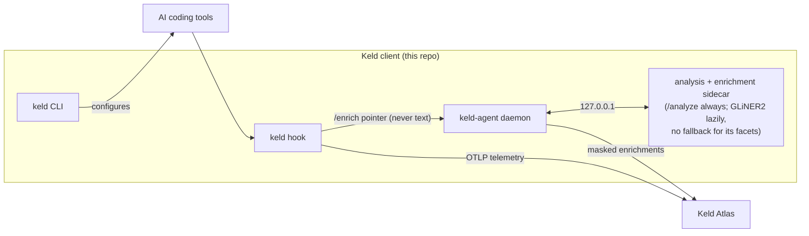

# Keld client — Agent & Contributor Guide

This repo is the **Keld client**: everything Keld runs on an engineer's own
machine. It has two jobs, and the second is the core of the project:

1. **Telemetry** — the `keld` CLI configures local AI coding tools (Claude Code,
   Codex, Gemini CLI) to emit usage telemetry to Keld Atlas.
2. **On-device enrichment** — the `keld-agent` daemon (+ its GLiNER2 sidecar)
   classifies each prompt **locally**, masks anything sensitive, and publishes to
   Atlas only the derived, masked signal. **Raw prompt text never leaves the
   machine.** This is the privacy-preserving intelligence the CLI installs.

Go single static binaries (`keld`, `keld-agent`) + an optional Python ML sidecar.
No runtime dependencies for the CLI itself.

## Architecture


```mermaid
flowchart LR
  Tools["AI coding tools"]
  subgraph Client["Keld client (this repo)"]
    CLI["keld CLI"]
    Hook["keld hook"]
    Agent["keld-agent daemon"]
    Sidecar["analysis + enrichment sidecar<br/>(/analyze always; GLiNER2 lazily,<br/>no fallback for its facets)"]
  end
  Atlas["Keld Atlas"]
  CLI -->|configures| Tools
  Tools --> Hook
  Hook -->|OTLP telemetry| Atlas
  Hook -->|"/enrich pointer (never text)"| Agent
  Agent <-->|127.0.0.1| Sidecar
  Agent -->|masked enrichments| Atlas
```

**Two lanes, one privacy invariant.**
- **Telemetry (push):** the hook posts usage telemetry straight to Atlas. No
  daemon involvement.
- **Enrichment (local):** the hook fire-and-forgets a *pointer* (transcript path
  + prompt id — **never text**) to the daemon's loopback `/enrich`. The daemon's
  background worker resolves the text on-device, runs the enrichment pipeline,
  **masks**, and syncs to Atlas `/v1/enrichments`. The prompt text is read
  locally and never transmitted — masking is enforced Go-side before publish.

## The enrichment agent (`keld-agent`) — the core

`cmd/keld-agent` → `internal/agentcli` → `internal/agent/*`. Lifecycle:
`ingress` (loopback HTTP intake, per-user secret, bounded `queue`) → `resolve`
(read prompt text + tail recent prompts from the transcript) → `enrich`
(the pipeline) → `mask` → `publish` (Atlas). Panic-isolated per job; a readiness
gate holds work until the backend is up. Delivery is durable: the hook writes a
prompt *pointer* (never text) to the on-disk `spool` when the daemon is
unreachable, and the daemon drains it on startup + a periodic sweep.

**An unconfigured agent IDLES, it does not fail.** The service is routinely
registered *before* onboarding runs (the documented macOS pkg order), so a
missing `~/.keld/hook.json` is a normal startup state, not a crash. `Run` waits
on `daemon.awaitConfig` (re-reads hook.json every `KELD_CONFIG_POLL`, default
5s; announces the wait once, not per poll) and starts the instant `keld signal
setup` writes the token — no restart needed. Returning an error here instead
cost a tester **69 launchd spawns in 12 minutes**, because the plist's
`KeepAlive` was an unconditional `<true/>`. That is now the
`SuccessfulExit=false` dictionary, so a clean exit is final while a real crash
still restarts; systemd's `Restart=on-failure` was already the equivalent
(don't add `RestartSec` — see the note in `service.go`), and the Windows
`ONLOGON` scheduled task never retried at all.

**Capture triggers.** Two triggers feed the same queue: the **command hook**
(`keld __hook --source <tool>`, wired by `keld setup`), and an on-device
**transcript watcher** (`internal/agent/watch/`) that tails the JSONL transcripts
Claude Code (all surfaces incl. the Desktop app), **Cowork**, and **Gemini** write to disk —
the hook-free path. The watcher synthesizes the same `spool.Pointer` the hook does
(never text) keyed on `promptId`; the queue dedups hook↔watcher overlap via a
recently-completed set (`queue.Complete`, marked only on a real publish so retries
and watcher fallbacks stay re-offerable). Sources: `~/.claude/projects` →
`claude_code`, the Cowork `local-agent-mode-sessions/**/.claude/projects` trees →
`cowork` (macOS), `~/.gemini/tmp/*/chats` → `gemini` (all platforms). Env: `KELD_WATCH` (default on), `KELD_WATCH_POLL` (default 5s),
`KELD_WATCH_BACKFILL` (default off = forward-only), `KELD_WATCH_ROOTS` (comma-separated
`source:dir`, default empty). macOS + Linux; Windows deferred.

**Cowork went VM-backed, and host-side capture cannot follow it.** Newer Claude
desktop builds run Cowork inside a VM (`vm_bundles/claudevm.bundle`) whose
transcripts live in the VM's disk image, not under `local-agent-mode-sessions`.
Nothing on the host can read them: no folder is shared and the VM's address does
not answer the host. Discovery therefore finds no *live* Cowork transcripts on
these machines — and because the pre-VM session directories are never cleaned up,
a root is still discovered, just permanently stale. `coworkHidden`
(`internal/agent/watch/roots.go`) detects that exact shape — VM images touched
within `coworkActiveWindow` while no Cowork `.jsonl` was written in the same
window — and logs one advisory line per daemon run, because the failure is
otherwise completely silent: Cowork just stops appearing in Atlas. It keys on
transcript **freshness**, not root existence, precisely so the stale-directory
machines are caught. Restoring capture needs a path the host can read (or an
in-VM emitter); `KELD_WATCH_ROOTS=cowork:<dir>` points the watcher at one the day
it exists.

**Watched-source telemetry (`internal/agent/promptlog`).** Cowork's own OTEL is
configured to Keld but its sandbox egress blocks `atlas.keld.co`, so the daemon
mirrors the transcript's events into OTLP logs+metrics host-side: the watcher's
per-line `observe` hook → `promptlog.Telemetry.Observe`, which emits `user_prompt`
/ `api_request` / `assistant_response` logs + `token.usage`/`cost.usage` metrics to
`/v1/logs` + `/v1/metrics`, matching the CLI's native OTEL schema. Identity
(`user.email`/`account_uuid`/`organization.id`) is recovered from the Cowork
session path/metadata. **Never emits prompt/response text.** Default source
`{cowork}` (Claude Code emits its own OTEL); `KELD_WATCH_TELEMETRY` (off/on),
`KELD_WATCH_TELEMETRY_SOURCES`. **Codex** and **Gemini** are covered via their own watcher roots
(`~/.codex/sessions` and `~/.gemini/tmp/*/chats`, sources codex and gemini) + specialized readers for enrichment
(TranscriptReader resolves user_message by session_id#ordinal for Codex, by message `id` for Gemini);
telemetry via their native OTEL (config completed in the tool adapters), not host-side promptlog.

**Enrichment pipeline (`internal/agent/enrich/`).** A staged registry of
extractors ("sweeps") run over a swappable `Model` backend, producing a `Profile`.
Single-flight (never fans out) so the shared model issues at most one inference at
a time. Two waves, up to 7 facets per prompt:
- **Wave 1** (independent, committed as a batch): `task_type` (the routing key for
  the Keld Inference Exchange — a 10-entry routing taxonomy: `summarization`,
  `translation`, `code_generation`, `information_extraction`, `classification`,
  `reasoning`, `question_answering`, `text_generation`, `rewriting`, `general`),
  `sensitivity` (+ masked entity spans; detects **concrete leaked data**, not
  topic — unions TWO independent evidence sources, **neither of them GLiNER2**,
  and rolls up to the highest-severity class: `ssn`⇒`phi`, `credit_card`⇒`pci`,
  `api_key`/`secret`⇒`secrets`, other personal id⇒`pii`. See
  **The sensitivity facet's two sources** below),
  `domain` (+ entities), `activity_type`, `personal`, `function_guess`
  (12 business functions).
- **Wave 2** (conditioned on Wave-1 `function_guess`): `subcategory`.

**`speech_act` was DROPPED at schema v9, and the gate is now model-free.** It
was an eighth facet (`command`/`question`/`statement`/`fragment`) and it also
supplied the enrichment gate's model half. A pre-registered study measured it
live over 2,015 inferences
(`docs/superpowers/specs/2026-08-24-facet-value-results.md`): accuracy **0.695
against a 0.713 majority baseline** — worth less than always answering
`command`. It predicted `statement` 22 times and was right **zero** times, at up
to full confidence. The other measured facets are fine (`task_type` 0.733 vs
0.143, `domain` 0.683 vs 0.261, `activity_type` 0.670 vs 0.243), so this is a
targeted removal, not a retreat from model-backed classification. Consequences,
each deliberate: `Profile.SpeechAct`/`SpeechActAlt` and
`Enrichment.speech_act`/`speech_act_alt` are gone from the published payload (a
published-vocabulary change, hence the v8→v9 bump; producer strings move `-v8`
→ `-v9`); `SpeechActDefs` is deleted; the gate keeps only its model-free
approval lexicon (`prefilterContentFree`), whose own validation measured it at
recall 100% on-corpus with the `fragment` branch a strict subset of it, so
0/24-dangerous survives; `sensitivity` is now the ONLY always-run pass. This
saves ~12% of enrichment CPU (one inference of eight) and **none** of the 1.8 GB
model — the remaining facets still need it. The **gold labels are kept** in
`eval/gold.jsonl`, unscored, as the evidence for judging a re-introduced
classifier: the study named the label *wording* as the suspect, so a
`SpeechActDefs` re-bakeoff is the live alternative to permanent removal.

**The sensitivity facet's two sources.** Neither classifies; the class is
a rollup over which entity labels were DETECTED (`sensitivityFromEntities`).
**Neither is GLiNER2** — this facet does not touch `ctx.Model` at all, and a
test asserts its output is identical with a Model present and with none.
1. **`creddetect`** — vendored gitleaks credential rules. Pure Go, no model, no
   network, over the FULL prompt text. Always available; the only source that
   needs nothing at all.
2. **The sidecar's `/pii`** (`enrich.PIIScanner` → `sidecar.Client.DetectPIIIn`
   → `app/pii.py`, presidio-analyzer). **Region-scoped pattern recognizers**,
   every one of them checksum- or algorithm-validated: a universal tier
   (`credit_card`, `email`, `phone`, `iban`, `crypto_wallet`) plus one country
   tier per configured region — `us` by default (`ssn`, `aba_routing`, `us_npi`,
   `medical_license`), with `uk es it pl fi kr in au ng th sg` opt-in. It needs
   **no GLiNER2** — and, since the NER came out, **no spaCy model either**: only
   a blank tokenizer, because every recognizer left is a regex plus a check
   algorithm. It never touches the inference single-flight, so it is wired in
   `ml_backend:"deterministic"` too. It returns **offsets only, never the
   matched value** — the Go side resolves and masks from its own copy of the
   text.

   ⚠️ **Region-scoped is a PRECISION decision, not a cost one** (the full set
   measured **+0.5 ms/prompt**, which is nothing). Almost every national-id
   recognizer is a bare digit run plus ONE check digit, so its false-positive
   floor against arbitrary numbers is 1-in-10 or 1-in-11 — a checksum makes a
   false positive unlikely, not impossible — and the shapes **collide across
   countries**. A valid `us_npi` is ten digits starting 1 or 2, which is exactly
   the `uk_nhs` shape, and `uk_nhs` rolls up to `phi`: enabling `uk` inside a
   US-only org manufactures the most severe class out of provider ids. Verified
   collisions are pinned in `sidecar/app/test_pii_regions.py`. Configure with
   `KELD_PII_REGIONS` (comma-separated, `none` = universal only) or
   `pii_regions` in `~/.keld/agent-config.json`; an Atlas org value
   (`Remote.PIIRegions`) overrides both and takes effect on the **next prompt**,
   because the region list rides each `/pii` request rather than the sidecar's
   startup environment. **Atlas does not serve the key yet** — the client seam
   exists so adopting it is a server change alone.

   ⚠️ **`phi` is deliberately narrow, and two assignments were argued rather
   than assumed.** `us_npi` maps to `pii`, NOT `phi`: an NPI is a public CMS
   provider-registry number, so routing it to the most severe class would
   overstate a lookup as a leak. `aba_routing` maps to `pci` while identifying a
   **bank branch from a published directory**, not an account — kept as a
   reliable marker that banking data is present, not as leaked data itself.
   `it_vat_code`, `kr_brn`, `in_gstin`, `au_abn`, `au_acn` and `sg_uen` are
   **business registration numbers**, included only because each of those
   registers also issues to sole traders; they are the weakest members of their
   (opt-in) regions. See `SensitivityFromEntity`'s comment in `labels.go`.

   ⚠️ **Ten recognizers the design asked for DO NOT EXIST in
   presidio-analyzer 2.2.362**, so those regions are absent entirely rather than
   silently empty: there is **no German recognizer of any kind**, no Swedish, no
   South African, no Turkish, and no UK driving licence.

⚠️ **`person` and `address` are NOT DETECTED. The coverage is four types, not
six.** They came from presidio's `SpacyRecognizer`, and on **2,000 real
developer prompts** that recognizer produced **998 of 1,090 spans with zero
confirmed names and zero addresses** — `JSON` ×132, `Docker`, `YAGNI` ×27,
exported Go identifiers, hex colour literals, and a bare `❌` at **0.85**, the
same score a real name gets. Overall precision was **~1%**, and **24% of prompts
published `sensitivity: pii`**. No threshold separates a common noun from a name,
so the recognizer was removed rather than tuned; the same measurement rerun
against the current detector publishes `pii` on **0.45%** of prompts at 100%
precision, and `pci`/`phi` never fire. Both dropped types mapped to `pii`, the
LOWEST severity class, so nothing severe was lost — but free-form personal names
in prose are now **undetectable**, and that is a real narrowing, not a tuning.
`SensitivityFromEntity` still knows both names so a future detector needs no
schema change. Full before/after:
`~/keld/refseries-context/pii-precision/RESULTS.md` (reproduce with
`scripts/pii_precision.py --port N --regions us|all`). The same 2,000-prompt run
against the **widened** detector with **every region enabled** produced **zero**
spans of any new type — the only raw presidio output was three readings of one
digit run inside a URL path, all removed by the fragment gate.
There is deliberately **no third, GLiNER2 source**. `/entities` over a
`SensitiveEntityLabels` vocabulary used to be one, and it was redundant:
presidio produced every mapped type the GLiNER2 NER did (`person`/`address` then
came from its `SpacyRecognizer`, which is spaCy, not GLiNER2 — both have since
been dropped as measured noise, see above), so the NER added no type of its
own while needing a corroboration rule to keep its confident, perfectly-shaped
documentation constants off the wire. That rule, the label vocabulary, and the
call are all gone. Re-admitting a model here is a deliberate decision with its
own evidence, not a rewiring.

⚠️ **The published-test-value gate lives in ONE place: `sidecar/app/wellknown.py`.**
`4111 1111 1111 1111` passes Luhn, `123-45-6789` is the textbook SSN,
`user@example.com` is RFC 2606 — developer transcripts are saturated with them,
and ungated the facet reports `pci`/`phi` continuously and is worse than absent.
The gate is applied **at source**, inside `scan()` before it answers, so nothing
it suppresses can reach Go by another route — there is no second detector to
route around it. Two rules there are **measured, not structural**: a no-reply /
machine local-part denylist (66 of 78 `email` spans in the corpus were one
`noreply@` address quoted out of a `Co-Authored-By` git trailer — an unattended
sink is not personal data), and a rejection of Go-module-version paths
(`host.tld/pkg@v1.23.4` parses as local-part-at-domain and scored 1.0). A
companion **numeric-fragment gate** lives in `pii.py`, not here, because it needs
the surrounding text: a match preceded by `[0-9.,:/-]` is the tail of a longer
token, which is how 13 digits after a decimal point published **`pci` at 1.0**.
It is asymmetric on purpose — the right-hand side rejects only a continuation
(digit, or `.,-` then a digit), because "…4470, then email" is prose and the
whitespace-token rule would have cost real detections. With **no scan available
the four personal-data types simply have no source**; only credentials remain, and the loss is declared (see
`facets_degraded` below) rather than papered over. Do not add a Go copy of the
list, and do not add a second detector that would need one.

**`facets_degraded` for sensitivity turns on the SCAN.** The scan is the sole
source for every personal-data type, so a whole scan leaves nothing uncovered
and a Model's absence costs nothing.
Scan absent / failed / **`truncated`** ⇒ degraded, unless the answer already
reached the ceiling of the severity order (`phi`), which no missing evidence
could raise.
- **`workstreams`** (`enrich/workstreams.go`) is the one pass that runs **no
  inference**: it asks the sidecar's `/analyze` for the deterministic dimensions
  of the hour of work ending at this prompt (project, branch, model,
  output_type, language, workflow, tooling), counted from tool-call metadata.
  It takes COORDINATES (transcript path + prompt id), never text, and publishes
  as `workstreams` — a map of dimension → `Labeled` (`share` becomes the
  confidence). It declares `ModelFree`+`AlwaysRun`, and is registered only when
  the daemon has an analysis backend (`enrich.WithWorkstreams`) **and** the
  source is one the analysis can read — `claude_code`/`cowork` only
  (`enrich.WorkstreamsEligible`): the analysis resolves a prompt by Claude-Code
  JSONL shape, so Codex/Gemini prompt ids 404, and registering it there would
  downgrade every one of their jobs to `"partial"` for a facet that was never
  obtainable. Callers with no backend (eval, localagent) are unchanged. A dimension the window could not
  attribute is **absent**, never present-with-an-empty-value; a failed analysis
  fails the pass (`pipeline_status:"partial"`) rather than publishing an empty
  set. Attribution needs **two** things, not one: the winning value's share is
  ≥ 0.50 **and** the window holds ≥ `window.MIN_EVIDENCE` (5) observations at
  that level. The second exists because a share is a ratio — one tool call
  gives share 1.0 by construction — and `evidence` is dropped on the way to the
  published enrichment, so nothing downstream can tell one observation from
  five hundred. Five is derived, not chosen: under the 0.50 floor read as a
  null hypothesis, `0.5**n` first falls below 5% at n=5, so below it no share
  distinguishes the window from a coin flip. Measured on the 572-window
  reference sample: 347 of 2927 attributed dimension slots become unattributed,
  330 of which were publishing at share 1.0 and 129 off a single observation.
  **Nothing from `/analyze` reaches Atlas except those dimensions.** In
  particular `inventory.named_terms` (proper nouns lifted from message text —
  real person names have been observed) is deliberately unmodelled on
  `sidecar.AnalyzeResult`: the field is dropped at the wire boundary, so it is
  structurally unforwardable no matter what the level is configured to do. That
  is what makes it safe for the level to be **on by default** (see the
  analysis-service bullet below).
- **The watcher signals ingest; the sidecar never polls.** `/analyze` answers out
  of a persistent reference-series store, and the parse that fills it is driven by
  the transcript watcher: a file that advanced in a poll is signalled once (per
  file, per poll) to the sidecar's **`POST /ingest`**, which parses only the
  appended tail from its own byte-offset checkpoint. Coordinates only — a path,
  never a line, never text. The seam is `watch.WithIngestSignal` (the coarse
  sibling of the per-line `observe` hook); the daemon-side policy is
  `daemon/ingestsignal.go`: **fire-and-forget** on a bounded, path-coalescing
  queue with one serial sender, so an unreachable sidecar can never block or slow
  the watcher's poll loop — the loop that carries every hook-free prompt. Signals
  are **dropped, not retried**, because ingest resumes from the stored offset: the
  next signal catches up, and `/analyze`'s own on-demand ingest is the backstop if
  none ever comes. Scoped to `enrich.WorkstreamsEligible` sources (the same
  predicate the pass is gated on — a Codex/Gemini window can never be served, so
  ingesting it is pure cost). Forward-only by default, matching
  `KELD_WATCH_BACKFILL`: a first sighting consumes nothing, so a daemon restart is
  not a herd of whole-file ingests. Why it matters: a first whole-file ingest
  measured **5.1s on a 90 MB transcript**, and inside an `/analyze` request that
  lands on an enrichment job's per-pass deadline.
- **Retention is bounded by TIME, and a pruned window REFUSES (410) rather than
  answering narrower.** The store's raw `event` rows expire at
  `KELD_REFSERIES_RETAIN_DAYS` (400) and the one text-derived level, `term`, at
  `KELD_REFSERIES_TERM_RETAIN_DAYS` (90); `KELD_REFSERIES_MAX_MB` (1024) is a size
  **backstop**, not the operating policy — measured, 1,552,800 rows (400 days at
  3,882/day) is 174 MB, so the cap is ~6-9 years and the horizon is what bites.
  ⚠️ **Pruning raw events does not degrade a window's edges — it breaks the digest
  outright.** `/analyze` serves every window with
  `exclude_slots=(RECONCILE_SLOT,)` (reconcile must be re-scoped per window), and
  `Store.window_rows` answers an excluded-slot query **entirely from `event`** —
  a `bin` row has no slot dimension to filter on — so for the digest path `bin`
  is not a degraded fallback for a pruned event, it is not read at all. Measured
  on the test fixture: prune the events, keep every bin, and the window returns
  **200** with `evidence` 179 → 36, `project`/`branch`/`model` silently `null`,
  and a confident 0.833 share off a fifth of the data, with `is_current()` still
  True so nothing objects. So the store keeps a monotonic **serving floor** and a
  window starting below it is refused: `WindowExpired` → **410** (`analyze_expired`),
  which the Go client treats as a genuine error rather than retrying — correct,
  since retrying can never restore a pruned row — so the workstreams facet
  publishes `partial`. Not 503 (the one status `post()` retries through; it would
  spin forever) and not 404 ("prompt not in this transcript", which would hide a
  horizon set shorter than the windows being asked for). `term` is the **only**
  level whose **bins** are pruned too: it is an INVENTORY level, so it is
  precomputed into `bin`, and under "rollups are never pruned" no event policy
  would bound the lifetime of a person's name at all. Never pruned: every other
  level's bins, and `prompt`/`parse_state`/`ingest` — the prompt index is what
  keeps 410 distinguishable from 404, and `parse_state` is what makes a tail parse
  equal a full parse. Pruning is **chunked** (5,000 rows, measured 14 ms, one short
  transaction each) so it cannot lock out the watcher-driven `/ingest`, rides
  `ingest_file` (both writers) with an hourly gate that being over-cap overrides,
  and is reported in `/metrics` under `store` — size (`live_mb` **and** `file_mb`,
  because **SQLite does not shrink the file on DELETE**: measured, 400,000 events
  took the file to 41.5 MB, and deleting half of them left the file at 41.5 MB
  while live pages halved to 21.1 MB. A cap read off the file size would delete
  every row the store had and *still* be over cap — it would prune the whole
  series to no effect — so it is enforced on `page_count - freelist_count`
  (`Store.live_mb`) and `/metrics` reports both), per-table row counts, oldest
  retained event, `serving_floor_ts` and what each policy removed.
- ⚠️ **`/analyze` and `/ingest` are confined to `KELD_ANALYZE_ROOTS`.** The sidecar has **no
  auth** — `serve.py` binds 127.0.0.1 and that is the whole of it — which was
  adequate while every endpoint only processed text the caller already held.
  `/analyze` is the first that opens an **arbitrary filesystem path as the
  daemon's user** and returns content derived from it, so unconfined it is a
  confused deputy: on a multi-user host any other local user can POST a path
  under someone else's `~/.claude/projects` and read back their workspaces,
  branches and named terms. The path is therefore checked against an allowlist
  before the open — `os.path.realpath` on both sides, so neither `../` nor a
  symlink escapes — and anything outside answers **403** (not 404: a rejected
  path and an unresolvable one must stay distinguishable), counted as
  `analyze_rejected`/`ingest_rejected` in `/metrics`. `/ingest` shares the
  allowlist because it is the same read with a persistence side effect. The daemon sets the variable at spawn from
  `watch.AnalyzeRoots()` (`daemon/sidecarenv.go`), which is the **stable
  ancestors** of each layout plus `KELD_WATCH_ROOTS`, not `DiscoverRoots()`'s
  globbed leaves: session directories appear after the sidecar is spawned.
  Empty means **deny everything**; absent means the sidecar's own per-user
  defaults.
- **This is the client-side analysis and enrichment service, not a GLiNER2
  wrapper.** GLiNER2 was the first use case, not a precondition: the service
  starts and serves with no model loaded, and `/analyze` answers with the
  inference worker still `down` (pinned in `test_main.py` against the real
  `lifespan`). `/analyze`'s `named_terms` level is **on** by default
  (`KELD_TERMS=0` switches it off) and loads spaCy — ~619 MB, into the FastAPI
  parent, permanently, since the parent is never recycled. That coexists with
  GLiNER2 fine (~60 + ~619 + ~2740 MB against a 4096 MB budget); what did not
  was the **accounting** — see the parent-reserve bullet under Resource safety.
  The response carries `named_terms_status` (`ok` / `skipped:disabled` /
  `degraded:spacy_unavailable`), because an empty `named_terms` is otherwise
  not self-describing: a window that held no terms and a level that never ran
  look identical. `KELD_TERMS_MAX_LEN` (default 100k chars/message) restores
  spaCy's own per-document guard, which had been set to 20,000,000 — i.e.
  disabled; over-length messages are skipped by the NER pass, never cut, and
  the regex shapes still read them in full.
- **Classifiers score against readable label DESCRIPTIONS, not bare id strings**
  (the bi-encoder keys on token/semantic overlap — the label wording is
  load-bearing; e.g. `code_generation` scores against "software engineering").
- Label vocabularies live in `labels.go` (gated by `SchemaVersion`, currently **8**
  — bump it and re-run the eval when changing any vocab). Classify calls are
  prefixed with a context preamble (`Meta.PreambleCoding()`; `domain` uses the
  fuller `Meta.Preamble()`). **Facet-selective agentic augmentation:** agentic
  framework metadata helps `domain` but hurts `task_type`, so only `domain`
  augments with it — `task_type` and the others drop it.

**The reference-series store (`analysis/store.py`, `analysis/ingest.py`).**
`/analyze` used to re-parse the whole transcript on every request: median **0.79s
on a 90 MB file**, and since a 60-minute window holds a **mean of 3.8 user prompts
(max 20, over 370 windows)** that is the same hour parsed **~4x**, up to 20x in a
burst. It now answers from a persistent series at `~/.keld/state/refseries.db`
(native SQLite, created `0600`, path resolved through `KELD_HOME`; never pickled
pandas — the package is deliberately pandas-free): **2.3ms on the same file, 340x.**
Nothing else persisted before this, so no dynamics were computable at all. Equality
with a parse is **asserted, not assumed**: `analyze_window_by_parse` is retained as
the ORACLE and never as a fallback, and **0 of 90 real prompts across 30 transcripts
differ from it**.
- **A window is a query over 5-minute bins (`BIN_SECONDS = 300`) and the two edges
  are read EXACTLY.** A 60-minute window ending at a prompt's own instant
  essentially never lands on a bin boundary, so both edge bins are almost always
  partial; snapping outward over-counts, snapping inward drops, and either turns
  every digest into an approximation. `window_rows` partitions instead — the
  fully-covered interior from `bin` (11 of 13 queries for a typical hour), the two
  edges from `event` — and a window shorter than one bin has no interior and is
  answered from events alone. The ordering rule is **not** reimplemented in SQL:
  SQLite computes the per-`(level, ref)` sums and `window.rollup` merges and applies
  its own alphabetical tie-break, so `rollup_window` returns exactly what
  `window.rollup` returns over the same rows and `workstreams.payload` consumes it
  unchanged.
- **`bin` is sparse by design, and its absence must never read as "no evidence".**
  Two things make that unmisreadable rather than merely documented: a **`bin_level`
  registry that `bin.level` REFERENCES** (with `foreign_keys=ON`, so the table
  physically cannot hold an unregistered level — asserted with a direct INSERT), and
  `rollup_window` routing unbinned levels to `event`, so the sparseness never reaches
  a caller. `PRECOMPUTED_LEVELS` is **derived** from `workstreams.ALLOCATION` +
  `INVENTORY` (12 levels) rather than typed, against the 19 `events_for_turns` emits;
  registering a new level backfills its bins from the retained events, with no
  transcript re-read.
- **Row timestamps are quantized to the series' own 0.1s resolution**
  (`levels.quantize`), so a window edge finer than that is not representable and is
  evaluated at that resolution. Measured against the old exact-timestamp turn
  selection: **6 of 90 real prompts move one turn across an edge, changing an
  evidence count by 1; 0 change any published VALUE.**
- WAL + `busy_timeout=5000` + `synchronous=NORMAL`; one writer, readers on executor
  threads — WAL is what lets a digest be served *during* an ingest. `NORMAL` is safe
  **only** because events, re-rolled bins and the byte-offset checkpoint commit in
  **ONE transaction**: a dropped trailing commit loses the offset too, so the next
  ingest re-reads the same tail. A half-applied batch is the state nothing downstream
  would notice, which is why `transaction()` exists. Non-ref rows are dropped on the
  way in — a `say` row carries `len(body)`, a measure of message text, and a `tok`
  row carries token counts; neither is a reference event.

⚠️ **A tail parse is only equal to a full parse because it was MADE equal.**
`ingest_file` parses just the bytes a transcript grew by, resuming from the `ingest`
table's byte offset (rotation/truncation caught by a `HEAD_BYTES = 4096` head
fingerprint that includes the byte *count*, since a growing file changes how much
there is to hash). The non-obvious part is that this is **not** automatically equal
to parsing the whole file, and if it isn't, the series is silently and permanently
wrong — nothing downstream re-derives these rows. **Measured first:** naive
per-chunk ingest of real transcripts differed from a single pass by up to **4,179
`repo_mentioned` rows** and **1,276 `workspace_evidence` rows** on single files.
Both retroactive sources are real, and they are handled by two different means
because the costs differ:
- **`reconcile` is RECOMPUTED WHOLE each batch.** It resolves prose paths against
  every DECLARED path, so a tail declaration reattributes a head mention and no
  incremental form is correct. `pending` is persisted in `parse_state`, the tail is
  appended, and the result REPLACES the previous one — exact by construction, no
  detection needed. Affordable because `pending` is tiny: **104-859 entries for
  2-47 MB transcripts, and reconciling the whole of one costs 0-3ms.** This is why
  `Store.replace_events` exists and DELETEs its slot first: `upsert_events` can only
  add or raise a count, but a recomputed set must be able to **RETRACT** a row, or a
  reattributed file stays counted under both names — reconcile's own split-share
  defect reintroduced by the storage layer.
- **Workspace evidence ACCUMULATES, and a change in the DERIVED ANSWER forces a
  reparse.** `scan_workspace` is a whole-file pre-pass: a `CLAUDE.md` read at 17:00
  re-resolves the 09:00 turns from "cwd as given" to "repo-level marker", and with it
  the `root_dir` every path is relative to. Accumulation is exactly equal to one pass
  but cannot be retroactive, so the distinct cwds seen so far (1-8 per transcript) are
  carried and their resolution + remote selection recomputed after each batch. Keying
  on the **answer** rather than the raw evidence means a new `cd` target that resolves
  to the same workspace costs nothing. Reparse over re-derivation is deliberate:
  re-deriving means a second, partial copy of `events_for_turns`.

**Equivalence at corpus scale: 284 real transcripts (0-47 MB), each ingested in 40
successive chunks against one whole-file ingest — 0 files differed, 0 rows
differed.** Retroactive reparses hit **0.7% of appends (53/7,571)**. The 47 MB file
costs **1.82s for its entire 41-chunk lifetime against 0.76s for one full parse**
(~44ms per ingest, against the 0.8-1.0s per PROMPT the parse path used to spend),
and chunk count barely moves the total — which is the O(tail) claim holding. Two
further silent-wrongness traps are pinned rather than hoped for: the **watermark**
must not retreat (taking the batch's last turn regresses on the 9-in-9,937 real
turns whose timestamp precedes the previous line), and `ingest.terms_mode`
fingerprints the terms pipeline's **identity** into the parse state — `term` is the
one level never re-derived, so a store ingested under `KELD_TERMS=0` would otherwise
report no `named_terms` forever. A changed fingerprint reparses.

**The dynamics block (`analysis/dynamics.py`) — what MOVED in the window.** The same
`/analyze` call that characterises the window also answers what changed inside it:
`WorkstreamAnalyzer` returns one `WindowAnalysis`, so the dynamics cost **no second
round-trip and no inference at all** (two `rollup_window` calls, ~2ms each) and they
publish under `ml_backend:"deterministic"` too. The span is cut into a recent
**slice** and an abutting **baseline**, and each dimension is compared across the
cut. What crosses to Atlas is the derived half only:
- `status` — the comparison's own outcome, from a closed six-value set (`compared`,
  `both_absent`, `slice_absent`, `baseline_absent`, `slice_thin`, `baseline_thin`).
  **Always stated**, so a missing metric is readable rather than merely absent:
  `tooling` is *absent* on 50.3% of 60-minute windows, and a reader who cannot tell
  absence from stability reads near-constant churn off a dimension that has no data
  at all. **Metrics are reported only under `compared`.**
- `turnover` / `decay` — the share of slice evidence in values absent from the
  baseline, and its mirror. **Two different facts**: a slice can take on a new value
  without dropping an old one. Both are shares, so they are invariant to how busy the
  window was.
- `concentration_shift` — the slice dominant's share of the slice minus that same
  value's share of the baseline: is the thing that owns the window holding more of it
  than it used to. Withheld when the slice has no dominant value, rather than computed
  against an arbitrary pick.
- `changed` — did the dominant value change? **Three-state**: `false` for
  `both_absent` (a level that never fired did not change), and **nil** wherever the
  comparison cannot support a yes or a no. A plain `bool`/`float64` would render all
  of that as `false`/`0.0`, i.e. "we checked, nothing moved" — the single misreading
  the evidence-floor work exists to prevent.
- `reading` — the conclusion, **stated**, from a closed 7-value vocabulary in
  precedence order: `switched` / `narrowing` / `broadening` / `churning` / `widening`
  / `shedding` / `steady`. Computed entirely from the four fields above: no new
  inference, no second query. Unstated (empty) outside `compared`, never defaulted to
  `steady`.

⚠️ **Stating the conclusion IS the feature — emitting the numbers alone measured
worse than emitting nothing.** Three arms scored on the same windows: a 16 KB
characterisation of raw window numbers came in at **-3.3/-20.0 on synthesis
accuracy**, worse than emitting nothing, against **+36.7** for a digest of the same
facts. The digest was not number-free; it *labelled* each number and stated the
conclusion, and all 14 full-document failures were the one question where the reader
got `engineer_messages: 5` / `assistant_messages: 84` and had to divide. A bare
number also invites a **wrong** reading: asked "which ticket?", a model answered
**2659** — the window's own `reference_events` count — and labelling it moved correct
declines from **76% to 100%**. So the numbers ship **keyed** (in JSON the key IS the
label) beside the stated reading; the unlabelled remainder, which is what made the
losing arm 16 KB, does not — no per-side value/share/evidence/reason, no timestamps,
no sizer detail.

**That same cut is the privacy mechanism.** Every dynamics field that could hold a
reference level's own string lives in the per-side `slice`/`baseline` objects, and
`term` — the one level read from message text — has held real person names. So no
field that crosses the wire can hold a level value at all: the subtree's only strings
are `status` and `reading`, asserted exhaustively by a reflect walk at the decode
boundary and by a marshal-level wire test. Both vocabularies are mirrored Go-side as
`enrich.DynamicStatuses`/`DynamicReadings` and pinned against `dynamics.py` by
reading that file, because the Go side **DROPS** an unrecognised value — the sidecar
is frozen and shipped separately, so version skew is real, and a drift would silently
stop publishing a dimension instead of failing.

**`MIN_EVIDENCE` (5) is about SAMPLE SIZE, not minutes — and `MATERIAL =
1/MIN_EVIDENCE = 0.2` is derived from it.** Duration appears nowhere in the
derivation: it asks whether unanimity could have come from a coin, which depends only
on how many times the coin was flipped (`0.5**n` first falls below 5% at n=5, and
`min_evidence_for(floor, alpha)` deliberately takes **no duration argument**, so a
duration-scaled floor cannot be written by accident). A duration-scaled floor is not a
generalisation of that argument but a worse one: it would make the significance of a
published attribution a function of slice length while `value` and `share` look
identical either way, and `evidence` is **dropped before publish**, so no reader could
tell a 3%-confident claim from a 50%-confident one. Measured over 20,000 windows
(4,000 seeded anchors x 5 slice lengths, 55 transcripts / 542 MB): median `workspace`
evidence falls **130 → 20** from 60 to 5 minutes — a sixth, as the plan predicted —
but a sixth of 130 is still four times the floor. Buying back the 424 of 3,902
`project` slots the floor costs at 5 minutes gains 13.5 pooled points and takes
P(false attribution) from **0.031 to 0.50**. `MATERIAL` follows the same argument one
level down: at the floor a share is measured over 5 observations, so 0.2 is the finest
difference one observation can produce.

**The slice is sized by an EWMA change detector, and that beat a constant by
measurement.** `DEFAULT_SIZER = EwmaSizer()` (fast 0.3, slow 0.02, threshold 0.2)
encodes the `branch` series as a per-bucket novelty share and cuts at the LAST rising
edge of `fast - slow`, on a **60-second** observation step — deliberately finer than
the 5-minute bin, giving 60 observations inside the span budget instead of 12. Over 25
sessions / 111 transitions / 1,966 windows: **86.4% precision / 54.8% recall against
`FixedSizer(15)`'s 11.8% / 27.8% — +74.6 and +27.0 points**, firing on 27.0% of
windows, median detection **2.0 min** from the nearest real transition against fixed's
10.0.
- **The shuffled-truth control is why that is believed.** Relocate every transition to
  a random non-empty bin of the same session and the EWMA collapses **86.4% → 24.1%**,
  while every fixed sizer **barely moves (11.9% → 10.9%)** — because a constant offset
  carries no information about the work and **was never a detector**. The fixed sweep
  is flat at chance across 5-30 min.
- ⚠️ **`river` was measured and REJECTED; do not add it hopefully.** Its best detector
  (PageHinkley, 55.5% / 34.3%) clears the pre-registered rules but is **dominated on
  both metrics** by an idiom already in this repo (the sidecar's own CPU-EWMA rate
  governor); ADWIN and KSWIN lose outright, and ADWIN scores *better* on shuffled
  truth than on real truth. Their defaults are silent inside a **60-observation
  budget** and their detection lag (6-9 buckets) exceeds the 5-minute hit tolerance,
  so those two structurally cannot hit. `sidecar/requirements.txt` is untouched.
- `FixedSizer` stays as the **no-detection fallback**, which is 73% of windows, and
  `SLICE_MINUTES` stays **15**. 10 minutes was the measured optimum for a constant
  standing ALONE; behind a detector the constant only ever runs on stationary work,
  where localisation is irrelevant by definition and attribution rate is the metric
  instead (`language` 68.0% vs 63.0% at 15 vs 10). Both numbers are measured on their
  own population. Detection reads **`branch` only**, because that is what could be
  measured — `workspace` has **ZERO** transitions in 51 sessions, a transcript being
  scoped to one project dir. Widening the level is unmeasured.

**Half the dimensions were dropped on their own distributions.** Cheap was not an
argument for emitting one, so every dynamic was measured over EVERY window `/analyze`
could answer — **51 sessions, 2,702 windows**, the quiet ones included, sized by the
shipped `DEFAULT_SIZER` — against a bar written down FIRST: disqualified if 90% of
readings fall inside one 0.05-wide band (CONSTANT), if `compared` on under 10% of
windows (RARE), or if the yes/no a reader acts on is yes on ≥90% of windows
(ALWAYS-YES). `DROPPED_DIMENSIONS = ("project", "model", "tooling")`:
- `project` — turnover, decay and shift **identically 0.000 on all 2,180 compared
  windows**, `changed` never True, reading `steady` 100.0%. Constant **BY
  CONSTRUCTION**: a transcript is scoped to one project directory, the same fact
  `DETECT_LEVEL` is pinned on.
- `model` — turnover exactly zero on 98.5% of 2,126 windows, lift against ground truth
  **+0.000**, and `changed` **True 0 times in 2,702 windows**.
- `tooling` — `compared` on **3.9%** (106 of 2,702), and where it IS comparable it
  points the **WRONG WAY**: mean turnover 0.010 inside a transition window against
  0.070 outside.

KEPT: `branch` — mean turnover **0.346 INSIDE** a transition window against **0.003
outside**, which is what a change-of-work metric looks like — plus `output_type`,
`language` and `workflow`; the last is 2.6 points above the RARE bar and that is
stated at the constant rather than smoothed. Inventory levels are excluded
structurally and the exclusion was confirmed by distribution rather than by argument
(`integrations` `compared` on **0** of 2,702 windows; `named_terms` non-zero on
**98.3%** — no window in which it says no, a disqualifier needing no ground truth).
`DYNAMIC_DIMENSIONS` is derived from `workstreams.ALLOCATION` minus the dropped set,
and `dynamics()` neither takes nor forwards a `dimensions=` argument, so **the
published vocabulary cannot be widened by a caller** — the parameter exists only to
reproduce that measurement. The dropped three are still reported as allocation
workstreams by the digest; only their *dynamics* are gone.

**Model backends.** `ml_backend` (local, startup-only, `settings.Settings`)
selects one of three modes:
- **`"auto"`/`""` (default)** — Enrichment is **ML-only** for its full facet
  set: there is no deterministic *substitute* for the model's own facets. A
  reloading/evicted/not-yet-provisioned sidecar is waited out, never silently
  swapped for a lower-fidelity stand-in of the same facets — that swap is the
  thing this project forbids. `sidecar/` — HTTP client to the GLiNER2 sidecar
  (`/classify`, `/extract`, `/entities`); the sole `Model` implementation.
  Model provisioning (`provision/`) fetches weights (`hf.go`) into
  `~/.keld/models` **on demand** — see the provisioning gotcha below. Why a
  bundled sidecar over in-process ONNX:
  `docs/keld-agent-p2-onnx-decision.md` (historical — see the superseded note
  at its top).
- **`"deterministic"`** — enrichment stays **on** and `Worker` runs with a
  `nil` `enrich.Model`. This is a *different* set of facets — the ones that
  need no model at all, e.g. credential detection (`CredentialSpans`) and
  regular-format PII detection (`PIISpans` — ssn/credit_card/email; both pure
  Go, no sidecar, no network) and the **workstream dimensions** the sidecar's
  `/analyze` derives from transcript coordinates — not a fallback for the
  model's facets.
  **The analysis service still runs; only the model is never loaded.** The
  sidecar is the client-side analysis-and-enrichment service in general
  (`/analyze`, `/match`, `/vocabulary`, `/classify`, `/extract`) and GLiNER2 is
  one capability it loads lazily on its first inference — so this mode starts
  the service (`deterministicBackend` → `sidecarService` + `go sup.Start`) and
  simply never issues an inference, which means the weights are never loaded
  and never even provisioned. Not starting it was a trap: `analyzerFor` came
  back nil, the workstreams pass never registered, and the mode published a
  single credential-derived facet.
  When a service exists, its readiness gate **polls service health**
  (`/health`), not model warmth — the model never warms here, so a warmth gate
  would hold every job forever, and a trivially-true gate would publish
  workstream-less profiles for every job that landed before the service
  finished starting. It polls in the **background** and the gate reads a cached
  atomic (`serviceHealthGate`, the same `warmGate` mechanism `"auto"` uses for
  warmth) — `Worker` calls the gate per job and `waitWarm` re-calls it every
  ~20ms, so a gate that probed `/health` inline would cost thousands of
  loopback connects per deferred job, and a full client timeout on *every* call
  against a service that accepts TCP but never answers. Waiting there is right: the supervisor is bringing the
  service up, so the work becomes doable shortly, and a service that is present
  but never comes up **wedges** this mode (jobs queue/spool) rather than
  degrading — the same trade `"auto"` makes.
  **When there is no service at all, the gate is trivially true instead.**
  `sidecarService` reports `ok == false` when no sidecar binary is installed
  (`err == nil`) or the loopback port could not be allocated (`err != nil`);
  neither resolves without a daemon restart, so `deterministicBackend` takes
  `noAnalysisService` — one `sidecar.unavailable` event (the two causes stay
  distinguishable via its `reason`/`error` field), an open gate, and a **nil**
  analyzer. Enrichment then runs its remaining model-free facets (credential
  detection) with the workstreams pass simply unregistered — absent from
  `extractor_versions` rather than present-and-failed, and so not a downgrade
  (see `pipeline_status` below). Holding the gate here would wedge the mode
  forever on what is the state of **every** machine before the sidecar tarball
  is fetched. Dropping the facet entirely and reporting it dropped is not the
  substitution never-degrade forbids — nothing lower-fidelity stands in for
  window analysis.
  *Known gap:* a service that **starts** and then permanently gives up
  (supervisor restart cap exhausted) still wedges this mode; that third case is
  not yet distinguished from "starting".
  `wireEnrichment` returns the analyzer as its own value (derived from the
  service client, not from the `Model`) and threads it to `process`.
  `Settings.MLEnabled()` is false in this mode;
  `Settings.EnrichmentEnabled()` is true. The pipeline tolerates a nil `Model`:
  `enrich.runStage` skips any `Extractor` that needs a model and hasn't opted
  in via the `modelFreeExtractor` capability (mirroring `alwaysRunner`) —
  `SensitivityExtractor` is the one built-in that implements it, since its
  credential layer runs regardless of the model and its NER half is simply
  skipped when `ctx.Model == nil` — a clean skip, decided before `Run`, rather
  than a nil-interface panic.
  **A skip is NOT a failure.** `runStage` returns a tri-state
  (`passOK`/`passFailed`/`passSkipped`): a pass that needs a Model where there
  structurally is none does not set `anyFailed`, so a deterministic run whose
  every executed pass succeeded publishes `pipeline_status:"enriched"`.
  `"partial"` keeps its one meaning — something that should have worked did
  not (panic, error, pass deadline) — including for a model-free pass that
  errors in this mode. This is `WithWorkstreams`' idiom one level down: don't
  downgrade a profile for a facet the run never had. The thinner facet set
  stays **visible** in the new `Profile.FacetsSkipped` / wire
  `facets_skipped` (omitted when empty, so auto-mode payloads are unchanged) —
  always a subset of the `extractor_versions` keys, since a pass that was
  never registered at all (unwired workstreams, above) is absent from both.
  **A HALF-run pass is neither.** `sensitivity` is `ModelFree`, so it RUNS in
  this mode — and, since it consults no model at all, it runs WHOLE whenever the
  PII scan is available. What still half-runs it is a missing/failed/truncated
  **scan**: only the credential layer is left, so an SSN with no credential
  pattern publishes `sensitivity:"none"`, a confident negative from a check
  nobody performed. A pass therefore declares reduced
  capability per job via the optional `degradedExtractor` capability
  (`Degraded(ctx) bool`, consulted after a successful `Run`, mirroring
  `modelFreeExtractor`); `runStage` reports `passDegraded`, the result commits
  normally, and the pass is named in `Profile.FacetsDegraded` / wire
  `facets_degraded` — a **sibling** of `facets_skipped`, not a member: a
  skipped facet has no value, a degraded one has a real value to be read as
  "from the checks that ran". Both lists are subsets of the
  `extractor_versions` keys (pinned by a test), both are omitted when empty,
  and neither moves `pipeline_status`. The sensitivity **vocabulary** is
  unchanged — `"none"` plus the marker is the honest pair, and a new
  `"unknown"` label would be a contract break for no extra information — so
  that work bumped nothing. (`SchemaVersion` is now **8**; the dynamics block
  below took it 7 → 8 when it began publishing.)
- **`"off"`** — enrichment is **disabled entirely**: no enrichment worker is
  started and `/enrich` accepts-and-discards (returns 202, never enqueues).
  Telemetry and client-events are unaffected.

**Delivery reliability (never degrade, never wedge).** When enrichment is
enabled, it always runs on GLiNER2 — there is no fallback to swap to. A sidecar
that isn't ready yet (not yet provisioned, restarting, mid-recycle, or the
supervisor couldn't bring it up at all) keeps the readiness gate **closed**:
jobs simply queue/spool until the sidecar is ready, they are never processed by
anything else. `ml_backend:"deterministic"` obeys the same rule against a
different definition of ready — the service answering `/health`, since it asks
for no inference — but only when a service actually exists to become ready. With
no sidecar installed at all it runs on without window analysis rather than wait
for something that cannot arrive (see *Model backends* above).

**Deadlines are PER PASS, not per job** (`KELD_ENRICH_PASS_TIMEOUT`, default
30s). Per-pass is the only correct unit: a job issues 8-9 inferences, so a
job-wide budget meant one slow pass discarded *every pass that had already
succeeded* and re-spooled the whole job — the same work redone and re-discarded
until the attempt budget ran out. That amplification kept the sidecar in
permanent burst and was the driver behind the RAM-oscillation incident. Bounded
per pass, a slow pass costs exactly one facet: `runStage` reports it failed, the
other passes commit, and the profile publishes as `pipeline_status:"partial"`.
Progress is monotonic. Each pass deadline is a child of the job context (via
`enrich.WithJobContext`) and is bound to the backend through
`enrich.ContextModel` (`Client.WithModelContext`), so expiry aborts that pass's
in-flight sidecar call instead of leaving an orphan attempt consuming the
single-flight sidecar.

`KELD_ENRICH_JOB_TIMEOUT` (default **5m**) is now only a **wedge backstop** for a
job stuck outside a pass (resolve, publish). It must stay above
`passes x KELD_ENRICH_PASS_TIMEOUT` or it pre-empts the per-pass deadlines and
resurrects the discard-everything failure mode; a unit test pins that invariant.
A job that trips the backstop re-spools, **bounded** by
`KELD_ENRICH_MAX_ATTEMPTS` (default 4) — an exhausted job is
`spool.Quarantine`'d to `spool/bad/` rather than retried forever. Atlas dedups on
`dedup_key`, so a late double-publish from a recovering attempt is harmless.

**Adaptive input truncation (`enrich/lenstat`).** GLiNER2's transient activation
memory scales with sequence length, and gliner2's own `max_len` defaults to
`None` — *no truncation* — so one long prompt could allocate a multi-GB spike.
The daemon therefore tracks the streaming mean/variance of observed prompt
lengths (Welford; **lengths only, never text**, persisted to
`~/.keld/state/prompt-lengths.json`) and truncates at **mu + 2*sigma**, the window
that covers ~97.7% of that machine's prompts in full. It is clamped to
`[KELD_ENRICH_TOKEN_FLOOR (512), KELD_ENRICH_TOKEN_CEILING (768)]` and stays at
the liberal ceiling until `KELD_ENRICH_LEN_MIN_SAMPLE` (200) observations make the
estimate representative. The floor means the adaptive cap can only ever *widen*
the window; the ceiling is the memory budget expressed in tokens and is a hard
invariant, since mu+2*sigma knows nothing about RAM. The cap rides each request
as `max_len` (`Client.WithMaxLen` → sidecar → gliner2). Ceiling values are
**measured**, not estimated — see the table in `lenstat.go`; cost is superlinear
in both memory *and* latency, so raising it is not a free win. Credential
detection is unaffected (`creddetect.Detect` runs Go-side on the full text);
NER-derived PII sees only the window.

⚠️ **This is sized for chat-scale prompts and does NOT extend to agentic-workflow
payloads** (system prompt + work prompt + metadata, thousands of tokens). Three
things break: mu+2*sigma is meaningless on the resulting bimodal population; no
token cap both admits such a payload and fits the memory budget (measured
marginal cost exceeds 1 MB/token, so ~4000 tokens implies ~7 GB); and
head-truncation discards the work prompt when the system prompt leads. The fix is
segment-aware **windowed** inference — bounded peak regardless of payload length,
linear rather than superlinear cost — spec'd in
`docs/superpowers/specs/2026-07-24-agentic-scale-input-bounding.md`. Read it
before extending enrichment to agentic sources.

**Control plane.** Enrichment is governed per-org from Atlas
(`settings/`, `agentcfg/`); the daemon polls `GET /v1/enrichment-settings`
(`KELD_SETTINGS_POLL`). Remote overrides local; non-fatal if Atlas is unreachable.
See `docs/enrichment-settings.md`.

**Auth & self-heal.** Both client tokens are long-lived and revoke-only (no
TTL) — the CLI token (`~/.keld/auth.json`) and the org ingest token
(`~/.keld/hook.json`) — so normal background operation needs no re-auth. The
daemon reads the ingest token at startup but self-heals on a persistent
publish/settings `401`/`403`: it re-fetches the current ingest token via
`Onboarding` using the CLI token (`auth.Load`), live-swaps it into the shared
`creds.Token` (publish/settings/client-events all pick it up from there),
rewrites `hook.json`, and emits an `auth.refreshed` client-event.
Single-flight + cooldown (`KELD_REAUTH_COOLDOWN`, default 60s) turns a burst
of 401s into one re-onboard. Token-only: an endpoint change instead logs a
"restart to adopt" warning. If the CLI token itself is gone/revoked, the
daemon writes `~/.keld/reauth-required` and logs loudly; `keld signal
status`/`doctor` and `keld-agent status` surface it — recovery is `keld
login` then `keld-agent restart`. **Known limitation (v1):** a job that hits
the 401 mid-rotation isn't itself re-spooled (only the per-job timeout path
re-spools, bounded by `KELD_ENRICH_MAX_ATTEMPTS`); the daemon still recovers
forward for subsequent jobs — lossless re-spool of the 401'd job is a
documented follow-up.

**Client-events telemetry (`internal/agent/clientevents/`).** Separately from
enrichment, the daemon emits structured **operational** events about itself —
job retries/quarantines, sidecar crashes/fallback, publish failures, resource
pressure, lifecycle — batched and POSTed to `POST /v1/signal/client-events`
(`x-keld-ingest-token`, same header convention as publish/settings). This is
the first route under the **`/v1/signal/*`** convention: the namespace for new
client↔Atlas protocol routes going forward (`/v1/enrichments` and
`/v1/enrichment-settings` predate it and are not renamed as part of this — a
later coordinated migration). Governed per-org via a `client_telemetry` block
riding the existing `/v1/enrichment-settings` poll (default ON, independent of
the enrichment toggle). Events carry only ids + structured primitive metadata;
a Go-side **privacy redaction gate** (`clientevents/redact.go`) strips
absolute paths, drops non-primitive field types, and reduces errors to a
class+summary before anything is buffered — never raw prompt text, matching
the same invariant enrichment upholds for masked spans. Durable like
enrichment: batched + periodically flushed, retried via `internal/retry`, and
spooled to `~/.keld/spool/clientevents/` (bounded, drop-oldest) when Atlas is
unreachable. Full wire contract (envelope, event/code catalog, settings
defaults, redaction guarantee): **`docs/signal-client-events.md`**.

**Resource safety (the sidecar is a good citizen).** Single-flight + bounded
queue (503 backpressure); a **rate governor** (CPU-EWMA min-interval pacing) and a
**CPU thread scaler** (`torch.set_num_threads` capped to host load, default 50%
of cores). Inference itself runs in a separate **inference worker** child
process, not the long-lived FastAPI service — the service holds no model and
its own RSS stays flat regardless of uptime. The worker is **recycled** (killed
and respawned, reclaiming its heap via process exit — the only cross-platform
memory reset) on an **RSS ceiling** (`model_cost_mb + KELD_SIDECAR_RSS_MARGIN_MB`),
**memory pressure** (available RAM ≤ `KELD_SIDECAR_EVICT_AVAIL_PCT` — held down
until headroom returns), **idle** (`KELD_SIDECAR_IDLE_UNLOAD_S`, `<=0` disables),
a **hung-job timeout** (`KELD_SIDECAR_JOB_DEADLINE_S`), or a crash; it respawns
lazily on the next request.

**The guard must not sample under the inference lock.** `poll()` used to read the
worker's RSS while holding the same lock `call()` holds for an entire inference,
so it could only ever sample *between* jobs — right after the worker returned its
heap to the OS. Every in-flight spike was invisible: measured live, RSS
oscillated 2715MB → 5692MB against a 3409MB ceiling with `recycles == 0`. So the
guard now has two tiers:

- `observe_rss()` samples **without the lock** (reading RSS needs no lock; only
  mutating the worker does) and records `peak_rss_mb` for the current worker
  generation.
- The **RSS ceiling is a baseline-drift guard**, decided only when the lock is
  free (a mid-inference sample measures a transient spike, not drift, and
  recycling for it would kill a job to reclaim memory about to be freed anyway).
  The lock is taken **non-blocking** — waiting would stall the poll loop for a
  whole inference and pin every sample to a job boundary, i.e. the trough.
- A **hard limit** (`KELD_SIDECAR_MEM_BUDGET_MB` 4096 − `KELD_SIDECAR_PARENT_RESERVE_MB`
  150, or absolute `KELD_SIDECAR_RSS_HARD_MB`) is enforced on the lock-free
  sample and kills the worker **even mid-job** (`kills.hard`). Derived from the
  TOTAL budget, because that is the actual requirement; it never sits below
  `ceiling + KELD_SIDECAR_RSS_HARD_MARGIN_MB`, or an ordinary spike would become a
  mid-job kill. Prevention (bounded `max_len`) keeps peaks far below it, so this
  stays a backstop. Note it bounds *sustained* use: with a 1s poll a fast
  allocation can overshoot briefly before the kill lands.

**The parent's share of the budget is MEASURED, not assumed.** `hard_limit_mb()`
is `total budget − what the parent costs`, and "what the parent costs" was the
constant `KELD_SIDECAR_PARENT_RESERVE_MB` (150) — true only while the parent
held nothing but FastAPI. Once the `term` level's spaCy pipeline is resident
the parent is ~680 MB, so the worker's hard limit was computed ~470 MB too
generous: under-protection, arrived at silently, in the one direction that
matters. `WorkerManager.parent_reserve_mb()` now returns
`max(constant, high-water measured parent RSS)`, sampled lock-free by `poll()`.
**High-water, not live**: a limit tracking a live sample moves in both
directions, so a parent dip would relax the worker's limit with nothing about
the risk having changed — the same non-monotone failure the RSS guard already
had by sampling the trough. The parent is never recycled, so its cost is
monotone in fact and the peak is the honest summary. `max()` with the constant
keeps it strictly conservative against the old behaviour: an early sample can
never grant MORE headroom than before. The standing invariant is unchanged —
the hard limit never sits below `ceiling + KELD_SIDECAR_RSS_HARD_MARGIN_MB`.

**And the composition must be monotone too, which it was not.** A monotone
reserve does not give a monotone limit for free. `hard_limit_mb()` returned
`budget − reserve` whenever that came out above the ceiling and the
`ceiling + hard_margin` floor only when it did not, putting a **step
discontinuity** at `reserve == budget − ceiling`: measured at the delivered
defaults (model_cost 2385, ceiling 3409, budget 4096), parent 686 gave 3410 and
parent 688 gave **3921** — 2 MB of parent growth bought the worker 511 MB and
abandoned the budget without bound. The guard relaxed exactly when memory
pressure was highest, and spaCy's 619.6 MB sits one NER transient below that
edge, with the high-water latch making the crossing permanent. It is now
`max(budget − reserve, ceiling + hard_margin)`: monotone by construction, and
the floor is **unconditional** rather than a property of one branch — which is
also what fixes the invariant, since 3476.4 shipped against a required 3921.

**The honest consequence: at the delivered defaults the budget cannot be met.**
parent 619.6 + ceiling 3409 + margin 512 = **4540.6 MB** against a 4096 MB
budget. No hard limit satisfies both. The margin wins — a limit under
`ceiling + hard_margin` turns every ordinary transient spike into a mid-job
kill, a worse failure than overshooting a budget — and the overshoot is
**reported, not absorbed**: `budget_shortfall_mb()` surfaces in `/metrics`, and
`poll()` logs one loud line per **worker generation** (not per poll — a
once-a-second line is a flood operators filter out, which is the same as never
warning) naming every term and the levers. Which term gives —
`KELD_SIDECAR_MEM_BUDGET_MB`, `KELD_ENRICH_TOKEN_CEILING` /
`KELD_SIDECAR_RSS_MARGIN_MB`, or `KELD_TERMS=0` — is an operator's decision the
code must not make silently.

`GET /metrics` exposes a `worker` block (`state`/`worker_rss_mb`/**`peak_rss_mb`**/
`parent_rss_mb`/**`parent_reserve_mb`**/`model_cost_mb`/**`ceiling_mb`**/**`hard_limit_mb`**/
**`budget_shortfall_mb`**/`recycles`/
`kills` incl. `hard`) alongside governor EWMA/threads/queue/counts — the peak and
the limits it is judged against, because an instantaneous sample is exactly what
made the oscillation look healthy. Full mechanisms + load-test validation:
**`sidecar/loadtest/README.md`**.

**`KELD_SIDECAR_MAX_CHARS` (default 24000) is a tokenizer-cost guard, not the
memory bound.** Memory scales with *tokens*, and gliner2 truncates to `max_len`
only *after* tokenizing, so a char pre-clip still helps on a pathological paste —
but it must stay generous enough never to pre-empt the token cap. It previously
defaulted to 8000 (~1100 word tokens), which silently made it the real
constraint and rendered any larger token cap dead.

**Footprint caps are set at spawn, parent-side** (`daemon.go` → `sidecarEnv`),
inherited by the spawned worker child. The daemon injects `MALLOC_ARENA_MAX=2`
plus `OMP/MKL/OPENBLAS/NUMEXPR_NUM_THREADS=2` and `KELD_SIDECAR_MAX_THREADS=2`
(all set-if-absent, so an operator can override) — a cheap Linux-only baseline
footprint reducer, not the memory-safety mechanism itself (that's the worker
recycle above). Without the arena cap, glibc spawns a malloc arena per
allocating thread and each retains freed heap — RSS then balloons to ~2× the
model working set (measured 6.4 GB vs a ~2.6 GB working set on a 20-core host).
`MALLOC_ARENA_MAX` **must** be parent-set: glibc reads it when the child's
allocator initializes, before Python can set it for itself. The thread caps
also bound CPU to ≤2 cores.

## The CLI (`keld`)

`cmd/keld` → `internal/cli`. Browser-based device-authorization login
(`internal/auth`), tool detection + config editing with summary/diff + backups
(`internal/tools`, `internal/diffview`), hook install (`internal/hook`). Commands:
top-level `login`/`logout`/`whoami`; the `keld signal` group
(`setup`/`status`/`doctor`/`uninstall`) for telemetry onboarding. Config paths via
`internal/paths` (`KELD_HOME`).

**Machine interface (installer-/automation-driven onboarding).** `keld login` and
`keld signal setup` each take `--json`, emitting **NDJSON** on stdout (one event
object per line) instead of human text — the seam the native platform installers
drive to render the device code + setup progress in their own UI. `keld login
--json` emits `device_code` (immediately) then `authorized`/`error` (non-zero exit
on error); `--no-browser` suppresses the auto-open so the caller owns the link.
`keld signal setup --json` is non-interactive (implies `--yes`): a `tool` event per
tool (`configured`/`already_configured`/`skipped_conflict`) then `done`. Keep all
auth/setup logic Go-side behind the `onStart` (auth) and `SetupOpts.Emit` (setup)
seams — don't reimplement it in installer code; the human paths stay unchanged when
those seams are unset. `keld-agent install` is **TTY-aware** (`term.IsTerminal` —
`os.ModeCharDevice` is wrong because macOS launchd wires stdin to `/dev/null`):
in a terminal it runs login → setup → service install; headless it registers the
service only and prints the finish-setup commands, so a GUI installer's pages drive
`keld --json` instead of a hung, invisible interactive flow.

## Repo layout

```
cmd/keld/            CLI entrypoint
cmd/keld-agent/      enrichment daemon entrypoint
internal/
  agentcli/          keld-agent cobra commands (run/install/uninstall/...)
  agent/
    ingress/         loopback /enrich intake (auth + bounded queue)
    queue/           bounded, key-deduping job queue (backpressure)
    resolve/         read prompt text + recent-prompt tail from transcripts
    enrich/          the pipeline: extractors, passes, labels, mask, meta
      sidecar/           HTTP client to the GLiNER2 sidecar (the only Model)
      lenstat/           adaptive input truncation (mu+2sigma prompt-length stats)
      creddetect/        deterministic credential detection (vendored gitleaks rules)
      eval/              enrichment quality eval harness
    provision/       model provisioning (weights → ~/.keld/models)
    publish/         build + POST masked enrichments to Atlas
    settings/ agentcfg/  per-org control-plane polling
    service/         OS service install (darwin/linux/windows)
    daemon/          wires it all together; spawns/superwises the sidecar
  spool/             durable on-disk pointer queue (hook fallback + re-spool/quarantine)
  auth/ cli/ tools/ diffview/ hook/ paths/ telemetry/ config/ console/ ...
sidecar/
  serve.py           entrypoint the daemon spawns (uvicorn on 127.0.0.1)
  app/
    main.py          FastAPI app: /analyze /ingest /pii /match /vocabulary
                     /classify /extract /entities /health /metrics; lifespan
                     wires governor + scaler + runner + worker poll loop
    governor.py      CPU-EWMA rate pacing         runner.py       single-flight runner
    cpuscale.py      host-load → torch threads    worker.py       inference child (holds model)
    metrics.py       /metrics payload             worker_manager.py  spawn/recycle/dispatch
    adapter.py       normalize model output
    pii.py           presidio recognizers, region tiers, numeric-fragment gate
    wellknown.py     published-test-value gate (the ONE place; see Conventions)
    analysis/        the analysis service — no model, off the inference lock
      store.py         SQLite reference series (~/.keld/state/refseries.db):
                       events, 5-minute bins, bin_level registry, retention
      ingest.py        incremental tail parse from a byte offset (== a full parse)
      analyze.py       window digest; analyze_window_by_parse is the ORACLE
      dynamics.py      what MOVED in the window + the EWMA slice sizer
      window.py        rollup / attribution / dominant; MIN_EVIDENCE
      levels.py        level vocabulary + 0.1s timestamp quantization
      workstreams.py   ALLOCATION + INVENTORY payload (the published shape)
      transcript.py    JSONL line seams (turns_in / tool_use_in)
      workspace.py     whole-file workspace + remote resolution
      reconcile.py     prose paths against declared paths (re-scoped per window)
      match.py vocab.py shell.py terms.py text.py paths.py   supporting passes
  loadtest/          smoke + soak load-test harness (see its README)
  keld-agent-sidecar.spec / build-freeze.sh   PyInstaller packaging
docs/                enrichment-settings.md, ONNX decision, superpowers/{specs,plans}
scripts/             install.sh / install.ps1, send-test-prompt.py, enrichments-sink.py
```

## Building & running

```bash
make build-binaries    # keld + keld-agent (Go)
make sidecar           # create the Python 3.12 sidecar venv (~/.keld/sidecar-venv) + wrapper
make install-linux     # build-binaries + sidecar + install the systemd --user service
make send-test-prompt  # push one test prompt to the running daemon
make uninstall-linux   # remove the service
```

## Testing

```bash
go test ./...          # Go unit tests (59 test files)

# Sidecar unit tests — standalone scripts (no pytest), via the sidecar venv:
cd sidecar
for f in app/test_*.py loadtest/test_*.py; do
  PYTHONPATH=. ~/.keld/sidecar-venv/bin/python "$f"; done

# Sidecar load tests (opt-in; load the real model, minutes-long):
cd sidecar
PYTHONPATH=. ~/.keld/sidecar-venv/bin/python -m loadtest smoke   # ~2-3 min
PYTHONPATH=. ~/.keld/sidecar-venv/bin/python -m loadtest soak --minutes 45 --live
```

## Conventions

- **Privacy is the invariant.** Raw prompt text is read on-device and must never
  be transmitted; the daemon publishes only masked labels + masked spans. Masking
  is enforced Go-side (`enrich/mask.go`) before publish; the sidecar returns raw
  spans and never publishes.
- **Config via env (`KELD_*`)**, resolved through `internal/config` /
  `internal/paths`; credentials/tokens/hook/manifest under `~/.keld` with
  user-only permissions.
- **CLI = single static Go binary**, no runtime deps. `ml_backend:"auto"`
  (default) enrichment is **ML-only** for its facet set: the GLiNER2 sidecar is
  mandatory and there is no deterministic *substitute* for those facets — when
  it isn't ready, jobs queue/spool until it is (see Delivery reliability
  above). `ml_backend:"deterministic"` is not that substitute: it is a
  different facet set that needs no model at all — it still runs the analysis
  service and gates on it being healthy *when one is installed*, it just never
  asks it to load the model; with no sidecar present it drops the window-analysis
  facet and runs the rest rather than wedge (see Model backends above).
- **Sidecar single-flight** (one inference at a time) is load protection, not an
  accident — don't fan out inference. RAM is bounded by recycling the inference
  worker child process, CPU by the governor + thread scaler (see
  `sidecar/loadtest/README.md`).
- **Schema versioning:** changing any enrichment vocabulary is contract-affecting
  — bump `enrich.SchemaVersion` and re-run the eval (`enrich/eval/`). The
  `sensitivity_spans[].label` set counts: v7 added the 25 region-scoped entity
  names, which moved every producer string from `-v6` to `-v7`.
- **Dependency-pull retries:** outbound "fetch a required dependency" calls use
  `internal/retry` (`retry.Do` + the canonical `IsTransient` classifier; policy
  env-tunable via `KELD_RETRY_*`). Transient = net faults + HTTP 408/429/5xx;
  **unknown errors are permanent by design** (never hammer). The HF model download
  (`sidecar/hf.go`) uses it; settings-poll / publish / api adopt it when next
  touched — don't hand-roll new backoff loops.
- **Never cut text mid-sentence.** Any text read as language — a prompt, a
  generated report, a conversation window handed to a model, a span shown to a
  person — is bounded at a **logical delimiter**: a sentence end, a line break, a
  turn boundary, an entry boundary. Never at a rune count that lands mid-clause.
  An **identifier is never truncated at all**: a path or symbol cut short is a
  *false* identifier, so drop the whole term instead. And **dropping must be
  visible** — `omittedNotice` is the precedent; a silently shorter input is the
  same defect one level up. Measured cost of getting this wrong: beats were
  generated with a 200-rune cap against a "two or three sentences" instruction,
  and **46 of 47 came out mid-clause with a median of zero complete sentences**
  — unusable output from a correct model, caused entirely by the cut.
  This does **not** govern the ML token caps (`lenstat`'s `max_len`,
  `KELD_SIDECAR_MAX_CHARS`), where head-truncation is deliberate and the
  constraint is activation memory rather than legibility.

## Gotchas

- **The sidecar needs Python 3.12** (host default may be 3.14 without torch/gliner2
  wheels). Use the venv at `~/.keld/sidecar-venv` (`make sidecar`); run its tests
  with that interpreter, never the host python.
- **Sidecar tests are standalone scripts** (no pytest); each ends with a
  `__main__` runner that runs every `test_*` function.
- **Distribution packaging** freezes the sidecar with PyInstaller
  (`keld-agent-sidecar.spec`) into `keld-agent-sidecar`; the daemon resolves it
  beside `keld-agent` (flat or nested layout).
- **macOS signing needs TWO certs, and notarization is decoupled from the release.**
  `installers/macos/build-pkg.sh` signs **every** Mach-O in the payload with the
  *Developer ID Application* cert — not just the three entrypoints, because the
  frozen sidecar is a one-dir tree of ~15k files / ~100 native libs and
  notarization rejects the whole submission over a single unsigned one — then signs
  the pkg itself with the *Developer ID Installer* cert. CI imports both p12s into
  a throwaway keychain and **derives the identity names from it** (a hand-typed
  name fails at `productsign` with an opaque error). Bundle the **G2 intermediate**
  in each p12 or a clean runner can't build a chain to a trusted root.
  ⚠️ **The pkg ships WITHOUT the sidecar.** Apple's notary service scans every file
  in a submission, and the frozen sidecar is ~15k files / ~190MB of torch — which
  put a real submission **4+ hours** into an unbounded queue. The pkg payload is now
  just `keld`, `keld-agent`, `onboard.command`, `VERSION` (4 files, ~2 Mach-O to
  sign instead of ~103). `onboard.command` fetches the sidecar tarball into
  **`~/.local/bin`** — a well-known `sidecarBinPath()` dir that is user-writable, so
  no sudo prompt, and the same place `install.sh` puts it. It fetches **before**
  `keld-agent install`, because that command starts the daemon and the sidecar
  should exist by then. Pinned to the pkg's own release via the staged `VERSION`
  file (falls back to the latest-release API for dry-run builds), Apple-Silicon-only,
  and non-fatal on failure: telemetry still works, enrichment jobs spool, re-running
  the script retries.
  ⚠️ **Apple's notary queue is unbounded and unobservable** — no error, no log, no
  queue position, with the service reported healthy throughout. So the release does
  NOT block on it either: submit, wait only
  `KELD_NOTARY_TIMEOUT` (default 15m), then ship. Safe because Gatekeeper validates
  **online**, so a ticket landing after we ship still passes; stapling only adds
  *offline* validation. A rejection (`Invalid`) still fails the build — that means a
  broken payload, which waiting won't fix. The submission id is written to
  `<pkg>.notarization-id` + the run summary so a later staple needs no log
  archaeology. `KELD_NOTARY_REQUIRED=1` restores fail-on-timeout.
- **Obfuscation (`KELD_OBFUSCATE=1`, CI-set, default off).** The installer/release
  freeze obfuscates the shipped sidecar — python-minifier **locals-only** rename
  (globals/Pydantic-fields/spawn-targets preserved; annotations kept so Pydantic
  v2 + FastAPI still work) → free-tier PyArmor bytecode encryption → PyInstaller.
  `build-freeze.sh` freezes from a **copy** (never clobbers the tree), hard-fails
  if the tools are missing, and the `.spec` names the obfuscated `app.*` +
  `pyarmor_runtime` as `hiddenimports` (their imports are encrypted, invisible to
  PyInstaller analysis). Go binaries are `-s -w`-stripped by GoReleaser. Dev/local
  builds stay plain/debuggable. It's **license-ready** (a paid PyArmor license
  unlocks RFT/BCC via the same flow) and protects **code logic only** — it does
  **not** hide the base model (GLiNER2 is discoverable via bundled deps + the
  on-disk weights; explicit non-goal).
- **Frozen worker spawn needs `freeze_support()`.** The inference worker uses
  `multiprocessing` spawn, which re-execs the frozen binary to bootstrap the
  child; `serve.py` calls `multiprocessing.freeze_support()` so the child doesn't
  fall through to argparse. This only manifests in the **frozen** binary — unit
  tests never freeze, so it can't be caught there. `make freeze-check` (plain) and
  `make obfuscate-check` (obfuscated) run the freeze + a real `/classify`
  worker-spawn gate locally (Linux); CI's installer smoke does the same for every
  shipped OS. Any change touching the worker/spawn/freeze path must keep those
  green.
- **macOS onboarding UI:** `installers/macos/onboard.command` is a plain Terminal
  script (no SwiftUI app) staged executable into the payload by `build-pkg.sh` and
  opened by the pkg `postinstall` in the logged-in user's GUI session (`launchctl
  asuser … open onboard.command`). It prompts for the one-time setup code and runs
  `keld login --code "$CODE"` (falling back to interactive `keld login` on an empty
  or failed code), then `keld signal setup --yes`, then `keld-agent install` —
  **last**, since onboarding precedes the agent: `postinstall` no longer
  pre-registers the service headlessly. Best-effort (`|| true`) and safe to re-run.
- **Windows onboarding UI:** `installers/windows/keld-agent.iss` `[Code]` adds a
  post-install Inno wizard page ("Set up Keld") that drives the `keld --json`
  interface (WinAPI timer + async NDJSON temp-file polling). Compiled by `iscc` on
  the Windows CI runner; UX is human-verified on Windows. Unlike macOS, the Windows
  installer's headless `keld-agent install` still pre-registers the service (the
  TTY guard); the wizard page then drives interactive login/setup.
- **Managed tool settings** (e.g. Claude Code org/remote-managed `settings.json`)
  override user settings — if telemetry goes nowhere, check the managed OTLP
  endpoint.
- **Model provisioning is ON DEMAND, never at startup.** The ~1.9 GB fetch is
  triggered by `Worker`'s **warmup** — the one call that actually loads the
  model — via `daemon/model_on_demand.go`, not by a goroutine kicked off in
  `mlBackendWithOpts`. It used to be the latter, which charged the download to
  every machine running the default mode whether or not it ever enriched a
  prompt. Consequences worth knowing:
  - The download is **not awaited inside the warm budget.** `warmWait`
    (default 120s) is sized for a model *load*; awaiting a multi-gigabyte
    download inside it would cancel the fetch on expiry, and since
    `EnsureModel` stages into a temp dir it removes on failure, every job would
    restart from zero. So `ensure` runs the fetch on the **daemon's** context,
    waits only as long as the caller's ctx allows, and reports "not ready yet"
    otherwise. Jobs defer + re-spool (no retry budget consumed) and the next
    one finds the download further along. Never a lower-fidelity substitute.
  - Success **latches**; a failure does not. `EnsureModel` verifies by
    streaming a SHA-256 over ~1.9 GB, so re-asking it per job would re-hash the
    weights on every prompt.
  - **`ml_backend:"auto"` is unchanged in meaning and still needs the model.**
    The default pipeline issues **5 inferences per prompt** (4 classify + 1
    extract — `task_type`, `activity_type`, `personal`, `subcategory`, and
    `domain`'s extract; `function_guess` is structural on a coding-tool source
    and `sensitivity` consults no model — was 6 before schema v9 dropped
    `speech_act`), pinned by
    `enrich.TestBuiltInPipelineStillDemandsAModel`. On-demand provisioning
    therefore *defers* the download to the first prompt; it does not remove it.
    Claims that "in v2 nothing loads the model" do not hold for the Go
    pipeline — measure before acting on them.
  - `"deterministic"` and `"off"` get **no warmup at all**, so they can no
    longer fetch weights they never use.
- **`hf.go` filters the siblings manifest** (`nonModelFile`): docs, git
  metadata and images are skipped — `fastino/gliner2-large-v1` ships
  `README.md`, `.gitattributes` and `image/GitHub.png` (4.4 MB), all of which
  used to be installed next to the weights. It is a **denylist by shape, not an
  allowlist**: gliner2 opens `config.json`, `encoder_config/config.json`,
  `model.safetensors` (`pytorch_model.bin` fallback) and hands the whole dir to
  `AutoTokenizer`, so a missed tokenizer/config file is a runtime load failure
  no unit test catches. `.txt` is deliberately **not** denied — `vocab.txt` and
  `merges.txt` are real tokenizer files.

## Design docs

Specs in `docs/superpowers/specs/`, plans in `docs/superpowers/plans/`; control
plane in `docs/enrichment-settings.md`; sidecar resource safety + load testing in
`sidecar/loadtest/README.md`; macOS Developer ID signing + the **unresolved**
notarization problem (zero verdicts on this account; the account-provisioning check
that still needs doing) in `docs/macos-signing-and-notarization.md`.
