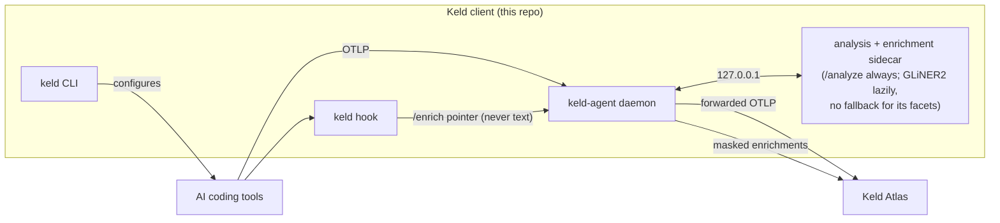

# Keld client — Agent & Contributor Guide

This repo is the **Keld client**: everything Keld runs on an engineer's own
machine. It has two jobs, and the second is the core of the project:

1. **Telemetry** — the `keld` CLI configures local AI coding tools (Claude Code,
   Codex, Gemini CLI) to emit usage telemetry to Keld Atlas.
2. **On-device enrichment** — the `keld-agent` daemon (+ its GLiNER2 sidecar)
   classifies each prompt **locally**, masks anything sensitive, and publishes to
   Atlas only the derived, masked signal. **Raw prompt text never leaves the
   machine.** This is the privacy-preserving intelligence the CLI installs.

⚠️ **Two qualifications, and this said "One" until the second arrived.**

1. **Schema v18.** `inventory.named_terms` publishes proper nouns lifted from
   message TEXT, and real person names have been observed in it. It is still not
   raw text, a span, or an offset: it is a term and a count. See the
   `named_terms` note in the workstreams bullet under *The enrichment agent* for
   the decision and the alternative that was not taken.
2. **`KELD_TEXTEMBED`, off by default.** Message text is encoded ON DEVICE and a
   256-d vector is published — MRL-truncated, then multiplied by a fixed
   orthogonal projection that preserves cosine and inner products exactly, so
   training is unaffected while off-the-shelf inversion tooling needs a matrix
   the client did not choose. See *Text vectors* in
   `docs/superpowers/specs/2026-08-26-signal-embeddings-design.md`.

So **"nothing derived from the prompt's own words crosses" is not the invariant**
and has not been since v18; the honest statement is narrower and is the one at
the top of this file: **raw prompt text never leaves the machine.** Text, spans
and offsets do not cross. Things MEASURED from text — a count, a length, a
vector — may, each on its own argument and its own evidence, never by analogy to
one already here.

Go single static binaries (`keld`, `keld-agent`) + an optional Python ML sidecar.
No runtime dependencies for the CLI itself.

## Architecture


```mermaid
flowchart LR
  Tools["AI coding tools"]
  subgraph Client["Keld client (this repo)"]
    CLI["keld CLI"]
    Hook["keld hook"]
    Agent["keld-agent daemon"]
    Sidecar["analysis + enrichment sidecar<br/>(/analyze always; GLiNER2 lazily,<br/>no fallback for its facets)"]
  end
  Atlas["Keld Atlas"]
  CLI -->|configures| Tools
  Tools --> Hook
  Tools -->|OTLP| Agent
  Agent -->|forwarded OTLP| Atlas
  Hook -->|"/enrich pointer (never text)"| Agent
  Agent <-->|127.0.0.1| Sidecar
  Agent -->|masked enrichments| Atlas
```

**Two lanes, one privacy invariant.**
- **Telemetry (push):** AI tools POST OTLP to the daemon's loopback telemetry
  proxy (`internal/agent/teleproxy`, fixed port **14318**, `KELD_TELEMETRY_PORT`
  to move it), which forwards to Atlas with the daemon's own token.
  ⚠️ **This bullet used to read "the hook posts usage telemetry straight to
  Atlas. No daemon involvement", and the change is the whole point rather than a
  refactor.** A tool reads its configuration ONCE, at startup, and keeps the
  credential in memory — so when the org's ingest token rotated, every running
  tool went on posting the old one and its telemetry was rejected until a human
  restarted the editor. Measured on a real machine: `tool_events` froze for 40
  minutes while `keld signal doctor` reported no problems, **correctly** — every
  fact it can reach was right, and the stale copy lived inside a process it
  cannot inspect. The hook cannot detect it either: a Claude Code child process
  sees **no `OTEL_*` variables at all**, because Claude Code applies its `env`
  block to its own OTEL SDK and exports nothing. So detection was impossible and
  remediation could only ever be "ask the human to restart"; the fix is to stop
  handing the tool a credential. `keld signal setup` writes the loopback address
  and a **stable local secret** (`agentcfg.TelemetrySecret`, generated once and
  never rotated — unlike `Info.Secret`, regenerated every daemon start, which
  would rebuild the bug one layer down and fire it daily). The token the daemon
  attaches is read **per request**, so a rotation mid-flight is picked up.
  ⚠️ **The proxy accepts that secret in THREE shapes, because the tools do not
  agree on one**: `x-keld-ingest-token` (Claude Code, Codex), `?token=` in the
  URL (Gemini — its OTLP SDK cannot send a custom header at all), and
  `x-keld-telemetry-secret`. Assuming a single shape 401'd all three tools live
  while the entire Go suite passed, because the tests used the name the proxy
  chose rather than the ones `telemetry.ClaudeEnv`/`CodexBlockBody`/
  `GeminiTelemetry` emit. Widening where the credential may appear does not
  widen what is accepted.
  ⚠️ **THE TEXT GATE OVER-MATCHED `prompt.id` AND SILENTLY BROKE EVERY
  CORRELATION.** `teleproxy.textKey` matched an attribute key by SHAPE —
  `strings.Contains(k, "prompt")` and seven siblings — and its comment said "a
  key it over-matches costs one dropped attribute". That was wrong about the
  most important attribute on the wire: Claude Code sends `prompt.id` on every
  record, and Atlas joins `Enrichment.corr_id` to `ToolEvent.prompt_id`. So the
  proxy blanked the one field relating a block to the telemetry it describes,
  and the failure was invisible in the way a dropped attribute is not — rows
  arrived, attributed, counted, and joined to nothing. Measured on the dev
  Atlas: of one proxied session's 1,107 events, **0** had a non-empty
  `prompt_id`, while unproxied seed rows kept theirs; after the fix, 10 of 10.
  Reported as "blocks show up but the activity panel is empty", which is that
  join returning nothing. The rule is now two-sided — match a text word, then
  subtract the identifier/measurement SUFFIXES (`.id`, `_id`, `_length`,
  `_tokens`, …) — and both halves are load-bearing: drop the first and text
  leaks, drop the second and correlation dies. An unanticipated shape still
  fails CLOSED, toward privacy. Pinned by `striptext_identity_test.go` against a
  **real captured Claude Code payload**, because the original gate shipped
  green: `prompt.id` was in no fixture, so nothing could see the cost.
  ⚠️ **`keld signal setup` now SAYS to restart the tools, and never used to.**
  The reasoning was written in that package twice and printed zero times. A tool
  reads its telemetry config once at startup, so one already running keeps
  posting wherever it was pointed when it launched; nothing on the machine can
  detect or fix that from outside. Measured: a session started before setup ran
  emitted **0** telemetry events over 11 hours while its blocks published
  normally — blocks are read from the transcript by the daemon and never depend
  on the tool's config, so the visible half of the product stayed healthy and
  hid the silent half. The `done` event carries `restart_required` so an
  installer's UI can say it too.
  ⚠️ **And doctor now asks PER SESSION, because the machine-wide check cannot.**
  `localagent.TelemetryState` asks whether telemetry has arrived AT ALL since the
  credential was written, so on a machine running two editors — one started
  before setup, one after — the second vouches for the first and doctor reports
  "No problems found", correctly and uselessly. `SessionTelemetryState` compares
  the sessions whose transcripts are being written NOW against
  `teleproxy.SessionsOnDisk()`, a bounded (64, oldest-evicted) record of which
  tool session ids the proxy has forwarded for. Session ids are IDENTIFIERS —
  the same class already published as `corr_id`; no text, span or offset is read.
  Three refusals keep it from lying: an **empty record is "not tracked yet"**,
  never "nothing is arriving" (on upgrade the state file has a `last_forward` and
  no sessions, and reporting then would call every running tool broken the day it
  shipped); `agent-*.jsonl` **subagent transcripts are excluded** (they share
  their parent's OTEL session id and are **620 of 671** files here, so including
  them means hundreds of false findings); and the session's start instant is read
  by DECODING lines for a top-level `timestamp`, never by pattern-matching the
  first one — Claude Code opens a transcript with untimestamped `custom-title` /
  `mode` / `file-history-snapshot` records, the same trap `capture.scan`
  documents. Scoped to `claude_code`: Cowork's egress is blocked by design and
  Codex/Gemini transcript names are not their OTLP session ids. The record is
  LOADED at proxy construction, not started empty — otherwise a daemon restart
  makes every session look untracked, and the first forward then writes that
  empty map back, erasing the history rather than merely not reading it.
  ⚠️ **And `teleproxy`'s tests now isolate `KELD_HOME` in a `TestMain`, because
  they were writing the developer's real `~/.keld`.** `New()` resolves
  `StatePath()` at construction and every successful forward persists, while most
  tests there pass `t.TempDir()` only for the SPOOL — so the spool was isolated
  and the state file was not. Running `go test ./...` on a live machine
  overwrote its telemetry record, erased the per-session history, and silently
  turned this very check inconclusive. A test that mutates the machine it runs on
  is a worse defect than the one it checks for.
  ⚠️ **Telemetry now depends on the daemon**, where it did not before. Paid for
  with a bounded spool under `spool/telemetry` and not hoped away; a machine
  whose daemon never starts collects nothing, and `keld signal doctor` is the
  detector — which can only exist AFTER this path, since pre-proxy the client
  kept no record of tool telemetry at all. Delivery is confirmed from the
  RESPONSE, not the status code: captive portals answer **200 with an HTML login
  page**, and a status-only check would delete the batch. A drain **stops on a
  REJECTION** (401/403 — every remaining batch would be told the same thing),
  **ends the sweep on UNAVAILABLE** (net/5xx — never a re-onboard, nothing is
  wrong with the credential), and **continues past a REFUSED payload** (4xx —
  or one bad batch blocks every good one behind it). See
  `docs/superpowers/specs/2026-08-27-telemetry-loopback-proxy-design.md`.
- **Enrichment (local):** the hook fire-and-forgets a *pointer* (transcript path
  + prompt id — **never text**) to the daemon's loopback `/enrich`. The daemon's
  background worker resolves the text on-device, runs the enrichment pipeline,
  **masks**, and syncs to Atlas `/v1/enrichments`. The prompt text is read
  locally and never transmitted — masking is enforced Go-side before publish.

## The enrichment agent (`keld-agent`) — the core

`cmd/keld-agent` → `internal/agentcli` → `internal/agent/*`. Lifecycle:
`ingress` (loopback HTTP intake, per-user secret, bounded `queue`) → `resolve`
(read prompt text + tail recent prompts from the transcript) → `enrich`
(the pipeline) → `mask` → `publish` (Atlas). Panic-isolated per job; a readiness
gate holds work until the backend is up.

⚠️ **A DEDUP IS NOT BACKPRESSURE, and collapsing the two cost work twice.**
`queue.Offer` returns an `Outcome` — `Accepted` / `Duplicate` / `Full` / `Closed`
— because it used to return a bare `false` for all four and both callers read
that as overload. The ingress answered **429**, and since the hook treats any
`>=400` as failure and durably SPOOLS the pointer, a prompt the daemon had
already published came back as "try again later" and was written to disk;
`drainEnrichSpool` then kept that row and re-offered it on **every sweep
forever**, because a row is deleted only when its offer succeeds and a duplicate
never can — unbounded spool growth. Observed live: a POST for a prompt finished
one second earlier returned 429 while the 1024-slot queue held single digits.
`Outcome.TakenOn()` (Accepted or Duplicate) is the predicate both callers want —
the daemon has assumed responsibility, so a caller holding a durable copy may
drop it. Only `Full`/`Closed` are backpressure. The hook↔watcher overlap that
produces duplicates is **designed** (`queue.Complete` exists for it) and must
never read as overload. Delivery is durable: the hook writes a
prompt *pointer* (never text) to the on-disk `spool` when the daemon is
unreachable, and the daemon drains it on startup + a periodic sweep.

**An unconfigured agent IDLES, it does not fail.** The service is routinely
registered *before* onboarding runs (the documented macOS pkg order), so a
missing `~/.keld/hook.json` is a normal startup state, not a crash. `Run` waits
on `daemon.awaitConfig` (re-reads hook.json every `KELD_CONFIG_POLL`, default
5s; announces the wait once, not per poll) and starts the instant `keld signal
setup` writes the token — no restart needed. Returning an error here instead
cost a tester **69 launchd spawns in 12 minutes**, because the plist's
`KeepAlive` was an unconditional `<true/>`. That is now the
`SuccessfulExit=false` dictionary, so a clean exit is final while a real crash
still restarts; systemd's `Restart=on-failure` was already the equivalent
(don't add `RestartSec` — see the note in `service.go`), and the Windows
`ONLOGON` scheduled task never retried at all.

**Capture triggers.** Two triggers feed the same queue: the **command hook**
(`keld __hook --source <tool>`, wired by `keld setup`), and an on-device
**transcript watcher** (`internal/agent/watch/`) that tails the JSONL transcripts
Claude Code (all surfaces incl. the Desktop app), **Cowork**, and **Gemini** write to disk —
the hook-free path. The watcher synthesizes the same `spool.Pointer` the hook does
(never text) keyed on `promptId`; the queue dedups hook↔watcher overlap via a
recently-completed set (`queue.Complete`, marked only on a real publish so retries
and watcher fallbacks stay re-offerable). Sources: `~/.claude/projects` →
`claude_code`, the Cowork `local-agent-mode-sessions/**/.claude/projects` trees →
`cowork` (macOS), `~/.gemini/tmp/*/chats` → `gemini` (all platforms). Env: `KELD_WATCH` (default on), `KELD_WATCH_POLL` (default 5s),
`KELD_WATCH_BACKFILL` (default off = forward-only), `KELD_WATCH_ROOTS` (comma-separated
`source:dir`, default empty). macOS + Linux; Windows deferred.

**Cowork went VM-backed, and host-side capture cannot follow it.** Newer Claude
desktop builds run Cowork inside a VM (`vm_bundles/claudevm.bundle`) whose
transcripts live in the VM's disk image, not under `local-agent-mode-sessions`.
Nothing on the host can read them: no folder is shared and the VM's address does
not answer the host. Discovery therefore finds no *live* Cowork transcripts on
these machines — and because the pre-VM session directories are never cleaned up,
a root is still discovered, just permanently stale. `coworkHidden`
(`internal/agent/watch/roots.go`) detects that exact shape — VM images touched
within `coworkActiveWindow` while no Cowork `.jsonl` was written in the same
window — and logs one advisory line per daemon run, because the failure is
otherwise completely silent: Cowork just stops appearing in Atlas. It keys on
transcript **freshness**, not root existence, precisely so the stale-directory
machines are caught. Restoring capture needs a path the host can read (or an
in-VM emitter); `KELD_WATCH_ROOTS=cowork:<dir>` points the watcher at one the day
it exists.

**Watched-source telemetry (`internal/agent/promptlog`).** Cowork's own OTEL is
configured to Keld but its sandbox egress blocks `atlas.keld.co`, so the daemon
mirrors the transcript's events into OTLP logs+metrics host-side: the watcher's
per-line `observe` hook → `promptlog.Telemetry.Observe`, which emits `user_prompt`
/ `api_request` / `assistant_response` logs + `token.usage`/`cost.usage` metrics to
`/v1/logs` + `/v1/metrics`, matching the CLI's native OTEL schema. Identity
(`user.email`/`account_uuid`/`organization.id`) is recovered from the Cowork
session path/metadata. **Never emits prompt/response text.** Default source
`{cowork}` (Claude Code emits its own OTEL); `KELD_WATCH_TELEMETRY` (off/on),
`KELD_WATCH_TELEMETRY_SOURCES`. **Codex** and **Gemini** are covered via their own watcher roots
(`~/.codex/sessions` and `~/.gemini/tmp/*/chats`, sources codex and gemini) + specialized readers for enrichment
(TranscriptReader resolves user_message by session_id#ordinal for Codex, by message `id` for Gemini);
telemetry via their native OTEL (config completed in the tool adapters), not host-side promptlog.

**Enrichment pipeline (`internal/agent/enrich/`).** A staged registry of
extractors ("sweeps") run over a swappable `Model` backend, producing a `Profile`.
Single-flight (never fans out) so the shared model issues at most one inference at
a time. Two waves, up to 7 facets per prompt:
- **Wave 1** (independent, committed as a batch): `task_type` (the routing key for
  the Keld Inference Exchange — a 10-entry routing taxonomy: `summarization`,
  `translation`, `code_generation`, `information_extraction`, `classification`,
  `reasoning`, `question_answering`, `text_generation`, `rewriting`, `general`),
  `sensitivity` (+ masked entity spans; detects **concrete leaked data**, not
  topic — unions TWO independent evidence sources, **neither of them GLiNER2**,
  and rolls up to the highest-severity class: `ssn`⇒`phi`, `credit_card`⇒`pci`,
  `api_key`/`secret`⇒`secrets`, other personal id⇒`pii`. See
  **The sensitivity facet's two sources** below),
  `domain` (+ entities), `activity_type`, `personal`, `function_guess`
  (12 business functions).
- **Wave 2** (conditioned on Wave-1 `function_guess`): `subcategory`.

**`speech_act` was DROPPED at schema v9, and the gate is now model-free.** It
was an eighth facet (`command`/`question`/`statement`/`fragment`) and it also
supplied the enrichment gate's model half. A pre-registered study measured it
live over 2,015 inferences
(`docs/superpowers/specs/2026-08-24-facet-value-results.md`): accuracy **0.695
against a 0.713 majority baseline** — worth less than always answering
`command`. It predicted `statement` 22 times and was right **zero** times, at up
to full confidence. The other measured facets are fine (`task_type` 0.733 vs
0.143, `domain` 0.683 vs 0.261, `activity_type` 0.670 vs 0.243), so this is a
targeted removal, not a retreat from model-backed classification. Consequences,
each deliberate: `Profile.SpeechAct`/`SpeechActAlt` and
`Enrichment.speech_act`/`speech_act_alt` are gone from the published payload (a
published-vocabulary change, hence the v8→v9 bump; producer strings move `-v8`
→ `-v9`); `SpeechActDefs` is deleted; the gate keeps only its model-free
approval lexicon (`prefilterContentFree`), whose own validation measured it at
recall 100% on-corpus with the `fragment` branch a strict subset of it, so
0/24-dangerous survives; `sensitivity` is now the ONLY always-run pass. This
saves ~12% of enrichment CPU (one inference of eight) and **none** of the 1.8 GB
model — the remaining facets still need it. The **gold labels are kept** in
`eval/gold.jsonl`, unscored, as the evidence for judging a re-introduced
classifier: the study named the label *wording* as the suspect, so a
`SpeechActDefs` re-bakeoff is the live alternative to permanent removal.

**The sensitivity facet's two sources.** Neither classifies; the class is
a rollup over which entity labels were DETECTED (`sensitivityFromEntities`).
**Neither is GLiNER2** — this facet does not touch `ctx.Model` at all, and a
test asserts its output is identical with a Model present and with none.
1. **`creddetect`** — vendored gitleaks credential rules. Pure Go, no model, no
   network, over the FULL prompt text. Always available; the only source that
   needs nothing at all.
2. **The sidecar's `/pii`** (`enrich.PIIScanner` → `sidecar.Client.DetectPIIIn`
   → `app/pii.py`, presidio-analyzer). **Region-scoped pattern recognizers**,
   every one of them checksum- or algorithm-validated: a universal tier
   (`credit_card`, `email`, `phone`, `iban`, `crypto_wallet`) plus one country
   tier per configured region — `us` by default (`ssn`, `aba_routing`, `us_npi`,
   `medical_license`), with `uk es it pl fi kr in au ng th sg` opt-in. It needs
   **no GLiNER2** — and, since the NER came out, **no spaCy model either**: only
   a blank tokenizer, because every recognizer left is a regex plus a check
   algorithm. It never touches the inference single-flight, so it is wired in
   `ml_backend:"deterministic"` too. It returns **offsets only, never the
   matched value** — the Go side resolves and masks from its own copy of the
   text.

   ⚠️ **Region-scoped is a PRECISION decision, not a cost one** (the full set
   measured **+0.5 ms/prompt**, which is nothing). Almost every national-id
   recognizer is a bare digit run plus ONE check digit, so its false-positive
   floor against arbitrary numbers is 1-in-10 or 1-in-11 — a checksum makes a
   false positive unlikely, not impossible — and the shapes **collide across
   countries**. A valid `us_npi` is ten digits starting 1 or 2, which is exactly
   the `uk_nhs` shape, and `uk_nhs` rolls up to `phi`: enabling `uk` inside a
   US-only org manufactures the most severe class out of provider ids. Verified
   collisions are pinned in `sidecar/app/test_pii_regions.py`. Configure with
   `KELD_PII_REGIONS` (comma-separated, `none` = universal only) or
   `pii_regions` in `~/.keld/agent-config.json`; an Atlas org value
   (`Remote.PIIRegions`) overrides both and takes effect on the **next prompt**,
   because the region list rides each `/pii` request rather than the sidecar's
   startup environment. **Atlas does not serve the key yet** — the client seam
   exists so adopting it is a server change alone.

   ⚠️ **`phi` is deliberately narrow, and two assignments were argued rather
   than assumed.** `us_npi` maps to `pii`, NOT `phi`: an NPI is a public CMS
   provider-registry number, so routing it to the most severe class would
   overstate a lookup as a leak. `aba_routing` maps to `pci` while identifying a
   **bank branch from a published directory**, not an account — kept as a
   reliable marker that banking data is present, not as leaked data itself.
   `it_vat_code`, `kr_brn`, `in_gstin`, `au_abn`, `au_acn` and `sg_uen` are
   **business registration numbers**, included only because each of those
   registers also issues to sole traders; they are the weakest members of their
   (opt-in) regions. See `SensitivityFromEntity`'s comment in `labels.go`.

   ⚠️ **Ten recognizers the design asked for DO NOT EXIST in
   presidio-analyzer 2.2.362**, so those regions are absent entirely rather than
   silently empty: there is **no German recognizer of any kind**, no Swedish, no
   South African, no Turkish, and no UK driving licence.

⚠️ **`person` and `address` are NOT DETECTED. The coverage is four types, not
six.** They came from presidio's `SpacyRecognizer`, and on **2,000 real
developer prompts** that recognizer produced **998 of 1,090 spans with zero
confirmed names and zero addresses** — `JSON` ×132, `Docker`, `YAGNI` ×27,
exported Go identifiers, hex colour literals, and a bare `❌` at **0.85**, the
same score a real name gets. Overall precision was **~1%**, and **24% of prompts
published `sensitivity: pii`**. No threshold separates a common noun from a name,
so the recognizer was removed rather than tuned; the same measurement rerun
against the current detector publishes `pii` on **0.45%** of prompts at 100%
precision, and `pci`/`phi` never fire. Both dropped types mapped to `pii`, the
LOWEST severity class, so nothing severe was lost — but free-form personal names
in prose are now **undetectable**, and that is a real narrowing, not a tuning.
`SensitivityFromEntity` still knows both names so a future detector needs no
schema change. Full before/after:
`~/keld/refseries-context/pii-precision/RESULTS.md` (reproduce with
`scripts/pii_precision.py --port N --regions us|all`). The same 2,000-prompt run
against the **widened** detector with **every region enabled** produced **zero**
spans of any new type — the only raw presidio output was three readings of one
digit run inside a URL path, all removed by the fragment gate.
There is deliberately **no third, GLiNER2 source**. `/entities` over a
`SensitiveEntityLabels` vocabulary used to be one, and it was redundant:
presidio produced every mapped type the GLiNER2 NER did (`person`/`address` then
came from its `SpacyRecognizer`, which is spaCy, not GLiNER2 — both have since
been dropped as measured noise, see above), so the NER added no type of its
own while needing a corroboration rule to keep its confident, perfectly-shaped
documentation constants off the wire. That rule, the label vocabulary, and the
call are all gone. Re-admitting a model here is a deliberate decision with its
own evidence, not a rewiring.

⚠️ **The published-test-value gate lives in ONE place: `sidecar/app/wellknown.py`.**
`4111 1111 1111 1111` passes Luhn, `123-45-6789` is the textbook SSN,
`user@example.com` is RFC 2606 — developer transcripts are saturated with them,
and ungated the facet reports `pci`/`phi` continuously and is worse than absent.
The gate is applied **at source**, inside `scan()` before it answers, so nothing
it suppresses can reach Go by another route — there is no second detector to
route around it. Two rules there are **measured, not structural**: a no-reply /
machine local-part denylist (66 of 78 `email` spans in the corpus were one
`noreply@` address quoted out of a `Co-Authored-By` git trailer — an unattended
sink is not personal data), and a rejection of Go-module-version paths
(`host.tld/pkg@v1.23.4` parses as local-part-at-domain and scored 1.0). A
companion **numeric-fragment gate** lives in `pii.py`, not here, because it needs
the surrounding text: a match preceded by `[0-9.,:/-]` is the tail of a longer
token, which is how 13 digits after a decimal point published **`pci` at 1.0**.
It is asymmetric on purpose — the right-hand side rejects only a continuation
(digit, or `.,-` then a digit), because "…4470, then email" is prose and the
whitespace-token rule would have cost real detections. With **no scan available
the four personal-data types simply have no source**; only credentials remain, and the loss is declared (see
`facets_degraded` below) rather than papered over. Do not add a Go copy of the
list, and do not add a second detector that would need one.

**`facets_degraded` for sensitivity turns on the SCAN.** The scan is the sole
source for every personal-data type, so a whole scan leaves nothing uncovered
and a Model's absence costs nothing.
Scan absent / failed / **`truncated`** ⇒ degraded, unless the answer already
reached the ceiling of the severity order (`phi`), which no missing evidence
could raise.
- **`workstreams`** (`enrich/workstreams.go`) is the one pass that runs **no
  inference**: it asks the sidecar's `/analyze` for the deterministic dimensions
  of the hour of work ending at this prompt — the seven ALLOCATION dimensions
  (project, branch, model, output_type, language, skill, tooling) plus the
  published INVENTORY ones — counted from tool-call metadata.
  It takes COORDINATES (transcript path + prompt id), never text, and publishes
  as `workstreams` — a map of dimension → `Labeled` (`share` becomes the
  confidence). It declares `ModelFree`+`AlwaysRun`, and is registered only when
  the daemon has an analysis backend (`enrich.WithWorkstreams`) **and** the
  source is one the analysis can read — `claude_code`/`cowork` only
  (`enrich.WorkstreamsEligible`): the analysis resolves a prompt by Claude-Code
  JSONL shape, so Codex/Gemini prompt ids 404, and registering it there would
  downgrade every one of their jobs to `"partial"` for a facet that was never
  obtainable. Callers with no backend (eval, localagent) are unchanged. A failed analysis
  fails the pass (`pipeline_status:"partial"`) rather than publishing an empty
  set. Attribution needs **two** things, not one: the winning value's share is
  ≥ 0.50 **and** the window holds ≥ `window.MIN_EVIDENCE` (5) observations at
  that level. The second exists because a share is a ratio — one tool call
  gives share 1.0 by construction. Five is derived, not chosen: under the 0.50
  floor read as a null hypothesis, `0.5**n` first falls below 5% at n=5, so
  below it no share distinguishes the window from a coin flip. Measured on the
  572-window reference sample: 347 of 2927 attributed dimension slots become
  unattributed, 330 of which were publishing at share 1.0 and 129 off a single
  observation.
  ⚠️ **EVERY dimension now publishes, and the floor is a LABEL rather than a
  publish gate** (schema v21 / sidecar SCHEMA 16). This reverses the rule that a
  sub-floor dimension is simply absent, and it reverses the second half of
  MIN_EVIDENCE's own justification, which used to read "`evidence` is dropped on
  the way to the published enrichment, so nothing downstream can tell one
  observation from five hundred". It isn't dropped any more: `Labeled` carries
  `evidence` (the count) and `status` (`attributed`/`thin`/`tie`/`no_majority`/
  `absent` — `enrich.WorkstreamStatuses`, the sidecar's `window.REASONS`), both
  `omitempty` so the ML facets that share the type are byte-unchanged. Deleting
  the dimension cost 924 of 12,016 measured dimension-slots (7.7%) that held
  **real evidence and published nothing** — 198 of them one observation short —
  with `toolchain` discarding more slots (172) than it published (138).
  **The floor did NOT move and nothing was promoted:** `attributed` still means
  exactly what it meant, the two conditions above are unchanged, and removing
  them would take P(false attribution) from 0.031 to 0.50. A consumer that
  renders `thin` identically to `attributed` is misreporting — the contract
  states that and cannot enforce it. A dimension is now
  present-with-a-stated-outcome, never silently missing; only a **pre-16
  sidecar**'s JSON null still drops (it sent no count and no status, so there is
  nothing to state), and an object with no `status` from that same sidecar reads
  as `attributed`, because that sidecar emitted an object only when it had
  attributed.
  **Nothing from `/analyze` reaches Atlas except those dimensions and the nine
  inventory ones.** ⚠️ **All nine inventories now publish, including
  `named_terms`** — a deliberate reversal (schema v18) of the rule that governed
  this file for most of its life. `inventory.named_terms` is proper nouns lifted
  from **message text**, matched against no declared vocabulary, and real person
  names have been observed in it ("Federico", "Daniel"). It used to be
  unmodelled on `sidecar.AnalyzeResult` precisely so a publish path had
  structurally nowhere to forward it; it is now modelled like its eight
  siblings, bounded by SHAPE alone (`sidecar.convertNamedTerms`).
  There is deliberately **no person-name filter**, and adding one would be worse
  than the absence: spaCy's person detection measured **~1% precision** on this
  corpus (998 of 1,090 spans with zero confirmed names), which is why presidio's
  `SpacyRecognizer` was removed from `sensitivity` outright. A filter at that
  precision does not remove names, it only removes the belief that names are
  present. The alternative that was NOT taken, and is still the safer shape if
  this is ever revisited, is `/match` + `publish.Custom`: an org declares its
  customers/suppliers/initiatives and only the **matched id** publishes — never
  a span, an offset, or the text. What still holds: `inventory` as a BLOCK
  remains unforwardable (a test pins it), so a tenth key the sidecar adds later
  cannot ride along; no raw prompt text, no spans and no offsets cross; masking
  is still enforced Go-side.
- **The PATH inventory dimensions (`files`, `directories`, `components`) publish
  a frequency distribution, and their caps are per-level.** The `file`/`dir`/
  `component` levels were extracted and stored long before they were published;
  they answer "which paths were hot this hour", which is a distribution, not a
  single owner — so they are INVENTORY, never ALLOCATION. ⚠️ **The blanket
  open-vocabulary cap of 12 is wrong for them**, and silently: measured over 165
  one-hour windows, distinct-per-window runs p50 8 / p90 32 / max 54 for `file`,
  p50 5 / p90 14 / max 27 for `dir`, p50 3 / p90 7 / max 17 for `component`, so
  a cap of 12 truncates **33% of windows** on `file` alone. Truncation is top-N
  by count, so a hotspot can never be the thing cut — but the tail is what
  separates "this hour touched three files" from "this hour touched forty", and
  losing it silently makes a scattered window read as a focused one. Caps sit
  just above each level's own p90 (**40 / 24 / 16**) and the cut is **declared**
  in the sibling `inventory_omitted`, which is what stops a truncated inventory
  from being indistinguishable from a short one — the `omittedNotice` rule
  (Conventions → never cut text mid-sentence) applied one level up. That block
  covers ALL nine inventory dimensions, since the other six were silently
  truncating at 12 already.
  ⚠️ **What makes these safe to publish is that they are ALREADY
  workspace-relative** — `reconcile()` resolves every path against the resolved
  workspace root. Verified over the full 500-transcript corpus plus a Cowork
  session: **zero** absolute paths, zero `~`/`/Users`/`/home`, zero `../`
  escapes, zero URLs, zero Windows drive paths, at all three levels. It is
  gated TWICE, not merely tested: the sidecar payload asserts the shape, and
  `sidecar.notWorkspaceRelative` re-checks it per entry at the Go decode
  boundary, dropping a bad value without losing the rest of the list. Two gates
  because the vocabulary is OPEN — `physical_acts` can lean on a closed table,
  and these cannot. The residual exposure is repo *structure* (`services/api/app/billing`)
  and any customer name inside a filename — the same class `branch` already
  crosses. (That comparison used to end "not the class `named_terms` does";
  since v18 `named_terms` crosses too, so paths are no longer the more exposed
  of the two.) Do not add a producer for these
  levels that bypasses `reconcile()`. Note they are coding-heavy: a
  non-engineering session yields **3 distinct paths in total**, so an empty list
  here is a real answer, not a gap.
⚠️ **THE PROMPT INDEX HOLDS BOTH IDS, AND HOLDING ONLY `uuid` SILENTLY EMPTIED
EVERY ENRICHMENT.** A Claude Code user line carries two: `uuid`, unique per line,
and `promptId`, the identity of the human TURN — shared by every follow-on line of
it (measured on a real transcript: one `promptId` spanned **7 user lines across 8
minutes**). The daemon names a prompt by `promptId` and only by it:
`watch/filter.go` REJECTS a line without one, the spool pointer carries it, the
queue dedups on it, and it is published as `corr_id`, which Atlas joins against
`ToolEvent.prompt_id`. So `promptId` is the id `/analyze` and `/tick` are ASKED
about. While the index held only `uuid`, every lookup 404'd, the workstreams pass
**failed** (not skipped — a failed pass is what sets `partial`), and every prompt
published `pipeline_status:"partial"` with no workstreams, no dynamics and no
prior. Under `ml_backend:"deterministic"` that is the whole payload. Measured on a
live v2 machine: **8 of 8 prompts partial, and 0 of 1,627 stored enrichments had
ever carried a workstream.**
**Why no test caught it, which is the part to keep:** both halves of the sidecar
agreed on `uuid` — the index AND `analyze.py`'s oracle scan — so
`analyze_window_by_parse`, the equality test that guards the entire store,
compared two identical wrong answers; and every sidecar fixture built a user turn
as `{"type":"user","uuid":…}` with **no `promptId` at all**, so the sidecar's own
corpus did not look like a real transcript. The Go tests use fakes and never
crossed the seam either. An oracle that shares the bug proves nothing, and a
fixture that does not resemble production is why it could.
Both ids are now indexed, in FILE order under `upsert_prompts`' existing
`ON CONFLICT DO NOTHING`, so a shared `promptId` resolves to the FIRST line
carrying it — the human prompt's own instant, never a continuation's, which would
run every window minutes long. `analyze.py`'s oracle matches either id and **must
change in the same commit as the index**, or the equality test goes back to
proving nothing. `resolve/claude.go` already accepted either id when reading
prompt TEXT; this made the sidecar consistent with a rule the Go side already had.
Pinned from both ends by `sidecar/app/test_prompt_id_seam.py` and
`watch/filter_test.go`'s `TestHumanPromptIDIsThePromptIdFieldNotTheUUID`, which
name each other — **do not remove `promptId` from those fixtures.**
`ingest.STATE_VERSION` 4 → 5 is the repair: existing stores hold uuid-only
indexes and nothing recomputes them, so **expect one reparse per transcript on
upgrade.**

- **The watcher signals ingest; the sidecar never polls.** `/analyze` answers out
  of a persistent reference-series store, and the parse that fills it is driven by
  the transcript watcher: a file that advanced in a poll is signalled once (per
  file, per poll) to the sidecar's **`POST /ingest`**, which parses only the
  appended tail from its own byte-offset checkpoint. Coordinates only — a path,
  never a line, never text. The seam is `watch.WithIngestSignal` (the coarse
  sibling of the per-line `observe` hook); the daemon-side policy is
  `daemon/ingestsignal.go`: **fire-and-forget** on a bounded, path-coalescing
  queue with one serial sender, so an unreachable sidecar can never block or slow
  the watcher's poll loop — the loop that carries every hook-free prompt. Signals
  are **dropped, not retried**, because ingest resumes from the stored offset: the
  next signal catches up, and `/analyze`'s own on-demand ingest is the backstop if
  none ever comes. Scoped to `enrich.WorkstreamsEligible` sources (the same
  predicate the pass is gated on — a Codex/Gemini window can never be served, so
  ingesting it is pure cost). Forward-only by default, matching
  `KELD_WATCH_BACKFILL`: a first sighting consumes nothing, so a daemon restart is
  not a herd of whole-file ingests. Why it matters: a first whole-file ingest
  measured **5.1s on a 90 MB transcript**, and inside an `/analyze` request that
  lands on an enrichment job's per-pass deadline.
- **Retention is bounded by TIME, and a pruned window REFUSES (410) rather than
  answering narrower.** The store's raw `event` rows expire at
  `KELD_REFSERIES_RETAIN_DAYS` (400) and the one text-derived level, `term`, at
  `KELD_REFSERIES_TERM_RETAIN_DAYS` (90); `KELD_REFSERIES_MAX_MB` (1024) is a size
  **backstop**, not the operating policy — measured, 1,552,800 rows (400 days at
  3,882/day) is 174 MB, so the cap is ~6-9 years and the horizon is what bites.
  ⚠️ **Pruning raw events does not degrade a window's edges — it breaks the digest
  outright.** `/analyze` serves every window with
  `exclude_slots=(RECONCILE_SLOT,)` (reconcile must be re-scoped per window), and
  `Store.window_rows` answers an excluded-slot query **entirely from `event`** —
  a `bin` row has no slot dimension to filter on — so for the digest path `bin`
  is not a degraded fallback for a pruned event, it is not read at all. Measured
  on the test fixture: prune the events, keep every bin, and the window returns
  **200** with `evidence` 179 → 36, `project`/`branch`/`model` silently `null`,
  and a confident 0.833 share off a fifth of the data, with `is_current()` still
  True so nothing objects. So the store keeps a monotonic **serving floor** and a
  window starting below it is refused: `WindowExpired` → **410** (`analyze_expired`),
  which the Go client treats as a genuine error rather than retrying — correct,
  since retrying can never restore a pruned row — so the workstreams facet
  publishes `partial`. Not 503 (the one status `post()` retries through; it would
  spin forever) and not 404 ("prompt not in this transcript", which would hide a
  horizon set shorter than the windows being asked for). `term` is the **only**
  level whose **bins** are pruned too: it is an INVENTORY level, so it is
  precomputed into `bin`, and under "rollups are never pruned" no event policy
  would bound the lifetime of a person's name at all. Never pruned: every other
  level's bins, and `prompt`/`parse_state`/`ingest` — the prompt index is what
  keeps 410 distinguishable from 404, and `parse_state` is what makes a tail parse
  equal a full parse. Pruning is **chunked** (5,000 rows, measured 14 ms, one short
  transaction each) so it cannot lock out the watcher-driven `/ingest`, rides
  `ingest_file` (both writers) with an hourly gate that being over-cap overrides,
  and is reported in `/metrics` under `store` — size (`live_mb` **and** `file_mb`,
  because **SQLite does not shrink the file on DELETE**: measured, 400,000 events
  took the file to 41.5 MB, and deleting half of them left the file at 41.5 MB
  while live pages halved to 21.1 MB. A cap read off the file size would delete
  every row the store had and *still* be over cap — it would prune the whole
  series to no effect — so it is enforced on `page_count - freelist_count`
  (`Store.live_mb`) and `/metrics` reports both), per-table row counts, oldest
  retained event, `serving_floor_ts` and what each policy removed.
- ⚠️ **`/analyze` and `/ingest` are confined to `KELD_ANALYZE_ROOTS`.** The sidecar has **no
  auth** — `serve.py` binds 127.0.0.1 and that is the whole of it — which was
  adequate while every endpoint only processed text the caller already held.
  `/analyze` is the first that opens an **arbitrary filesystem path as the
  daemon's user** and returns content derived from it, so unconfined it is a
  confused deputy: on a multi-user host any other local user can POST a path
  under someone else's `~/.claude/projects` and read back their workspaces,
  branches and named terms. The path is therefore checked against an allowlist
  before the open — `os.path.realpath` on both sides, so neither `../` nor a
  symlink escapes — and anything outside answers **403** (not 404: a rejected
  path and an unresolvable one must stay distinguishable), counted as
  `analyze_rejected`/`ingest_rejected` in `/metrics`. `/ingest` shares the
  allowlist because it is the same read with a persistence side effect. The daemon sets the variable at spawn from
  `watch.AnalyzeRoots()` (`daemon/sidecarenv.go`), which is the **stable
  ancestors** of each layout plus `KELD_WATCH_ROOTS`, not `DiscoverRoots()`'s
  globbed leaves: session directories appear after the sidecar is spawned.
  Empty means **deny everything**; absent means the sidecar's own per-user
  defaults.
- **This is the client-side analysis and enrichment service, not a GLiNER2
  wrapper.** GLiNER2 was the first use case, not a precondition: the service
  starts and serves with no model loaded, and `/analyze` answers with the
  inference worker still `down` (pinned in `test_main.py` against the real
  `lifespan`). `/analyze`'s `named_terms` level is **on** by default
  (`KELD_TERMS=0` switches it off) and loads spaCy — ~619 MB, into the FastAPI
  parent, permanently, since the parent is never recycled.
  ⚠️ **That default used to be justified by the level being unforwardable, and
  that argument no longer exists** — `named_terms` publishes as of schema v18
  (see the workstreams bullet above). The default is unchanged, but it is now an
  open decision resting on the level's usefulness rather than on its output
  being confined to the device, and it costs 619 MB in a parent that is never
  recycled, inside a budget already documented below as oversubscribed. Anyone
  revisiting `KELD_TERMS`' default should know it was never re-argued on its own
  merits. That coexists with
  GLiNER2 fine (~60 + ~619 + ~2740 MB against a 4096 MB budget); what did not
  was the **accounting** — see the parent-reserve bullet under Resource safety.
  The response carries `named_terms_status` (`ok` / `skipped:disabled` /
  `degraded:spacy_unavailable`), because an empty `named_terms` is otherwise
  not self-describing: a window that held no terms and a level that never ran
  look identical. `KELD_TERMS_MAX_LEN` (default 100k chars/message) restores
  spaCy's own per-document guard, which had been set to 20,000,000 — i.e.
  disabled; over-length messages are skipped by the NER pass, never cut, and
  the regex shapes still read them in full.
- **Classifiers score against readable label DESCRIPTIONS, not bare id strings**
  (the bi-encoder keys on token/semantic overlap — the label wording is
  load-bearing; e.g. `code_generation` scores against "software engineering").
- Label vocabularies live in `labels.go` (gated by `SchemaVersion`, currently **21**
  — bump it and re-run the eval when changing any vocab). Classify calls are
  prefixed with a context preamble (`Meta.PreambleCoding()`; `domain` uses the
  fuller `Meta.Preamble()`). **Facet-selective agentic augmentation:** agentic
  framework metadata helps `domain` but hurts `task_type`, so only `domain`
  augments with it — `task_type` and the others drop it.

**The reference-series store (`analysis/store.py`, `analysis/ingest.py`).**
`/analyze` used to re-parse the whole transcript on every request: median **0.79s
on a 90 MB file**, and since a 60-minute window holds a **mean of 3.8 user prompts
(max 20, over 370 windows)** that is the same hour parsed **~4x**, up to 20x in a
burst. It now answers from a persistent series at `~/.keld/state/refseries.db`
(native SQLite, created `0600`, path resolved through `KELD_HOME`; never pickled
pandas — the package is deliberately pandas-free): **2.3ms on the same file, 340x.**
Nothing else persisted before this, so no dynamics were computable at all. Equality
with a parse is **asserted, not assumed**: `analyze_window_by_parse` is retained as
the ORACLE and never as a fallback, and **0 of 90 real prompts across 30 transcripts
differ from it**.
- **A window is a query over 5-minute bins (`BIN_SECONDS = 300`) and the two edges
  are read EXACTLY.** A 60-minute window ending at a prompt's own instant
  essentially never lands on a bin boundary, so both edge bins are almost always
  partial; snapping outward over-counts, snapping inward drops, and either turns
  every digest into an approximation. `window_rows` partitions instead — the
  fully-covered interior from `bin` (11 of 13 queries for a typical hour), the two
  edges from `event` — and a window shorter than one bin has no interior and is
  answered from events alone. The ordering rule is **not** reimplemented in SQL:
  SQLite computes the per-`(level, ref)` sums and `window.rollup` merges and applies
  its own alphabetical tie-break, so `rollup_window` returns exactly what
  `window.rollup` returns over the same rows and `workstreams.payload` consumes it
  unchanged.
- **`bin` is sparse by design, and its absence must never read as "no evidence".**
  Two things make that unmisreadable rather than merely documented: a **`bin_level`
  registry that `bin.level` REFERENCES** (with `foreign_keys=ON`, so the table
  physically cannot hold an unregistered level — asserted with a direct INSERT), and
  `rollup_window` routing unbinned levels to `event`, so the sparseness never reaches
  a caller. `PRECOMPUTED_LEVELS` is **derived** from `workstreams.ALLOCATION` +
  `INVENTORY` (16 levels) rather than typed, against the 19 `events_for_turns` emits;
  registering a new level backfills its bins from the retained events, with no
  transcript re-read.
- **Row timestamps are quantized to the series' own 0.1s resolution**
  (`levels.quantize`), so a window edge finer than that is not representable and is
  evaluated at that resolution. Measured against the old exact-timestamp turn
  selection: **6 of 90 real prompts move one turn across an edge, changing an
  evidence count by 1; 0 change any published VALUE.**
- WAL + `busy_timeout=5000` + `synchronous=NORMAL`; one writer, readers on executor
  threads — WAL is what lets a digest be served *during* an ingest. `NORMAL` is safe
  **only** because events, re-rolled bins and the byte-offset checkpoint commit in
  **ONE transaction**: a dropped trailing commit loses the offset too, so the next
  ingest re-reads the same tail. A half-applied batch is the state nothing downstream
  would notice, which is why `transaction()` exists. Non-ref rows are dropped on the
  way in — a `say` row carries `len(body)`, a measure of message text, and a `tok`
  row carries token counts; neither is a reference event. ⚠️ **That drop is now
  conditional** — see `KELD_CAPTURE` below — but the default is still drop, and
  nothing routes those rows to `event` either way.

⚠️ **`KELD_CAPTURE` (default OFF) keeps four signals the store used to compute and
discard, and flipping it costs a reparse.** They are the training corpus step 2 of
`docs/superpowers/specs/2026-08-26-signal-embeddings-design.md` needs, and all four
are numbers: per-role message CHARACTER COUNTS (`say`), the raw token split (`tok`),
tool-call OUTCOMES (`is_error` + result size), and `bin_offset` — the byte position
where each 5-minute bin's first line starts. The first three ride `turn_magnitude`'s
existing `kind` dimension (a new magnitude is data, not DDL); only `bin_offset` adds
a table. `Store.has_magnitudes` stays scoped to the COST kinds so a published field
cannot move because a character count arrived.
- **Why a byte index at all:** `transcript.turns_between` is O(FILE) — a whole-file
  parse, 0.79 s on the 90 MB transcript — so re-reading one block through it puts
  back the exact cost this store exists to remove. A block is bin-aligned by
  construction, so a block span maps to a byte range: one seek, one bounded scan.
- ⚠️ **The anchoring timestamp must be the RECORD'S OWN, and a bare regex does not
  give that.** `capture.scan` reads the instant off the raw line without decoding it,
  and taking the first `"timestamp"` anywhere in the line took a NESTED one:
  `file-history-snapshot` records have no top-level timestamp at all, and measured
  over 73,449 lines of the 40 largest real transcripts 1,135 of them (1.5%) match. The
  result was not merely imprecise but NON-MONOTONE — 31 of those 40 transcripts held a
  bin whose offset disagreed with `json.loads`, one anchoring at byte 13,931 of a 24 MB
  file whose preceding bin anchored at 9,426,720, i.e. a negative-length byte range —
  and these rows are written once at ingest and never re-derived. The line is therefore
  routed: a message-shaped line (`"type":"user"`/`"assistant"`, the shape `turns_in`
  gates on) keeps the regex, measured exact on 45,587 lines and 293.7 MB of the 321.3 MB
  corpus; anything else is DECODED, exact by construction and so robust to a record type
  Claude Code has not invented yet, and affordable because the bookkeeping records are
  the small ones — 8.3 ms to decode every one of them on the 90 MB transcript.
- ⚠️ **`KELD_CAPTURE` is fingerprinted into `parse_state`** (`ingest.capture_mode`, the
  sibling of `terms_mode`), so a change forces one reparse and no single transcript can
  hold rows from two settings. That is a per-TRANSCRIPT guarantee and the store is not
  one transcript: flip it on and only sessions that see another append reparse, so a
  dormant session keeps no capture rows. A corpus builder querying the store CAN
  therefore see two incomparable populations; whether a per-session marker is needed is
  a step-2 decision, deliberately not answered. Absent means NOT RECORDED, never zero.
- ⚠️ **Thinking-block LENGTH is not in this data and no toggle changes that.** Every
  block a platform writes carries a signature and an EMPTY `thinking` string (9,148
  measured in `text.think_blocks`, re-measured 7,648 with 0 of nonzero length), so
  `say_asst_think` is emitted and, being zero, never stored. The COUNT is the signal and
  is captured as `say_asst_think_blocks`. Don't wire a length consumer.
- `bin_offset` and `turn_magnitude` are both swept to the retention SERVING FLOOR
  rather than carrying horizons of their own: below it, one is a number nothing can be
  joined to and the other a seek into a window `/analyze` refuses (410). `/metrics`
  reports both row counts under `store.rows`.

⚠️ **`KELD_TEXTEMBED` (default OFF) is the TEXT half of the same corpus, and it is the
first thing in this repo that reads message text in order to keep something derived
from it** (`analysis/textembed.py`). The deterministic half enters as numbers; this
half enters as a text embedding, and neither is ever serialised into the other's
modality — a bi-encoder fed digest PROSE answered `record` on 36 of 36 inputs, so
that direction is closed.
- **The unit is the MESSAGE, not the shell.** A 240-minute shell holds hundreds of KB;
  `tool_result` lines are the huge ones `turns_in` skips unparsed and must stay that
  way (this module reads only `text` and `thinking` content BLOCKS, so a `tool_result`
  riding a `tool_use` line is unreadable by construction, not by filter); and shells
  overlap across rows, so per-message encoding means each message is encoded ONCE EVER
  and every shell reuses the vector. Three streams — `user`, `asst`, `think` — kept
  separate and never concatenated. `think` is `skipped:empty` in practice: 9,144
  thinking blocks re-measured over the 40 largest local transcripts, **0 non-empty**.
- **Qwen3-Embedding-0.6B via `transformers.AutoModel`, encode 1024-d, publish MRL
  prefix-sliced to 256-d.** Nothing was added to `sidecar/requirements.txt` — gliner2
  already pulls torch and transformers. The 256 is the one parameter that cannot be
  revised retroactively: a corpus collected at 256 cannot be widened without
  re-embedding every machine's history.
- **Its own child process, and bf16 is MEASURED on both axes.** Not the FastAPI parent:
  `parent_reserve_mb()` is a high-water latch, so anything resident there permanently
  shrinks the inference worker's hard limit. Measured on 200 real messages, 2 threads:
  float32 **3113 MB / 804.0 ms per message**, bfloat16 **1673 MB (1813 peak) /
  766.2 ms** — bf16 is 1313 MB cheaper and no slower, so it is not a latency trade.
  Idle-unloaded (`KELD_TEXTEMBED_IDLE_UNLOAD_S`), never spawned when the toggle is off.
  ⚠️ **Two of those bf16 figures were SINGLE-SHOT and did not survive the sustained
  arm** (`loadtest embed`, 104 messages / 23 batches / 181 s on a real 14.4 MB
  transcript, same host): resident replicates (1673 → **1700 MB**), but the peak is
  **2345-2432 MB, not 1813** — a one-shot script cannot see an in-flight transient, and the peak is
  not a stable number (2072/2345/2414/2432/2389 across five runs) — and the
  cost is **1119-1635 ms/message, not 766.2** (message LENGTH is the variable, and ~1.1-1.6 s
  is what `featuretext`'s independent ~1.44 s/message already said). The dtype comparison
  is unaffected — both arms ran the same inputs — and bf16 stands on the 1313 MB, which
  replicated. Size any per-message or per-block cost off **~1.6 s**.
- **Absent weights are a STATED status, never a crash or a stall.** They are provisioned
  on demand into `~/.keld/models` and handed over as `KELD_TEXTEMBED_DIR`, the sibling of
  `KELD_GLINER2_DIR`; nothing downloads at import. `degraded:weights_unavailable`, an
  empty vector list, and a retry cooldown — not a latch, because provisioning is
  asynchronous, and not per call, because a failed spawn costs seconds.
- **A fixed ORTHOGONAL projection is applied before publish**, generated deterministically
  from `KELD_TEXTEMBED_PROJECTION_SEED`. It preserves cosine and inner products exactly,
  so training is unaffected, and it withholds the embedding space from off-the-shelf
  inversion tooling. ⚠️ The matrix is **Keld's, not the client's** — issued to the fleet,
  so the client multiplies by a constant it did not choose.
- ⚠️ **Never cut a message mid-sentence.** Long messages are split at sentence boundaries
  and the chunk vectors mean-pooled; a single sentence over the cap is dropped WHOLE and
  the drop is declared as `dropped_chars`. Every scalar (`dispersion`/`drift`/`novelty`)
  is `None` where it could not be computed, never 0.0 — an absent comparison and a
  comparison that found no movement are different facts.

⚠️ **`POST /features` is a CURSOR route, not an anchor-instant one, and the sidecar chooses the
anchors** (schema **17**; `analysis/features.py`'s `feature_rows`, `analysis/featuretext.py`).
`{path, since_ts, now, max_rows, resolved}` → `{schema, rows, watermark}` — `POST /blocks`' shape,
because only this process owns the store and can therefore see where the non-empty 5-minute bins
and the closed blocks are; a daemon supplying a grid would have to guess it. The anchor-instant form
is kept, unchanged, as **`POST /features/probe`** for studies, which want raw floats in `manifest()`
order rather than the transport. Three anchor kinds ride one **globally chronological** stream
(`message` / `bin` / `block`) and `since_ts` is `>` on a row's own instant, so a batch is cut at an
instant boundary and **never inside one** — two rows can share a 0.1 s tick, and emitting half of
them would advance the caller's cursor past the other half forever. `anchor_id` is REQUIRED on a
`message` row (the turn's uuid) for the same reason. Rows carry the vector int8-quantised as
`{dims, scale, q}`, `q` base64 of two's-complement bytes, `dims` declared so the Go side compares
rather than trusts. Measured end to end on a real 26 MB transcript: **1.6 s for 96 rows** structured
only, 604 rows across the whole session replayed in 90 cursor calls with **0 lost and 0 repeated**,
and **0 of 604 rows dropped** by `sidecar.FeatureRowsFor`'s six refusals.
- **`FEATURE_SPEC_VERSION` is 2 and `DIMS` is 1534, not the spec's 1,414.** `S(t)` gained the
  per-shell, per-stream text scalars (`<shell>.text.<stream>.{n,dispersion,drift,novelty}` plus a
  `_known` flag per scalar) and `row.meta.text_recorded`. ⚠️ Those 106 slots are present **whether
  or not `KELD_TEXTEMBED` is on**: a width that depended on a machine's environment is exactly the
  incoherent-corpus failure the frozen manifest exists to prevent, so the flag beside them is what
  says they may be read — `capture_recorded`'s idiom one group along.
- ⚠️ **A `message` row exists ONLY where the text half ran, and that is ABSENT rather than empty.**
  A message has no lookback, so there is no structured vector to compute; with the toggle off the
  kind simply does not appear. `bin`/`block` rows never carry a `text` block at all — the centroid
  is not published — so the text half reaches them as those scalars.
- ⚠️ **ENCODING RUNS OFF THE REQUEST, and that is forced by a measurement, not tidiness.** The
  daemon's sidecar client has a **5-second** timeout and one batch of 64 real messages costs
  **~92 s** (~1.44 s/message with the real weights, 2 threads — and **1119-1635 ms/message** re-measured
  under `loadtest embed`'s sustained arm, which is the figure to size with) plus the child's first
  load, measured at **2.8 s warm / ~20 s cold** (this line said ~90 s, one cold contended reading;
  the argument never turned on it, since even 2.8 s plus any encoding is past the 5 s budget);
  a whole 1,646-message session is ~40 minutes. A synchronous encode could not land at any
  useful batch size, and a timed-out POST is classed as *retryable*, so the failure mode is an
  unbounded retry loop rather than one slow response. `featuretext.TextSource` therefore serves what
  its cache holds (measured **0.12-0.44 s** per call, real weights) and hands the remainder to one
  background pass. The instant of the first message with no vector is the **FRONTIER**, and NO row
  at or after it is emitted — including `bin`/`block` rows — so every published row's text half is
  measured over a **complete** message history up to its own instant, and the cursor never runs past
  an unencoded message. `pending:encoding` is the stated status meanwhile.
- ⚠️ **A message the encoder RAN on and produced nothing for is cached as such, or the frontier
  LATCHES AND THE CURSOR WEDGES FOREVER.** A message whose every sentence exceeds the chunk cap is
  dropped whole and will never have a vector; left as a cache miss it would pin the frontier at its
  own instant permanently. That is kept distinct from a **degraded** encoder, which must be retried —
  and a degraded encoder drops the text half WHOLE and returns no frontier, because publishing rows
  over a prefix of the history while the rest is unreachable is the confident-number-over-a-fraction
  failure the frontier exists to prevent.
- The encoder child is idle-unloaded from the same 1 s poll loop that recycles the inference worker
  (measured **1.70 GB resident / 2.35-2.43 GB peak**, bf16, real weights — the "~1.9 GB" this line used
  to carry sat between the two and named neither) — nothing else would ever release it, because
  `/features` only ever spawns. ⚠️ **That unload is now MEASURED end to end rather than asserted:**
  `python -m loadtest embed` is the encoder's arm of the load-test harness (`sidecar/loadtest/`,
  opt-in, never part of `smoke`) and it drives a sustained encode off a real transcript to establish
  no leak (**+32 MB** over 180 s), a bounded peak, that idle-unload actually returns **1711 MB** to
  the OS and the next request respawns the child, that `/analyze`, `/blocks` and `/features` keep
  answering *during* a pass (p50 **17→20 / 117→165 / 54→77 ms**), and the per-message cost above.
  ⚠️ Its first run found `embed.peak_rss_mb` pinned to the TROUGH — 1717 MB reported against a live
  2072 MB — because `Encoder.maybe_unload` took the encode lock BLOCKING and stalled the very poll
  loop whose lock-free `observe_rss` ran one line earlier. That is the RSS-oscillation incident's
  shape one child over; fixed, and pinned by `app/test_guard_visibility.py`'s encoder block. **A
  lock-free sampler behind a blocking caller is not a lock-free sampler.**

⚠️ **The parse state carries a THIRD accumulator, and adding it forced a one-off reparse of
every existing store.** `pending` (reconcile) and `cwds` (workspace) were the two; `reqs` is the
third — the set of `requestId`s already costed. It exists because `events_for_turns` deduped
requests with a set **local to one call** while incremental ingest calls it once per batch, and
`turn_magnitude`'s primary key includes `source_line` (the batch ordinal). So a request whose
assistant lines straddled a batch boundary was written twice and `turn_magnitudes` summed both:
measured **2x on a three-line request cut after line 1, and 3x ingested a line at a time** —
exactly lines-per-request. Nothing caught it because the oracle test ingests in ONE batch, the
fixture used one `requestId` per line (making the dedup a structural no-op), and `test_ingest`'s
chunked-equivalence comparator did not look at `turn_magnitude` at all. It does now.
`ingest.STATE_VERSION` 3 → 4 is the REPAIR rather than mere bookkeeping: existing stores already
hold the duplicate rows and nothing recomputes them, so the version mismatch forces one reparse and
`clear_session` drops them. **Expect every store to reparse once on upgrade.** The set costs
1,875 ids / ~59 KB of JSON on a 90 MB transcript — the same order as `pending` — and a truncated
hash was deliberately rejected, because a collision would silently DROP a request's spend rather
than double it.

⚠️ **A tail parse is only equal to a full parse because it was MADE equal.**
`ingest_file` parses just the bytes a transcript grew by, resuming from the `ingest`
table's byte offset (rotation/truncation caught by a `HEAD_BYTES = 4096` head
fingerprint that includes the byte *count*, since a growing file changes how much
there is to hash). The non-obvious part is that this is **not** automatically equal
to parsing the whole file, and if it isn't, the series is silently and permanently
wrong — nothing downstream re-derives these rows. **Measured first:** naive
per-chunk ingest of real transcripts differed from a single pass by up to **4,179
`repo_mentioned` rows** and **1,276 `workspace_evidence` rows** on single files.
Both retroactive sources are real, and they are handled by two different means
because the costs differ:
- **`reconcile` is RECOMPUTED WHOLE each batch.** It resolves prose paths against
  every DECLARED path, so a tail declaration reattributes a head mention and no
  incremental form is correct. `pending` is persisted in `parse_state`, the tail is
  appended, and the result REPLACES the previous one — exact by construction, no
  detection needed. Affordable because `pending` is tiny: **104-859 entries for
  2-47 MB transcripts, and reconciling the whole of one costs 0-3ms.** This is why
  `Store.replace_events` exists and DELETEs its slot first: `upsert_events` can only
  add or raise a count, but a recomputed set must be able to **RETRACT** a row, or a
  reattributed file stays counted under both names — reconcile's own split-share
  defect reintroduced by the storage layer.
- **Workspace evidence ACCUMULATES, and a change in the DERIVED ANSWER forces a
  reparse.** `scan_workspace` is a whole-file pre-pass: a `CLAUDE.md` read at 17:00
  re-resolves the 09:00 turns from "cwd as given" to "repo-level marker", and with it
  the `root_dir` every path is relative to. Accumulation is exactly equal to one pass
  but cannot be retroactive, so the distinct cwds seen so far (1-8 per transcript) are
  carried and their resolution + remote selection recomputed after each batch. Keying
  on the **answer** rather than the raw evidence means a new `cd` target that resolves
  to the same workspace costs nothing. Reparse over re-derivation is deliberate:
  re-deriving means a second, partial copy of `events_for_turns`.

**Equivalence at corpus scale: 284 real transcripts (0-47 MB), each ingested in 40
successive chunks against one whole-file ingest — 0 files differed, 0 rows
differed.** Retroactive reparses hit **0.7% of appends (53/7,571)**. The 47 MB file
costs **1.82s for its entire 41-chunk lifetime against 0.76s for one full parse**
(~44ms per ingest, against the 0.8-1.0s per PROMPT the parse path used to spend),
and chunk count barely moves the total — which is the O(tail) claim holding. Two
further silent-wrongness traps are pinned rather than hoped for: the **watermark**
must not retreat (taking the batch's last turn regresses on the 9-in-9,937 real
turns whose timestamp precedes the previous line), and `ingest.terms_mode`
fingerprints the terms pipeline's **identity** into the parse state — `term` is the
one level never re-derived, so a store ingested under `KELD_TERMS=0` would otherwise
report no `named_terms` forever. A changed fingerprint reparses.

**The dynamics block (`analysis/dynamics.py`) — what MOVED in the window.** The same
`/analyze` call that characterises the window also answers what changed inside it:
`WorkstreamAnalyzer` returns one `WindowAnalysis`, so the dynamics cost **no second
round-trip and no inference at all** (two `rollup_window` calls, ~2ms each) and they
publish under `ml_backend:"deterministic"` too. The span is cut into a recent
**slice** and an abutting **baseline**, and each dimension is compared across the
cut. What crosses to Atlas is the derived half only:
- `status` — the comparison's own outcome, from a closed six-value set (`compared`,
  `both_absent`, `slice_absent`, `baseline_absent`, `slice_thin`, `baseline_thin`).
  **Always stated**, so a missing metric is readable rather than merely absent:
  `tooling` is *absent* on 50.3% of 60-minute windows, and a reader who cannot tell
  absence from stability reads near-constant churn off a dimension that has no data
  at all. **Metrics are reported only under `compared`.**
- `turnover` / `decay` — the share of slice evidence in values absent from the
  baseline, and its mirror. **Two different facts**: a slice can take on a new value
  without dropping an old one. Both are shares, so they are invariant to how busy the
  window was.
- `concentration_shift` — the slice dominant's share of the slice minus that same
  value's share of the baseline: is the thing that owns the window holding more of it
  than it used to. Withheld when the slice has no dominant value, rather than computed
  against an arbitrary pick.
- `changed` — did the dominant value change? **Three-state**: `false` for
  `both_absent` (a level that never fired did not change), and **nil** wherever the
  comparison cannot support a yes or a no. A plain `bool`/`float64` would render all
  of that as `false`/`0.0`, i.e. "we checked, nothing moved" — the single misreading
  the evidence-floor work exists to prevent.
- `reading` — the conclusion, **stated**, from a closed 7-value vocabulary in
  precedence order: `switched` / `narrowing` / `broadening` / `churning` / `widening`
  / `shedding` / `steady`. Computed entirely from the four fields above: no new
  inference, no second query. Unstated (empty) outside `compared`, never defaulted to
  `steady`.

⚠️ **Stating the conclusion IS the feature — emitting the numbers alone measured
worse than emitting nothing.** Three arms scored on the same windows: a 16 KB
characterisation of raw window numbers came in at **-3.3/-20.0 on synthesis
accuracy**, worse than emitting nothing, against **+36.7** for a digest of the same
facts. The digest was not number-free; it *labelled* each number and stated the
conclusion, and all 14 full-document failures were the one question where the reader
got `engineer_messages: 5` / `assistant_messages: 84` and had to divide. A bare
number also invites a **wrong** reading: asked "which ticket?", a model answered
**2659** — the window's own `reference_events` count — and labelling it moved correct
declines from **76% to 100%**. So the numbers ship **keyed** (in JSON the key IS the
label) beside the stated reading; the unlabelled remainder, which is what made the
losing arm 16 KB, does not — no per-side value/share/evidence/reason, no timestamps,
no sizer detail.

**That same cut is the privacy mechanism.** Every dynamics field that could hold a
reference level's own string lives in the per-side `slice`/`baseline` objects, and
`term` — the one level read from message text — has held real person names. So no
field that crosses the wire can hold a level value at all: the subtree's only strings
are `status` and `reading`, asserted exhaustively by a reflect walk at the decode
boundary and by a marshal-level wire test. Both vocabularies are mirrored Go-side as
`enrich.DynamicStatuses`/`DynamicReadings` and pinned against `dynamics.py` by
reading that file, because the Go side **DROPS** an unrecognised value — the sidecar
is frozen and shipped separately, so version skew is real, and a drift would silently
stop publishing a dimension instead of failing.

**`MIN_EVIDENCE` (5) is about SAMPLE SIZE, not minutes — and `MATERIAL =
1/MIN_EVIDENCE = 0.2` is derived from it.** Duration appears nowhere in the
derivation: it asks whether unanimity could have come from a coin, which depends only
on how many times the coin was flipped (`0.5**n` first falls below 5% at n=5, and
`min_evidence_for(floor, alpha)` deliberately takes **no duration argument**, so a
duration-scaled floor cannot be written by accident). A duration-scaled floor is not a
generalisation of that argument but a worse one: it would make the significance of a
published attribution a function of slice length while `value` and `share` look
identical either way. (`evidence` used to be **dropped before publish** too, so no reader
could tell a 3%-confident claim from a 50%-confident one; since v21 the count and the
status DO publish — see the workstreams bullet — which is what turned the floor into a
label. The duration argument is unaffected: a duration-scaled floor would still make
significance a function of slice length, and it is the FLOOR ITSELF that must not move.) Measured over 20,000 windows
(4,000 seeded anchors x 5 slice lengths, 55 transcripts / 542 MB): median `workspace`
evidence falls **130 → 20** from 60 to 5 minutes — a sixth, as the plan predicted —
but a sixth of 130 is still four times the floor. Buying back the 424 of 3,902
`project` slots the floor costs at 5 minutes gains 13.5 pooled points and takes
P(false attribution) from **0.031 to 0.50**. `MATERIAL` follows the same argument one
level down: at the floor a share is measured over 5 observations, so 0.2 is the finest
difference one observation can produce.

**The slice is sized by an EWMA change detector, and that beat a constant by
measurement.** `DEFAULT_SIZER = EwmaSizer()` (fast 0.3, slow 0.02, threshold 0.2)
encodes the `branch` series as a per-bucket novelty share and cuts at the LAST rising
edge of `fast - slow`, on a **60-second** observation step — deliberately finer than
the 5-minute bin, giving 60 observations inside the span budget instead of 12. Over 25
sessions / 111 transitions / 1,966 windows: **86.4% precision / 54.8% recall against
`FixedSizer(15)`'s 11.8% / 27.8% — +74.6 and +27.0 points**, firing on 27.0% of
windows, median detection **2.0 min** from the nearest real transition against fixed's
10.0.
- **The shuffled-truth control is why that is believed.** Relocate every transition to
  a random non-empty bin of the same session and the EWMA collapses **86.4% → 24.1%**,
  while every fixed sizer **barely moves (11.9% → 10.9%)** — because a constant offset
  carries no information about the work and **was never a detector**. The fixed sweep
  is flat at chance across 5-30 min.
- ⚠️ **`river` was measured and REJECTED; do not add it hopefully.** Its best detector
  (PageHinkley, 55.5% / 34.3%) clears the pre-registered rules but is **dominated on
  both metrics** by an idiom already in this repo (the sidecar's own CPU-EWMA rate
  governor); ADWIN and KSWIN lose outright, and ADWIN scores *better* on shuffled
  truth than on real truth. Their defaults are silent inside a **60-observation
  budget** and their detection lag (6-9 buckets) exceeds the 5-minute hit tolerance,
  so those two structurally cannot hit. `sidecar/requirements.txt` is untouched.
- `FixedSizer` stays as the **no-detection fallback**, which is 73% of windows, and
  `SLICE_MINUTES` stays **15**. 10 minutes was the measured optimum for a constant
  standing ALONE; behind a detector the constant only ever runs on stationary work,
  where localisation is irrelevant by definition and attribution rate is the metric
  instead (`language` 68.0% vs 63.0% at 15 vs 10). Both numbers are measured on their
  own population. Detection reads **`branch` only**, because that is what could be
  measured — `workspace` has **ZERO** transitions in 51 sessions, a transcript being
  scoped to one project dir. Widening the level is unmeasured.

**Half the dimensions were dropped on their own distributions.** Cheap was not an
argument for emitting one, so every dynamic was measured over EVERY window `/analyze`
could answer — **51 sessions, 2,702 windows**, the quiet ones included, sized by the
shipped `DEFAULT_SIZER` — against a bar written down FIRST: disqualified if 90% of
readings fall inside one 0.05-wide band (CONSTANT), if `compared` on under 10% of
windows (RARE), or if the yes/no a reader acts on is yes on ≥90% of windows
(ALWAYS-YES).
⚠️ **RE-MEASURED 2026-08-25 on 500 transcripts / 2,555 windows, because the original ran on
55.** The store every pre-`bbb74b4` study used held 55 of 500 transcripts — a unique-session-key
filter dropped all 445 `agent-*.jsonl` subagent transcripts, whose names collide in 8 characters.
On the rebuilt corpus `project` (100% zero), `model` (98.6%) and `tooling` (comparable on 3.2%)
all REPLICATE, so the drops stand on 9x the evidence. Full results:
`~/keld/refseries-context/blocks/DYNAMICS-REMEASURED.md`.
⚠️ **And the CONSTANT band test alone MISCLASSIFIES A SPARSE SIGNAL — never apply it without the
inside/outside contrast beside it.** Re-measured, `branch` sits at 90.2% inside one band and so
"fails" CONSTANT by 0.2 points, while its turnover is **0.346 inside a transition window against
0.003 outside** — a 115x separation, and the actual reason it is kept. A metric that is zero on
90% of windows and large on the rest is concentrated AND informative; those are not opposites and
the band test cannot distinguish them. Applied alone it recommends removing exactly the signals
that fire rarely and mean the most. `skill` likewise re-measures at 9.0% comparable against the
10% RARE bar, down from 12.6%, and is KEPT: the 445 newly-included subagent transcripts are short
and skill-free, so they enlarge the denominator without adding comparable windows — a population
effect, not a weakening signal.
`DROPPED_DIMENSIONS = ("project", "model", "tooling")`:
- `project` — turnover, decay and shift **identically 0.000 on all 2,180 compared
  windows**, `changed` never True, reading `steady` 100.0%. Constant **BY
  CONSTRUCTION**: a transcript is scoped to one project directory, the same fact
  `DETECT_LEVEL` is pinned on.
- `model` — turnover exactly zero on 98.5% of 2,126 windows, lift against ground truth
  **+0.000**, and `changed` **True 0 times in 2,702 windows**.
- `tooling` — `compared` on **3.9%** (106 of 2,702), and where it IS comparable it
  points the **WRONG WAY**: mean turnover 0.010 inside a transition window against
  0.070 outside.

KEPT: `branch` — mean turnover **0.346 INSIDE** a transition window against **0.003
outside**, which is what a change-of-work metric looks like — plus `output_type`,
`language` and `skill`; the last is 2.6 points above the RARE bar and that is
stated at the constant rather than smoothed. Inventory levels are excluded
structurally and the exclusion was confirmed by distribution rather than by argument
(`integrations` `compared` on **0** of 2,702 windows; `named_terms` non-zero on
**98.3%** — no window in which it says no, a disqualifier needing no ground truth).
`DYNAMIC_DIMENSIONS` is derived from `workstreams.ALLOCATION` minus the dropped set,
and `dynamics()` neither takes nor forwards a `dimensions=` argument, so **the
published vocabulary cannot be widened by a caller** — the parameter exists only to
reproduce that measurement. The dropped three are still reported as allocation
workstreams by the digest; only their *dynamics* are gone.

**The session prior (`analysis/prior.py`) — the session this window sits in, reported
BESIDE it.** A window is characterised in isolation, so a value sitting just over the
attribution floor is indistinguishable from one that is the whole story. The session is a
cheap, stable frame of reference that makes the difference visible: per dimension a
`value`/`share`/`evidence`/`status` for the session, plus three contrast measures —
`agrees`, `departure` (the window's share minus that value's share of the prior) and
`novel` (the window's value never occurred before it). Same `rollup_window`, wider bounds,
no second parse and no inference.

⚠️ **CONTRAST, NEVER FALLBACK — every other rule here is subordinate to this one.** The
prior never supplies a value the window lacked: with no window value all three contrasts
are `None` and `workstreams` keeps its honest blank. A thin window inheriting the
session's value buys coverage by laundering "we do not know" into something confident,
which is the exact defect `MIN_EVIDENCE` exists to prevent and which this project has
already paid for twice (`activity_type`'s `transform` predicted 36 times, right zero;
`speech_act`'s `statement` 22 times, right zero). **45.1% of windows have no prior at
all** — 461 of 1,022 are a session's first — and that number is the standing pressure to
soften this. Don't. The block is emitted anyway, saying `absent` out loud, because a
suppressed block reads as an oversight and an oversight is what someone eventually
"fixes".

⚠️ **The prior is cut at the window's START, which is a deliberate correction to its own
spec.** "The session so far" taken literally puts the window INSIDE its own prior, and
that reading is degenerate rather than merely weak: `novel` cannot fire — 0 of 1,022
windows on all seven dimensions, structurally — a session's first window IS its own prior
(agreement 100%, departure 0), and every departure shrinks toward zero monotonically with
how much of the session the window is (`language` agreement 70.6% → 89.9%, `skill` 25.8%
→ 83.8%, purely from the overlap). So it covers `[session start, window start)`: still
causal, a strict subset of what the daemon knew, and the only reading under which all
three measures are non-degenerate. Nothing is accumulated — the prior is **recomputed**
per request from stored events, because an incrementally-updated one would drift from
those events with no way to check it.

**`ENABLED = ("branch", "language", "output_type", "skill")`**, decided over 1,022 windows
(`docs/superpowers/specs/2026-08-24-session-prior-results.md`): `skill` 25.8% agreement /
44.0% novelty — the signal, being the phase transitions of the process — `language` 70.6%
/ 2.3%, `branch` 76.1% / 6.1%, `output_type` 86.7% / 1.1%. `project` and `model` agree
**100.0% with zero disagreements**, so a contrast there would publish a constant.
⚠️ **`output_type` was excluded on that 86.7% and the exclusion was WRONG** — not because
the number was wrong but because of what agreement can say: it is defined only where BOTH
sides are attributed, so it is silent about precisely the windows the dimension is for.
On John's Cowork session the prior carried `output_type` in **6 of 7** windows where the
window could not attribute at all (the deck is built in hour one; every hour after reads
`absent` while the session reads `presentation`) against `tooling` 4/7 and every other
dimension 0/7. That session's SHAPE outweighs its size: it is skill-free, as is 61.6% of
the corpus, and without `output_type` the block would rarely say anything for the majority
case. `tooling` stays out, with the bar for revisiting it written into `prior.py` and its
test rather than remembered: agreement ≤ 0.90 **or** prior-attributed coverage ≥ 0.70,
against its current 98.5% / 24.3%.

`PRIOR_DIMENSIONS` is **derived** from `workstreams.ALLOCATION` rather than restated, so
the two cannot drift and **an INVENTORY level is structurally not addable** — which is
what keeps `named_terms` (the one level read from message text, and which has held real
person names) out of this block by construction rather than by care. `status` is named
`status`, not `reason`: `reason` is on publish's `forbiddenWireKeys` as the dynamics
per-side key, and a second meaning on the wire is a reader's error waiting to happen. A
prior that is itself `no_majority` is **informative** — the window's ambiguity is the
session's — and is never collapsed into "no prior". Cost is 1.6 µs per dimension; the
block's ~16.7 ms is its two rollups, paid per call regardless of how many dimensions ride
it.

**The block cutter (`analysis/blocks.py`) — where a piece of work ENDS.** A window is an
arbitrary hour; a **block** is a contiguous span of one session's ACTIVE time, and where one
ends is the only question this module answers. Two terminators, and the set is closed:
**idle** — `IDLE_BINS` (3) consecutive empty 5-minute bins, i.e. 15 minutes of silence, which
is not a claim about the work but a claim there wasn't any — and **budget**,
`MAX_BLOCK_MINUTES` (20) elapsed, which is only "we had to cut somewhere". They are reported
separately (`REASONS = session_start / idle / budget / session_end`) because a reader who
cannot tell them apart cannot tell an arithmetic boundary from a real pause. Both numbers are
MEASURED, in a pre-registered four-arm study over 496 sessions
(`~/keld/refseries-context/blocks/BLOCK-BOUND-2-{PREREGISTRATION,RESULTS}.md`, harness
`scripts/block_sizing_eval.py`): a plain time cap (A′), an evidence-gated cap that defers
until the block can attribute (B′), a turn count (C′), and no bound at all (D′). **A′ won, at
20 minutes** — and on the CONSTRAINTS rather than on the metric: with dead air excluded every
arm attributes within a point of every other (**95.2-96.2%**), so what separated them is that
A′'s maximum block EQUALS its cap by construction (**0.33h**), while B′ is **bit-identical**
to A′ at every cap ≥ 30 min (the deferral gate never fires once idle is handled) and D′
produces **7.5-hour** blocks with **53.0%** of them spanning a whole session. `IDLE_BINS` was
fixed in the pre-registration and then swept (2/3/6 bins = 10/15/30 min) rather than left
asserted: at the shipped cap, **94.9%** attributable at 10 min, **95.3% at 15**, **93.4%** at
30. Retuning either re-opens the four-arm comparison.

**Blocks tile the ACTIVE part of a session, not `[lo, hi)`.** Idle splits the span into active
segments first and the cap runs WITHIN each; the dead air between them belongs to NO block. So
the invariant is **every active bin lies in exactly one block**, and never "the blocks cover
the span" — which is what round 1 of the study measured by accident, tiling silence with empty
20-minute blocks, and it cost arm A its attribution outright (**29.8% → 95.3%** once
corrected). A reader tempted to make blocks abut across a gap is reintroducing exactly that.

⚠️ **There is NO merge rule, and the absence is the design.** The 95% attribution bar was
DEFINED, in the pre-registration and before the run, as the point at which a merge rule becomes
unnecessary; A′@20 clears it (**95.3%**, **96.21%** after the ablation below). The obvious
repair — fold a thin block forward into its neighbour — was built and measured
(`BLOCK-SIZING-RESULTS.md`): it changes a published VALUE in **88.6%** of the merges it
performs, against a pre-registered **5%** bar, and merges chain (**94.6%** of the 7,391
absorbed blocks were followed by a block that was itself thin). Merging does not recover a thin
block's answer; it overwrites it with the neighbour's. So a thin block publishes UNATTRIBUTED
and survives as its own block — an honest blank, the same call `window.MIN_EVIDENCE` and
`prior.py`'s CONTRAST-NEVER-FALLBACK make one level down. Do not add a merge rule and do not
add a knob for one: a knob is a merge rule with the decision deferred.

⚠️ **A THIRD terminator was ABLATED, and every measured number improved.** The change detector
(`EwmaSizer` over the `branch` series) was the third terminator in the arm that won the
pre-registered comparison. A post-hoc ablation over the same 496-session corpus at the shipped
cap (`BLOCK-BOUND-2-ABLATION.md`) emptied its cut list: attributable **95.29% → 96.21%**,
blocks holding any evidence **99.3% → 100.0%** — the detector was the **ONLY** source of empty
blocks, which is the precise failure the idle terminator was introduced to eliminate — merge
rate **1.36% → 0.67%**, longest block unchanged at 20m. The mechanism is not subtle: a detected
cut ends a block EARLY, so it holds less evidence and is likelier to fall under `MIN_EVIDENCE`;
the detector was buying its **4.3%** of boundaries by thinning the blocks around them. What is
given up is the claim those cuts sat in more MEANINGFUL places — which is exactly the claim
**Phase 0a could not establish**: `branch` recalled **7.1%** of real work shifts against a
fixed-interval control's **17.3%**, and every alternative detection level failed its bar, with
`action` scoring **−3.5** — better on shuffled truth than on real truth. Two consequences worth
knowing: the bound is now **fully domain-agnostic** (detection was its only branch-dependent
part, so a session with no repository behaves identically — nothing missing, nothing degraded),
and `blocks.py` no longer imports `dynamics` at all. ⚠️ **`EwmaSizer` was NOT removed** — it
keeps its separate, measured, shipped use sizing the dynamics SLICE (above), which this
ablation does not touch. `_form` likewise keeps the `cuts` parameter it is now always handed
`[]` for, so the shipped arithmetic stays identical to the measured arm evaluated with an empty
cut list rather than being a second code path that would have to be shown equal to it;
`detected` is therefore deliberately absent from `REASONS`, which is what `cut` can emit.

⚠️ **`cut()` requires BIN-ALIGNED bounds and fails SILENTLY without them.** `active_segments`
filters on bin STARTS, so a bin straddling a non-aligned `from_ts` is dropped from every
segment while `rollup_window`, which takes exact instants, still counts the events inside it:
evidence lands in no block, nothing errors, and no block looks wrong. The caller owns the
alignment (`analyze._block_span` floors and ceils). It is deliberately not clamped inside
`cut()`, because the study oracle pins that function byte-identical to the measured arm, whose
harness always passed bin-aligned session bounds — a clamp would mean the shipped cutter is no
longer the arm that was measured.

**`/analyze` reports the block BESIDE the window, never instead of it.** An additive `block`
key (opt-in) carrying the span and the two boundary reasons, and nothing else — no evidence or
attributability field, because the two definitions of thinness in this codebase disagree:
per-level attribution reads 95.3% against 99.3% for holding any pooled evidence, and a block
holding one unit at each of eight allocation levels clears a pooled floor while every level in
it reads `thin`. Whoever adds the first consumer picks the per-level measure deliberately
rather than reaching for the shorter pooled sum. Sidecar `SCHEMA` 14 → 15; every other field is
still computed over the hour, and narrowing the window to the block is a later phase with its
own eval re-run. **Phases 2-5 of
`docs/superpowers/specs/2026-08-25-signal-block-pipeline-design.md` are NOT built** — `covers`
(the prompt-id → block-span episode mapping, `complete: false` where an episode runs past the
block), the Go wire (the deterministic facets move onto `publish.WindowEnrichment` and
`publish.Enrichment` shrinks to `sensitivity` plus correlation), the tick becoming the primary
trigger rather than a gap-filler, and the `ml_backend:"deterministic"` default flip. The last
two are gated on Atlas, for the same reason the tick ships inert (below): flipping the default
before Atlas renders block facets **blanks its Context column**, since `function_guess`,
`subcategory` and `activity_type` are all in the deterministic skipped set.

**Model backends.** `ml_backend` (local, startup-only, `settings.Settings`)
selects one of three modes:
- **`"auto"`/`""` (default)** — Enrichment is **ML-only** for its full facet
  set: there is no deterministic *substitute* for the model's own facets. A
  reloading/evicted/not-yet-provisioned sidecar is waited out, never silently
  swapped for a lower-fidelity stand-in of the same facets — that swap is the
  thing this project forbids. `sidecar/` — HTTP client to the GLiNER2 sidecar
  (`/classify`, `/extract`, `/entities`); the sole `Model` implementation.
  Model provisioning (`provision/`) fetches weights (`hf.go`) into
  `~/.keld/models` **on demand** — see the provisioning gotcha below. Why a
  bundled sidecar over in-process ONNX:
  `docs/keld-agent-p2-onnx-decision.md` (historical — see the superseded note
  at its top).
- **`"deterministic"`** — enrichment stays **on** and `Worker` runs with a
  `nil` `enrich.Model`. This is a *different* set of facets — the ones that
  need no model at all, e.g. credential detection (`CredentialSpans`) and
  regular-format PII detection (`PIISpans` — ssn/credit_card/email; both pure
  Go, no sidecar, no network) and the **workstream dimensions** the sidecar's
  `/analyze` derives from transcript coordinates — not a fallback for the
  model's facets.
  **The analysis service still runs; only the model is never loaded.** The
  sidecar is the client-side analysis-and-enrichment service in general
  (`/analyze`, `/match`, `/vocabulary`, `/classify`, `/extract`) and GLiNER2 is
  one capability it loads lazily on its first inference — so this mode starts
  the service (`deterministicBackend` → `sidecarService` + `go sup.Start`) and
  simply never issues an inference, which means the weights are never loaded
  and never even provisioned. Not starting it was a trap: `analyzerFor` came
  back nil, the workstreams pass never registered, and the mode published a
  single credential-derived facet.
  When a service exists, its readiness gate **polls service health**
  (`/health`), not model warmth — the model never warms here, so a warmth gate
  would hold every job forever, and a trivially-true gate would publish
  workstream-less profiles for every job that landed before the service
  finished starting. It polls in the **background** and the gate reads a cached
  atomic (`serviceHealthGate`, the same `warmGate` mechanism `"auto"` uses for
  warmth) — `Worker` calls the gate per job and `waitWarm` re-calls it every
  ~20ms, so a gate that probed `/health` inline would cost thousands of
  loopback connects per deferred job, and a full client timeout on *every* call
  against a service that accepts TCP but never answers. Waiting there is right: the supervisor is bringing the
  service up, so the work becomes doable shortly, and a service that is present
  but never comes up **wedges** this mode (jobs queue/spool) rather than
  degrading — the same trade `"auto"` makes.
  **When there is no service at all, the gate is trivially true instead.**
  `sidecarService` reports `ok == false` when no sidecar binary is installed
  (`err == nil`) or the loopback port could not be allocated (`err != nil`);
  neither resolves without a daemon restart, so `deterministicBackend` takes
  `noAnalysisService` — one `sidecar.unavailable` event (the two causes stay
  distinguishable via its `reason`/`error` field), an open gate, and a **nil**
  analyzer. Enrichment then runs its remaining model-free facets (credential
  detection) with the workstreams pass simply unregistered — absent from
  `extractor_versions` rather than present-and-failed, and so not a downgrade
  (see `pipeline_status` below). Holding the gate here would wedge the mode
  forever on what is the state of **every** machine before the sidecar tarball
  is fetched. Dropping the facet entirely and reporting it dropped is not the
  substitution never-degrade forbids — nothing lower-fidelity stands in for
  window analysis.
  *Known gap:* a service that **starts** and then permanently gives up
  (supervisor restart cap exhausted) still wedges this mode; that third case is
  not yet distinguished from "starting".
  `wireEnrichment` returns the analyzer as its own value (derived from the
  service client, not from the `Model`) and threads it to `process`.
  `Settings.MLEnabled()` is false in this mode;
  `Settings.EnrichmentEnabled()` is true. The pipeline tolerates a nil `Model`:
  `enrich.runStage` skips any `Extractor` that needs a model and hasn't opted
  in via the `modelFreeExtractor` capability (mirroring `alwaysRunner`) —
  `SensitivityExtractor` is the one built-in that implements it, since its
  credential layer runs regardless of the model and its NER half is simply
  skipped when `ctx.Model == nil` — a clean skip, decided before `Run`, rather
  than a nil-interface panic.
  **A skip is NOT a failure.** `runStage` returns a tri-state
  (`passOK`/`passFailed`/`passSkipped`): a pass that needs a Model where there
  structurally is none does not set `anyFailed`, so a deterministic run whose
  every executed pass succeeded publishes `pipeline_status:"enriched"`.
  `"partial"` keeps its one meaning — something that should have worked did
  not (panic, error, pass deadline) — including for a model-free pass that
  errors in this mode. This is `WithWorkstreams`' idiom one level down: don't
  downgrade a profile for a facet the run never had. The thinner facet set
  stays **visible** in the new `Profile.FacetsSkipped` / wire
  `facets_skipped` (omitted when empty, so auto-mode payloads are unchanged) —
  always a subset of the `extractor_versions` keys, since a pass that was
  never registered at all (unwired workstreams, above) is absent from both.
  **A HALF-run pass is neither.** `sensitivity` is `ModelFree`, so it RUNS in
  this mode — and, since it consults no model at all, it runs WHOLE whenever the
  PII scan is available. What still half-runs it is a missing/failed/truncated
  **scan**: only the credential layer is left, so an SSN with no credential
  pattern publishes `sensitivity:"none"`, a confident negative from a check
  nobody performed. A pass therefore declares reduced
  capability per job via the optional `degradedExtractor` capability
  (`Degraded(ctx) bool`, consulted after a successful `Run`, mirroring
  `modelFreeExtractor`); `runStage` reports `passDegraded`, the result commits
  normally, and the pass is named in `Profile.FacetsDegraded` / wire
  `facets_degraded` — a **sibling** of `facets_skipped`, not a member: a
  skipped facet has no value, a degraded one has a real value to be read as
  "from the checks that ran". Both lists are subsets of the
  `extractor_versions` keys (pinned by a test), both are omitted when empty,
  and neither moves `pipeline_status`. The sensitivity **vocabulary** is
  unchanged — `"none"` plus the marker is the honest pair, and a new
  `"unknown"` label would be a contract break for no extra information — so
  that work bumped nothing. (The dynamics block below took `SchemaVersion`
  7 → 8 when it began publishing; the current value is stated once, above, at
  the `labels.go` bullet — don't restate it here, it only goes stale twice.)
- **`"off"`** — enrichment is **disabled entirely**: no enrichment worker is
  started and `/enrich` accepts-and-discards (returns 202, never enqueues).
  Telemetry and client-events are unaffected.

⚠️ **WHAT A FRESH INSTALL LANDS ON, AND WHY IT IS NOT THE COMPILED-IN DEFAULT.**
`keld-agent install` writes two keys into `~/.keld/agent-config.json` —
`{"ml_backend": "deterministic", "blocks": true}` — via
`settings.WriteInstallDefaults`, which MERGES, so an operator's `pii_regions`,
`include_entity_text` and feature toggles survive an installer run. That is v2: the
model-free facet set plus the block emitter, and **no multi-gigabyte model download,
ever**.

⚠️ **FIRST SIGHT BACKFILLS, and that default is a REVERSAL.** The block emitter
used to seed its cursor at the transcript's watermark and emit nothing on first
sight — so on a fresh install every block that already existed was unreachable
(measured on this repo's corpus: **24 closed blocks in one transcript, none of
which ever reached Atlas**), plus, permanently, the block each transcript was
mid-way through when first seen. The reasoning was an analogy to
`KELD_WATCH_BACKFILL` — a restart must not "emit a herd of history" — and the
analogy does not hold: the watcher's backfill re-reads whole transcripts from
disk and is unbounded in FILE SIZE, while a block backfill is a query against a
store that already holds the answer, bounded to `maxPerSweep` (24, the sidecar's
own `DEFAULT_MAX_BLOCKS`) per transcript per sweep and drained across sweeps by
the cursor. The pacing that makes it safe was already there. `KELD_BLOCKS_BACKFILL=0`
restores forward-only, and that branch keeps its tests rather than being deleted.
Re-emission is free either way: a block's identity is `(session, block.start)`
and Atlas upserts, so a re-delivered block is not a duplicate.

⚠️ **BACKFILL NEEDED TWO MORE THINGS, AND EACH FAILED SILENTLY WITHOUT THE NEXT.**
The emitter can only cut blocks for a transcript the STORE has ingested, and it
only sees transcripts in its active set, which the watcher's advance signal
fills. So:
1. **First sight has to signal at all.** Under forward-only `scanFile` set a
   first-sighting cursor to EOF and returned EARLY, so `advanced` never fired and
   a transcript entered the active set only when it next GREW — a session that
   ended yesterday could never be backfilled, whatever the toggle said. The two
   paths are now separated at that sighting: the PROMPT path stays forward-only
   (offering every historical prompt for enrichment is a real herd, and the EOF
   cursor is what prevents it — measured, 2 enrichments rather than 2,152 across
   a full fresh-install simulation), while the ingest/blocks signal fires,
   because it carries coordinates only and does not depend on the cursor.
2. **Those signals have to be PACED.** The ingest signal rides a 64-slot,
   path-coalescing queue whose policy is DROP rather than retry — safe for a
   growing transcript because the next signal catches up, and unsafe for a first
   sighting, which has no next signal. Firing all of them at once on a machine
   with **2,152 known transcripts filled the 64 slots and dropped ~2,088
   permanently**, and the dropped ones were exactly the dormant transcripts the
   change existed to reach. First sightings now drain `firstSightPerPoll` (4) per
   poll; four because the real limit is downstream — one serial sender, and a
   first whole-file ingest measured 5.1s on a 90 MB transcript. Measured end to
   end: `parse_state` 8 → 109 in two minutes (~51 transcripts/min, ~13 minutes
   for 683), with system load FALLING (2.41 → 1.13) rather than spiking.
   ⚠️ A refused signal is RETRIED, not dropped: `drainFirstSight` pops an entry
   only when the hook reports it was taken on, so the pacing rate is real
   backpressure rather than a constant guessed against the sidecar's throughput.

The two-key config write is written FIRST in `runInstall`, before login, because `ml_backend` is
read at daemon startup and never re-read — the restart inside `installService`
(`launchctl bootout`+`bootstrap` / `systemctl --user restart` / `schtasks /End`+`/Run`)
is what makes the new mode take effect in the same run. On macOS that is not
academic: the pkg's `postinstall` kickstarts the agent BEFORE opening
`onboard.command`, so a daemon is already running on the old settings by then. A
test pins the order.

The **compiled-in defaults are unchanged** (`ml_backend` zero value = `"auto"`,
`Settings.Blocks` = false) and that is deliberate, not a hedge. Every machine an
installer never writes to — a binary upgraded in place, `go run`, CI, the eval
harness — keeps the full ML facet set, `TestBuiltInPipelineStillDemandsAModel` keeps
passing untouched, and Atlas's Context column keeps rendering `function_guess` /
`subcategory` / `activity_type` for that population. Phase 5 of
`docs/superpowers/specs/2026-08-25-signal-block-pipeline-design.md` (the default
flip) is still unstarted and still gated on Atlas.

⚠️ **`ml_backend` has NO REMOTE OVERRIDE.** It is local and startup-only and nothing
in `agentcfg/` touches it, so Atlas can neither move a machine between modes nor roll
one back. **The installer is the only lever that will ever exist**, which has two
consequences worth stating rather than discovering: a re-install FLIPS an existing
`auto` machine (deliberate — every re-install converges), and an existing fleet's
Atlas Context column therefore empties machine-by-machine at whatever pace people
upgrade, with no server-side brake. If that pace ever needs controlling, the control
is a staged rollout of the installer itself. `--backend auto|deterministic|off` on
`keld-agent install` is the manual path back.

`blocks` likewise has no remote override — an asymmetry with `Remote.Features`, which
CAN turn feature rows off fleet-wide — and `KELD_BLOCKS=0` is what switches a single
machine off without editing JSON. The key exists at all because an env-only toggle is
**unreachable from an installer**: `LaunchAgentPlist` and `SystemdUnit` carry no
environment block and the Windows task is a bare `/TR "<exe>" run`, so there is
nowhere to put `KELD_BLOCKS` that the daemon would see.

⚠️ **`make install-linux` routes through `keld-agent install` too** (`Makefile`'s
`install-service` target), so a dev machine converges on `deterministic` like
everyone else — pass `--backend auto` to keep exercising GLiNER2 locally. And
⚠️ **do not run `keld-agent install` to test the config write**: `KELD_HOME`
isolates `~/.keld` but NOT the service path, which `service.Install` resolves from
`os.UserHomeDir()` — it will rewrite your real unit to point at the `go run` temp
binary and restart it into `failed`.

**Delivery reliability (never degrade, never wedge).** When enrichment is
enabled, it always runs on GLiNER2 — there is no fallback to swap to. A sidecar
that isn't ready yet (not yet provisioned, restarting, mid-recycle, or the
supervisor couldn't bring it up at all) keeps the readiness gate **closed**:
jobs simply queue/spool until the sidecar is ready, they are never processed by
anything else. `ml_backend:"deterministic"` obeys the same rule against a
different definition of ready — the service answering `/health`, since it asks
for no inference — but only when a service actually exists to become ready. With
no sidecar installed at all it runs on without window analysis rather than wait
for something that cannot arrive (see *Model backends* above).

**Deadlines are PER PASS, not per job** (`KELD_ENRICH_PASS_TIMEOUT`, default
30s). Per-pass is the only correct unit: a job issues 8-9 inferences, so a
job-wide budget meant one slow pass discarded *every pass that had already
succeeded* and re-spooled the whole job — the same work redone and re-discarded
until the attempt budget ran out. That amplification kept the sidecar in
permanent burst and was the driver behind the RAM-oscillation incident. Bounded
per pass, a slow pass costs exactly one facet: `runStage` reports it failed, the
other passes commit, and the profile publishes as `pipeline_status:"partial"`.
Progress is monotonic. Each pass deadline is a child of the job context (via
`enrich.WithJobContext`) and is bound to the backend through
`enrich.ContextModel` (`Client.WithModelContext`), so expiry aborts that pass's
in-flight sidecar call instead of leaving an orphan attempt consuming the
single-flight sidecar.

`KELD_ENRICH_JOB_TIMEOUT` (default **5m**) is now only a **wedge backstop** for a
job stuck outside a pass (resolve, publish). It must stay above
`passes x KELD_ENRICH_PASS_TIMEOUT` or it pre-empts the per-pass deadlines and
resurrects the discard-everything failure mode; a unit test pins that invariant.
A job that trips the backstop re-spools, **bounded** by
`KELD_ENRICH_MAX_ATTEMPTS` (default 4) — an exhausted job is
`spool.Quarantine`'d to `spool/bad/` rather than retried forever. Atlas dedups on
`dedup_key`, so a late double-publish from a recovering attempt is harmless.

**Tick-driven window characterisation (`daemon/tick.go`, sidecar
`analysis/coverage.py` + `analysis/tick.py`, `POST /tick`) — OFF by default
(`KELD_TICK`).** Enrichment fires **per prompt** and every window looks **back**
60 minutes, so the work a prompt *causes* falls outside that prompt's own
window; when the next prompt is more than an hour later, nothing characterises
it. Measured (`scripts/tick_coverage.py`, frozen corpus): **56.4%** of john's
reference events and **55.0%** of the 496-transcript Claude Code corpus's turns
lie inside some prompt's look-back — a third to a half of all work is invisible
to enrichment, and it is worse the more autonomous the agent. A tick
characterises the gaps: **99.7% / 99.5%** after.

- **The frontier is the whole no-double-publish guarantee.** Never emit above
  `min(watermark, now - span)`. Time `t` below that can only be covered by a
  prompt in `(t, t+span]`, all of which have already arrived, so the covered set
  there is FINAL and an emitted window can never later overlap a prompt's. Not a
  margin — exact, and replayed against randomised incremental prompt streams.
  The price is latency only: a window facet lands up to `span + interval` after
  the work. **Nothing safety-relevant waits for a tick** — `sensitivity` and
  every text facet keep their per-prompt trigger, and this path never reads
  prompt text at all.
- **A timer, not the ingest signal.** A gap becomes emittable a whole span after
  the work, by which time the machine is usually quiet and no ingest signal is
  coming. Measured, the share of recovered work emitted only after the
  transcript's last turn: **5.8%** (john) / **79.5%** (Claude Code corpus) — an
  ingest-driven tick would drop it, in exactly the burst-then-silence shape the
  tick exists for. **Idle emits nothing** structurally instead: a silent
  interval's windows hold no evidence and are dropped sidecar-side.
- **The interval is latency, not coverage.** 99.5% at 5/10/20/60 minutes alike.
  Default 10m (`KELD_TICK_INTERVAL`).
- **The covered set comes from the DAEMON, not the store.** The store's `prompt`
  index holds every user- *and* assistant-shaped turn (~260 rows for john's 14
  human prompts); planning against it swallows the session and emits nothing.
  The daemon names the prompt ids (it owns `watch/filter.go`'s human-prompt
  filter) and the store times them; state in `~/.keld/state/tick.json`
  (per-transcript monotonic cursor + bounded prompt memory, forward-only on
  first sight).
- **Watermark and retention are honoured through `analyze_window`'s own
  `StoreBehind`/`WindowExpired`, never re-derived.** Behind ⇒ the cursor stops
  and the tick retries. Expired ⇒ the window is dropped, counted, and the cursor
  **advances** — stopping on a permanent refusal would wedge a daemon that had
  been down longer than the retention horizon.
- ⚠️ **The client half ships INERT, and that is why it is off by default.** A
  tick row publishes under `corr_scheme:"window"` with a deterministic
  `<session>@<window_end>` id, in its own wire type (`publish.WindowEnrichment`)
  carrying no text facets at all. It could **not** ride a prompt's correlation:
  Atlas keys enrichments `UNIQUE(org_id, source_id, corr_scheme, corr_id)` and
  inserts `ON CONFLICT DO UPDATE` over every column, so the design spec's
  recommended option (a) would **overwrite** the anchor prompt's enrichment
  rather than dedup against it. Under its own scheme it cannot collide — but
  every Atlas consumer joins `Enrichment.corr_id == ToolEvent.prompt_id`, so a
  window row is accepted and stored (including in `enrichments.raw`) and
  **joins to nothing** until Atlas learns a time+identity join. Switching
  `KELD_TICK` on logs that and emits a `window.tick_enabled` client-event
  saying so. Flipping the default is a one-line change the day Atlas catches up.

**Adaptive input truncation (`enrich/lenstat`).** GLiNER2's transient activation
memory scales with sequence length, and gliner2's own `max_len` defaults to
`None` — *no truncation* — so one long prompt could allocate a multi-GB spike.
The daemon therefore tracks the streaming mean/variance of observed prompt
lengths (Welford; **lengths only, never text**, persisted to
`~/.keld/state/prompt-lengths.json`) and truncates at **mu + 2*sigma**, the window
that covers ~97.7% of that machine's prompts in full. It is clamped to
`[KELD_ENRICH_TOKEN_FLOOR (512), KELD_ENRICH_TOKEN_CEILING (768)]` and stays at
the liberal ceiling until `KELD_ENRICH_LEN_MIN_SAMPLE` (200) observations make the
estimate representative. The floor means the adaptive cap can only ever *widen*
the window; the ceiling is the memory budget expressed in tokens and is a hard
invariant, since mu+2*sigma knows nothing about RAM. The cap rides each request
as `max_len` (`Client.WithMaxLen` → sidecar → gliner2). Ceiling values are
**measured**, not estimated — see the table in `lenstat.go`; cost is superlinear
in both memory *and* latency, so raising it is not a free win. Credential
detection is unaffected (`creddetect.Detect` runs Go-side on the full text);
NER-derived PII sees only the window.

⚠️ **This is sized for chat-scale prompts and does NOT extend to agentic-workflow
payloads** (system prompt + work prompt + metadata, thousands of tokens). Three
things break: mu+2*sigma is meaningless on the resulting bimodal population; no
token cap both admits such a payload and fits the memory budget (measured
marginal cost exceeds 1 MB/token, so ~4000 tokens implies ~7 GB); and
head-truncation discards the work prompt when the system prompt leads. The fix is
segment-aware **windowed** inference — bounded peak regardless of payload length,
linear rather than superlinear cost — spec'd in
`docs/superpowers/specs/2026-07-24-agentic-scale-input-bounding.md`. Read it
before extending enrichment to agentic sources.

**Control plane.** Enrichment is governed per-org from Atlas
(`settings/`, `agentcfg/`); the daemon polls `GET /v1/enrichment-settings`
(`KELD_SETTINGS_POLL`). Remote overrides local; non-fatal if Atlas is unreachable.
See `docs/enrichment-settings.md`.

**Auto-update (`internal/agent/update/`).** The daemon moves itself, the `keld`
CLI and the frozen sidecar to the release **Atlas names** — fetch, verify,
swap, restart, confirm, roll back. Two seams and **no new clock**: the trigger
is the settings poll's existing `onRemote` hook, and the confirm pass runs at
the top of `Run`.

⚠️ **The version source is ATLAS, NOT `releases/latest`, and that is the whole
point rather than a preference.** This file already states the problem for
`ml_backend`: "an existing fleet's Atlas Context column therefore empties
machine-by-machine at whatever pace people upgrade, **with no server-side
brake**. If that pace ever needs controlling, the control is a staged rollout
of the installer itself." A client that resolves `releases/latest` itself
converges the entire fleet the moment a tag is pushed — that is the same defect
with a faster fuse, not a smaller version of it. So `settings.Remote.Release`
(`agent_release`) carries `{enabled, version, base_url}`, pointer-fielded like
`PIIRegions`/`Features`, and **an absent block means NO UPDATE** — the
strictest reading of the omitted-key rule, because unattended binary
replacement is the last thing that should be reachable from the server by
omission. `KELD_AUTOUPDATE=0` refuses locally; **local refusal wins, local
permission never does.** Atlas does not serve the key yet, so the seam exists
and nothing moves until it does.
⚠️ **`version` is a PIN, not a floor**, and the daemon moves to it in EITHER
direction. A control plane that can only move a fleet forward is not a brake,
and the brake is the entire reason for choosing Atlas — so a downgrade is a
first-class supported operation, not an error case. Comparison is identity
after normalizing one leading `v`, never semver ordering: ordering is what a
floor needs, and it has parsing edge cases a pin does not.
⚠️ **A MISSING PUBLISHED SHA-256 IS FATAL HERE, and `install.sh` warns and
continues.** The divergence is deliberate and is the one asymmetry worth
remembering: the installer has a human reading its output who can abort, and an
unattended swap does not. So the single case where the installer degrades
gracefully is the case this must refuse. Staging lives **inside** the
destination (no `/tmp` fallback) for the reason `install.sh` gives — the commit
must be a same-filesystem rename, not a cross-device copy of the sidecar's
~15,000 files.
⚠️ **THE macOS `.pkg` CANNOT BE UPDATED IN PLACE, AND ITS SYMLINKS ARE THE
TRAP.** The pkg stages to a root-owned `/usr/local/keld`, so an unprivileged
daemon migrates: it installs to `~/.local/bin` and repoints the LaunchAgent via
**`service.InstallAt`** — new, because `service.Install` reads
`os.Executable()`, which at that moment is still the OLD path, and using it
would leave launchd starting the stale binary forever while the update reported
success. Two more consequences, each implemented rather than hoped away.
`installers/macos/scripts/postinstall` **repoints `~/.local/bin/keld` to a
root-owned SYMLINK back at `/usr/local/keld/keld`**, so `Swap.Replace` uses
`os.Lstat`, never `os.Stat` — following the link would displace the pkg's own
binary, which we do not own, while the link itself sits in a user-owned
directory and is ours to replace. And `/usr/local/bin/keld` (root-owned,
usually ahead of `~/.local/bin` on PATH) **cannot be rewritten at all**: the
daemon converges and the CLI a human types does not, so
`keld signal doctor` names that link with the exact `ln -sf` rather than
letting the install quietly disagree with itself about its own version.
⚠️ **AUTO-ROLLBACK ALONE IS UNSTABLE — `failed_versions` is what closes the
loop.** `~/.keld/update/state.json` is written **before** the restart, and
cleared only by a daemon that came up as the new version. Three outcomes, and
the third is the one that makes a bad release self-healing rather than a
bricked fleet: past `KELD_UPDATE_CONFIRM_DEADLINE` (15m) the swap is undone
**whichever version is running**, because a binary that crashed on startup
never got far enough to clear its own marker — the stale marker IS the crash
report. Then, since Atlas still pins the bad version, without a memory of the
failure the next poll re-applies it: swap, crash, roll back, swap. A
rolled-back version is therefore never retried **until the pin moves** — the
update-loop equivalent of `KELD_ENRICH_MAX_ATTEMPTS` quarantining a job rather
than retrying it forever. Two refusals keep the recovery honest: a **failed
restart leaves the marker PENDING** on purpose (the swap already happened, so
the next start must still be able to undo it), and a **rollback that cannot
restore does NOT restart** — the machine is in an unknown state and bouncing
the service can only obscure it, so it reports at error severity and stops.
A pre-flight `keld-agent --version` runs on the staged binary **before** any
swap: a wrong-architecture build hashes correctly and cannot run, and catching
that costs milliseconds rather than a restart, a rollback and a second restart.
`Maybe` takes its decision **inline** (a pure function over already-loaded
state) and hands only the work to a single-flighted goroutine — the settings
poll carries per-org config to every other subsystem and must never block on a
190 MB download. Reporting is disk-only in `internal/localagent/update.go`,
the same rule `models.go` follows: a CLI that cannot reach the daemon does not
thereby know an update failed.
⚠️ **WHO SETS THE PIN IS AN OPEN ATLAS-SIDE QUESTION, AND `base_url` IS THE
SHARP EDGE.** **As of 2026-08-27** nothing serves `agent_release` and there is
no producer for it, so the client is inert — a date, because an open question
recorded without one reads as current forever and is indistinguishable from one
nobody revisited. Before one exists: `version` + `base_url` together
say "fetch this binary from this host and run it", and the checksum gate does
NOT constrain that — `checksums.txt` is fetched from the SAME `base_url`, so it
proves the transfer was not corrupted, never that the bytes came from Keld.
Write access to `agent_release` is therefore equivalent to root on every machine
in the org. Three ways out, cheapest first: Atlas never serves `base_url` and
the client ignores it (mirrors configured locally); a server-supplied
`base_url` is honoured only when a local env var permits that host; or release
assets are signed and verified against a key compiled into the binary — the only
one that makes the host untrusted. **None was implemented on that date.** Choose
before the first real rollout, not after, and record the choice WITH THE DATE it
was taken — here and in `docs/auto-update.md`, whose status block is dated for
the same reason. Reference: `docs/auto-update.md`. Spec:
`docs/superpowers/specs/2026-08-27-signal-auto-update-design.md`.

**The signal-embeddings publish half (`internal/agent/features/`).** The daemon
side of `POST /features`: an emitter with a per-transcript cursor, the sibling of
`internal/agent/blocks/` and built the same way — it asks the sidecar which rows
exist past its cursor and publishes them. Rows ride `publish.FeatureRow` under
their **own `corr_scheme`**, never `Enrichment` or `BlockEnrichment`, because
Atlas keys enrichments `UNIQUE(org_id, source_id, corr_scheme, corr_id)` and
upserts `ON CONFLICT DO UPDATE` over every column — sharing a scheme OVERWRITES
rather than dedups, the same trap `publish/window.go` documents at length. The
corr id is `session@feature@anchor@key`: four segments against a block id's two
and a prompt id's zero, so the id spaces are disjoint by SHAPE as well as by
scheme. Transport is `clientevents`' batch path (extracted in `a00a1e1` so a
second route could reuse it), with its own spool dir — a shared one would
cross-post bodies between routes.
⚠️ **The cursor advances on BUFFERING, not on delivery**, because a batching path
cannot observe delivery. That is made safe by backpressure rather than by hope: a
sweep never takes more rows than the buffer has room for, so a full buffer HOLDS
the cursor instead of dropping rows the sidecar would never re-offer.

**Four toggles, all OFF by default, and they are not interchangeable.**
`KELD_CAPTURE` (the extra ingest rows + `bin_offset`) ⚠️ is fingerprinted into
`parse_state`, so flipping it forces one reparse — that is why it is separate,
and why turning publishing off must never cost a reparse to turn back on.
`KELD_TEXTEMBED` gates the encoder child. `KELD_FEATURES` computes and stores
rows locally; `KELD_FEATURES_PUBLISH` sends them to Atlas. The last two carry an
Atlas per-org override riding the existing settings poll (`Remote.Features`,
`Remote.FeaturesPublish`) — the `client_telemetry` precedent, remote overrides
local, and an OMITTED key leaves the local base rather than defaulting on, so a
silent fleet-wide enable is not reachable from the server.
The whole subsystem registers only under `ml_backend:"deterministic"`. Under
`"auto"` it is ABSENT — never registered, so it appears in neither
`facets_skipped` nor `extractor_versions`, which is this codebase's existing
distinction between a pass that was skipped and one that was never wired.

**PROJECT ATTRIBUTION (`internal/agent/attrib/`, `daemon/attrib.go`,
`sidecar/app/analysis/attribution.py`, `sidecar/app/verifier.py`) — which declared
project a closed BLOCK belongs to, decided on device.** OFF by default
(`KELD_ATTRIBUTION`, or `attribution` in `~/.keld/agent-config.json`). An org declares
projects (`settings.RemoteProject`: id/title/description/team/repos/keywords/ticket key)
via `KELD_PROJECTS_FILE` or the settings poll's `projects` key; the daemon pushes them
down with `POST /projects` and the block emitter's `OnPublished` hook schedules a durable
job per published block. `POST /attribute` takes COORDINATES and the block's own
already-computed dims and answers with project IDS, confidences, closed enums and integer
timings — no text, no span, no offset, in either direction.
- **The score is embedding + a deterministic boost, and NOTHING is assigned without the
  encoder.** `BOOST_CAP` (0.35) sits below `THRESHOLD - BAND` (0.41) by construction, so a
  boost-only score cannot cross the bar; a machine with no weights answers
  `degraded:weights_unavailable` and the durable job re-attributes it later. There is
  exactly one attribution path, the benchmarked one. `source` is therefore
  `embedding|verifier` — **"metadata" is not producible** — and `encoder_state` is
  `warm|absent`, never `cold`: the route never loads the encoder inside a request, it
  answers `pending` and warms on a background thread.
- **⚠️ TWO NEW MODEL CHILDREN AND A NEW NATIVE DEPENDENCY, ON THE SAME BUDGET.** The
  **text encoder** (Qwen3-Embedding-0.6B, ~1.2 GB of weights, 1.70 GB resident /
  2.35-2.43 GB peak) is the SAME child the signal-embeddings path uses — one provisioner,
  never two fetching into one directory. The **verifier** (Gemma 4 E2B Q4_K_M GGUF, ~3 GB,
  `llama-cpp-python` — the repo's first **compiled native** runtime dependency, pinned
  exactly for that reason) runs in its OWN recycled worker child with its own
  `WorkerManager`, its own `KELD_VERIFIER_RSS_MARGIN_MB` (512, half GLiNER2's, because a
  fixed-`n_ctx` GGUF has less room to drift than a transformer on unbounded input), and
  `KELD_ATTRIBUTION_VERIFIER=1` as its opt-IN — ⚠️ **OFF by default since 2026-09-03**
  (it was on within the gate until then): the one real-data A/B went 1-for-3 for minutes of
  CPU per block, its 3 GB beside the encoder's 1.7 GB exhausted swap on the benchmark
  machine, and every figure in `docs/notes/whats-next-attribution.md` §8 was measured
  without it, so the default now matches what was measured. The provisioner reads the same
  switch, so a machine that never opts in never fetches the GGUF. Both halves
  (`attrib.VerifierEnabled`, `verifier.enabled`) mirror one table and change together.
  So `KELD_SIDECAR_MEM_BUDGET_MB` is now
  spent by **three** children, not one: the verifier's manager subtracts the parent's RSS
  plus the other two children's high-water peaks before computing its own hard limit
  (`_verifier_reserve_rss`), and reports the overrun rather than absorbing it — `/metrics`
  gained a `verifier` block beside `worker` and `embed`. ⚠️ **Both children are polled by
  `lifespan`'s one poll loop.** The verifier's manager shipped UNPOLLED for a whole branch,
  and `poll()` is the sole driver of the RSS ceiling, the recycle, the idle unload and the
  pressure eviction — so a llama.cpp child held its weights and a 4096-token KV cache for
  the sidecar's entire life, unbounded and unmeasured. A manager that is constructed is not
  a manager that is guarded.
- **⚠️ `llama_cpp` must be in the PyInstaller spec, and its absence is invisible.** It is a
  ctypes binding: `libllama` plus ~10 ggml shared objects are opened by a path computed at
  import time (PyInstaller's binary analysis cannot follow that), and the one
  `from llama_cpp import Llama` lives inside `Verifier.__init__` — PyArmor-encrypted
  bytecode under `KELD_OBFUSCATE=1`, which CI sets for releases. So the module AND its
  libraries are both invisible, and a spec missing them ships a binary that starts, is
  healthy, classifies, scans for PII and fails EVERY verdict. Exactly the freeze_support()
  and presidio failure class. `make freeze-check` / `make obfuscate-check` now spawn the
  verifier child and demand a real verdict (`keld-agent-sidecar --selftest verifier`), and
  that arm FAILS rather than skips when no GGUF is present — a gate that passes quietly on
  the machines lacking the model is the same as no gate.
  ⚠️ **BUT IT IS DEVELOPER-MANUAL TODAY, NOT CI.** Nothing under `.github/` invokes
  `scripts/freeze-check-local.sh` or `--selftest`: `ci.yml` excludes both targets
  deliberately (they need the ~5 GB sidecar venv and the GLiNER2 weights, and take
  minutes), and `installers.yml` runs its own inline `/classify` smoke, which by
  construction cannot reach the verifier's import path. So the arm exists and must be run
  by hand before a release; **nothing automatically stops this defect returning.** Wiring
  it into `installers.yml`'s per-release smoke — where the freeze already happens — is the
  follow-up, and it needs a GGUF on that runner or an explicit
  `KELD_FREEZE_CHECK_VERIFIER=0` waiver.
- **⚠️ TURNING ATTRIBUTION ON STARTS ENCODING MESSAGE TEXT ON DEVICE.**
  `daemon/sidecarenv.go` sets `KELD_TEXTEMBED=1` (set-if-absent) whenever attribution is
  on, because `/attribute` needs the same encoder. Nothing derived from it is PUBLISHED by
  that — feature rows stay gated on `KELD_FEATURES`/`KELD_FEATURES_PUBLISH` and the org's
  `features` toggle, and `/attribute` answers with ids — but the encoder does read message
  text locally, which is new behaviour on a machine that had the toggle off, and it is the
  toggle this file describes as the one deciding whether text is read to keep something
  derived from it. `KELD_TEXTEMBED=0` explicitly still wins; `/attribute` then answers
  `skipped:disabled` for every block.
- **The two model downloads are gated on a KNOWN NON-EMPTY project list.** 4.2 GB fetched
  for an org that has declared nothing buys nothing — every `/attribute` answers
  `skipped:no_projects` without loading a model — and Atlas does not serve `projects` yet,
  so that is currently every machine without `KELD_PROJECTS_FILE`. The gate is read live per
  published block, so a list arriving on a later poll starts the fetch with no restart.
- **⚠️ `skipped:no_projects` is NON-TERMINAL while the daemon holds a list, and the daemon
  re-posts after a sidecar respawn.** `attribution._projects` is module state in the sidecar
  PARENT, so the supervisor's crash-restart takes it, while the daemon's change-gated POST
  concludes there is nothing new to say: every subsequent block was published attributed to
  nothing AND THE JOB DELETED, permanently, until the daemon itself restarted. Both halves
  are fixed — `Supervisor.SetOnRespawn` re-posts the list, and the attributor HOLDS the job
  (the shape `degraded:weights_unavailable` already uses) whenever it believes projects are
  declared. The second half also closes the startup race, where the first sweep runs
  concurrently with the first POST. Anything else the daemon pushes DOWN once, rather than
  riding each request the way `PIIRegions` does, has the same shape and belongs on that hook.
- **Version skew HOLDS rather than quarantines.** An older frozen sidecar 404s `/attribute`;
  that is surfaced as `AttributeResult.RouteUnsupported` and holds the job, because the
  sidecar updates on its own cadence and the work becomes doable when it catches up. A
  genuine quarantine (4 real errors) now emits `attribution.job_quarantined` — `Store.List`
  skips subdirectories, so `spool/attrib/bad/` is never re-read and the loss is otherwise
  invisible to the fleet.
- **The decision is RELATIVE, not an absolute bar: `cut = max(null, top - MARGIN)`.**
  An absolute threshold conflated two questions and real-transcript evaluation showed it
  (2026-09-02, 21 real blocks: every block carries a per-block score offset, so one bar
  admits 0.4x false positives beside 0.6+ true ones). LEVEL — does the block belong to
  anything? — is answered by a competitor: `NULL_DOC` is embedded beside the projects and
  a project attributes only by BEATING "nothing" in the same ranking (the null gets no
  boost). SHAPE — is there a clear winner? — is `MARGIN` (0.08, `KELD_ATTRIBUTION_MARGIN`):
  everything within MARGIN of the top is assigned, and `VERIFY_HALO` (0.04,
  `KELD_ATTRIBUTION_VERIFY_HALO`) around the cut is where the verifier adjudicates. One
  deliberate consequence: a strong exact-match boost (repo + ticket) CAN carry a project
  past the null on its own — with an encoder present; with none, nothing is ever assigned
  (AC-4 as amended).
- ⚠️ **WHAT IS SCORED CHANGED ON 2026-09-03, AND THE CHANGE IS MEASURED: THE WHOLE BLOCK,
  MEAN-POOLED, CENTRED.** Until then `_span_texts` returned the USER stream only, on the
  argument that "scoring a project against the model's own prose would attribute work to
  whatever the assistant happened to name" — plausible, written at implementation time, and
  never measured; the eval recorded the cost the day it shipped (benchmark 0.929 with
  assistant text, ported pipeline 0.823 without) and kept the rule. On 61 real, labelled
  blocks (`docs/notes/whats-next-attribution.md` §9): user text alone put **28%** of blocks
  on the right project; the whole block, mean-pooled and centred, put **92%** there. Three
  facts behind that: a real block's user words are often "continue" while the reply names
  the work; **24 of 25 blocks with no user text at all** — agent continuations — have
  assistant text, so this is also how the structurally-silent third of a machine's work
  attributes; and MEAN beats MAX (92% vs 82%) because the best of ~12 messages is high for
  anything. The feared failure did occur, on 4 of 61. Only the USER's words still feed
  `concepts` (which publishes phrases) and the verifier prompt.
  **Centring** (`attribution.Offsets`) subtracts each document's running mean similarity
  over the messages the machine has scored — because the null is written as speech and the
  projects as artifacts, the null out-scored every project on 66% of individual messages
  regardless of topic, and the projects' own baselines spanned 0.093 against a MARGIN of
  0.08. It is a running mean of SCALARS persisted at `~/.keld/state/attribution-offsets.json`
  (two floats per document, never a vector), keyed by the document's TEXT so a reworded
  project starts fresh, and GATED all-or-nothing at `KELD_ATTRIBUTION_MIN_BACKGROUND` (50)
  messages: below it the decision is exactly the uncentred one, because a ten-message
  offset measured non-monotone. Whole-block without centring measured 59%. The attribution
  meta carries `centred` and `background_n`, and `model_versions.scoring` names the rule,
  because centred and uncentred rows differ on ~40% of blocks and nothing else would say so.
- **Quality.** The 0.823 recorded before this was measured under the OLD absolute threshold
  with user-only text and the verifier on — a pipeline that no longer exists in three ways.
  `sidecar/app/test_attribution_quality.py` (opt-in, `KELD_ATTRIBUTION_EVAL=1`) now scores
  the shipped configuration — whole-block, mean, centred (primed over the fixtures), no
  verifier unless `KELD_ATTRIBUTION_EVAL_VERIFIER=1` — and its floor is a regression tripwire
  under THAT measurement, not the design gate. MARGIN/VERIFY_HALO are starting points
  awaiting calibration on LABELED REAL blocks — the correction flywheel, not another
  synthetic sweep. Runbook: `docs/attribution-smoke.md`.

**`keld signal doctor` / `status` report on-device model state**
(`internal/localagent/models.go`). ⚠️ **Presence is a filesystem stat, never a
daemon probe**, and that is what makes it correct rather than merely cheap: no
endpoint exposes GLiNER2 weight-presence at all, the encoder's `/metrics` field
only answers while the sidecar is up, and a CLI that cannot reach the daemon does
not thereby know a model is missing. Reading disk makes daemon reachability
irrelevant, so "unreachable" can never render as "absent" — the same
`thin`/`absent` discipline the rest of this codebase runs on. ⚠️ **A model that
is absent but NOT NEEDED is not a problem and must not be reported as one**, or
every v2 user is nagged forever about a 1.9 GB model they will never load:
GLiNER2 is needed only under `"auto"`, the encoder only when `KELD_TEXTEMBED` and
the local `features` toggle are both on. When one IS needed and absent, the line
states the reason and that the work defers rather than fails. Neither command may
trigger a download or a model load. Known limit: `Needed` resolves from
local-only config, so it is blind to an org remote override — the same limitation
`ml_backend` already has.

**Auth & self-heal.** Both client tokens are long-lived and revoke-only (no
TTL) — the CLI token (`~/.keld/auth.json`) and the org ingest token
(`~/.keld/hook.json`) — so normal background operation needs no re-auth. The
daemon reads the ingest token at startup but self-heals on a persistent
publish/settings `401`/`403`: it re-fetches the current ingest token via
`Onboarding` using the CLI token (`auth.Load`), live-swaps it into the shared
`creds.Token` (publish/settings/client-events all pick it up from there),
rewrites `hook.json`, and emits an `auth.refreshed` client-event.
Single-flight + cooldown (`KELD_REAUTH_COOLDOWN`, default 60s) turns a burst
of 401s into one re-onboard. Token-only: an endpoint change instead logs a
"restart to adopt" warning. If the CLI token itself is gone/revoked, the
daemon writes `~/.keld/reauth-required` and logs loudly; `keld signal
status`/`doctor` and `keld-agent status` surface it — recovery is `keld
login` then `keld-agent restart`. **Known limitation (v1):** a job that hits
the 401 mid-rotation isn't itself re-spooled (only the per-job timeout path
re-spools, bounded by `KELD_ENRICH_MAX_ATTEMPTS`); the daemon still recovers
forward for subsequent jobs — lossless re-spool of the 401'd job is a
documented follow-up.

**Client-events telemetry (`internal/agent/clientevents/`).** Separately from
enrichment, the daemon emits structured **operational** events about itself —
job retries/quarantines, sidecar crashes/fallback, publish failures, resource
pressure, lifecycle — batched and POSTed to `POST /v1/signal/client-events`
(`x-keld-ingest-token`, same header convention as publish/settings). This is
the first route under the **`/v1/signal/*`** convention: the namespace for new
client↔Atlas protocol routes going forward (`/v1/enrichments` and
`/v1/enrichment-settings` predate it and are not renamed as part of this — a
later coordinated migration). Governed per-org via a `client_telemetry` block
riding the existing `/v1/enrichment-settings` poll (default ON, independent of
the enrichment toggle). Events carry only ids + structured primitive metadata;
a Go-side **privacy redaction gate** (`clientevents/redact.go`) strips
absolute paths, drops non-primitive field types, and reduces errors to a
class+summary before anything is buffered — never raw prompt text, matching
the same invariant enrichment upholds for masked spans. Durable like
enrichment: batched + periodically flushed, retried via `internal/retry`, and
spooled to `~/.keld/spool/clientevents/` (bounded, drop-oldest) when Atlas is
unreachable. Full wire contract (envelope, event/code catalog, settings
defaults, redaction guarantee): **`docs/signal-client-events.md`**.

**Resource safety (the sidecar is a good citizen).** Single-flight + bounded
queue (503 backpressure); a **rate governor** (CPU-EWMA min-interval pacing) and a
**CPU thread scaler** (`torch.set_num_threads` capped to host load, default 50%
of cores). Inference itself runs in a separate **inference worker** child
process, not the long-lived FastAPI service — the service holds no model and
its own RSS stays flat regardless of uptime. The worker is **recycled** (killed
and respawned, reclaiming its heap via process exit — the only cross-platform
memory reset) on an **RSS ceiling** (`model_cost_mb + KELD_SIDECAR_RSS_MARGIN_MB`),
**memory pressure** (available RAM ≤ `KELD_SIDECAR_EVICT_AVAIL_PCT` — held down
until headroom returns), **idle** (`KELD_SIDECAR_IDLE_UNLOAD_S`, `<=0` disables),
a **hung-job timeout** (`KELD_SIDECAR_JOB_DEADLINE_S`), or a crash; it respawns
lazily on the next request.

⚠️ **A SUPERVISOR KILL REAPS THE PROCESS GROUP, NOT THE PID IT CAN SEE — and until
`e40dd53` it did not.** Every mechanism above assumes killing the sidecar reclaims
what the sidecar was holding, and that assumption was false for the whole life of
the worker child. `Supervisor.killChild` sent `cmd.Process.Kill()` — SIGKILL, to the
sidecar's pid alone. SIGKILL cannot be caught, so `main.py`'s `lifespan` teardown
(`wm.shutdown`, `_TEXT_SOURCE.shutdown`) never ran, and the `multiprocessing`
children were reparented to init and held their memory indefinitely. Measured on a
real machine: an inference worker at **2.9 GB** and encoder children at **0.55-1.9 GB**
surviving their parent, reparented to `systemd --user`.

The fix is `Setpgid` at spawn plus `stopChild`: **SIGTERM to the sidecar ALONE**, so
the `lifespan` teardown that already existed can finally run and exit the children
cleanly, then **SIGKILL to the GROUP unconditionally**, because a tidy parent exit can
still leave a straggler. `Setpgid` is set in the supervisor rather than in each spawn
func so no caller can forget it, and `childGroup` refuses to signal a group whose
`pgid != pid` — that would be the daemon's own group — falling back to a pid-only kill,
never worse than the old behaviour. A process group over `Pdeathsig` because the latter
is Linux-only. Multiprocessing spawn inherits the group, so the frozen binary's
`freeze_support()` re-exec lands inside it.
`KELD_SIDECAR_STOP_GRACE` (default **5s**) is a BOUND, not a budget: idle teardown
measures **110.6 ms**, while an encoder mid-weights-load does *not* finish in 5s and is
reaped by the group kill. It must not track the worst case — `TextSource.shutdown` can
drain a ~92s encode, and launchd SIGKILLs the daemon itself at 20s.
⚠️ Two changes elsewhere are what make this work at all, and removing either makes the
fix silently inert while every test still passes: `sidecarService` uses `exec.Command`
rather than `CommandContext` (whose cancel hook SIGKILLs the pid immediately and
pre-empts the SIGTERM), and `Run` waits on `AwaitSidecarStop` (because `serve()`
returned microseconds after ctx cancel and the daemon exited mid-reap).
**Windows is PARTIAL:** `taskkill /T` reaps the tree, but no SIGTERM is reachable from
a console-less service, so `lifespan` still does not run there; the job object that
would be the real answer is not implemented. Stated in `procgroup_windows.go`'s header.

**The guard must not sample under the inference lock.** `poll()` used to read the
worker's RSS while holding the same lock `call()` holds for an entire inference,
so it could only ever sample *between* jobs — right after the worker returned its
heap to the OS. Every in-flight spike was invisible: measured live, RSS
oscillated 2715MB → 5692MB against a 3409MB ceiling with `recycles == 0`. So the
guard now has two tiers:

- `observe_rss()` samples **without the lock** (reading RSS needs no lock; only
  mutating the worker does) and records `peak_rss_mb` for the current worker
  generation.
- The **RSS ceiling is a baseline-drift guard**, decided only when the lock is
  free (a mid-inference sample measures a transient spike, not drift, and
  recycling for it would kill a job to reclaim memory about to be freed anyway).
  The lock is taken **non-blocking** — waiting would stall the poll loop for a
  whole inference and pin every sample to a job boundary, i.e. the trough.
- A **hard limit** (`KELD_SIDECAR_MEM_BUDGET_MB` 4096 − `KELD_SIDECAR_PARENT_RESERVE_MB`
  150, or absolute `KELD_SIDECAR_RSS_HARD_MB`) is enforced on the lock-free
  sample and kills the worker **even mid-job** (`kills.hard`). Derived from the
  TOTAL budget, because that is the actual requirement; it never sits below
  `ceiling + KELD_SIDECAR_RSS_HARD_MARGIN_MB`, or an ordinary spike would become a
  mid-job kill. Prevention (bounded `max_len`) keeps peaks far below it, so this
  stays a backstop. Note it bounds *sustained* use: with a 1s poll a fast
  allocation can overshoot briefly before the kill lands.

**The parent's share of the budget is MEASURED, not assumed.** `hard_limit_mb()`
is `total budget − what the parent costs`, and "what the parent costs" was the
constant `KELD_SIDECAR_PARENT_RESERVE_MB` (150) — true only while the parent
held nothing but FastAPI. Once the `term` level's spaCy pipeline is resident
the parent is ~680 MB, so the worker's hard limit was computed ~470 MB too
generous: under-protection, arrived at silently, in the one direction that
matters. `WorkerManager.parent_reserve_mb()` now returns
`max(constant, high-water measured parent RSS)`, sampled lock-free by `poll()`.
**High-water, not live**: a limit tracking a live sample moves in both
directions, so a parent dip would relax the worker's limit with nothing about
the risk having changed — the same non-monotone failure the RSS guard already
had by sampling the trough. The parent is never recycled, so its cost is
monotone in fact and the peak is the honest summary. `max()` with the constant
keeps it strictly conservative against the old behaviour: an early sample can
never grant MORE headroom than before. The standing invariant is unchanged —
the hard limit never sits below `ceiling + KELD_SIDECAR_RSS_HARD_MARGIN_MB`.

**And the composition must be monotone too, which it was not.** A monotone
reserve does not give a monotone limit for free. `hard_limit_mb()` returned
`budget − reserve` whenever that came out above the ceiling and the
`ceiling + hard_margin` floor only when it did not, putting a **step
discontinuity** at `reserve == budget − ceiling`: measured at the delivered
defaults (model_cost 2385, ceiling 3409, budget 4096), parent 686 gave 3410 and
parent 688 gave **3921** — 2 MB of parent growth bought the worker 511 MB and
abandoned the budget without bound. The guard relaxed exactly when memory
pressure was highest, and spaCy's 619.6 MB sits one NER transient below that
edge, with the high-water latch making the crossing permanent. It is now
`max(budget − reserve, ceiling + hard_margin)`: monotone by construction, and
the floor is **unconditional** rather than a property of one branch — which is
also what fixes the invariant, since 3476.4 shipped against a required 3921.

**The honest consequence: at the delivered defaults the budget cannot be met.**
parent 619.6 + ceiling 3409 + margin 512 = **4540.6 MB** against a 4096 MB
budget. No hard limit satisfies both. The margin wins — a limit under
`ceiling + hard_margin` turns every ordinary transient spike into a mid-job
kill, a worse failure than overshooting a budget — and the overshoot is
**reported, not absorbed**: `budget_shortfall_mb()` surfaces in `/metrics`, and
`poll()` logs one loud line per **worker generation** (not per poll — a
once-a-second line is a flood operators filter out, which is the same as never
warning) naming every term and the levers. Which term gives —
`KELD_SIDECAR_MEM_BUDGET_MB`, `KELD_ENRICH_TOKEN_CEILING` /
`KELD_SIDECAR_RSS_MARGIN_MB`, or `KELD_TERMS=0` — is an operator's decision the
code must not make silently.

`GET /metrics` exposes a `worker` block (`state`/`worker_rss_mb`/**`peak_rss_mb`**/
`parent_rss_mb`/**`parent_reserve_mb`**/`model_cost_mb`/**`ceiling_mb`**/**`hard_limit_mb`**/
**`budget_shortfall_mb`**/`recycles`/
`kills` incl. `hard`) alongside governor EWMA/threads/queue/counts — the peak and
the limits it is judged against, because an instantaneous sample is exactly what
made the oscillation look healthy. Full mechanisms + load-test validation:
**`sidecar/loadtest/README.md`**.

**`KELD_SIDECAR_MAX_CHARS` (default 24000) is a tokenizer-cost guard, not the
memory bound.** Memory scales with *tokens*, and gliner2 truncates to `max_len`
only *after* tokenizing, so a char pre-clip still helps on a pathological paste —
but it must stay generous enough never to pre-empt the token cap. It previously
defaulted to 8000 (~1100 word tokens), which silently made it the real
constraint and rendered any larger token cap dead.

**Footprint caps are set at spawn, parent-side** (`daemon.go` → `sidecarEnv`),
inherited by the spawned worker child. The daemon injects `MALLOC_ARENA_MAX=2`
plus `OMP/MKL/OPENBLAS/NUMEXPR_NUM_THREADS=2` and `KELD_SIDECAR_MAX_THREADS=2`
(all set-if-absent, so an operator can override) — a cheap Linux-only baseline
footprint reducer, not the memory-safety mechanism itself (that's the worker
recycle above). Without the arena cap, glibc spawns a malloc arena per
allocating thread and each retains freed heap — RSS then balloons to ~2× the
model working set (measured 6.4 GB vs a ~2.6 GB working set on a 20-core host).
`MALLOC_ARENA_MAX` **must** be parent-set: glibc reads it when the child's
allocator initializes, before Python can set it for itself. The thread caps
also bound CPU to ≤2 cores.

## The CLI (`keld`)

`cmd/keld` → `internal/cli`. Browser-based device-authorization login
(`internal/auth`), tool detection + config editing with summary/diff + backups
(`internal/tools`, `internal/diffview`), hook install (`internal/hook`). Commands:
top-level `login`/`logout`/`whoami`; the `keld signal` group
(`setup`/`status`/`doctor`/`uninstall`) for telemetry onboarding. Config paths via
`internal/paths` (`KELD_HOME`).

**Machine interface (installer-/automation-driven onboarding).** `keld login` and
`keld signal setup` each take `--json`, emitting **NDJSON** on stdout (one event
object per line) instead of human text — the seam the native platform installers
drive to render the device code + setup progress in their own UI. `keld login
--json` emits `device_code` (immediately) then `authorized`/`error` (non-zero exit
on error); `--no-browser` suppresses the auto-open so the caller owns the link.
`keld signal setup --json` is non-interactive (implies `--yes`): a `tool` event per
tool (`configured`/`already_configured`/`skipped_conflict`) then `done`. Keep all
auth/setup logic Go-side behind the `onStart` (auth) and `SetupOpts.Emit` (setup)
seams — don't reimplement it in installer code; the human paths stay unchanged when
those seams are unset. `keld-agent install` is **TTY-aware** (`term.IsTerminal` —
`os.ModeCharDevice` is wrong because macOS launchd wires stdin to `/dev/null`):
in a terminal it runs login → setup → service install; headless it registers the
service only and prints the finish-setup commands, so a GUI installer's pages drive
`keld --json` instead of a hung, invisible interactive flow.

## Repo layout

```
cmd/keld/            CLI entrypoint
cmd/keld-agent/      enrichment daemon entrypoint
internal/
  agentcli/          keld-agent cobra commands (run/install/uninstall/...)
  agent/
    ingress/         loopback /enrich intake (auth + bounded queue)
    queue/           bounded, key-deduping job queue (backpressure)
    resolve/         read prompt text + recent-prompt tail from transcripts
    enrich/          the pipeline: extractors, passes, labels, mask, meta
      sidecar/           HTTP client to the GLiNER2 sidecar (the only Model)
      lenstat/           adaptive input truncation (mu+2sigma prompt-length stats)
      creddetect/        deterministic credential detection (vendored gitleaks rules)
      eval/              enrichment quality eval harness
    provision/       model provisioning (weights → ~/.keld/models); GLiNER2 and
                     the Qwen3 text encoder, both on demand, neither at startup
    blocks/          the v2 block emitter + its per-transcript cursor
                     (KELD_BLOCKS enables it; KELD_BLOCKS_BACKFILL, default ON,
                      decides what FIRST SIGHT of a transcript does)
    features/        the signal-embeddings emitter + its cursor (KELD_FEATURES)
    update/          auto-update: Atlas pins a release; fetch, verify, swap by
                     displacement, restart, confirm — or restore .prev and
                     never retry that version until the pin moves
    teleproxy/       loopback OTLP receiver: tools post here, the daemon forwards
                     with its own token so no tool ever holds an Atlas credential
    publish/         build + POST masked enrichments to Atlas; block, window and
                     feature rows each under their own corr_scheme
    settings/ agentcfg/  per-org control-plane polling
    service/         OS service install (darwin/linux/windows)
    daemon/          wires it all together; spawns/superwises the sidecar
                     procgroup_*.go: a kill reaps the GROUP, not the bare pid
  spool/             durable on-disk pointer queue (hook fallback + re-spool/quarantine)
  auth/ cli/ tools/ diffview/ hook/ paths/ telemetry/ config/ console/ ...
sidecar/
  serve.py           entrypoint the daemon spawns (uvicorn on 127.0.0.1)
  app/
    main.py          FastAPI app: /analyze /ingest /pii /match /vocabulary
                     /classify /extract /entities /health /metrics; lifespan
                     wires governor + scaler + runner + worker poll loop
    governor.py      CPU-EWMA rate pacing         runner.py       single-flight runner
    cpuscale.py      host-load → torch threads    worker.py       inference child (holds model)
    metrics.py       /metrics payload             worker_manager.py  spawn/recycle/dispatch
    adapter.py       normalize model output
    pii.py           presidio recognizers, region tiers, numeric-fragment gate
    wellknown.py     published-test-value gate (the ONE place; see Conventions)
    analysis/        the analysis service — no model, off the inference lock
      store.py         SQLite reference series (~/.keld/state/refseries.db):
                       events, 5-minute bins, bin_level registry, retention
      ingest.py        incremental tail parse from a byte offset (== a full parse)
      analyze.py       window digest; analyze_window_by_parse is the ORACLE
      dynamics.py      what MOVED in the window + the EWMA slice sizer
      blocks.py        the block cutter: 20m cap + 15m idle, no merge rule
      blockdigest.py   characterise ONE block -> the v2 payload (POST /blocks)
      capture.py       raw-line pass: tool outcomes + bin offsets, no json.loads
      features.py      S(t), the 1,534-dim shell ladder (POST /features)
      featuretext.py   the text half's cache, background pass and FRONTIER
      textembed.py     per-message text vectors, in their own encoder child
      window.py        rollup / attribution / dominant; MIN_EVIDENCE
      levels.py        level vocabulary + 0.1s timestamp quantization
      workstreams.py   ALLOCATION + INVENTORY payload (the published shape)
      transcript.py    JSONL line seams (turns_in / tool_use_in)
      workspace.py     whole-file workspace + remote resolution
      reconcile.py     prose paths against declared paths (re-scoped per window)
      match.py vocab.py shell.py terms.py text.py paths.py   supporting passes
  loadtest/          smoke + soak load-test harness (see its README)
  keld-agent-sidecar.spec / build-freeze.sh   PyInstaller packaging
docs/                enrichment-settings.md, ONNX decision, superpowers/{specs,plans}
scripts/             install.sh / install.ps1, send-test-prompt.py, enrichments-sink.py
```

## Building & running

```bash
make build-binaries    # keld + keld-agent (Go)
make sidecar           # create the Python 3.12 sidecar venv (~/.keld/sidecar-venv) + wrapper
make install-linux     # build-binaries + sidecar + install the systemd --user service
make send-test-prompt  # push one test prompt to the running daemon
make uninstall-linux   # remove the service
```

## Testing

```bash
go test ./...          # Go unit tests (59 test files)

# Sidecar unit tests — standalone scripts (no pytest), via the sidecar venv:
cd sidecar
for f in app/test_*.py loadtest/test_*.py; do
  PYTHONPATH=. ~/.keld/sidecar-venv/bin/python "$f"; done

# Sidecar load tests (opt-in; load the real model, minutes-long):
cd sidecar
PYTHONPATH=. ~/.keld/sidecar-venv/bin/python -m loadtest smoke   # ~2-3 min
PYTHONPATH=. ~/.keld/sidecar-venv/bin/python -m loadtest soak --minutes 45 --live
```

## Conventions

- **Privacy is the invariant.** Raw prompt text is read on-device and must never
  be transmitted; the daemon publishes only masked labels + masked spans. Masking
  is enforced Go-side (`enrich/mask.go`) before publish; the sidecar returns raw
  spans and never publishes.
  ⚠️ **`named_terms` was the one exception** (schema v18): proper nouns lifted
  from message text, published as term + count, with no person-name filter
  because none measured reliable enough to be honest (~1% precision — see the
  workstreams bullet). Still no raw text, no spans, no offsets.
  ⚠️ **IT IS NO LONGER THE ONLY ONE, AND THIS BULLET USED TO SAY IT WAS** — "the
  ONLY published signal not derived from tool-call inputs; do not add a second
  one by analogy to it." The second arrived deliberately, not by analogy:
  `KELD_TEXTEMBED` (off by default) encodes message text ON DEVICE and publishes
  a 256-d vector, MRL-truncated and then multiplied by a fixed orthogonal
  projection — cosine and inner products preserved exactly, so training is
  unaffected, while off-the-shelf inversion tooling (vec2text, ALGEN) needs a
  matrix the client does not choose and an attacker does not have. The encoder
  never leaves the machine; only its output does.
  **So "derived from text" stopped being the test.** The test is whether TEXT, a
  SPAN, or an OFFSET crosses — and it never does. That is the stronger rule and
  it is the one to enforce. A sentence embedding is invertible in principle
  (measured elsewhere at up to 92% exact recovery on 32-token inputs), which is
  precisely why the projection exists, why the toggle ships off, and why a THIRD
  text-derived signal is a decision needing its own evidence rather than an
  analogy to these two.
- **Config via env (`KELD_*`)**, resolved through `internal/config` /
  `internal/paths`; credentials/tokens/hook/manifest under `~/.keld` with
  user-only permissions.
- **CLI = single static Go binary**, no runtime deps. `ml_backend:"auto"`
  (default) enrichment is **ML-only** for its facet set: the GLiNER2 sidecar is
  mandatory and there is no deterministic *substitute* for those facets — when
  it isn't ready, jobs queue/spool until it is (see Delivery reliability
  above). `ml_backend:"deterministic"` is not that substitute: it is a
  different facet set that needs no model at all — it still runs the analysis
  service and gates on it being healthy *when one is installed*, it just never
  asks it to load the model; with no sidecar present it drops the window-analysis
  facet and runs the rest rather than wedge (see Model backends above).
- **Sidecar single-flight** (one inference at a time) is load protection, not an
  accident — don't fan out inference. RAM is bounded by recycling the inference
  worker child process, CPU by the governor + thread scaler (see
  `sidecar/loadtest/README.md`).
- **Schema versioning:** changing any enrichment vocabulary is contract-affecting
  — bump `enrich.SchemaVersion` and re-run the eval (`enrich/eval/`). The
  `sensitivity_spans[].label` set counts: v7 added the 25 region-scoped entity
  names, which moved every producer string from `-v6` to `-v7`.
- **Dependency-pull retries:** outbound "fetch a required dependency" calls use
  `internal/retry` (`retry.Do` + the canonical `IsTransient` classifier; policy
  env-tunable via `KELD_RETRY_*`). Transient = net faults + HTTP 408/429/5xx;
  **unknown errors are permanent by design** (never hammer). The HF model download
  (`sidecar/hf.go`) uses it; settings-poll / publish / api adopt it when next
  touched — don't hand-roll new backoff loops.
- **Never cut text mid-sentence.** Any text read as language — a prompt, a
  generated report, a conversation window handed to a model, a span shown to a
  person — is bounded at a **logical delimiter**: a sentence end, a line break, a
  turn boundary, an entry boundary. Never at a rune count that lands mid-clause.
  An **identifier is never truncated at all**: a path or symbol cut short is a
  *false* identifier, so drop the whole term instead. And **dropping must be
  visible** — `omittedNotice` is the precedent; a silently shorter input is the
  same defect one level up. Measured cost of getting this wrong: beats were
  generated with a 200-rune cap against a "two or three sentences" instruction,
  and **46 of 47 came out mid-clause with a median of zero complete sentences**
  — unusable output from a correct model, caused entirely by the cut.
  This does **not** govern the ML token caps (`lenstat`'s `max_len`,
  `KELD_SIDECAR_MAX_CHARS`), where head-truncation is deliberate and the
  constraint is activation memory rather than legibility.

## Gotchas

- **The sidecar needs Python 3.12** (host default may be 3.14 without torch/gliner2
  wheels). Use the venv at `~/.keld/sidecar-venv` (`make sidecar`); run its tests
  with that interpreter, never the host python.
- **Sidecar tests are standalone scripts** (no pytest); each ends with a
  `__main__` runner that runs every `test_*` function.
- **Distribution packaging** freezes the sidecar with PyInstaller
  (`keld-agent-sidecar.spec`) into `keld-agent-sidecar`; the daemon resolves it
  beside `keld-agent` (flat or nested layout).
- **macOS signing needs TWO certs, and notarization is decoupled from the release.**
  `installers/macos/build-pkg.sh` signs **every** Mach-O in the payload with the
  *Developer ID Application* cert — not just the three entrypoints, because the
  frozen sidecar is a one-dir tree of ~15k files / ~100 native libs and
  notarization rejects the whole submission over a single unsigned one — then signs
  the pkg itself with the *Developer ID Installer* cert. CI imports both p12s into
  a throwaway keychain and **derives the identity names from it** (a hand-typed
  name fails at `productsign` with an opaque error). Bundle the **G2 intermediate**
  in each p12 or a clean runner can't build a chain to a trusted root.
  ⚠️ **The pkg ships WITHOUT the sidecar.** Apple's notary service scans every file
  in a submission, and the frozen sidecar is ~15k files / ~190MB of torch — which
  put a real submission **4+ hours** into an unbounded queue. The pkg payload is now
  just `keld`, `keld-agent`, `onboard.command`, `VERSION` (4 files, ~2 Mach-O to
  sign instead of ~103). `onboard.command` fetches the sidecar tarball into
  **`~/.local/bin`** — a well-known `sidecarBinPath()` dir that is user-writable, so
  no sudo prompt, and the same place `install.sh` puts it. It fetches **before**
  `keld-agent install`, because that command starts the daemon and the sidecar
  should exist by then. Pinned to the pkg's own release via the staged `VERSION`
  file (falls back to the latest-release API for dry-run builds), Apple-Silicon-only,
  and non-fatal on failure: telemetry still works, enrichment jobs spool, re-running
  the script retries.
  ⚠️ **Notarization is a HARD GATE — a release cannot ship un-notarized.**
  `KELD_NOTARY_REQUIRED` defaults to **1**, so `build-pkg.sh` fails unless Apple
  returns `Accepted`; the workflow relaxes it to 0 only for the documented
  **no-secrets** path (forks/dry runs without the Apple secrets, which are meant to
  produce unsigned non-distributable output). The earlier design shipped regardless
  of verdict, which was wrong: "unstapled but valid online" only holds once a ticket
  **exists**, and with no verdict there is no ticket, so Gatekeeper blocks the
  installer outright. That hedge existed because Apple returned *zero* verdicts for
  days (one submission sat 5h32m — no error, no log, no queue position, service
  healthy); it resolved 2026-08-06 **account-side**, and verdicts now land in ~25s
  (23s v0.20.0, 24s v0.21.0), so tolerating "no verdict" buys nothing.
  `KELD_NOTARY_TIMEOUT` (default 15m) is now the **stall tolerance before failing**,
  ~36x observed latency. A rejection (`Invalid`) fails for a different reason — a
  broken payload, which waiting won't fix. The submission id is still written to
  `<pkg>.notarization-id` + the run summary first, so a failed build can be stapled
  or diagnosed without log archaeology. `staple.yml` sweeps daily as a backstop.
  Invariants pinned by `installers/macos/build_pkg_notarization_test.sh` (static
  assertions — the gate can't execute off macOS).
- **Obfuscation (`KELD_OBFUSCATE=1`, CI-set, default off).** The installer/release
  freeze obfuscates the shipped sidecar — python-minifier **locals-only** rename
  (globals/Pydantic-fields/spawn-targets preserved; annotations kept so Pydantic
  v2 + FastAPI still work) → free-tier PyArmor bytecode encryption → PyInstaller.
  `build-freeze.sh` freezes from a **copy** (never clobbers the tree), hard-fails
  if the tools are missing, and the `.spec` names the obfuscated `app.*` +
  `pyarmor_runtime` as `hiddenimports` (their imports are encrypted, invisible to
  PyInstaller analysis). Go binaries are `-s -w`-stripped by GoReleaser. Dev/local
  builds stay plain/debuggable. It's **license-ready** (a paid PyArmor license
  unlocks RFT/BCC via the same flow) and protects **code logic only** — it does
  **not** hide the base model (GLiNER2 is discoverable via bundled deps + the
  on-disk weights; explicit non-goal).
- **Frozen worker spawn needs `freeze_support()`.** The inference worker uses
  `multiprocessing` spawn, which re-execs the frozen binary to bootstrap the
  child; `serve.py` calls `multiprocessing.freeze_support()` so the child doesn't
  fall through to argparse. This only manifests in the **frozen** binary — unit
  tests never freeze, so it can't be caught there. `make freeze-check` (plain) and
  `make obfuscate-check` (obfuscated) run the freeze + a real `/classify`
  worker-spawn gate locally (Linux); CI's installer smoke does the same for every
  shipped OS. Any change touching the worker/spawn/freeze path must keep those
  green.
- **macOS onboarding UI:** `installers/macos/onboard.command` is a plain Terminal
  script (no SwiftUI app) staged executable into the payload by `build-pkg.sh` and
  opened by the pkg `postinstall` in the logged-in user's GUI session (`launchctl
  asuser … open onboard.command`). It prompts for the one-time setup code and runs
  `keld login --code "$CODE"` (falling back to interactive `keld login` on an empty
  or failed code), then `keld signal setup --yes`, then `keld-agent install` —
  **last**, since onboarding precedes the agent: `postinstall` no longer
  pre-registers the service headlessly. Best-effort (`|| true`) and safe to re-run.
- **Windows onboarding UI:** `installers/windows/onboard.cmd`, staged into the
  payload by the `.iss` `[Files]` section and opened by the post-install `[Run]`
  step with `postinstall shellexec skipifsilent`. It is the sibling of macOS's
  `onboard.command` and does the same three things: prompt for the one-time setup
  code, run `keld-agent install --code "$CODE"` (falling back to `--yes` browser
  login), and report success from OBSERVED STATE — an `ingest_token` in
  `hook.json` — never from an exit code. `skipifsilent` is there so an MDM
  `/SILENT` push does not block on a console waiting for a human; such a machine
  is finished by `keld-agent install --code <CODE>` from the management tool.
  ⚠️ **This bullet used to describe an Inno `[Code]` wizard page driving `keld
  --json` with a WinAPI timer and async NDJSON polling, and said its "UX is
  human-verified on Windows". THAT PAGE NEVER EXISTED** — `git log` on the `.iss`
  shows two commits and neither added it. What was actually there was `[Run]
  keld-agent.exe install` with `runhidden nowait`: an interactive login in a
  window nobody could see, on a step Inno neither waited for nor could report.
  Every Windows machine registered its logon task and then idled on
  `awaitConfig` forever — nothing collected, nothing said. A doc describing
  unbuilt code as built is what kept that invisible, which is why the correction
  is stated rather than quietly swapped. **Do not re-add `runhidden` to that
  `[Run]` line.** The wizard page is a nicer UX and remains a legitimate future
  change; it is an aspiration, not a description.
  ⚠️ **Not verified on Windows.** `iscc` compiling the `.iss` in CI proves
  `onboard.cmd` is staged (a missing `Source:` is a compile error) and nothing
  more; no CI check can confirm a console appeared and a human pasted a code.
- **Managed tool settings** (e.g. Claude Code org/remote-managed `settings.json`)
  override user settings — if telemetry goes nowhere, check the managed OTLP
  endpoint.
- **Model provisioning is ON DEMAND, never at startup.** The ~1.9 GB fetch is
  triggered by `Worker`'s **warmup** — the one call that actually loads the
  model — via `daemon/model_on_demand.go`, not by a goroutine kicked off in
  `mlBackendWithOpts`. It used to be the latter, which charged the download to
  every machine running the default mode whether or not it ever enriched a
  prompt. Consequences worth knowing:
  - The download is **not awaited inside the warm budget.** `warmWait`
    (default 120s) is sized for a model *load*; awaiting a multi-gigabyte
    download inside it would cancel the fetch on expiry, and since
    `EnsureModel` stages into a temp dir it removes on failure, every job would
    restart from zero. So `ensure` runs the fetch on the **daemon's** context,
    waits only as long as the caller's ctx allows, and reports "not ready yet"
    otherwise. Jobs defer + re-spool (no retry budget consumed) and the next
    one finds the download further along. Never a lower-fidelity substitute.
  - Success **latches**; a failure does not. `EnsureModel` verifies by
    streaming a SHA-256 over ~1.9 GB, so re-asking it per job would re-hash the
    weights on every prompt.
  - **`ml_backend:"auto"` is unchanged in meaning and still needs the model.**
    The default pipeline issues **5 inferences per prompt** (4 classify + 1
    extract — `task_type`, `activity_type`, `personal`, `subcategory`, and
    `domain`'s extract; `function_guess` is structural on a coding-tool source
    and `sensitivity` consults no model — was 6 before schema v9 dropped
    `speech_act`), pinned by
    `enrich.TestBuiltInPipelineStillDemandsAModel`. On-demand provisioning
    therefore *defers* the download to the first prompt; it does not remove it.
    Claims that "in v2 nothing loads the model" do not hold for the Go
    pipeline — measure before acting on them.
  - `"deterministic"` and `"off"` get **no warmup at all**, so they can no
    longer fetch weights they never use.
- **`hf.go` filters the siblings manifest** (`nonModelFile`): docs, git
  metadata and images are skipped — `fastino/gliner2-large-v1` ships
  `README.md`, `.gitattributes` and `image/GitHub.png` (4.4 MB), all of which
  used to be installed next to the weights. It is a **denylist by shape, not an
  allowlist**: gliner2 opens `config.json`, `encoder_config/config.json`,
  `model.safetensors` (`pytorch_model.bin` fallback) and hands the whole dir to
  `AutoTokenizer`, so a missed tokenizer/config file is a runtime load failure
  no unit test catches. `.txt` is deliberately **not** denied — `vocab.txt` and
  `merges.txt` are real tokenizer files.

## Design docs

Specs in `docs/superpowers/specs/`, plans in `docs/superpowers/plans/`; control
plane in `docs/enrichment-settings.md`; sidecar resource safety + load testing in
`sidecar/loadtest/README.md` (including the `embed` arm, which is what found the
encoder's real peak and the two defects behind it); the signal-embeddings training
corpus — what `S(t)` holds, why the digest is never serialised into the encoder,
the cursor contract, and the corrections its own measurements forced — in
`docs/superpowers/specs/2026-08-26-signal-embeddings-design.md`, with the
three-approach comparison behind it (and its three superseded conclusions marked
rather than deleted) in `2026-08-26-joint-embeddings-design.md`;
macOS Developer ID signing + the notarization stall
(**resolved** 2026-08-06 account-side after days of zero verdicts; verdicts now land
in ~25s, and what to check if it recurs) in `docs/macos-signing-and-notarization.md`.
Release asset completeness gate in
`docs/superpowers/specs/2026-08-10-release-asset-completeness-gate-design.md`.
