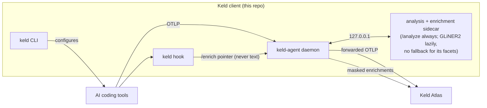

# Keld client — Agent & Contributor Guide

This repo is the **Keld client**: everything Keld runs on an engineer's own
machine. It has two jobs, and the second is the core of the project:

1. **Telemetry** — the `keld` CLI configures local AI coding tools (Claude Code,
   Codex, Gemini CLI) to emit usage telemetry to Keld Atlas.
2. **On-device enrichment** — the `keld-agent` daemon (+ its GLiNER2 sidecar)
   classifies each prompt **locally**, masks anything sensitive, and publishes to
   Atlas only the derived, masked signal. **Raw prompt text never leaves the
   machine.** This is the privacy-preserving intelligence the CLI installs.

⚠️ **Two qualifications, and this said "One" until the second arrived.**

1. **Schema v18.** `inventory.named_terms` publishes proper nouns lifted from
   message TEXT, and real person names have been observed in it. It is still not
   raw text, a span, or an offset: it is a term and a count. See the
   `named_terms` note in the workstreams bullet under *The enrichment agent* for
   the decision and the alternative that was not taken.
2. **`KELD_TEXTEMBED`, off by default.** Message text is encoded ON DEVICE and a
   256-d vector is published — MRL-truncated, then multiplied by a fixed
   orthogonal projection that preserves cosine and inner products exactly, so
   training is unaffected while off-the-shelf inversion tooling needs a matrix
   the client did not choose. See *Text vectors* in
   `docs/superpowers/specs/2026-08-26-signal-embeddings-design.md`.

So **"nothing derived from the prompt's own words crosses" is not the invariant**
and has not been since v18; the honest statement is narrower and is the one at
the top of this file: **raw prompt text never leaves the machine.** Text, spans
and offsets do not cross. Things MEASURED from text — a count, a length, a
vector — may, each on its own argument and its own evidence, never by analogy to
one already here.

Go single static binaries (`keld`, `keld-agent`) + an optional Python ML sidecar.
No runtime dependencies for the CLI itself.

**Where the detail lives.** This file states the rules and the invariants. The
measurements, studies and incident post-mortems that produced them live in
`docs/architecture/`, one file per subsystem, each with a dated provenance header
— see *Design docs* at the end for the index. **Read the linked file before
changing one of those areas.** (Split out 2026-09-17, verbatim; nothing was
deleted.)

## Architecture


```mermaid
flowchart LR
  Tools["AI coding tools"]
  subgraph Client["Keld client (this repo)"]
    CLI["keld CLI"]
    Hook["keld hook"]
    Agent["keld-agent daemon"]
    Sidecar["analysis + enrichment sidecar<br/>(/analyze always; GLiNER2 lazily,<br/>no fallback for its facets)"]
  end
  Atlas["Keld Atlas"]
  CLI -->|configures| Tools
  Tools --> Hook
  Tools -->|OTLP| Agent
  Agent -->|forwarded OTLP| Atlas
  Hook -->|"/enrich pointer (never text)"| Agent
  Agent <-->|127.0.0.1| Sidecar
  Agent -->|masked enrichments| Atlas
```

**Two lanes, one privacy invariant.**
- **Telemetry (push):** AI tools POST OTLP to the daemon's loopback telemetry
  proxy (`internal/agent/teleproxy`, fixed port **14318**, `KELD_TELEMETRY_PORT`
  to move it), which forwards to Atlas with the daemon's own token.
  **No tool ever holds an Atlas credential.** `keld signal setup` writes the
  loopback address plus a **stable local secret** (`agentcfg.TelemetrySecret`,
  generated once and never rotated); the daemon attaches the org token itself,
  read **per request**, so a mid-flight rotation is picked up. A tool reads its
  config once at startup, which is why the credential must not live there — and
  why `keld signal setup` **says to restart the tools** and the `done` event
  carries `restart_required`.
  ⚠️ **The proxy accepts that secret in THREE shapes** — `x-keld-ingest-token`
  (Claude Code, Codex), `?token=` in the URL (Gemini, whose OTLP SDK cannot send
  a custom header), and `x-keld-telemetry-secret`. Assuming one 401s all three
  tools while the Go suite stays green.
  ⚠️ **`teleproxy.textKey` is TWO-SIDED and both halves are load-bearing:** match
  a text word, then subtract the identifier/measurement suffixes (`.id`, `_id`,
  `_length`, `_tokens`, …). Drop the first and text leaks; drop the second and
  `prompt.id` is blanked, which silently kills every `Enrichment.corr_id` ↔
  `ToolEvent.prompt_id` join. An unanticipated shape fails **CLOSED**. Pinned by
  `striptext_identity_test.go` against a real captured payload — keep it real.
  **Doctor asks PER SESSION** (`localagent.SessionTelemetryState`), because the
  machine-wide check lets one healthy editor vouch for a broken one. Three
  refusals keep it honest: an empty record is *not tracked yet*, `agent-*.jsonl`
  subagent transcripts are excluded, and a session's start instant is read by
  DECODING lines for a top-level `timestamp`, never by taking the first one.
  ⚠️ `teleproxy`'s tests isolate `KELD_HOME` in a `TestMain` — `New()` resolves
  `StatePath()` at construction, so without it `go test ./...` overwrites the
  developer's real `~/.keld` telemetry record.
  Telemetry **depends on the daemon**; a bounded spool under `spool/telemetry`
  pays for that. Delivery is confirmed from the **RESPONSE**, never the status
  code (captive portals answer 200 with an HTML login page). A drain **stops on a
  REJECTION** (401/403), **ends the sweep on UNAVAILABLE** (net/5xx), and
  **continues past a REFUSED payload** (4xx).
  Why each of those exists, with the measurements: **`docs/architecture/telemetry-proxy-and-capture.md`**.
  Spec: `docs/superpowers/specs/2026-08-27-telemetry-loopback-proxy-design.md`.
- **Enrichment (local):** the hook fire-and-forgets a *pointer* (transcript path
  + prompt id — **never text**) to the daemon's loopback `/enrich`. The daemon's
  background worker resolves the text on-device, runs the enrichment pipeline,
  **masks**, and syncs to Atlas `/v1/enrichments`. The prompt text is read
  locally and never transmitted — masking is enforced Go-side before publish.

## The enrichment agent (`keld-agent`) — the core

`cmd/keld-agent` → `internal/agentcli` → `internal/agent/*`. Lifecycle:
`ingress` (loopback HTTP intake, per-user secret, bounded `queue`) → `resolve`
(read prompt text + tail recent prompts from the transcript) → `enrich`
(the pipeline) → `mask` → `publish` (Atlas). Panic-isolated per job; a readiness
gate holds work until the backend is up.

⚠️ **A DEDUP IS NOT BACKPRESSURE, and collapsing the two cost work twice.**
`queue.Offer` returns an `Outcome` — `Accepted` / `Duplicate` / `Full` / `Closed`
— because it used to return a bare `false` for all four and both callers read
that as overload. The ingress answered **429**, and since the hook treats any
`>=400` as failure and durably SPOOLS the pointer, a prompt the daemon had
already published came back as "try again later" and was written to disk;
`drainEnrichSpool` then kept that row and re-offered it on **every sweep
forever**, because a row is deleted only when its offer succeeds and a duplicate
never can — unbounded spool growth. Observed live: a POST for a prompt finished
one second earlier returned 429 while the 1024-slot queue held single digits.
`Outcome.TakenOn()` (Accepted or Duplicate) is the predicate both callers want —
the daemon has assumed responsibility, so a caller holding a durable copy may
drop it. Only `Full`/`Closed` are backpressure. The hook↔watcher overlap that
produces duplicates is **designed** (`queue.Complete` exists for it) and must
never read as overload. Delivery is durable: the hook writes a
prompt *pointer* (never text) to the on-disk `spool` when the daemon is
unreachable, and the daemon drains it on startup + a periodic sweep.

**An unconfigured agent IDLES, it does not fail.** The service is routinely
registered *before* onboarding runs (the documented macOS pkg order), so a
missing `~/.keld/hook.json` is a normal startup state, not a crash. `Run` waits
on `daemon.awaitConfig` (re-reads hook.json every `KELD_CONFIG_POLL`, default
5s; announces the wait once, not per poll) and starts the instant `keld signal
setup` writes the token — no restart needed. Returning an error here instead
cost a tester **69 launchd spawns in 12 minutes**, because the plist's
`KeepAlive` was an unconditional `<true/>`. That is now the
`SuccessfulExit=false` dictionary, so a clean exit is final while a real crash
still restarts; systemd's `Restart=on-failure` was already the equivalent
(don't add `RestartSec` — see the note in `service.go`), and the Windows
`ONLOGON` scheduled task never retried at all.

**Capture triggers.** Two triggers feed the same queue: the **command hook**
(`keld __hook --source <tool>`, wired by `keld setup`), and an on-device
**transcript watcher** (`internal/agent/watch/`) that tails the JSONL transcripts
Claude Code (all surfaces incl. the Desktop app), **Cowork**, and **Gemini** write to disk —
the hook-free path. The watcher synthesizes the same `spool.Pointer` the hook does
(never text) keyed on `promptId`; the queue dedups hook↔watcher overlap via a
recently-completed set (`queue.Complete`, marked only on a real publish so retries
and watcher fallbacks stay re-offerable). Sources: `~/.claude/projects` →
`claude_code`, the Cowork `local-agent-mode-sessions/**/.claude/projects` trees →
`cowork` (macOS), `~/.gemini/tmp/*/chats` → `gemini` (all platforms). Env: `KELD_WATCH` (default on), `KELD_WATCH_POLL` (default 5s),
`KELD_WATCH_BACKFILL` (default off = forward-only), `KELD_WATCH_ROOTS` (comma-separated
`source:dir`, default empty). macOS + Linux; Windows deferred.

**Cowork went VM-backed and host-side capture cannot follow it** (as of
2026-08-06). Newer Claude desktop builds run Cowork inside a VM whose transcripts
live in its disk image; nothing on the host can read them, and because the
pre-VM session directories are never cleaned up a root is still discovered, just
permanently stale. `coworkHidden` (`internal/agent/watch/roots.go`) detects that
exact shape and logs one advisory line per daemon run — the failure is otherwise
completely silent. `KELD_WATCH_ROOTS=cowork:<dir>` points the watcher at a
readable path the day one exists.

**Watched-source telemetry (`internal/agent/promptlog`).** Cowork's sandbox
blocks egress to Atlas, so the daemon mirrors its transcript events into OTLP
logs+metrics host-side, matching the CLI's native OTEL schema. **Never emits
prompt/response text.** Default source `{cowork}`; `KELD_WATCH_TELEMETRY`,
`KELD_WATCH_TELEMETRY_SOURCES`. Codex and Gemini use their own watcher roots for
enrichment and their **native** OTEL for telemetry, not promptlog.

Detail: **`docs/architecture/telemetry-proxy-and-capture.md`**.

**Enrichment pipeline (`internal/agent/enrich/`).** A staged registry of
extractors ("sweeps") run over a swappable `Model` backend, producing a `Profile`.
Single-flight (never fans out) so the shared model issues at most one inference at
a time. Two waves, up to 7 facets per prompt:
- **Wave 1** (independent, committed as a batch): `task_type` (the routing key for
  the Keld Inference Exchange — a 10-entry routing taxonomy: `summarization`,
  `translation`, `code_generation`, `information_extraction`, `classification`,
  `reasoning`, `question_answering`, `text_generation`, `rewriting`, `general`),
  `sensitivity` (+ masked entity spans; detects **concrete leaked data**, not
  topic — unions TWO independent evidence sources, **neither of them GLiNER2**,
  and rolls up to the highest-severity class: `ssn`⇒`phi`, `credit_card`⇒`pci`,
  `api_key`/`secret`⇒`secrets`, other personal id⇒`pii`. See
  **The sensitivity facet's two sources** below),
  `domain` (+ entities), `activity_type`, `personal`, `function_guess`
  (12 business functions).
- **Wave 2** (conditioned on Wave-1 `function_guess`): `subcategory`.

**`speech_act` was DROPPED at schema v9, and the gate is now model-free.** It
was an eighth facet (`command`/`question`/`statement`/`fragment`) and it also
supplied the enrichment gate's model half. A pre-registered study measured it
live over 2,015 inferences
(`docs/superpowers/specs/2026-08-24-facet-value-results.md`): accuracy **0.695
against a 0.713 majority baseline** — worth less than always answering
`command`. It predicted `statement` 22 times and was right **zero** times, at up
to full confidence. The other measured facets are fine (`task_type` 0.733 vs
0.143, `domain` 0.683 vs 0.261, `activity_type` 0.670 vs 0.243), so this is a
targeted removal, not a retreat from model-backed classification. Consequences,
each deliberate: `Profile.SpeechAct`/`SpeechActAlt` and
`Enrichment.speech_act`/`speech_act_alt` are gone from the published payload (a
published-vocabulary change, hence the v8→v9 bump; producer strings move `-v8`
→ `-v9`); `SpeechActDefs` is deleted; the gate keeps only its model-free
approval lexicon (`prefilterContentFree`), whose own validation measured it at
recall 100% on-corpus with the `fragment` branch a strict subset of it, so
0/24-dangerous survives; `sensitivity` is now the ONLY always-run pass. This
saves ~12% of enrichment CPU (one inference of eight) and **none** of the 1.8 GB
model — the remaining facets still need it. The **gold labels are kept** in
`eval/gold.jsonl`, unscored, as the evidence for judging a re-introduced
classifier: the study named the label *wording* as the suspect, so a
`SpeechActDefs` re-bakeoff is the live alternative to permanent removal.

**The sensitivity facet's two sources — NEITHER of them GLiNER2.** The facet does
not touch `ctx.Model` at all (a test asserts its output is identical with a Model
present and with none); nothing classifies, and the class is a rollup over which
entity labels were DETECTED (`sensitivityFromEntities`).
1. **`creddetect`** — vendored gitleaks credential rules, pure Go, no model, no
   network, over the FULL prompt text. Always available.
2. **The sidecar's `/pii`** (`app/pii.py`, presidio-analyzer) — region-scoped
   pattern recognizers, every one checksum- or algorithm-validated, needing no
   GLiNER2 and no spaCy model. It returns **offsets only, never the matched
   value**; the Go side resolves and masks from its own copy of the text.
   Configure with `KELD_PII_REGIONS` / `pii_regions`; `Remote.PIIRegions`
   overrides both and takes effect on the **next prompt**.

⚠️ **Region scoping is a PRECISION decision, not a cost one** — the full set
measured +0.5 ms/prompt. National-id shapes COLLIDE across countries (a valid
`us_npi` is exactly the `uk_nhs` shape, and `uk_nhs` rolls up to `phi`), so
enabling a region an org does not operate in manufactures severity. Collisions
are pinned in `sidecar/app/test_pii_regions.py`.

⚠️ **`person` and `address` are NOT DETECTED — the coverage is four types, not
six.** presidio's `SpacyRecognizer` measured **~1% precision** on 2,000 real
developer prompts and was removed rather than tuned. Free-form personal names in
prose are now undetectable; `SensitivityFromEntity` still knows both names so a
future detector needs no schema change.

⚠️ **The published-test-value gate lives in ONE place: `sidecar/app/wellknown.py`**,
applied **at source** inside `scan()`. Do not add a Go copy and do not add a
second detector that would need one. A companion numeric-fragment gate lives in
`pii.py` because it needs the surrounding text.

**`facets_degraded` turns on the SCAN, not the Model.** The scan is the sole
source for every personal-data type, so absent/failed/**truncated** ⇒ degraded
(unless the answer already reached `phi`, which no missing evidence could raise).
Never let a check that did not run publish a confident negative.

Measurements, region tables and the two argued severity assignments:
**`docs/architecture/sensitivity-and-pii.md`**.

**The deterministic passes, and the analysis service they call.** These need no
model and run under every backend that enriches at all:

- **`workstreams`** (`enrich/workstreams.go`) is the one pass that runs **no
  inference**: it asks the sidecar's `/analyze` for the deterministic dimensions
  of the hour ending at this prompt — seven ALLOCATION dimensions (project,
  branch, model, output_type, language, skill, tooling) plus nine published
  INVENTORY ones — counted from tool-call metadata. It takes COORDINATES
  (transcript path + prompt id), **never text**. `ModelFree`+`AlwaysRun`,
  registered only with an analysis backend (`enrich.WithWorkstreams`) **and** a
  source the analysis can read (`enrich.WorkstreamsEligible`: `claude_code` /
  `cowork` only — Codex/Gemini prompt ids 404). A failed analysis fails the pass
  (`pipeline_status:"partial"`); it never publishes an empty set.
  **Attribution needs TWO things:** the winning share ≥ 0.50 **and** ≥
  `window.MIN_EVIDENCE` (5) observations. A share is a ratio — one tool call
  gives 1.0 by construction. Five is derived: `0.5**n` first falls below 5% at
  n=5.
  **EVERY dimension publishes and the floor is a LABEL, not a publish gate**
  (schema v21 / sidecar SCHEMA 16): `Labeled` carries `evidence` and `status`
  (`attributed`/`thin`/`tie`/`no_majority`/`absent`). **The floor did not move
  and nothing was promoted** — removing the two conditions would take
  P(false attribution) from 0.031 to 0.50. A consumer rendering `thin` as
  `attributed` is misreporting.
  ⚠️ **All nine inventories publish, including `named_terms`** (schema v18) —
  proper nouns from message text, term + count, no span or offset, and real
  person names have been observed in it. There is deliberately **no person-name
  filter**: none measures better than ~1% precision, so one would remove the
  belief that names are present rather than the names. `inventory` as a BLOCK
  stays unforwardable (a test pins it), so a tenth key cannot ride along.
  **The PATH inventory levels** (`files`/`directories`/`components`) are already
  workspace-relative — `reconcile()` resolves against the workspace root, and it
  is gated TWICE (sidecar payload assert + `sidecar.notWorkspaceRelative` at the
  Go decode boundary). Do not add a producer that bypasses `reconcile()`.
  Per-level caps (**40 / 24 / 16**) sit just above each level's p90 and the cut
  is declared in `inventory_omitted`.
  ⚠️ **A prompt is named by `promptId`, never `uuid`.** `watch/filter.go` rejects
  a line without one, the spool pointer carries it, the queue dedups on it, and
  it publishes as `corr_id`. Holding only `uuid` in the sidecar's index silently
  404'd every lookup and made **8 of 8 prompts partial**. Pinned from both ends by
  `sidecar/app/test_prompt_id_seam.py` and `watch/filter_test.go` — **do not
  remove `promptId` from those fixtures**, and `analyze.py`'s oracle must change
  in the same commit as the index or the equality test proves nothing.

  Caps, studies and the full incident: **`docs/architecture/window-analysis.md`**.
- **The watcher signals ingest; the sidecar never polls.** A file that advanced
  in a poll is signalled once to `POST /ingest`, which parses only the appended
  tail from its byte-offset checkpoint. Coordinates only. Signals are
  **dropped, not retried** (the next one catches up); the queue is bounded and
  path-coalescing with one serial sender, so an unreachable sidecar can never
  slow the watcher's poll loop.
- **Retention is bounded by TIME, and a pruned window REFUSES (410) rather than
  answering narrower.** `KELD_REFSERIES_RETAIN_DAYS` (400), `term` at
  `KELD_REFSERIES_TERM_RETAIN_DAYS` (90); `KELD_REFSERIES_MAX_MB` (1024) is a
  size backstop enforced on **live pages**, not file size (SQLite does not shrink
  on DELETE). Pruning raw events does not degrade a window's edges — it breaks
  the digest outright, which is why the store keeps a monotonic serving floor and
  answers **410**, never 503 (retried forever) or 404 (hides a short horizon).
- ⚠️ **`/analyze` and `/ingest` are confined to `KELD_ANALYZE_ROOTS`.** The
  sidecar has **no auth**; these are the first routes that open an arbitrary
  filesystem path as the daemon's user, so unconfined they are a confused deputy
  on a multi-user host. `realpath` on both sides, **403** outside (not 404).
  Empty means **deny everything**; absent means the sidecar's own defaults.
- **This is the client-side analysis service, not a GLiNER2 wrapper.** It starts
  and serves with no model loaded. `/analyze`'s `named_terms` level is **on** by
  default (`KELD_TERMS=0` off) and loads spaCy — ~619 MB into the FastAPI parent,
  permanently, since the parent is never recycled. ⚠️ That default was justified
  by the level being unforwardable, and **since schema v18 it publishes**, so the
  default now rests on usefulness alone and was never re-argued on its own
  merits. `named_terms_status` distinguishes a level that never ran from a window
  that held no terms; `KELD_TERMS_MAX_LEN` (100k chars/message) restores spaCy's
  own per-document guard.
- **Classifiers score against readable label DESCRIPTIONS, not bare id strings**
  (the bi-encoder keys on token/semantic overlap — the label wording is
  load-bearing; e.g. `code_generation` scores against "software engineering").
- Label vocabularies live in `labels.go` (gated by `SchemaVersion`, currently **21**
  — bump it and re-run the eval when changing any vocab). Classify calls are
  prefixed with a context preamble (`Meta.PreambleCoding()`; `domain` uses the
  fuller `Meta.Preamble()`). **Facet-selective agentic augmentation:** agentic
  framework metadata helps `domain` but hurts `task_type`, so only `domain`
  augments with it — `task_type` and the others drop it.

**The reference-series store (`analysis/store.py`, `analysis/ingest.py`).**
`/analyze` used to re-parse the whole transcript per request — median **0.79s on
a 90 MB file**, the same hour parsed ~4x. It now answers from a persistent series
at `~/.keld/state/refseries.db` (native SQLite, `0600`, via `KELD_HOME`; the
package is deliberately pandas-free): **2.3ms on the same file**. Equality with a
parse is **asserted, not assumed** — `analyze_window_by_parse` is retained as the
ORACLE and never as a fallback (0 of 90 real prompts differ).
- **A window is a query over 5-minute bins and BOTH EDGES ARE READ EXACTLY**:
  interior from `bin`, the two partial edge bins from `event`. Snapping either
  way turns every digest into an approximation. The ordering rule is not
  reimplemented in SQL — `window.rollup` merges and applies its own tie-break.
- **`bin` is sparse by design and its absence must never read as "no evidence"**:
  a `bin_level` registry that `bin.level` REFERENCES (with `foreign_keys=ON`) plus
  `rollup_window` routing unbinned levels to `event`. `PRECOMPUTED_LEVELS` is
  DERIVED from `workstreams.ALLOCATION` + `INVENTORY`, never typed.
- Row timestamps are quantized to 0.1s (`levels.quantize`). WAL +
  `busy_timeout=5000` + `synchronous=NORMAL` — `NORMAL` is safe **only** because
  events, re-rolled bins and the byte-offset checkpoint commit in **ONE
  transaction**.
- ⚠️ **`KELD_CAPTURE` (default OFF) is fingerprinted into `parse_state`**, so
  flipping it forces one reparse and no transcript can hold rows from two
  settings — but that is a per-TRANSCRIPT guarantee, so a corpus builder can see
  two incomparable populations. Absent means NOT RECORDED, never zero. It keeps
  four numeric signals (per-role character counts, the token split, tool-call
  outcomes, and `bin_offset`). ⚠️ `capture.scan`'s anchoring timestamp must be
  the RECORD'S OWN: a bare first-`"timestamp"` regex took a nested one on 1.5% of
  lines and produced non-monotone byte offsets, so non-message lines are DECODED.
- ⚠️ **Thinking-block LENGTH is not in this data** — every block carries an empty
  `thinking` string. The COUNT is the signal. Don't wire a length consumer.

Derivations, measurements and the retention/`/metrics` detail:
**`docs/architecture/reference-series-store.md`**.

⚠️ **`KELD_TEXTEMBED` (default OFF) reads message text in order to keep something
derived from it** (`analysis/textembed.py`) — the second of the two qualifications
at the top of this file. What crosses is a 256-d vector: Qwen3-Embedding-0.6B
encodes 1024-d on device, MRL prefix-sliced to 256, then multiplied by a **fixed
orthogonal projection** (`KELD_TEXTEMBED_PROJECTION_SEED`) that preserves cosine
and inner products exactly — training unaffected, off-the-shelf inversion tooling
needs a matrix the client did not choose. ⚠️ The matrix is **Keld's, not the
client's**. No text, span or offset crosses.
- **The unit is the MESSAGE, not the shell**, so each message is encoded once
  ever and every overlapping shell reuses the vector. Three streams (`user`,
  `asst`, `think`) kept separate and never concatenated; `think` is
  `skipped:empty` in practice.
- **Its own child process, bf16** (measured 2026-08-26: 1313 MB cheaper than
  float32 and no slower). Sustained cost is **~1.1-1.6 s/message** and the peak
  **2.35-2.43 GB** — size any per-message work off ~1.6 s, not off the
  single-shot figures the design first carried.
- **Absent weights are a STATED status** (`degraded:weights_unavailable`), never a
  crash or a stall. ⚠️ **Never cut a message mid-sentence** — long messages split
  at sentence boundaries and mean-pool; an over-long single sentence is dropped
  WHOLE and declared in `dropped_chars`. Every scalar is `None` where it could not
  be computed, never 0.0.
- **`POST /features` is a CURSOR route** (schema 17), not an anchor-instant one:
  `{path, since_ts, now, max_rows, resolved}` → `{schema, rows, watermark}`, with
  `/features/probe` kept for studies. `since_ts` is `>` on a row's own instant so
  a batch is never cut inside one. `FEATURE_SPEC_VERSION` 2, `DIMS` **1534** — the
  106 text slots are present **whether or not the toggle is on**, because a width
  that depended on the environment is the incoherent-corpus failure the frozen
  manifest exists to prevent.
- ⚠️ **Encoding runs OFF the request** (the sidecar client's timeout is 5 s; one
  batch of 64 messages costs ~92 s). The instant of the first unencoded message is
  the **FRONTIER** and no row at or after it is emitted; `pending:encoding` is the
  stated status. A message the encoder ran on and produced nothing for is cached
  as such, or the frontier LATCHES and the cursor wedges forever. A **degraded**
  encoder drops the text half WHOLE and returns no frontier.

Full contract, the loadtest figures and the two defects they found:
**`docs/architecture/text-vectors-and-features.md`** and
`docs/superpowers/specs/2026-08-26-signal-embeddings-design.md`.

⚠️ **A tail parse is only equal to a full parse because it was MADE equal**, and
if it isn't the series is silently and permanently wrong — nothing downstream
re-derives these rows. `ingest_file` resumes from the `ingest` table's byte offset
(rotation caught by a `HEAD_BYTES = 4096` head fingerprint that includes the byte
count). Two retroactive sources, handled differently because the costs differ:
**`reconcile` is RECOMPUTED WHOLE each batch** (which is why `Store.replace_events`
DELETEs its slot first — a recomputed set must be able to RETRACT a row), and
**workspace evidence ACCUMULATES, with a change in the DERIVED ANSWER forcing a
reparse**. The parse state carries a **third** accumulator, `reqs`, because
`events_for_turns` deduped requests with a set local to one call — a request
straddling a batch boundary was costed twice.

**Equivalence at corpus scale: 284 real transcripts, each ingested in 40
successive chunks against one whole-file ingest — 0 files differed, 0 rows
differed** (measured 2026-08-26). The watermark must not retreat, and
`ingest.terms_mode` / `capture_mode` fingerprint the pipeline's identity into the
parse state; a changed fingerprint reparses. Bumping `ingest.STATE_VERSION` is
the REPAIR mechanism for rows already written wrong — **expect one reparse per
transcript on such an upgrade**.

Why each measurement was taken and what it cost to miss:
**`docs/architecture/reference-series-store.md`**.

**The dynamics block (`analysis/dynamics.py`) — what MOVED in the window.** The
same `/analyze` call answers it, so dynamics cost **no second round-trip and no
inference** and publish under `ml_backend:"deterministic"` too. The span is cut
into a recent **slice** and an abutting **baseline**. What crosses is the derived
half only: `status` (a closed six-value set, **always stated**, so absence is
readable — `tooling` is absent on 50.3% of 60-minute windows), `turnover` and
`decay` (two different facts), `concentration_shift`, `changed` (**three-state**:
`false` only for `both_absent`, **nil** wherever the comparison cannot support a
yes or a no), and `reading` (a closed 7-value vocabulary, in precedence order).
⚠️ **Stating the conclusion IS the feature** — raw window numbers scored
**-3.3/-20.0** on synthesis accuracy, worse than emitting nothing, against
**+36.7** for a labelled digest. Numbers ship **keyed** beside the stated reading;
the unlabelled remainder does not.
**That same cut is the privacy mechanism.** Every field that could hold a level's
own string lives in the per-side `slice`/`baseline` objects, which do not cross —
`term` has held real person names. The subtree's only strings are `status` and
`reading`, asserted by a reflect walk at the decode boundary and a marshal-level
wire test. Both vocabularies are mirrored Go-side (`enrich.DynamicStatuses` /
`DynamicReadings`) and pinned against `dynamics.py` by reading that file, because
the Go side **DROPS** an unrecognised value and the sidecar ships separately.
**`MIN_EVIDENCE` (5) is about SAMPLE SIZE, not minutes**, and `MATERIAL =
1/MIN_EVIDENCE = 0.2` is derived from it. Duration appears nowhere in the
derivation and `min_evidence_for()` deliberately takes no duration argument — a
duration-scaled floor would make a published attribution's significance a
function of slice length while `value` and `share` look identical either way.
**The FLOOR ITSELF must not move.**
**The slice is sized by an EWMA change detector** (`DEFAULT_SIZER`, fast 0.3 /
slow 0.02 / threshold 0.2, on a 60-second observation step), which beat
`FixedSizer(15)` by **+74.6 / +27.0 points** — and is believed because of the
**shuffled-truth control**: the EWMA collapses 86.4% → 24.1% on shuffled truth
while every fixed sizer barely moves. ⚠️ **`river` was measured and REJECTED; do
not add it hopefully.** Detection reads **`branch` only** — widening it is
unmeasured.
**Half the dimensions were dropped on their own distributions**
(`DROPPED_DIMENSIONS = ("project", "model", "tooling")`), against a bar written
down FIRST, re-measured 2026-08-25 on 500 transcripts / 2,555 windows. ⚠️ **The
CONSTANT band test alone MISCLASSIFIES A SPARSE SIGNAL** — never apply it without
the inside/outside contrast beside it. `DYNAMIC_DIMENSIONS` is derived from
`workstreams.ALLOCATION` minus the dropped set and `dynamics()` neither takes nor
forwards a `dimensions=` argument, so **the published vocabulary cannot be
widened by a caller**.

**The session prior (`analysis/prior.py`) — the session this window sits in,
reported BESIDE it.** Per dimension a `value`/`share`/`evidence`/`status` plus
three contrasts: `agrees`, `departure`, `novel`. Same `rollup_window`, wider
bounds, no second parse and no inference.
⚠️ **CONTRAST, NEVER FALLBACK — every other rule here is subordinate to this
one.** The prior never supplies a value the window lacked; with no window value
all three contrasts are `None` and `workstreams` keeps its honest blank. **45.1%
of windows have no prior at all**, and that number is the standing pressure to
soften this. Don't. The block is emitted anyway, saying `absent` out loud,
because a suppressed block reads as an oversight and an oversight is what someone
eventually "fixes".
⚠️ **The prior is cut at the window's START** — "the session so far" taken
literally puts the window inside its own prior, under which `novel` cannot fire
at all. Nothing is accumulated; it is **recomputed** per request.
**`ENABLED = ("branch", "language", "output_type", "skill")`**, decided over 1,022
windows. ⚠️ `output_type` was first excluded on agreement alone and **that was
wrong** — agreement is defined only where both sides attribute, so it is silent
about precisely the windows the dimension is for. `tooling` stays out, with the
bar for revisiting it written into `prior.py` and its test. `PRIOR_DIMENSIONS` is
**derived** from `workstreams.ALLOCATION`, so an INVENTORY level is structurally
not addable — which is what keeps `named_terms` out by construction rather than
by care.

**The block cutter (`analysis/blocks.py`) — where a piece of work ENDS.** Two
terminators and the set is closed: **idle** (`IDLE_BINS` 3 = 15 minutes of
silence) and **budget** (`MAX_BLOCK_MINUTES` 20). Reported separately
(`REASONS`), because a reader who cannot tell them apart cannot tell an
arithmetic boundary from a real pause. Both numbers are MEASURED, in a
pre-registered four-arm study over 496 sessions; retuning either re-opens it.
**Blocks tile the ACTIVE part of a session, not `[lo, hi)`** — the invariant is
*every active bin lies in exactly one block*, never "the blocks cover the span".
⚠️ **There is NO merge rule, and the absence is the design.** The obvious repair
was built and measured: it changes a published VALUE in **88.6%** of the merges
it performs, against a pre-registered 5% bar. A thin block publishes
UNATTRIBUTED and survives as its own block. Do not add a merge rule and do not
add a knob for one — a knob is a merge rule with the decision deferred.
⚠️ **A THIRD terminator was ABLATED and every measured number improved**
(attributable 95.29% → 96.21%; the detector was the ONLY source of empty blocks).
`EwmaSizer` was **not** removed — it keeps its separate, measured use sizing the
dynamics slice. `_form` keeps the `cuts` parameter it is now always handed `[]`
for, so the shipped arithmetic stays identical to the measured arm.
⚠️ **`cut()` requires BIN-ALIGNED bounds and fails SILENTLY without them** —
evidence lands in no block, nothing errors, and no block looks wrong. The caller
owns the alignment (`analyze._block_span`); it is deliberately not clamped inside
`cut()`, because the study oracle pins that function byte-identical to the
measured arm.
**`/analyze` reports the block BESIDE the window, never instead of it** — an
additive `block` key carrying the span and the two boundary reasons and nothing
else, because the two definitions of thinness in this codebase disagree (95.3%
per-level against 99.3% pooled). Whoever adds the first consumer picks the
per-level measure deliberately. Phases 2-5 of
`docs/superpowers/specs/2026-08-25-signal-block-pipeline-design.md` are **NOT
built**.

Every study, bar and distribution behind the numbers above:
**`docs/architecture/window-analysis.md`**.

**Model backends.** `ml_backend` (local, **startup-only**, `settings.Settings`)
selects one of three modes. The rule they share: **no facet is ever silently
swapped for a lower-fidelity substitute of itself.**
- **`"auto"`/`""` (compiled-in default)** — enrichment is **ML-only** for its full
  facet set. A sidecar that is reloading, evicted or not yet provisioned is
  **waited out**: jobs queue/spool until it is ready.
- **`"deterministic"`** — enrichment stays **on** with a `nil` `enrich.Model`. A
  *different* facet set that needs no model (credential detection, and the
  workstream dimensions `/analyze` derives from coordinates), **not** a fallback.
  **The analysis service still runs**; only the model is never loaded, and never
  even provisioned. When a sidecar is installed the readiness gate polls that
  service's **`/health`** (in the background, behind a cached atomic — an inline
  probe would cost thousands of loopback connects per deferred job); a
  present-but-unhealthy service keeps jobs queued. When **no sidecar is
  installed** (or its port cannot be allocated) the gate is **trivially true** and
  the analyzer nil — nothing can arrive this daemon lifetime, so waiting would
  wedge the mode forever; the workstreams pass simply never registers.
- **`"off"`** — enrichment is **disabled entirely**: no worker, `/enrich`
  accepts-and-discards (202). Telemetry and client-events are unaffected.

**A SKIP IS NOT A FAILURE.** `runStage` is tri-state
(`passOK`/`passFailed`/`passSkipped`): a deterministic run whose every executed
pass succeeded publishes `pipeline_status:"enriched"` and names what it dropped in
`facets_skipped`. `"partial"` keeps its one meaning — something that should have
worked did not. **A HALF-run pass is neither**: a pass declares reduced capability
per job via `degradedExtractor`, commits normally, and is named in the **sibling**
`facets_degraded`. Both lists are subsets of the `extractor_versions` keys; a pass
that was never *registered* is absent from both. Neither moves `pipeline_status`.

⚠️ **WHAT A FRESH INSTALL LANDS ON IS NOT THE COMPILED-IN DEFAULT.**
`keld-agent install` writes `{"ml_backend":"deterministic","blocks":true,
"attribution":false}` via `settings.WriteInstallDefaults`, which **MERGES** so an
operator's other keys survive. That is v2: the model-free facet set plus the block
emitter, and **no multi-gigabyte model download, ever**. ⚠️ `attribution` is
written OFF unconditionally — until 2026-09-09 it was written as a copy of
`blocks`, i.e. ON, which switched on a 1.2 GB download and on-device text reading
for someone who had chosen nothing. The config write happens **first** in
`runInstall`, before login, because `ml_backend` is read at startup and never
re-read; the restart inside `installService` is what makes it take effect. A test
pins that order.
The **compiled-in defaults are unchanged** (`auto`, `Blocks` false) so every
machine an installer never writes to — an in-place upgrade, `go run`, CI, the eval
harness — keeps the full ML facet set.
⚠️ **`ml_backend` has NO REMOTE OVERRIDE.** The installer is the only lever that
will ever exist, so a re-install FLIPS an existing `auto` machine and an existing
fleet's Atlas Context column empties machine-by-machine with **no server-side
brake**. `--backend auto|deterministic|off` is the manual path back.
⚠️ **`make install-linux` routes through `keld-agent install` too**, so a dev
machine converges on `deterministic` — pass `--backend auto` to keep exercising
GLiNER2. And ⚠️ **do not run `keld-agent install` to test the config write**:
`KELD_HOME` isolates `~/.keld` but NOT the service path.

⚠️ **FIRST SIGHT BACKFILLS** (`KELD_BLOCKS_BACKFILL`, default ON) — a reversal of
the forward-only default, which left every already-closed block permanently
unreachable. The analogy to `KELD_WATCH_BACKFILL` does not hold: a block backfill
is a query against a store that already holds the answer, bounded to
`maxPerSweep` (24) per transcript per sweep. Re-emission is free — a block's
identity is `(session, block.start)` and Atlas upserts. ⚠️ It needed two more
things, each silent without the next: first sight must **signal at all** (the
PROMPT path stays forward-only — offering every historical prompt is a real herd),
and those signals must be **PACED** (`firstSightPerPoll` 4; firing all of them at
once dropped ~2,088 of 2,152 permanently). A refused signal is **retried**, not
dropped.

**Delivery reliability (never degrade, never wedge)** and **deadlines are PER
PASS, not per job** (`KELD_ENRICH_PASS_TIMEOUT`, 30s): a job issues 8-9
inferences, so a job-wide budget discarded every pass that had already succeeded
and re-spooled the whole job. Bounded per pass, a slow pass costs exactly one
facet and progress is monotonic. `KELD_ENRICH_JOB_TIMEOUT` (5m) is only a **wedge
backstop** and must stay above `passes × pass timeout` or it resurrects that
failure mode — a unit test pins the invariant. An exhausted job
(`KELD_ENRICH_MAX_ATTEMPTS`, 4) is `spool.Quarantine`'d, never retried forever;
Atlas dedups on `dedup_key`.

Each mode's full behaviour, the installer ordering and the backfill incidents:
**`docs/architecture/model-backends-and-install-defaults.md`**.

**Tick-driven window characterisation (`daemon/tick.go`, sidecar `/tick`) — OFF
by default (`KELD_TICK`).** Enrichment fires per prompt and every window looks
**back** 60 minutes, so the work a prompt *causes* falls outside that prompt's own
window: measured, only **55-56%** of turns lie inside some prompt's look-back, and
it is worse the more autonomous the agent. A tick characterises the gaps (99.5%
after).
- **The frontier is the whole no-double-publish guarantee:** never emit above
  `min(watermark, now - span)`. Exact, not a margin. The price is latency only,
  and **nothing safety-relevant waits for a tick** — `sensitivity` and every text
  facet keep their per-prompt trigger; this path never reads prompt text.
- **A timer, not the ingest signal** (a gap becomes emittable a span after the
  work, by which time the machine is quiet). Idle emits nothing structurally.
- **The covered set comes from the DAEMON, not the store** — the store's `prompt`
  index holds assistant-shaped turns too, and planning against it emits nothing.
- ⚠️ **The client half ships INERT, which is why it is off.** A tick row publishes
  under its own `corr_scheme:"window"` (it could not ride a prompt's correlation —
  Atlas upserts over every column and would OVERWRITE the anchor prompt's
  enrichment), so it is stored and **joins to nothing** until Atlas learns a
  time+identity join. Flipping the default is a one-line change the day it does.

Coverage measurements and the state file's rules:
**`docs/architecture/window-analysis.md`**.

**Adaptive input truncation (`enrich/lenstat`).** gliner2's `max_len` defaults to
`None` — *no truncation* — so one long prompt could allocate a multi-GB spike. The
daemon tracks the streaming mean/variance of prompt lengths (Welford; **lengths
only, never text**) and truncates at **mu + 2*sigma**, clamped to
`[KELD_ENRICH_TOKEN_FLOOR (512), KELD_ENRICH_TOKEN_CEILING (768)]`, staying at the
ceiling until 200 observations make the estimate representative. The floor means
the adaptive cap can only ever *widen* the window; the ceiling is the memory
budget expressed in tokens and is a hard invariant. Ceiling values are
**measured** (the table in `lenstat.go`) — cost is superlinear in memory *and*
latency. Credential detection is unaffected; NER-derived PII sees only the window.
⚠️ **This is sized for chat-scale prompts and does NOT extend to agentic-workflow
payloads.** Three things break: mu+2*sigma is meaningless on a bimodal
population; no token cap both admits such a payload and fits the budget (>1
MB/token measured, so ~4000 tokens implies ~7 GB); and head-truncation discards
the work prompt when the system prompt leads. Read
`docs/superpowers/specs/2026-07-24-agentic-scale-input-bounding.md` before
extending enrichment to agentic sources.

**Control plane.** Enrichment is governed per-org from Atlas
(`settings/`, `agentcfg/`); the daemon polls `GET /v1/enrichment-settings`
(`KELD_SETTINGS_POLL`). Remote overrides local; non-fatal if Atlas is unreachable.
See `docs/enrichment-settings.md`.

⚠️ **The version source is ATLAS, NOT `releases/latest`.** A client that resolves
`latest` itself converges the entire fleet the moment a tag is pushed — the same
defect as `ml_backend`'s missing brake, with a faster fuse.
`settings.Remote.Release` (`agent_release`) carries `{enabled, version, base_url}`
and **an absent block means NO UPDATE**. `KELD_AUTOUPDATE=0` refuses locally;
**local refusal wins, local permission never does.**
⚠️ **`version` is a PIN, not a floor** — the daemon moves to it in EITHER
direction, because a control plane that can only move a fleet forward is not a
brake. Comparison is identity after normalizing one leading `v`, never semver
ordering.
⚠️ **A missing published SHA-256 is FATAL here** while `install.sh` warns and
continues — the installer has a human who can abort; an unattended swap does not.
⚠️ **The macOS `.pkg` cannot be updated in place and its symlinks are the trap:**
the daemon migrates to `~/.local/bin` and repoints the LaunchAgent via
`service.InstallAt` (not `Install`, which reads the stale `os.Executable()`);
`Swap.Replace` uses `os.Lstat`, never `os.Stat`; and `/usr/local/bin/keld` cannot
be rewritten at all, so `keld signal doctor` names it with the exact `ln -sf`.
⚠️ **Auto-rollback alone is unstable — `failed_versions` closes the loop.** Past
`KELD_UPDATE_CONFIRM_DEADLINE` (15m) the swap is undone whichever version is
running (a stale marker IS the crash report), and a rolled-back version is never
retried **until the pin moves**. A failed restart leaves the marker PENDING on
purpose; a rollback that cannot restore does **not** restart.
⚠️ **WHO SETS THE PIN IS AN OPEN ATLAS-SIDE QUESTION, AND `base_url` IS THE SHARP
EDGE. As of 2026-08-27** nothing serves `agent_release`, so the client is inert.
`checksums.txt` is fetched from the SAME `base_url`, so it proves the transfer was
not corrupted, never that the bytes came from Keld — write access to
`agent_release` is therefore equivalent to root on every machine in the org.
Three ways out are recorded in `docs/auto-update.md`; **none was implemented on
that date.** Choose before the first real rollout and record the choice WITH THE
DATE it was taken.

Full rationale and traps: **`docs/auto-update.md`**. Spec:
`docs/superpowers/specs/2026-08-27-signal-auto-update-design.md`.

**The signal-embeddings publish half (`internal/agent/features/`).** An emitter
with a per-transcript cursor, the sibling of `internal/agent/blocks/`. Rows ride
`publish.FeatureRow` under their **own `corr_scheme`**, never `Enrichment` or
`BlockEnrichment` — Atlas keys enrichments `UNIQUE(org_id, source_id, corr_scheme,
corr_id)` and upserts over every column, so sharing a scheme OVERWRITES rather
than dedups. The corr id is `session@feature@anchor@key`: four segments against a
block id's two and a prompt id's zero, so the id spaces are disjoint by SHAPE as
well as by scheme. Transport is `clientevents`' batch path with its **own** spool
dir — a shared one would cross-post bodies between routes.
⚠️ **The cursor advances on BUFFERING, not on delivery**, because a batching path
cannot observe delivery. Backpressure is what makes that safe: a sweep never takes
more rows than the buffer has room for, so a full buffer HOLDS the cursor.

**Four toggles, all OFF by default, and they are not interchangeable.**
`KELD_CAPTURE` (extra ingest rows; ⚠️ fingerprinted into `parse_state`, so
flipping it forces one reparse — which is why turning publishing off must never
cost a reparse to turn back on), `KELD_TEXTEMBED` (the encoder child),
`KELD_FEATURES` (compute and store locally), `KELD_FEATURES_PUBLISH` (send to
Atlas). The last two carry an Atlas per-org override riding the settings poll
(`Remote.Features`, `Remote.FeaturesPublish`); remote overrides local, and an
**omitted** key leaves the local base rather than defaulting on, so a silent
fleet-wide enable is not reachable from the server. The whole subsystem registers
only under `ml_backend:"deterministic"`; under `"auto"` it is **ABSENT** — in
neither `facets_skipped` nor `extractor_versions`.

**PROJECT ATTRIBUTION (`internal/agent/attrib/`, `daemon/attrib.go`,
`sidecar/app/analysis/attribution.py`, `sidecar/app/verifier.py`) — which declared
project a closed BLOCK belongs to, decided on device.** OFF by default
(`KELD_ATTRIBUTION`, or `attribution` in `~/.keld/agent-config.json`). An org
declares projects (`settings.RemoteProject`) via `KELD_PROJECTS_FILE` or the
settings poll; the daemon pushes them down with `POST /projects` and the block
emitter's `OnPublished` hook schedules a durable job per published block.
`POST /attribute` takes COORDINATES and the block's already-computed dims and
answers with project IDS, confidences, closed enums and integer timings — **no
text, no span, no offset, in either direction.**
- ⚠️ **TURNING ATTRIBUTION ON STARTS ENCODING MESSAGE TEXT ON DEVICE.**
  `daemon/sidecarenv.go` sets `KELD_TEXTEMBED=1` (set-if-absent) because
  `/attribute` needs the same encoder. Nothing derived from it is *published* by
  that, but the encoder does read message text locally, which is new behaviour on
  a machine that had the toggle off. `KELD_TEXTEMBED=0` explicitly still wins.
- **NOTHING is assigned without the encoder.** `BOOST_CAP` (0.35) sits below
  `THRESHOLD - BAND` (0.41) by construction, so a boost-only score cannot cross
  the bar; a machine with no weights answers `degraded:weights_unavailable` and
  re-attributes later. There is exactly one attribution path, the benchmarked
  one — `source` is `embedding|verifier` and "metadata" is **not producible**.
- **The decision is RELATIVE, not an absolute bar:** `cut = max(null, top -
  MARGIN)`. `NULL_DOC` is embedded beside the projects, so a project attributes
  only by BEATING "nothing" in the same ranking. `MARGIN` (0.08) answers shape;
  `VERIFY_HALO` (0.04) is where the verifier adjudicates.
- ⚠️ **WHAT IS SCORED CHANGED ON 2026-09-03: the WHOLE BLOCK, mean-pooled,
  centred.** User text alone put **28%** of 61 real labelled blocks on the right
  project; whole-block mean-pooled and centred put **92%** there. MEAN beats MAX
  (92% vs 82%), and **24 of 25 blocks with no user text at all** are agent
  continuations that only attribute this way. The feared failure — attributing to
  what the assistant happened to name — did occur, on 4 of 61. Only the USER's
  words still feed `concepts` and the verifier prompt. **Centring**
  (`attribution.Offsets`) is a running mean of SCALARS, gated all-or-nothing at
  `KELD_ATTRIBUTION_MIN_BACKGROUND` (50) messages. Rollback is one variable:
  `KELD_ATTRIBUTION_SCORING=user-max`.
- **⚠️ TWO MODEL CHILDREN AND A NEW NATIVE DEPENDENCY, ON THE SAME BUDGET.** The
  text encoder is the SAME child the signal-embeddings path uses (one provisioner,
  never two). The **verifier** (Gemma 4 E2B Q4_K_M GGUF, ~3 GB,
  `llama-cpp-python` — the repo's first compiled native dependency, pinned exactly
  for that reason) runs in its own recycled worker child and is
  **`KELD_ATTRIBUTION_VERIFIER=1` opt-IN, OFF by default since 2026-09-03**: the
  one real-data A/B went 1-for-3 for minutes of CPU per block, and every figure in
  `docs/notes/whats-next-attribution.md` §8 was measured without it. So
  `KELD_SIDECAR_MEM_BUDGET_MB` is spent by **three** children; the overrun is
  reported, not absorbed. ⚠️ **Both children must be polled by `lifespan`'s one
  poll loop** — `poll()` is the sole driver of the RSS ceiling, the recycle, the
  idle unload and the pressure eviction. A manager that is constructed is not a
  manager that is guarded.
- ⚠️ **`llama_cpp` must be in the PyInstaller spec, and its absence is
  invisible** — a ctypes binding imported inside `Verifier.__init__`, itself
  PyArmor-encrypted under `KELD_OBFUSCATE=1`. A spec missing it ships a binary
  that starts, is healthy, and fails EVERY verdict. `make freeze-check` /
  `make obfuscate-check` spawn the verifier child and demand a real verdict, and
  that arm FAILS rather than skips when no GGUF is present. ⚠️ **BUT IT IS
  DEVELOPER-MANUAL TODAY, NOT CI** — nothing under `.github/` invokes it, so
  **nothing automatically stops this defect returning.**
- **The two model downloads are gated on a KNOWN NON-EMPTY project list**, read
  live per published block. ⚠️ **`skipped:no_projects` is NON-TERMINAL while the
  daemon holds a list**, and the daemon re-posts after a sidecar respawn
  (`Supervisor.SetOnRespawn`): module state in the parent does not survive a
  crash-restart, and a change-gated POST concluded there was nothing new to say.
  Anything else the daemon pushes DOWN once belongs on that hook.
- ⚠️ **TWO MATCHERS, OPPOSITE BEHAVIOURS, DIFFERENT CONSUMERS — and one of them drops a
  block that matches two workstream GROUPS.** `projects.MatchesFor` (→ `project_matches`
  on the wire) returns EVERY match; Atlas maps the ids to workstreams itself, so
  **Atlas-side multi-group attribution needs no Signal change**. `projects.Attribute`
  (→ the local ledger and the desktop Projects pane) returns one match or, for two or more,
  `ReasonConflict` and NO attribution — correct for the one-group world it was written in,
  wrong now that Atlas permits the same repo in two groups (its dedup is per-workstream).
  **Deferred 2026-09-17, not part of the Atlas work, written up in
  `docs/notes/whats-next-attribution.md` → Smaller carried items.** Don't "fix" one matcher
  to match the other without reading that note: the difference is deliberate on the wire
  side. Claim: `matchesfor-reports-every-match`, Claim: `attribute-conflicts-on-multi-match`.

- **Version skew HOLDS rather than quarantines** (`AttributeResult.RouteUnsupported`
  on a 404); a genuine quarantine emits `attribution.job_quarantined`.
- **Quality.** `sidecar/app/test_attribution_quality.py` (opt-in,
  `KELD_ATTRIBUTION_EVAL=1`) scores the *shipped* configuration and its floor is a
  regression tripwire under THAT measurement, not the design gate. MARGIN and
  VERIFY_HALO await calibration on LABELED REAL blocks — the correction flywheel,
  not another synthetic sweep.

Full scoring rationale, the evaluation and the packaging traps:
**`docs/architecture/project-attribution.md`**. Follow-ups:
`docs/notes/whats-next-attribution.md`. Runbook: `docs/attribution-smoke.md`.

**`keld signal doctor` / `status` report on-device model state**
(`internal/localagent/models.go`). ⚠️ **Presence is a filesystem stat, never a
daemon probe**, and that is what makes it correct rather than merely cheap: no
endpoint exposes GLiNER2 weight-presence at all, the encoder's `/metrics` field
only answers while the sidecar is up, and a CLI that cannot reach the daemon does
not thereby know a model is missing. Reading disk makes daemon reachability
irrelevant, so "unreachable" can never render as "absent" — the same
`thin`/`absent` discipline the rest of this codebase runs on. ⚠️ **A model that
is absent but NOT NEEDED is not a problem and must not be reported as one**, or
every v2 user is nagged forever about a 1.9 GB model they will never load:
GLiNER2 is needed only under `"auto"`, the encoder only when `KELD_TEXTEMBED` and
the local `features` toggle are both on. When one IS needed and absent, the line
states the reason and that the work defers rather than fails. Neither command may
trigger a download or a model load. Known limit: `Needed` resolves from
local-only config, so it is blind to an org remote override — the same limitation
`ml_backend` already has.

**Auth & self-heal.** Both client tokens are long-lived and revoke-only (no
TTL) — the CLI token (`~/.keld/auth.json`) and the org ingest token
(`~/.keld/hook.json`) — so normal background operation needs no re-auth. The
daemon reads the ingest token at startup but self-heals on a persistent
publish/settings `401`/`403`: it re-fetches the current ingest token via
`Onboarding` using the CLI token (`auth.Load`), live-swaps it into the shared
`creds.Token` (publish/settings/client-events all pick it up from there),
rewrites `hook.json`, and emits an `auth.refreshed` client-event.
Single-flight + cooldown (`KELD_REAUTH_COOLDOWN`, default 60s) turns a burst
of 401s into one re-onboard. Token-only: an endpoint change instead logs a
"restart to adopt" warning. If the CLI token itself is gone/revoked, the
daemon writes `~/.keld/reauth-required` and logs loudly; `keld signal
status`/`doctor` and `keld-agent status` surface it — recovery is `keld
login` then `keld-agent restart`. **Known limitation (v1):** a job that hits
the 401 mid-rotation isn't itself re-spooled (only the per-job timeout path
re-spools, bounded by `KELD_ENRICH_MAX_ATTEMPTS`); the daemon still recovers
forward for subsequent jobs — lossless re-spool of the 401'd job is a
documented follow-up.

**Client-events telemetry (`internal/agent/clientevents/`).** Separately from
enrichment, the daemon emits structured **operational** events about itself —
job retries/quarantines, sidecar crashes/fallback, publish failures, resource
pressure, lifecycle — batched and POSTed to `POST /v1/signal/client-events`
(`x-keld-ingest-token`, same header convention as publish/settings). This is
the first route under the **`/v1/signal/*`** convention: the namespace for new
client↔Atlas protocol routes going forward (`/v1/enrichments` and
`/v1/enrichment-settings` predate it and are not renamed as part of this — a
later coordinated migration). Governed per-org via a `client_telemetry` block
riding the existing `/v1/enrichment-settings` poll (default ON, independent of
the enrichment toggle). Events carry only ids + structured primitive metadata;
a Go-side **privacy redaction gate** (`clientevents/redact.go`) strips
absolute paths, drops non-primitive field types, and reduces errors to a
class+summary before anything is buffered — never raw prompt text, matching
the same invariant enrichment upholds for masked spans. Durable like
enrichment: batched + periodically flushed, retried via `internal/retry`, and
spooled to `~/.keld/spool/clientevents/` (bounded, drop-oldest) when Atlas is
unreachable. Full wire contract (envelope, event/code catalog, settings
defaults, redaction guarantee): **`docs/signal-client-events.md`**.

**Resource safety (the sidecar is a good citizen).** Single-flight + bounded queue
(503 backpressure); a **rate governor** (CPU-EWMA min-interval pacing) and a **CPU
thread scaler** (capped to host load, default 50% of cores). Inference runs in a
separate **inference worker child**, not the long-lived FastAPI service, and is
**recycled** — killed and respawned, reclaiming its heap via process exit, the
only cross-platform memory reset — on an RSS ceiling, memory pressure, idle
(`KELD_SIDECAR_IDLE_UNLOAD_S`), a hung-job timeout, or a crash.

⚠️ **A SUPERVISOR KILL REAPS THE PROCESS GROUP, NOT THE PID IT CAN SEE.** Every
mechanism above assumes killing the sidecar reclaims what it held, and that was
false until `e40dd53`: SIGKILL to the pid alone left `lifespan`'s teardown unrun
and the `multiprocessing` children reparented to init, holding **2.9 GB** and
**0.55-1.9 GB**. The fix is `Setpgid` at spawn plus `stopChild`: **SIGTERM to the
sidecar ALONE** so the teardown can run, then **SIGKILL to the GROUP
unconditionally**. ⚠️ Two changes elsewhere are what make it work, and removing
either makes it silently inert while every test passes: `sidecarService` uses
`exec.Command`, not `CommandContext` (whose cancel hook SIGKILLs first), and `Run`
waits on `AwaitSidecarStop`. `KELD_SIDECAR_STOP_GRACE` (5s) is a BOUND, not a
budget. **Windows is PARTIAL** — `taskkill /T` reaps the tree but no SIGTERM is
reachable, so `lifespan` still does not run there.

⚠️ **The guard must not sample under the inference lock.** Sampling while holding
it could only ever measure the trough between jobs: RSS oscillated **2715 → 5692
MB against a 3409 MB ceiling with `recycles == 0`**. So `observe_rss()` samples
**lock-free**; the **RSS ceiling** is a baseline-drift guard decided only when the
lock is free, taken **non-blocking**; and a **hard limit** enforced on the
lock-free sample kills the worker even mid-job. ⚠️ **A lock-free sampler behind a
blocking caller is not a lock-free sampler** — the encoder child reintroduced this
exact shape and is now pinned by `app/test_guard_visibility.py`.

**The parent's share of the budget is MEASURED, not assumed** —
`parent_reserve_mb()` returns `max(constant, high-water parent RSS)`. **High-water,
not live**: a limit tracking a live sample would relax when the parent dipped,
with nothing about the risk having changed. **And the composition must be monotone
too**: `hard_limit_mb()` is `max(budget - reserve, ceiling + hard_margin)`, after a
step discontinuity where 2 MB of parent growth bought the worker 511 MB.

**The honest consequence: at the delivered defaults the budget cannot be met** —
parent 619.6 + ceiling 3409 + margin 512 = **4540.6 MB against a 4096 MB budget**.
The margin wins, and the overshoot is **reported, not absorbed**
(`budget_shortfall_mb()` in `/metrics`, plus one loud line per **worker
generation** — not per poll, which is the same as never warning). Which term gives
is an operator's decision the code must not make silently.

**`KELD_SIDECAR_MAX_CHARS` (24000) is a tokenizer-cost guard, not the memory
bound** — memory scales with *tokens*, and it must stay generous enough never to
pre-empt the token cap. **Footprint caps are set at spawn, parent-side**
(`MALLOC_ARENA_MAX=2` plus the `*_NUM_THREADS=2` family, all set-if-absent).
`MALLOC_ARENA_MAX` **must** be parent-set: glibc reads it when the child's
allocator initializes, before Python can set it for itself. Without it RSS
balloons to ~2x the model working set (measured 6.4 GB against ~2.6 GB).

The incidents, the metrics block and load-test validation:
**`docs/architecture/sidecar-resource-safety.md`** and
`sidecar/loadtest/README.md`.

## The CLI (`keld`)

`cmd/keld` → `internal/cli`. Browser-based device-authorization login
(`internal/auth`), tool detection + config editing with summary/diff + backups
(`internal/tools`, `internal/diffview`), hook install (`internal/hook`). Commands:
top-level `login`/`logout`/`whoami`; the `keld signal` group
(`setup`/`status`/`doctor`/`uninstall`) for telemetry onboarding. Config paths via
`internal/paths` (`KELD_HOME`).

**Machine interface (installer-/automation-driven onboarding).** `keld login` and
`keld signal setup` each take `--json`, emitting **NDJSON** on stdout (one event
object per line) instead of human text — the seam the native platform installers
drive to render the device code + setup progress in their own UI. `keld login
--json` emits `device_code` (immediately) then `authorized`/`error` (non-zero exit
on error); `--no-browser` suppresses the auto-open so the caller owns the link.
`keld signal setup --json` is non-interactive (implies `--yes`): a `tool` event per
tool (`configured`/`already_configured`/`skipped_conflict`) then `done`. Keep all
auth/setup logic Go-side behind the `onStart` (auth) and `SetupOpts.Emit` (setup)
seams — don't reimplement it in installer code; the human paths stay unchanged when
those seams are unset. **`keld-agent install` installs and nothing more**: it
registers the service and prints how to finish — the app's Settings pane, or
`keld login && keld signal setup`. Onboarding is OPT-IN, via `--code <CODE>`
(non-interactive, the installers' path) or `--login` (browser device flow, gated
on `term.IsTerminal` — `os.ModeCharDevice` is wrong because macOS launchd wires
stdin to `/dev/null`).
⚠️ **THAT DEFAULT WAS INVERTED UNTIL 2026-09-05, and the old one had EXPIRED
rather than been chosen.** `install` used to log in whenever stdout looked like a
terminal, with `--headless` to opt out — correct while the CLI was the only
onboarding surface, because an install that did not onboard left a daemon idling
with nowhere to be told about Atlas. `POST /v1/config` plus daemon/onboarding.go
(the daemon now serves the page and that route BEFORE it has any config) removed
the constraint, so the flag was protecting a dead end that no longer exists.
`--headless` is kept ACCEPTED AND INERT — it asks for what already happens —
because cobra fails hard on an unknown flag and scripts, runbooks and MDM
payloads outlive a release. Both `onboard.command` and `onboard.cmd` pass
`--login --yes` on their fallback path; they relied on the old default and would
otherwise have silently stopped onboarding anyone whose setup code failed.

## Repo layout

```
cmd/keld/            CLI entrypoint
cmd/keld-agent/      enrichment daemon entrypoint
internal/
  agentcli/          keld-agent cobra commands (run/install/uninstall/...)
  agent/
    ingress/         loopback /enrich intake (auth + bounded queue)
    queue/           bounded, key-deduping job queue (backpressure)
    resolve/         read prompt text + recent-prompt tail from transcripts
    enrich/          the pipeline: extractors, passes, labels, mask, meta
      sidecar/           HTTP client to the GLiNER2 sidecar (the only Model)
      lenstat/           adaptive input truncation (mu+2sigma prompt-length stats)
      creddetect/        deterministic credential detection (vendored gitleaks rules)
      eval/              enrichment quality eval harness
    provision/       model provisioning (weights → ~/.keld/models); GLiNER2 and
                     the Qwen3 text encoder, both on demand, neither at startup
    blocks/          the v2 block emitter + its per-transcript cursor
                     (KELD_BLOCKS enables it; KELD_BLOCKS_BACKFILL, default ON,
                      decides what FIRST SIGHT of a transcript does)
    features/        the signal-embeddings emitter + its cursor (KELD_FEATURES)
    update/          auto-update: Atlas pins a release; fetch, verify, swap by
                     displacement, restart, confirm — or restore .prev and
                     never retry that version until the pin moves
    teleproxy/       loopback OTLP receiver: tools post here, the daemon forwards
                     with its own token so no tool ever holds an Atlas credential
    publish/         build + POST masked enrichments to Atlas; block, window and
                     feature rows each under their own corr_scheme
    settings/ agentcfg/  per-org control-plane polling
    service/         OS service install (darwin/linux/windows)
    daemon/          wires it all together; spawns/superwises the sidecar
                     procgroup_*.go: a kill reaps the GROUP, not the bare pid
  spool/             durable on-disk pointer queue (hook fallback + re-spool/quarantine)
  auth/ cli/ tools/ diffview/ hook/ paths/ telemetry/ config/ console/ ...
sidecar/
  serve.py           entrypoint the daemon spawns (uvicorn on 127.0.0.1)
  app/
    main.py          FastAPI app: /analyze /ingest /pii /match /vocabulary
                     /classify /extract /entities /health /metrics; lifespan
                     wires governor + scaler + runner + worker poll loop
    governor.py      CPU-EWMA rate pacing         runner.py       single-flight runner
    cpuscale.py      host-load → torch threads    worker.py       inference child (holds model)
    metrics.py       /metrics payload             worker_manager.py  spawn/recycle/dispatch
    adapter.py       normalize model output
    pii.py           presidio recognizers, region tiers, numeric-fragment gate
    wellknown.py     published-test-value gate (the ONE place; see Conventions)
    analysis/        the analysis service — no model, off the inference lock
      store.py         SQLite reference series (~/.keld/state/refseries.db):
                       events, 5-minute bins, bin_level registry, retention
      ingest.py        incremental tail parse from a byte offset (== a full parse)
      analyze.py       window digest; analyze_window_by_parse is the ORACLE
      dynamics.py      what MOVED in the window + the EWMA slice sizer
      blocks.py        the block cutter: 20m cap + 15m idle, no merge rule
      blockdigest.py   characterise ONE block -> the v2 payload (POST /blocks)
      capture.py       raw-line pass: tool outcomes + bin offsets, no json.loads
      features.py      S(t), the 1,534-dim shell ladder (POST /features)
      featuretext.py   the text half's cache, background pass and FRONTIER
      textembed.py     per-message text vectors, in their own encoder child
      window.py        rollup / attribution / dominant; MIN_EVIDENCE
      levels.py        level vocabulary + 0.1s timestamp quantization
      workstreams.py   ALLOCATION + INVENTORY payload (the published shape)
      transcript.py    JSONL line seams (turns_in / tool_use_in)
      workspace.py     whole-file workspace + remote resolution
      reconcile.py     prose paths against declared paths (re-scoped per window)
      match.py vocab.py shell.py terms.py text.py paths.py   supporting passes
  loadtest/          smoke + soak load-test harness (see its README)
  keld-agent-sidecar.spec / build-freeze.sh   PyInstaller packaging
docs/
  architecture/      the subsystem detail this file points at (see Design docs)
  notes/             working notes + live follow-ups
  superpowers/       {specs,plans}
                     enrichment-settings.md, auto-update.md, ONNX decision, ...
scripts/             install.sh / install.ps1, send-test-prompt.py, enrichments-sink.py
```

## Building & running

```bash
make build-binaries    # keld + keld-agent (Go)
make sidecar           # create the Python 3.12 sidecar venv (~/.keld/sidecar-venv) + wrapper
make install-linux     # build-binaries + sidecar + install the systemd --user service
make send-test-prompt  # push one test prompt to the running daemon
make uninstall-linux   # remove the service
```

## Testing

```bash
go test ./...          # Go unit tests (59 test files)

# Sidecar unit tests — standalone scripts (no pytest), via the sidecar venv:
cd sidecar
for f in app/test_*.py loadtest/test_*.py; do
  PYTHONPATH=. ~/.keld/sidecar-venv/bin/python "$f"; done

# Sidecar load tests (opt-in; load the real model, minutes-long):
cd sidecar
PYTHONPATH=. ~/.keld/sidecar-venv/bin/python -m loadtest smoke   # ~2-3 min
PYTHONPATH=. ~/.keld/sidecar-venv/bin/python -m loadtest soak --minutes 45 --live
```

## Conventions

- **Privacy is the invariant.** Raw prompt text is read on-device and must never
  be transmitted; the daemon publishes only masked labels + masked spans. Masking
  is enforced Go-side (`enrich/mask.go`) before publish; the sidecar returns raw
  spans and never publishes.
  ⚠️ **`named_terms` was the one exception** (schema v18): proper nouns lifted
  from message text, published as term + count, with no person-name filter
  because none measured reliable enough to be honest (~1% precision — see the
  workstreams bullet). Still no raw text, no spans, no offsets.
  ⚠️ **IT IS NO LONGER THE ONLY ONE, AND THIS BULLET USED TO SAY IT WAS** — "the
  ONLY published signal not derived from tool-call inputs; do not add a second
  one by analogy to it." The second arrived deliberately, not by analogy:
  `KELD_TEXTEMBED` (off by default) encodes message text ON DEVICE and publishes
  a 256-d vector, MRL-truncated and then multiplied by a fixed orthogonal
  projection — cosine and inner products preserved exactly, so training is
  unaffected, while off-the-shelf inversion tooling (vec2text, ALGEN) needs a
  matrix the client does not choose and an attacker does not have. The encoder
  never leaves the machine; only its output does.
  **So "derived from text" stopped being the test.** The test is whether TEXT, a
  SPAN, or an OFFSET crosses — and it never does. That is the stronger rule and
  it is the one to enforce. A sentence embedding is invertible in principle
  (measured elsewhere at up to 92% exact recovery on 32-token inputs), which is
  precisely why the projection exists, why the toggle ships off, and why a THIRD
  text-derived signal is a decision needing its own evidence rather than an
  analogy to these two.
- **Config via env (`KELD_*`)**, resolved through `internal/config` /
  `internal/paths`; credentials/tokens/hook/manifest under `~/.keld` with
  user-only permissions.
- **CLI = single static Go binary**, no runtime deps. `ml_backend:"auto"`
  (default) enrichment is **ML-only** for its facet set: the GLiNER2 sidecar is
  mandatory and there is no deterministic *substitute* for those facets — when
  it isn't ready, jobs queue/spool until it is (see Delivery reliability
  above). `ml_backend:"deterministic"` is not that substitute: it is a
  different facet set that needs no model at all — it still runs the analysis
  service and gates on it being healthy *when one is installed*, it just never
  asks it to load the model; with no sidecar present it drops the window-analysis
  facet and runs the rest rather than wedge (see Model backends above).
- **Sidecar single-flight** (one inference at a time) is load protection, not an
  accident — don't fan out inference. RAM is bounded by recycling the inference
  worker child process, CPU by the governor + thread scaler (see
  `sidecar/loadtest/README.md`).
- **Schema versioning:** changing any enrichment vocabulary is contract-affecting
  — bump `enrich.SchemaVersion` and re-run the eval (`enrich/eval/`). The
  `sensitivity_spans[].label` set counts: v7 added the 25 region-scoped entity
  names, which moved every producer string from `-v6` to `-v7`.
- **Dependency-pull retries:** outbound "fetch a required dependency" calls use
  `internal/retry` (`retry.Do` + the canonical `IsTransient` classifier; policy
  env-tunable via `KELD_RETRY_*`). Transient = net faults + HTTP 408/429/5xx;
  **unknown errors are permanent by design** (never hammer). The HF model download
  (`sidecar/hf.go`) uses it; settings-poll / publish / api adopt it when next
  touched — don't hand-roll new backoff loops.
- **Claims about this codebase are ANCHORED, not asserted — for new work, from
  2026-09-17.** `claimlock` (`.claimlock.toml`, `claims/`) pins a stated
  behaviour to the content that enforces it, so an edit that invalidates the
  claim reports itself instead of leaving the sentence true-looking and wrong.
  This file is full of claims that predate it ("measured 92% on 61 blocks",
  "`MIN_EVIDENCE` 5 is derived") and **none of them were imported** — importing
  would launder a review nobody recorded the content of into a fresh pin. So the
  store starts empty **on purpose**: a claim is written when the work that earns
  it lands, and `claimlock verify` is run only against something re-checked in
  that session. While editing, `claimlock affected <paths>`; at the end of a
  phase, `claimlock check --changed main`. Not in a pre-commit hook — measured
  elsewhere at 27.6x re-reporting.
  ⚠️ **LOCAL ONLY, decided 2026-09-17 — there is no CI gate and that is a
  choice, not an omission.** claimlock installs from the private
  `ncx-ai/claimlock` plugin repo, so a runner would need either a credential or
  a vendored copy; neither was judged worth it while the store is small and one
  person runs the gate. The honest consequence: **nothing automatic stops a
  stale claim reaching `main`** — the same shape as the verifier freeze-check
  under *Gotchas*, and named here rather than discovered later. Revisit when the
  store outgrows one person's habit or a second contributor writes claims; the
  cheapest fix is vendoring `bin/` + `lib/` (Python stdlib only, no install
  step), not a credential.

- **Never cut text mid-sentence.** Any text read as language — a prompt, a
  generated report, a conversation window handed to a model, a span shown to a
  person — is bounded at a **logical delimiter**: a sentence end, a line break, a
  turn boundary, an entry boundary. Never at a rune count that lands mid-clause.
  An **identifier is never truncated at all**: a path or symbol cut short is a
  *false* identifier, so drop the whole term instead. And **dropping must be
  visible** — `omittedNotice` is the precedent; a silently shorter input is the
  same defect one level up. Measured cost of getting this wrong: beats were
  generated with a 200-rune cap against a "two or three sentences" instruction,
  and **46 of 47 came out mid-clause with a median of zero complete sentences**
  — unusable output from a correct model, caused entirely by the cut.
  This does **not** govern the ML token caps (`lenstat`'s `max_len`,
  `KELD_SIDECAR_MAX_CHARS`), where head-truncation is deliberate and the
  constraint is activation memory rather than legibility.

## Gotchas

- **The sidecar needs Python 3.12** (host default may be 3.14 without torch/gliner2
  wheels). Use the venv at `~/.keld/sidecar-venv` (`make sidecar`); run its tests
  with that interpreter, never the host python.
- **Sidecar tests are standalone scripts** (no pytest); each ends with a
  `__main__` runner that runs every `test_*` function.
- **Distribution packaging** freezes the sidecar with PyInstaller
  (`keld-agent-sidecar.spec`) into `keld-agent-sidecar`; the daemon resolves it
  beside `keld-agent` (flat or nested layout).
- **macOS signing needs TWO certs, and notarization is decoupled from the release.**
  `installers/macos/build-pkg.sh` signs **every** Mach-O in the payload with the
  *Developer ID Application* cert — not just the three entrypoints, because the
  frozen sidecar is a one-dir tree of ~15k files / ~100 native libs and
  notarization rejects the whole submission over a single unsigned one — then signs
  the pkg itself with the *Developer ID Installer* cert. CI imports both p12s into
  a throwaway keychain and **derives the identity names from it** (a hand-typed
  name fails at `productsign` with an opaque error). Bundle the **G2 intermediate**
  in each p12 or a clean runner can't build a chain to a trusted root.
  ⚠️ **The pkg ships WITHOUT the sidecar.** Apple's notary service scans every file
  in a submission, and the frozen sidecar is ~15k files / ~190MB of torch — which
  put a real submission **4+ hours** into an unbounded queue. The pkg payload is now
  just `keld`, `keld-agent`, `onboard.command`, `VERSION` (4 files, ~2 Mach-O to
  sign instead of ~103). `onboard.command` fetches the sidecar tarball into
  **`~/.local/bin`** — a well-known `sidecarBinPath()` dir that is user-writable, so
  no sudo prompt, and the same place `install.sh` puts it. It fetches **before**
  `keld-agent install`, because that command starts the daemon and the sidecar
  should exist by then. Pinned to the pkg's own release via the staged `VERSION`
  file (falls back to the latest-release API for dry-run builds), Apple-Silicon-only,
  and non-fatal on failure: telemetry still works, enrichment jobs spool, re-running
  the script retries.
  ⚠️ **AND IT SKIPPED ON PRESENCE, WHICH COST ~3 WEEKS OF BLOCKS.** `fetch_sidecar`
  used to return early whenever any sidecar directory existed, so a pkg upgrade over
  an earlier install kept whatever sidecar was already there — measured on a real
  machine, a **2.3.0 daemon against an Aug 11 sidecar**. That sidecar predates
  `/blocks` entirely, so it answered **404**, which the emitter read as "no blocks
  closed yet": telemetry flowed, **zero blocks published**, and `keld signal doctor`
  reported no problems throughout, correctly — every fact either side could reach was
  fine, because **neither half knew what the other was**. The two halves ship as
  separate artifacts on separate cadences and nothing compared them.
  The fix is one stamp and three readers. `sidecar/build-freeze.sh` writes
  `dist/keld-agent-sidecar/VERSION` from `KELD_VERSION` (⚠️ at the tree ROOT, **not**
  via PyInstaller `datas`, which land under `_internal/` — a shell script must read
  it, so a PyInstaller layout change must not silently turn every comparison into
  "no version"); `onboard.command` compares it against the pkg's own `VERSION` and
  **replaces on mismatch, or when the tree carries no VERSION at all** (which predates
  the stamp and is therefore stale by definition); the sidecar returns it on
  `/health`; and the daemon compares it against `version.CLI` once per run, emitting
  `sidecar.version_skew` (warn, floor-exempt) plus one log line, with `keld signal
  doctor` saying the same thing on demand.
  ⚠️ **`dev` ON EITHER HALF MEANS "CANNOT TELL", NEVER SKEW** (`version.Skew` returns
  `known=false`): a source checkout, `make sidecar`'s venv wrapper and any local
  freeze have no VERSION, and a check that fires on every developer machine is one
  nobody reads on the machine that matters. Same refusal `localagent.ModelState` and
  `TelemetryState` make. An **unreachable** sidecar is likewise silent here — that is
  `sidecar.unavailable`'s job, and describing one failure twice under two names is how
  a fleet view stops meaning anything.
  ⚠️ **THE INSTALLER HALF IS macOS-ONLY; THE DETECTION HALF IS NOT.** Windows bundles
  the sidecar in the Inno payload (`ignoreversion recursesubdirs`) and `install.sh`
  replaces it unconditionally, so only the pkg — which cannot carry it past
  notarization — produces skew by construction. The daemon/doctor check runs
  everywhere anyway: a hand-placed sidecar, an interrupted update or a restored
  `.prev` produces the same state without the known cause.
  ⚠️ **`enrich.BlocksAnswer` EXISTS FOR THIS**, and a bare `ok` bool is what hid it:
  `BlocksCharacterised` now answers with a struct carrying `RouteUnsupported`, so a
  404 is distinguishable from "the store is behind". The emitter still **HOLDS the
  cursor** either way — the work becomes doable when the sidecar catches up — so what
  changed is what is SAID, not what is done. That generalizes the reading
  `/attribute` already had. Spec:
  `docs/superpowers/specs/2026-09-04-sidecar-version-skew-discovery.md`.
  ⚠️ **Notarization is a HARD GATE — a release cannot ship un-notarized.**
  `KELD_NOTARY_REQUIRED` defaults to **1**, so `build-pkg.sh` fails unless Apple
  returns `Accepted`; the workflow relaxes it to 0 only for the documented
  **no-secrets** path (forks/dry runs without the Apple secrets, which are meant to
  produce unsigned non-distributable output). The earlier design shipped regardless
  of verdict, which was wrong: "unstapled but valid online" only holds once a ticket
  **exists**, and with no verdict there is no ticket, so Gatekeeper blocks the
  installer outright. That hedge existed because Apple returned *zero* verdicts for
  days (one submission sat 5h32m — no error, no log, no queue position, service
  healthy); it resolved 2026-08-06 **account-side**, and verdicts now land in ~25s
  (23s v0.20.0, 24s v0.21.0), so tolerating "no verdict" buys nothing.
  `KELD_NOTARY_TIMEOUT` (default 15m) is now the **stall tolerance before failing**,
  ~36x observed latency. A rejection (`Invalid`) fails for a different reason — a
  broken payload, which waiting won't fix. The submission id is still written to
  `<pkg>.notarization-id` + the run summary first, so a failed build can be stapled
  or diagnosed without log archaeology. `staple.yml` sweeps daily as a backstop.
  Invariants pinned by `installers/macos/build_pkg_notarization_test.sh` (static
  assertions — the gate can't execute off macOS).
- **Obfuscation (`KELD_OBFUSCATE=1`, CI-set, default off).** The installer/release
  freeze obfuscates the shipped sidecar — python-minifier **locals-only** rename
  (globals/Pydantic-fields/spawn-targets preserved; annotations kept so Pydantic
  v2 + FastAPI still work) → free-tier PyArmor bytecode encryption → PyInstaller.
  `build-freeze.sh` freezes from a **copy** (never clobbers the tree), hard-fails
  if the tools are missing, and the `.spec` names the obfuscated `app.*` +
  `pyarmor_runtime` as `hiddenimports` (their imports are encrypted, invisible to
  PyInstaller analysis). Go binaries are `-s -w`-stripped by GoReleaser. Dev/local
  builds stay plain/debuggable. It's **license-ready** (a paid PyArmor license
  unlocks RFT/BCC via the same flow) and protects **code logic only** — it does
  **not** hide the base model (GLiNER2 is discoverable via bundled deps + the
  on-disk weights; explicit non-goal).
- **Frozen worker spawn needs `freeze_support()`.** The inference worker uses
  `multiprocessing` spawn, which re-execs the frozen binary to bootstrap the
  child; `serve.py` calls `multiprocessing.freeze_support()` so the child doesn't
  fall through to argparse. This only manifests in the **frozen** binary — unit
  tests never freeze, so it can't be caught there. `make freeze-check` (plain) and
  `make obfuscate-check` (obfuscated) run the freeze + a real `/classify`
  worker-spawn gate locally (Linux); CI's installer smoke does the same for every
  shipped OS. Any change touching the worker/spawn/freeze path must keep those
  green.
- **macOS onboarding UI:** onboarding happens INSIDE the installer wizard — a
  custom Installer.app section (`installers/macos/plugin/`, ordered before the
  Install step) that redeems the setup code, downloads the analysis sidecar with a
  progress bar, and collects which AI tools to configure. It renders the NDJSON
  emitted by `keld … --json` and reimplements none of it.
  ⚠️ **A pane CANNOT be placed after the Install step** (measured 2026-09-14,
  macOS 26.5.2: it enters with `installStarted=0` and the plugin's host process
  stops when installation completes), which is why everything interactive is
  pre-install and `scripts/postinstall` does every destructive step afterwards.
  ⚠️ **Two failure modes here are completely silent** — a `SectionOrder` entry
  missing `.bundle` loads nothing, and a bundle signed before its executable was
  recompiled fails to load with no diagnostic at all. Both are pinned by
  `installers/macos/plugin_test.sh`. `postinstall` falls back to opening
  `onboard.command` only when BOTH the pane never ran at all (no handoff file
  was ever written) AND the machine ended up unconfigured (no `hook.json`) —
  not on either alone: gating on `hook.json` by itself would also fire for a
  person who ran the pane and deliberately chose "Set up later", and opening a
  Terminal at someone who just made that choice is exactly what this branch
  exists to stop. `installers/macos/onboard.command` is retained for the
  pane-never-ran fallback and for MDM; it is no longer opened on the success
  path. It is staged into the payload by `build-pkg.sh` (alongside `keld`,
  `keld-agent` and `VERSION`) and, on the fallback path, opened via
  `launchctl asuser <uid> sudo -u <user> open "$PREFIX/onboard.command"` — the
  same asuser idiom every other user-side postinstall command uses, so the
  script runs in the console user's own GUI session rather than root's.
  See `docs/macos-wizard-onboarding.md`.
- **Windows onboarding UI:** `installers/windows/onboard.cmd`, staged into the
  payload by the `.iss` `[Files]` section and opened by the post-install `[Run]`
  step with `postinstall shellexec skipifsilent`. It is the sibling of macOS's
  `onboard.command` and does the same three things: prompt for the one-time setup
  code, run `keld-agent install --code "$CODE"` (falling back to `--yes` browser
  login), and report success from OBSERVED STATE — an `ingest_token` in
  `hook.json` — never from an exit code. `skipifsilent` is there so an MDM
  `/SILENT` push does not block on a console waiting for a human; such a machine
  is finished by `keld-agent install --code <CODE>` from the management tool.
  ⚠️ **This bullet used to describe an Inno `[Code]` wizard page driving `keld
  --json` with a WinAPI timer and async NDJSON polling, and said its "UX is
  human-verified on Windows". THAT PAGE NEVER EXISTED** — `git log` on the `.iss`
  shows two commits and neither added it. What was actually there was `[Run]
  keld-agent.exe install` with `runhidden nowait`: an interactive login in a
  window nobody could see, on a step Inno neither waited for nor could report.
  Every Windows machine registered its logon task and then idled on
  `awaitConfig` forever — nothing collected, nothing said. A doc describing
  unbuilt code as built is what kept that invisible, which is why the correction
  is stated rather than quietly swapped. **Do not re-add `runhidden` to that
  `[Run]` line.** The wizard page is a nicer UX and remains a legitimate future
  change; it is an aspiration, not a description.
  ⚠️ **Not verified on Windows.** `iscc` compiling the `.iss` in CI proves
  `onboard.cmd` is staged (a missing `Source:` is a compile error) and nothing
  more; no CI check can confirm a console appeared and a human pasted a code.
- **Managed tool settings** (e.g. Claude Code org/remote-managed `settings.json`)
  override user settings — if telemetry goes nowhere, check the managed OTLP
  endpoint.
- **Model provisioning is ON DEMAND, never at startup.** The ~1.9 GB fetch is
  triggered by `Worker`'s **warmup** — the one call that actually loads the
  model — via `daemon/model_on_demand.go`, not by a goroutine kicked off in
  `mlBackendWithOpts`. It used to be the latter, which charged the download to
  every machine running the default mode whether or not it ever enriched a
  prompt. Consequences worth knowing:
  - The download is **not awaited inside the warm budget.** `warmWait`
    (default 120s) is sized for a model *load*; awaiting a multi-gigabyte
    download inside it would cancel the fetch on expiry, and since
    `EnsureModel` stages into a temp dir it removes on failure, every job would
    restart from zero. So `ensure` runs the fetch on the **daemon's** context,
    waits only as long as the caller's ctx allows, and reports "not ready yet"
    otherwise. Jobs defer + re-spool (no retry budget consumed) and the next
    one finds the download further along. Never a lower-fidelity substitute.
  - Success **latches**; a failure does not. `EnsureModel` verifies by
    streaming a SHA-256 over ~1.9 GB, so re-asking it per job would re-hash the
    weights on every prompt.
  - **`ml_backend:"auto"` is unchanged in meaning and still needs the model.**
    The default pipeline issues **5 inferences per prompt** (4 classify + 1
    extract — `task_type`, `activity_type`, `personal`, `subcategory`, and
    `domain`'s extract; `function_guess` is structural on a coding-tool source
    and `sensitivity` consults no model — was 6 before schema v9 dropped
    `speech_act`), pinned by
    `enrich.TestBuiltInPipelineStillDemandsAModel`. On-demand provisioning
    therefore *defers* the download to the first prompt; it does not remove it.
    Claims that "in v2 nothing loads the model" do not hold for the Go
    pipeline — measure before acting on them.
  - `"deterministic"` and `"off"` get **no warmup at all**, so they can no
    longer fetch weights they never use.
- **`hf.go` filters the siblings manifest** (`nonModelFile`): docs, git
  metadata and images are skipped — `fastino/gliner2-large-v1` ships
  `README.md`, `.gitattributes` and `image/GitHub.png` (4.4 MB), all of which
  used to be installed next to the weights. It is a **denylist by shape, not an
  allowlist**: gliner2 opens `config.json`, `encoder_config/config.json`,
  `model.safetensors` (`pytorch_model.bin` fallback) and hands the whole dir to
  `AutoTokenizer`, so a missed tokenizer/config file is a runtime load failure
  no unit test catches. `.txt` is deliberately **not** denied — `vocab.txt` and
  `merges.txt` are real tokenizer files.

## Design docs

⚠️ **This file was split on 2026-09-17** (it had reached 180k characters, which is
past what is safely loadable). The rules and invariants stayed here; the
measurements, studies and incident post-mortems behind them moved, **verbatim**,
into `docs/architecture/`. Each of those files carries a dated provenance header
saying when its material was last substantively changed and that the split
re-verified nothing. **Nothing was deleted.** When a change touches one of these
areas, read its file before editing — the rule in this file will tell you what you
must not break, and only the linked file will tell you what it cost to learn.

| Area | File |
|---|---|
| Telemetry proxy, capture triggers, watched-source telemetry | `docs/architecture/telemetry-proxy-and-capture.md` |
| `sensitivity`: two sources, PII regions, the test-value gate | `docs/architecture/sensitivity-and-pii.md` |
| Workstreams, dynamics, the session prior, blocks, the tick | `docs/architecture/window-analysis.md` |
| The reference-series store: ingest, retention, capture, `/analyze` confinement | `docs/architecture/reference-series-store.md` |
| Text vectors, `/features`, the publish half and the four toggles | `docs/architecture/text-vectors-and-features.md` |
| Model backends, install defaults, delivery reliability | `docs/architecture/model-backends-and-install-defaults.md` |
| Project attribution | `docs/architecture/project-attribution.md` |
| Sidecar resource safety and input bounding | `docs/architecture/sidecar-resource-safety.md` |
| Auto-update | `docs/auto-update.md` |

Specs in `docs/superpowers/specs/`, plans in `docs/superpowers/plans/`; control
plane in `docs/enrichment-settings.md`; sidecar resource safety + load testing in
`sidecar/loadtest/README.md` (including the `embed` arm, which is what found the
encoder's real peak and the two defects behind it); the signal-embeddings training
corpus — what `S(t)` holds, why the digest is never serialised into the encoder,
the cursor contract, and the corrections its own measurements forced — in
`docs/superpowers/specs/2026-08-26-signal-embeddings-design.md`, with the
three-approach comparison behind it (and its three superseded conclusions marked
rather than deleted) in `2026-08-26-joint-embeddings-design.md`;
macOS Developer ID signing + the notarization stall
(**resolved** 2026-08-06 account-side after days of zero verdicts; verdicts now land
in ~25s, and what to check if it recurs) in `docs/macos-signing-and-notarization.md`.
Release asset completeness gate in
`docs/superpowers/specs/2026-08-10-release-asset-completeness-gate-design.md`.
