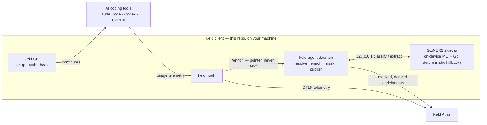
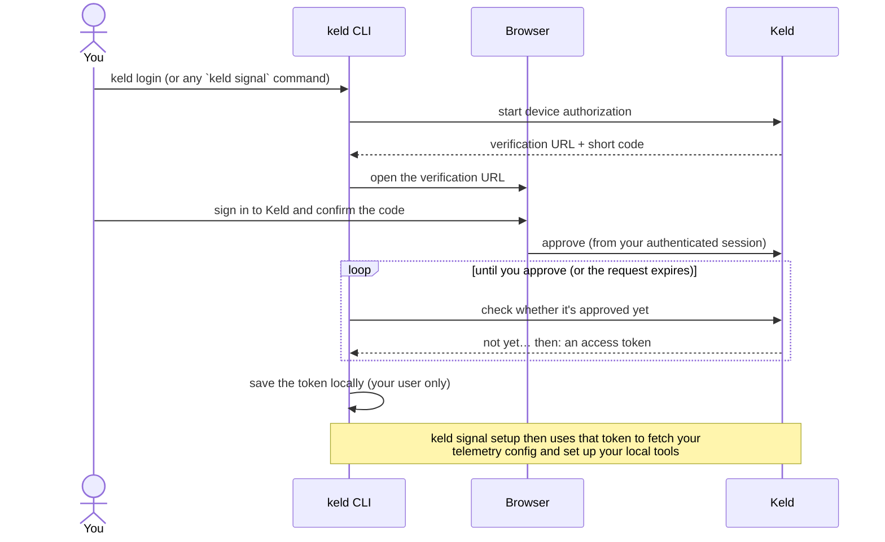

# keld — the Keld client

**The on-device half of Keld.** This repo is everything that runs on an
engineer's own machine, and it does two things:

1. **Telemetry** — configures your local AI coding tools (Claude Code, Codex,
   Gemini CLI) to emit usage telemetry to Keld Atlas.
2. **On-device enrichment (the core)** — a local daemon that classifies each
   prompt **on your machine**, masks anything sensitive, and sends Atlas only the
   *derived, masked* signal. **Raw prompt text never leaves the machine.**

That second capability is the heart of the project. It's what lets Keld report
*what kind of work* AI is being used for — by task, domain, business function,
sensitivity — **without exfiltrating a single prompt**. The `keld` CLI is the
setup/telemetry component; the `keld-agent` daemon and its GLiNER2 sidecar are the
privacy-preserving intelligence the CLI installs.

## What's in the client

| Component | Binary / process | Role |
|---|---|---|
| **CLI** | `keld` | Sign-in, detect tools, configure telemetry, install the hook, manage the agent. |
| **Hook** | `keld` (invoked by the tools) | Posts usage telemetry to Atlas and fire-and-forgets an *enrich pointer* (transcript path + prompt id — **never text**) to the local agent. |
| **Enrichment daemon** | `keld-agent` | Loopback intake → resolve prompt text locally → enrich → **mask** → publish masked enrichments to Atlas. |
| **ML sidecar** | `keld-agent-sidecar` | On-device GLiNER2 model doing the classification/extraction, spawned by the daemon on `127.0.0.1`. A pure-Go **deterministic backend** is the zero-dependency default and permanent fallback. |



**Two lanes, one privacy guarantee.** Telemetry (counts, models, latencies) goes
straight to Atlas from the hook. Enrichment (the semantic *meaning* of a prompt)
is computed **locally** by `keld-agent`; only masked labels + masked entity spans
are published. The raw prompt text is read on your machine and never transmitted.

## On-device enrichment (the core)

For each eligible prompt the agent runs a fixed sequence of classification /
extraction **sweeps** (single-flight, so it never runs concurrent inferences),
then masks and publishes. In two waves, up to 7 model calls per prompt:

- **Wave 1** (independent): `task_type` · `sensitivity` (+ masked entity spans) ·
  `domain` (+ entities) · `activity_type` · `personal` (work/personal) ·
  `function_guess` (one of 12 business functions).
- **Wave 2** (conditioned on the function): `subcategory`.

Each prompt yields a `Profile` — task, domain + entities, sensitivity + **masked**
spans, activity, function, subcategory — that's synced to Atlas. Sensitive spans
(emails, keys, SSNs…) are masked before anything leaves; a hard span match
(e.g. an API key) overrides the classifier to `secrets`.

- **Model backends.** GLiNER2 (DeBERTa-v2) via the sidecar when provisioned;
  otherwise a pure-Go **deterministic** backend — always present, zero-dependency.
- **Governed per organization.** An Atlas admin sets enrichment policy once
  (e.g. `include_entity_text`) and every agent picks it up within a poll interval.
- **Invisible good citizen.** The sidecar throttles CPU two ways (a rate governor
  *and* dynamic per-inference thread scaling), evicts the model under memory
  pressure or after inactivity (returning its ~2.6 GB to the OS), and is
  load-tested to prove it neither leaks nor runs away with CPU.

📄 **Deep dive:** [sidecar/loadtest/README.md](sidecar/loadtest/README.md) — the
sweep pipeline (with worked examples), the resource-safety mechanisms, tuning
knobs, and the measured validation results. See also
[docs/enrichment-settings.md](docs/enrichment-settings.md) (control plane) and
[docs/keld-agent-p2-onnx-decision.md](docs/keld-agent-p2-onnx-decision.md)
(why a bundled sidecar over in-process ONNX).

## Install

The **platform installers are the recommended path** — each bundles the whole
client (the `keld` CLI, the `keld-agent` enrichment daemon, and the frozen GLiNER2
sidecar) and registers the agent as a background service. Grab the latest from
[**GitHub Releases**](https://github.com/ncx-ai/keld-signal/releases/latest).

| Platform | Download | What it does |
|---|---|---|
| **macOS** (Apple Silicon) | `keld-<version>-arm64.pkg` | Full client + per-user agent |
| **macOS** (Intel) | `keld-<version>-amd64.pkg` | Full client + per-user agent |
| **Windows** (x64) | `keld-setup.exe` | Full client + logon-task agent |
| **Linux** (x64/arm64) | one-liner below (+ sidecar tarball) | CLI + agent (+ optional ML sidecar) |

### macOS — `.pkg` installer

Download the `.pkg` for your chip and open it. It installs to `/usr/local/keld`
and registers the per-user agent. It's a **`.pkg`, not a DMG** — a DMG is
drag-to-Applications for `.app` bundles, whereas Keld installs a CLI plus a
background daemon, which the `.pkg`'s install scripts wire up.

> **Gatekeeper:** release builds are signed + notarized when the maintainer's
> Apple credentials are configured; otherwise macOS warns on first run — open
> **System Settings → Privacy & Security** and click **Allow**.

### Windows — `keld-setup.exe`

Download **`keld-setup.exe`** and run it. Per-user (no admin): installs to
`%LOCALAPPDATA%\Programs\keld`, adds Keld to your `PATH`, and registers the agent
as a logon task.

> **SmartScreen:** unsigned builds trigger a warning — click **More info → Run
> anyway**. Code signing is a planned follow-up.

### Linux

No native package yet — install the CLI + agent with the one-liner:

```bash
curl -fsSL https://raw.githubusercontent.com/ncx-ai/keld-signal/main/scripts/install.sh | sh
```

It detects your OS/arch, fetches the latest release, and installs `keld` (and
`keld-agent`) to `~/.local/bin` (`KELD_INSTALL_DIR` to override). For on-device ML
enrichment, add the frozen sidecar (`keld-agent-sidecar_linux_amd64.tar.gz` from
Releases) beside `keld-agent`, or use `make install-linux` in a dev checkout for a
systemd `--user` service. Without the sidecar, enrichment runs on the pure-Go
deterministic backend.

### Advanced — CLI-only / raw binaries

The one-liners install just the `keld` CLI + `keld-agent` binaries (no bundled ML
sidecar):

```bash
# macOS / Linux
curl -fsSL https://raw.githubusercontent.com/ncx-ai/keld-signal/main/scripts/install.sh | sh
# Windows (PowerShell 5.1+)
irm https://raw.githubusercontent.com/ncx-ai/keld-signal/main/scripts/install.ps1 | iex
```

Or grab the raw archive from
[Releases](https://github.com/ncx-ai/keld-signal/releases/latest) and put the
binaries on your `$PATH` (a vanity `https://keld.co/install.sh` is planned):

| Platform | Architecture | Archive                     |
|----------|--------------|-----------------------------|
| macOS    | arm64 / amd64 | `keld_darwin_{arch}.tar.gz` |
| Linux    | arm64 / amd64 | `keld_linux_{arch}.tar.gz`  |
| Windows  | amd64        | `keld_windows_amd64.zip`    |

```bash
# Example (macOS arm64):
tar -xzf keld_darwin_arm64.tar.gz && chmod +x keld keld-agent && sudo mv keld keld-agent /usr/local/bin/
```

## Usage

```bash
keld login             # authenticate (also happens automatically on first `signal setup`)

keld signal setup      # detect tools, show changes, configure telemetry + install hook
keld signal status     # see what's configured
keld signal doctor     # diagnose problems
keld signal uninstall  # cleanly remove everything Keld added
```

Auth commands (`login`, `logout`, `whoami`) are top-level and shared across
Keld product groups. Telemetry onboarding lives under the `keld signal` group.

`keld signal setup` flags: `--tool claude_code,codex` (target specific tools),
`--dry-run` (show changes only), `--yes` (skip confirmation),
`--no-login` (fail instead of opening a browser, for CI).

`setup` is interactive. By default it prints a concise summary of the changes to
each config file; pass `--diff` to see the full unified diff. If a tool's config
already has settings Keld can't safely merge (e.g. Codex with its own `[otel]`
section), setup explains the conflict and lets you **[s]kip** that tool,
**[r]eplace** just the conflicting section with Keld's (the rest of your config
is preserved, and the diff is always shown for a replace), or **[a]bort**. Every
file Keld modifies is first copied to `~/.keld/backups/<tool>/`. Use `--dry-run`
to preview without writing and `--yes` to skip prompts (conflicts are
auto-skipped in that mode).

### Enabling enrichment (agent + sidecar)

The on-device enrichment agent is a separate binary (`keld-agent`) with an
optional Python ML sidecar. For local development on Linux:

```bash
make install-linux     # build keld + keld-agent + the sidecar venv, install the systemd --user service
make send-test-prompt  # push one test prompt to the running daemon
```

On first ML enrichment the agent provisions the model (~1.9 GB) into
`~/.keld/models` and the sidecar takes over; until then the pure-Go deterministic
backend runs. The daemon is safe to run without the sidecar — enrichment simply
uses the deterministic backend.

### Local development

To point the CLI at a Keld server running locally, pass `--api-url` to `keld
login` (or `keld signal setup`):

```bash
keld login --api-url http://localhost:8000   # auth against the local server
keld signal setup                            # remembered — uses the same server
```

The chosen URL is stored with your credentials, so subsequent commands target it
automatically. `--api-url` overrides the `KELD_API_URL` environment variable,
which does the same thing if you prefer setting it in your shell.

## Authentication

`keld` signs you in with a **browser-based device authorization** flow — you
approve the CLI from a normal signed-in Keld session, so your password is never
typed into (or seen by) the terminal.



Key points:

- **Lazy by default** — you don't have to run `keld login` first. Any command
  that needs auth (e.g. `keld signal setup`) starts this flow automatically; on a
  CI box use `--no-login` to fail cleanly instead of opening a browser.
- **You approve, in the browser** — the short code shown in your terminal is only
  meaningful to confirm inside an authenticated Keld session, and the approval is
  attributed to the signed-in person. The request stops working shortly after it
  is issued if left unapproved.
- **The token stays on your machine** — it's written under `~/.keld` with
  user-only file permissions (override the location with `KELD_HOME`). `keld
  whoami` shows who you're signed in as; `keld logout` removes it. Tokens are
  revocable from Keld, so a lost laptop can be cut off without rotating anything
  else.

## Org enrichment settings (control plane)

The local enrichment daemon (`keld-agent`) is governed **per organization** from
Keld Atlas: an admin sets policy once and every running agent picks it up within
one poll interval — remote overrides local, non-fatal if Atlas is unreachable.
Today it governs `include_entity_text`; the mechanism is generic and extends to
new keys without a protocol change.

See [docs/enrichment-settings.md](docs/enrichment-settings.md) for the full
subsystem: governance model, the HTTP API contract (`GET /v1/enrichment-settings`
for the daemon, admin `GET`/`PATCH /api/enrichment-settings`), the data model,
client behavior, and security.

## Environment

- `KELD_HOME` — where credentials, the hook, and the manifest live (default `~/.keld`).
- `KELD_API_URL` — Atlas base URL (default `https://atlas.keld.co`).
- `KELD_SETTINGS_POLL` — how often `keld-agent` polls Atlas for org enrichment
  settings (Go duration, default `5m`; for tests/local dev). See
  [docs/enrichment-settings.md](docs/enrichment-settings.md).

The GLiNER2 sidecar has load-protection + resource-safety knobs
(`KELD_SIDECAR_*`, `KELD_GOV_*`) documented, with the mechanisms and validation,
in [sidecar/loadtest/README.md](sidecar/loadtest/README.md#tunable-env). General
sidecar setup lives in [sidecar/README.md](sidecar/README.md).

## Contributing

See [AGENTS.md](AGENTS.md) for the architecture, repo layout, build/run/test
commands, and conventions.
