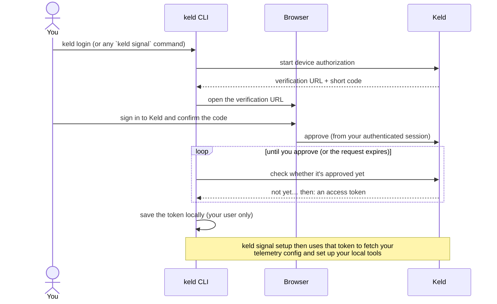

# keld — the Keld client

**The on-device half of Keld.** This repo is everything that runs on an
engineer's own machine, and it does two things:

1. **Telemetry** — configures your local AI coding tools (Claude Code, Codex with
   enriched capture + native telemetry, Gemini CLI) to emit usage telemetry to Keld Atlas.
2. **On-device enrichment (the core)** — a local daemon that classifies each
   prompt **on your machine**, masks anything sensitive, and sends Atlas only the
   *derived, masked* signal. **Raw prompt text never leaves the machine.**

That second capability is the heart of the project. It's what lets Keld report
*what kind of work* AI is being used for — by task, domain, business function,
sensitivity — **without exfiltrating a single prompt**. The `keld` CLI is the
setup/telemetry component; the `keld-agent` daemon and its GLiNER2 sidecar are the
privacy-preserving intelligence the CLI installs.

## What's in the client

| Component | Binary / process | Role |
|---|---|---|
| **CLI** | `keld` | Sign-in, detect tools, configure telemetry, install the hook, manage the agent. |
| **Hook** | `keld` (invoked by the tools) | Posts usage telemetry to Atlas and fire-and-forgets an *enrich pointer* (transcript path + prompt id — **never text**) to the local agent. |
| **Enrichment daemon** | `keld-agent` | Loopback intake → resolve prompt text locally → enrich → **mask** → publish masked enrichments to Atlas. |
| **ML sidecar** | `keld-agent-sidecar` | On-device GLiNER2 model doing the classification/extraction, spawned by the daemon on `127.0.0.1`. **Mandatory** — enrichment is ML-only; there is no fallback backend. |


**Two lanes, one privacy guarantee.** Telemetry (counts, models, latencies) goes
straight to Atlas from the hook. Enrichment (the semantic *meaning* of a prompt)
is computed **locally** by `keld-agent`; only masked labels + masked entity spans
are published. The raw prompt text is read on your machine and never transmitted.
(The agent also reports its own operational health — see
[Client-events monitoring](#client-events-monitoring-agent-health) below —
which is a third, much smaller stream: no prompt content, ever.)

## On-device enrichment (the core)

For each eligible prompt the agent runs a fixed sequence of classification /
extraction **sweeps** (single-flight, so it never runs concurrent inferences),
then masks and publishes. In two waves, up to 8 facets per prompt:

- **Wave 1** (independent): `task_type` · `sensitivity` (+ masked entity spans) ·
  `domain` (+ entities) · `activity_type` · `personal` (work/personal) ·
  `function_guess` (one of 12 business functions) · `speech_act`
  (command/question/statement/fragment).
- **Wave 2** (conditioned on the function): `subcategory`.

**Two capture triggers, one pipeline.** Prompts reach the daemon two ways, both
producing the same masked, derived `Profile`: (1) the **command hook**
(`keld __hook`, installed by `keld setup`) on `UserPromptSubmit`; and (2) an
on-device **transcript watcher** that tails the JSONL transcripts Claude Code
(every launch surface, including the Desktop app) and **Cowork** already write to
disk. The watcher is the hook-free path for surfaces that don't run command
hooks. It reads only a pointer (path + prompt id) into the existing
resolve → enrich → publish flow — **never prompt text** — and dedups against the
hook via the prompt id. Cowork prompts are labeled `source=cowork` and classified
as general knowledge work (not coding). Plain Claude *chat* (server-synced, no
local transcript) is not captured on-device.

Each prompt yields a `Profile` — `task_type`, `domain` + entities, `sensitivity` +
**masked** spans, `activity_type`, `personal`, `function_guess`, `subcategory`,
`speech_act` — synced to Atlas (**schema v6**). `task_type` is a **routing-aligned
taxonomy** (a real inference-job category — `summarization` · `translation` ·
`code_generation` · `information_extraction` · `classification` · `reasoning` ·
`question_answering` · `text_generation` · `rewriting` · `general`) — the routing
key for the Keld Inference Exchange. Classifier facets score against readable label
**descriptions**, not bare ids (a bi-encoder keys on token overlap, so the label
wording is load-bearing).

**Sensitivity is concrete leaked data, not topic.** The class is a rollup of which
concrete sensitive entity is present — SSN→`phi`, card→`pci`, credential→`secrets`,
other personal identifier (email/phone/person/address)→`pii`; medical or other
*topic* words alone are never flagged. Detection **unions two layers**: the GLiNER2
NER **and** a deterministic credential-detection layer (a vendored gitleaks ruleset
— keyword-prefiltered regex + entropy floors — with a **placeholder precision-gate**
that suppresses `YOUR_API_KEY`/`<API_KEY>`/redacted values). Any hit registers its
entity; the ordered rule table then picks the **highest-severity** class, so a
detected credential never downgrades a co-present SSN. Sensitive spans (emails,
keys, SSNs…) are **masked** before anything leaves the machine.

- **Model backends.** GLiNER2 (DeBERTa-v2) via the sidecar — the only backend.
  Enrichment is ML-only; there is no deterministic fallback. If the sidecar
  isn't ready yet (not yet provisioned, restarting, or the daemon couldn't
  bring it up), enrichment simply waits — jobs queue/spool until it is.
- **Governed per organization.** An Atlas admin sets enrichment policy once
  (e.g. `include_entity_text`) and every agent picks it up within a poll interval.
- **Invisible good citizen.** The long-lived sidecar service holds no model
  (RSS stays flat); inference runs in a separate worker child process that's
  **recycled** — killed and respawned, reclaiming its ~2.6 GB heap via process
  exit — on an RSS ceiling, memory pressure, inactivity, or a hung job, so a
  single misbehaving inference can't wedge or balloon the service. CPU is still
  throttled two ways (a rate governor *and* dynamic per-inference thread
  scaling), single-flight is preserved (one inference at a time), and it's all
  load-tested to prove it neither leaks nor runs away with CPU.
- **Reliable, GLiNER2-only delivery.** Enrichment never degrades to a fallback
  backend — there isn't one. The hook writes each prompt *pointer* (never the
  prompt text) to a durable on-disk **spool**, so work survives daemon downtime
  and is drained on startup and a periodic sweep. Each job runs under a deadline
  (`KELD_ENRICH_JOB_TIMEOUT`) that **cancels its in-flight sidecar calls** on
  timeout — so a slow or recycling sidecar worker can't leak self-amplifying retries — then
  re-spools for a later GLiNER2 retry. Retries are **bounded**: after
  `KELD_ENRICH_MAX_ATTEMPTS` a job is quarantined to `~/.keld/spool/bad/` rather
  than retried forever. A sidecar that isn't ready — mid-recycle, respawning, or
  still provisioning — is waited out (wake + retry, or jobs queue/spool until it
  comes up); enrichment is disabled only when the local `ml_backend` setting is
  explicitly `"off"`.

📄 **Deep dive:** [sidecar/loadtest/README.md](sidecar/loadtest/README.md) — the
sweep pipeline (with worked examples), the resource-safety mechanisms, tuning
knobs, and the measured validation results. See also
[docs/enrichment-settings.md](docs/enrichment-settings.md) (control plane) and
[docs/keld-agent-p2-onnx-decision.md](docs/keld-agent-p2-onnx-decision.md)
(why a bundled sidecar over in-process ONNX).

## Client-events monitoring (agent health)

Alongside enrichment, `keld-agent` reports its own **operational health** to
Atlas — a third, much smaller stream, distinct from both telemetry and
enrichment: job retries/quarantines, sidecar crashes or startup failures
(`sidecar.unavailable` — the sidecar couldn't be brought up, so jobs queue/spool
until it can), publish failures, sustained high RSS/CPU, and lifecycle
(`daemon.start`/`stop`).
It's how Atlas can tell an agent is struggling (or silent) without ever seeing a
prompt — events carry only ids, codes, and small structured fields (counts,
durations, thresholds), passed through a Go-side redaction gate that strips
paths and reduces errors to a class+summary before anything is buffered.

Batched and POSTed to `POST /v1/signal/client-events` — the first route under
the **`/v1/signal/*`** convention for new client↔Atlas protocol surfaces — with
the same durability posture as enrichment publish (retried, spooled to
`~/.keld/spool/clientevents/` if Atlas is unreachable). Governed per-org (on by
default) via the existing enrichment-settings poll.

📄 **Wire contract:** [docs/signal-client-events.md](docs/signal-client-events.md)
— the full envelope, event/code catalog, settings block, and redaction
guarantee (what Atlas's ingest route and dashboard build against).

## Install

The **platform installers are the recommended path** — each bundles the whole
client (the `keld` CLI, the `keld-agent` enrichment daemon, and the frozen GLiNER2
sidecar) and registers the agent as a background service. Grab the latest from
[**GitHub Releases**](https://github.com/ncx-ai/keld-signal/releases/latest).

| Platform | Download | What it does |
|---|---|---|
| **macOS** (Apple Silicon) | `keld-<version>-arm64.pkg` | Full client + per-user agent |
| **macOS** (Intel) | `keld-<version>-amd64.pkg` | Full client + per-user agent |
| **Windows** (x64) | `keld-setup.exe` | Full client + logon-task agent |
| **Linux** (x64/arm64) | one-liner below (+ sidecar tarball) | CLI + agent (+ optional ML sidecar) |

### macOS — `.pkg` installer

Download the `.pkg` for your chip and open it. It installs to `/usr/local/keld`
and registers the per-user agent. It's a **`.pkg`, not a DMG** — a DMG is
drag-to-Applications for `.app` bundles, whereas Keld installs a CLI plus a
background daemon, which the `.pkg`'s install scripts wire up.

After install, a small **Keld Setup** app opens automatically to walk you through
sign-in and tool configuration (it drives `keld login` / `keld signal setup` for
you). You can close it and run those two commands yourself later — the background
agent is registered either way.

> **Gatekeeper:** release builds are signed + notarized when the maintainer's
> Apple credentials are configured; otherwise macOS warns on first run — open
> **System Settings → Privacy & Security** and click **Allow**.

### Windows — `keld-setup.exe`

Download **`keld-setup.exe`** and run it. Per-user (no admin): installs to
`%LOCALAPPDATA%\Programs\keld`, adds Keld to your `PATH`, and registers the agent
as a logon task.

During install a **Set up Keld** step walks you through sign-in and tool
configuration (it drives `keld login` / `keld signal setup`). You can click Next to
skip it and run those two commands yourself later — the background agent is
registered either way.

> **SmartScreen:** unsigned builds trigger a warning — click **More info → Run
> anyway**. Code signing is a planned follow-up.

### Linux

No native package yet — install the CLI + agent with the one-liner:

```bash
curl -fsSL https://raw.githubusercontent.com/ncx-ai/keld-signal/main/scripts/install.sh | sh
```

It detects your OS/arch, fetches the latest release, and installs `keld` (and
`keld-agent`) to `~/.local/bin` (`KELD_INSTALL_DIR` to override). Enrichment is
ML-only, so on-device enrichment needs the sidecar: add the frozen sidecar
(`keld-agent-sidecar_linux_amd64.tar.gz` from Releases) beside `keld-agent`, or
use `make install-linux` in a dev checkout for a systemd `--user` service.
Without the sidecar, enrichment jobs simply queue/spool rather than run on a
fallback backend.

### Advanced — CLI-only / raw binaries

The one-liners install just the `keld` CLI + `keld-agent` binaries (no bundled ML
sidecar):

```bash
# macOS / Linux
curl -fsSL https://raw.githubusercontent.com/ncx-ai/keld-signal/main/scripts/install.sh | sh
# Windows (PowerShell 5.1+)
irm https://raw.githubusercontent.com/ncx-ai/keld-signal/main/scripts/install.ps1 | iex
```

Or grab the raw archive from
[Releases](https://github.com/ncx-ai/keld-signal/releases/latest) and put the
binaries on your `$PATH` (a vanity `https://keld.co/install.sh` is planned):

| Platform | Architecture | Archive                     |
|----------|--------------|-----------------------------|
| macOS    | arm64 / amd64 | `keld_darwin_{arch}.tar.gz` |
| Linux    | arm64 / amd64 | `keld_linux_{arch}.tar.gz`  |
| Windows  | amd64        | `keld_windows_amd64.zip`    |

```bash
# Example (macOS arm64):
tar -xzf keld_darwin_arm64.tar.gz && chmod +x keld keld-agent && sudo mv keld keld-agent /usr/local/bin/
```

## Usage

```bash
keld login             # authenticate (also happens automatically on first `signal setup`)

keld signal setup      # detect tools, show changes, configure telemetry + install hook
keld signal status     # see what's configured
keld signal doctor     # diagnose problems
keld signal uninstall  # cleanly remove everything Keld added
```

Auth commands (`login`, `logout`, `whoami`) are top-level and shared across
Keld product groups. Telemetry onboarding lives under the `keld signal` group.

`keld signal setup` flags: `--tool claude_code,codex` (target specific tools),
`--dry-run` (show changes only), `--yes` (skip confirmation),
`--no-login` (fail instead of opening a browser, for CI),
`--json` (stream machine-readable NDJSON instead of prompting; implies `--yes` —
see [Machine-readable interface](#machine-readable-interface-installers--automation)).

`setup` is interactive. By default it prints a concise summary of the changes to
each config file; pass `--diff` to see the full unified diff. If a tool's config
already has settings Keld can't safely merge (e.g. Codex with its own `[otel]`
section), setup explains the conflict and lets you **[s]kip** that tool,
**[r]eplace** just the conflicting section with Keld's (the rest of your config
is preserved, and the diff is always shown for a replace), or **[a]bort**. Every
file Keld modifies is first copied to `~/.keld/backups/<tool>/`. Use `--dry-run`
to preview without writing and `--yes` to skip prompts (conflicts are
auto-skipped in that mode).

### Enabling enrichment (agent + sidecar)

The on-device enrichment agent is a separate binary (`keld-agent`) with an
optional Python ML sidecar. For local development on Linux:

```bash
make install-linux     # build keld + keld-agent + the sidecar venv, install the systemd --user service
make send-test-prompt  # push one test prompt to the running daemon
```

On first ML enrichment the agent provisions the model (~1.9 GB) into
`~/.keld/models`; until provisioning finishes and the sidecar is ready,
enrichment jobs queue/spool rather than run on a fallback backend — there is
none. The daemon is safe to run without the sidecar: it stays up and telemetry
still flows, but enrichment stalls until the sidecar comes up (or you set the
local `ml_backend` to `"off"` to disable enrichment entirely).

### Local development

To point the CLI at a Keld server running locally, pass `--api-url` to `keld
login` (or `keld signal setup`):

```bash
keld login --api-url http://localhost:8000   # auth against the local server
keld signal setup                            # remembered — uses the same server
```

The chosen URL is stored with your credentials, so subsequent commands target it
automatically. `--api-url` overrides the `KELD_API_URL` environment variable,
which does the same thing if you prefer setting it in your shell.

### Machine-readable interface (installers & automation)

`keld login` and `keld signal setup` each accept `--json`, which streams
**newline-delimited JSON** on stdout instead of human text — one object per line,
each with an `event` field. This is what the native platform installers drive to
surface the device-authorization code and setup progress inside their own UI, and
it's useful for any scripted onboarding.

```bash
keld login --json --no-browser   # emit device_code immediately, then authorized (or error)
keld signal setup --json         # non-interactive (implies --yes); a tool event per tool, then done
```

`keld login --json` emits, in order:

- `{"event":"device_code","verification_url":…,"user_code":…,"expires_in":…,"interval":…}`
  — emitted immediately, so a caller can render the code without waiting for approval;
- `{"event":"authorized","principal":…,"org":…}` on success, or
  `{"event":"error","message":…}` with a non-zero exit.

`--no-browser` suppresses the automatic browser open so the caller owns the link
(it has the URL from the first event). `keld signal setup --json` emits a
`{"event":"tool",…,"action":"configured|already_configured|skipped_conflict"}` line
per detected tool, then `{"event":"done","configured":N}`.

**`keld-agent install` is TTY-aware.** Run from a terminal, it walks you through
`keld login` then `keld signal setup`, and finally registers the background service.
Run headless (e.g. by a GUI installer with no console attached), it **skips** the
interactive steps, registers the service only, and prints the commands to finish
setup — the installer's own pages drive the `--json` interface instead.

## Authentication

`keld` signs you in with a **browser-based device authorization** flow — you
approve the CLI from a normal signed-in Keld session, so your password is never
typed into (or seen by) the terminal.



Key points:

- **Lazy by default** — you don't have to run `keld login` first. Any command
  that needs auth (e.g. `keld signal setup`) starts this flow automatically; on a
  CI box use `--no-login` to fail cleanly instead of opening a browser.
- **You approve, in the browser** — the short code shown in your terminal is only
  meaningful to confirm inside an authenticated Keld session, and the approval is
  attributed to the signed-in person. The request stops working shortly after it
  is issued if left unapproved.
- **The token stays on your machine** — it's written under `~/.keld` with
  user-only file permissions (override the location with `KELD_HOME`). `keld
  whoami` shows who you're signed in as; `keld logout` removes it. Tokens are
  revocable from Keld, so a lost laptop can be cut off without rotating anything
  else.

## Org enrichment settings (control plane)

The local enrichment daemon (`keld-agent`) is governed **per organization** from
Keld Atlas: an admin sets policy once and every running agent picks it up within
one poll interval — remote overrides local, non-fatal if Atlas is unreachable.
Today it governs `include_entity_text`; the mechanism is generic and extends to
new keys without a protocol change.

See [docs/enrichment-settings.md](docs/enrichment-settings.md) for the full
subsystem: governance model, the HTTP API contract (`GET /v1/enrichment-settings`
for the daemon, admin `GET`/`PATCH /api/enrichment-settings`), the data model,
client behavior, and security.

## Environment

- `KELD_HOME` — where credentials, the hook, and the manifest live (default `~/.keld`).
- `KELD_API_URL` — Atlas base URL (default `https://atlas.keld.co`).
- `KELD_SETTINGS_POLL` — how often `keld-agent` polls Atlas for org enrichment
  settings (Go duration, default `5m`; for tests/local dev). See
  [docs/enrichment-settings.md](docs/enrichment-settings.md).
- `KELD_ENRICH_JOB_TIMEOUT` — per-job enrichment deadline (Go duration, default
  `30s`). On timeout the job's in-flight sidecar calls are cancelled and the
  pointer re-spools for a later GLiNER2 retry.
- `KELD_ENRICH_MAX_ATTEMPTS` — how many times a timed-out job re-spools before it
  is quarantined to `~/.keld/spool/bad/` (default `4`) — bounds retries so one
  un-enrichable prompt can't loop forever.
- `KELD_SPOOL_MAX` — cap on spooled pointers before the oldest are dropped
  (default `500`).

The GLiNER2 sidecar has load-protection + resource-safety knobs
(`KELD_SIDECAR_*`, `KELD_GOV_*`) documented, with the mechanisms and validation,
in [sidecar/loadtest/README.md](sidecar/loadtest/README.md#tunable-env). General
sidecar setup lives in [sidecar/README.md](sidecar/README.md).

## Release process

A release is cut by pushing a `vX.Y.Z` tag (`make release` bumps the version, tags,
and pushes — which kicks off CI). Two workflows run, in order, and both attach their
outputs to the **same** GitHub Release:

1. **`release.yml` → GoReleaser.** Builds the Go binaries `keld` and `keld-agent`
   for macOS/Linux/Windows (amd64 + arm64), **creates the GitHub Release**, and
   uploads the archives `keld_<os>_<arch>.tar.gz` (`.zip` on Windows) plus
   `checksums.txt`.
2. **`installers.yml` (chained via `needs: goreleaser`).** For each OS it freezes
   the GLiNER2 sidecar (`sidecar/build-freeze.sh` → PyInstaller, obfuscated), smoke-
   tests the frozen binary, then packages and uploads to the release:
   - **macOS** — `keld-<ver>-<arch>.pkg`, signed + notarized when the Apple secrets
     are present (unsigned otherwise).
   - **Windows** — `keld-setup.exe` (Inno Setup).
   - **Linux** — `keld-agent-sidecar_linux_<arch>.tar.gz` (the frozen sidecar; the
     Linux `install.sh` downloads exactly this, since macOS/Windows bundle the
     sidecar inside their native installers instead).

   It's chained from `release.yml` rather than triggered by `on: release: published`
   because GoReleaser creates the release with the default `GITHUB_TOKEN`, and
   releases created by `GITHUB_TOKEN` do **not** fire the `release` event — so an
   `on: release` workflow would silently never run for an automated release.

**The GLiNER2 model is not in any artifact.** The frozen sidecar ships the *runner*
(code + torch/gliner2 libraries + a bundled Python); the ~1.9 GB model is pulled at
runtime into the HF cache on the sidecar's first start (pin a local copy with
`KELD_GLINER2_DIR`). See [sidecar/README.md](sidecar/README.md).

**Where to find the artifacts.** On the repo's **Releases** page — every asset
above is attached to the tagged release. `install.sh` / `install.ps1` resolve the
**latest** release and download from there.

**Dry runs (no release, no secrets).** Run `installers.yml` on demand to build and
inspect the installers without cutting a release:

```bash
gh workflow run installers.yml           # optionally: --ref <branch>
```

This builds **unsigned** installers on all OSes and uploads them as **workflow
artifacts** (Actions → the run → *Artifacts*: `installers-<os>-<arch>`), including
the Linux `keld-agent-sidecar_*.tar.gz`. Use it to validate a freeze/packaging
change before tagging a real release.

> **Linux portability note.** The Linux sidecar is currently frozen on
> `ubuntu-latest`, so it dynamically links that runner's (recent) glibc and runs on
> current rolling/LTS distros. Broad old-glibc coverage (RHEL, older Debian/Ubuntu)
> requires freezing in a `manylinux_2_28` container (glibc 2.28) — tracked as a
> follow-up.

## Contributing

See [AGENTS.md](AGENTS.md) for the architecture, repo layout, build/run/test
commands, and conventions.
