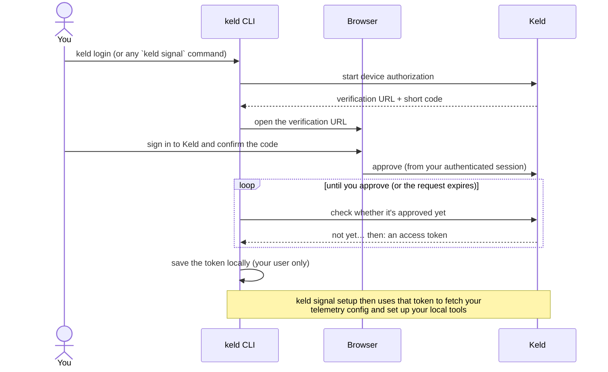

# keld

The Keld CLI configures your local AI coding tools (Claude Code, Codex, Gemini
CLI) to send telemetry to Keld Atlas.

## Install

`keld` is a single static binary — no Python, no runtime, no dependencies.

**macOS / Linux (one-liner):**

```bash
curl -fsSL https://raw.githubusercontent.com/ncx-ai/keld-cli/main/scripts/install.sh | sh
```

This detects your OS and architecture, fetches the latest release from GitHub,
and installs `keld` to `~/.local/bin`. Set `KELD_INSTALL_DIR` to override the
destination. A vanity URL (`https://keld.co/install.sh`) is planned but not yet
live; use the `raw.githubusercontent.com` form until then.

> **macOS Gatekeeper:** because the binary is not yet notarized, macOS may show
> a warning on first run. Go to **System Settings → Privacy & Security** and
> click **Allow**. Code signing and notarization are a planned follow-up.

**Windows (PowerShell 5.1+):**

```powershell
irm https://raw.githubusercontent.com/ncx-ai/keld-cli/main/scripts/install.ps1 | iex
```

Installs `keld.exe` to `%LOCALAPPDATA%\Programs\keld`. Set `KELD_INSTALL_DIR`
to override. A vanity URL (`https://keld.co/install.ps1`) is planned.

> **Windows SmartScreen:** unsigned binaries trigger a SmartScreen warning.
> Click **More info → Run anyway**. Code signing is a planned follow-up.

**Direct download** — grab the archive for your platform from
[GitHub Releases](https://github.com/ncx-ai/keld-cli/releases/latest), extract
the binary, and place it on your `$PATH`:

| Platform | Architecture | Archive                          | Binary inside     |
|----------|--------------|----------------------------------|-------------------|
| macOS    | arm64        | `keld_darwin_arm64.tar.gz`       | `keld`            |
| macOS    | amd64        | `keld_darwin_amd64.tar.gz`       | `keld`            |
| Linux    | arm64        | `keld_linux_arm64.tar.gz`        | `keld`            |
| Linux    | amd64        | `keld_linux_amd64.tar.gz`        | `keld`            |
| Windows  | amd64        | `keld_windows_amd64.zip`         | `keld.exe`        |

```bash
# Example (macOS arm64):
tar -xzf keld_darwin_arm64.tar.gz
chmod +x keld
sudo mv keld /usr/local/bin/
```

## Usage

```bash
keld login             # authenticate (also happens automatically on first `signal setup`)

keld signal setup      # detect tools, show changes, configure telemetry + install hook
keld signal status     # see what's configured
keld signal doctor     # diagnose problems
keld signal uninstall  # cleanly remove everything Keld added
```

Auth commands (`login`, `logout`, `whoami`) are top-level and shared across
Keld product groups. Telemetry onboarding lives under the `keld signal` group.

`keld signal setup` flags: `--tool claude_code,codex` (target specific tools),
`--dry-run` (show changes only), `--yes` (skip confirmation),
`--no-login` (fail instead of opening a browser, for CI).

`setup` is interactive. By default it prints a concise summary of the changes to
each config file; pass `--diff` to see the full unified diff. If a tool's config
already has settings Keld can't safely merge (e.g. Codex with its own `[otel]`
section), setup explains the conflict and lets you **[s]kip** that tool,
**[r]eplace** just the conflicting section with Keld's (the rest of your config
is preserved, and the diff is always shown for a replace), or **[a]bort**. Every
file Keld modifies is first copied to `~/.keld/backups/<tool>/`. Use `--dry-run`
to preview without writing and `--yes` to skip prompts (conflicts are
auto-skipped in that mode).

### Local development

To point the CLI at a Keld server running locally, pass `--api-url` to `keld
login` (or `keld signal setup`):

```bash
keld login --api-url http://localhost:8000   # auth against the local server
keld signal setup                            # remembered — uses the same server
```

The chosen URL is stored with your credentials, so subsequent commands target it
automatically. `--api-url` overrides the `KELD_API_URL` environment variable,
which does the same thing if you prefer setting it in your shell.

## Authentication

`keld` signs you in with a **browser-based device authorization** flow — you
approve the CLI from a normal signed-in Keld session, so your password is never
typed into (or seen by) the terminal.



Key points:

- **Lazy by default** — you don't have to run `keld login` first. Any command
  that needs auth (e.g. `keld signal setup`) starts this flow automatically; on a
  CI box use `--no-login` to fail cleanly instead of opening a browser.
- **You approve, in the browser** — the short code shown in your terminal is only
  meaningful to confirm inside an authenticated Keld session, and the approval is
  attributed to the signed-in person. The request stops working shortly after it
  is issued if left unapproved.
- **The token stays on your machine** — it's written under `~/.keld` with
  user-only file permissions (override the location with `KELD_HOME`). `keld
  whoami` shows who you're signed in as; `keld logout` removes it. Tokens are
  revocable from Keld, so a lost laptop can be cut off without rotating anything
  else.

## Org enrichment settings (control plane)

The local enrichment daemon (`keld-agent`) is governed **per organization** from
Keld Atlas: an admin sets policy once and every running agent picks it up within
one poll interval — remote overrides local, non-fatal if Atlas is unreachable.
Today it governs `include_entity_text`; the mechanism is generic and extends to
new keys without a protocol change.

See [docs/enrichment-settings.md](docs/enrichment-settings.md) for the full
subsystem: governance model, the HTTP API contract (`GET /v1/enrichment-settings`
for the daemon, admin `GET`/`PATCH /api/enrichment-settings`), the data model,
client behavior, and security.

## Environment

- `KELD_HOME` — where credentials, the hook, and the manifest live (default `~/.keld`).
- `KELD_API_URL` — Atlas base URL (default `https://atlas.keld.co`).
- `KELD_SETTINGS_POLL` — how often `keld-agent` polls Atlas for org enrichment
  settings (Go duration, default `5m`; for tests/local dev). See
  [docs/enrichment-settings.md](docs/enrichment-settings.md).
