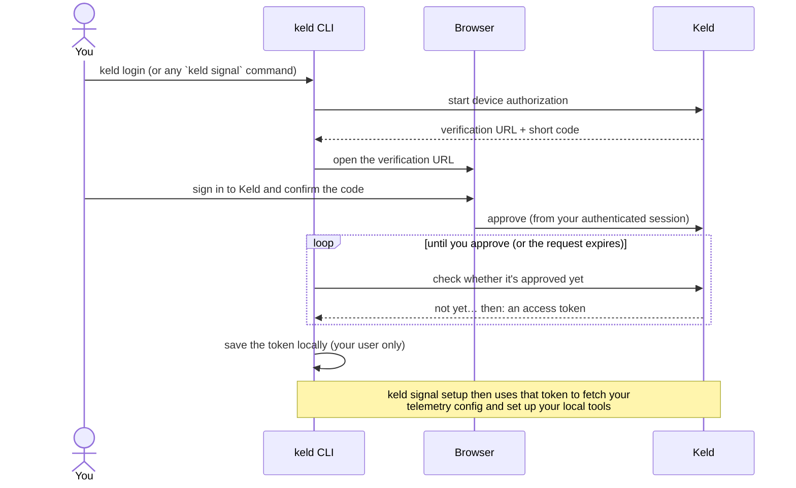

# keld

The Keld CLI configures your local AI coding tools (Claude Code, Codex, Gemini
CLI) to send telemetry to Keld Atlas.

## Install

Recommended (isolated, works on every platform):

```bash
pipx install keld
```

If you don't have pipx yet: `python -m pip install --user pipx && python -m pipx ensurepath`.

Alternatives: `uvx keld` / `uv tool install keld` (if you use uv), or
`pip install keld` **inside a virtual environment** (a bare `pip install` into
system Python fails with `externally-managed-environment` on modern distros).

## Usage

```bash
keld login             # authenticate (also happens automatically on first `signal setup`)

keld signal setup      # detect tools, show changes, configure telemetry + install hook
keld signal status     # see what's configured
keld signal doctor     # diagnose problems
keld signal uninstall  # cleanly remove everything Keld added
```

Auth commands (`login`, `logout`, `whoami`) are top-level and shared across
Keld product groups. Telemetry onboarding lives under the `keld signal` group.

`keld signal setup` flags: `--tool claude_code,codex` (target specific tools),
`--dry-run` (show changes only), `--yes` (skip confirmation),
`--no-login` (fail instead of opening a browser, for CI).

## Authentication

`keld` signs you in with a **browser-based device authorization** flow — you
approve the CLI from a normal signed-in Keld session, so your password is never
typed into (or seen by) the terminal.



Key points:

- **Lazy by default** — you don't have to run `keld login` first. Any command
  that needs auth (e.g. `keld signal setup`) starts this flow automatically; on a
  CI box use `--no-login` to fail cleanly instead of opening a browser.
- **You approve, in the browser** — the short code shown in your terminal is only
  meaningful to confirm inside an authenticated Keld session, and the approval is
  attributed to the signed-in person. The request stops working shortly after it
  is issued if left unapproved.
- **The token stays on your machine** — it's written under `~/.keld` with
  user-only file permissions (override the location with `KELD_HOME`). `keld
  whoami` shows who you're signed in as; `keld logout` removes it. Tokens are
  revocable from Keld, so a lost laptop can be cut off without rotating anything
  else.

## Environment

- `KELD_HOME` — where credentials, the hook, and the manifest live (default `~/.keld`).
- `KELD_API_URL` — Atlas base URL (default `https://atlas.keld.co`).
