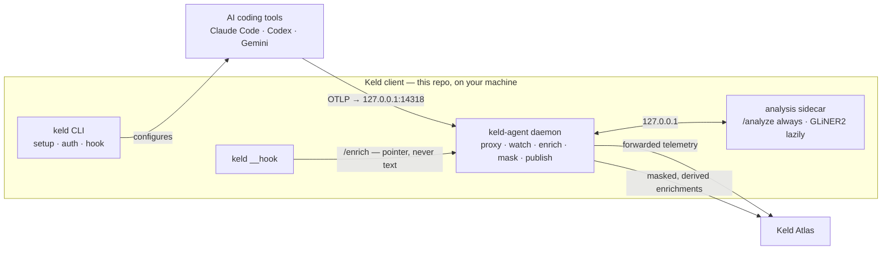

# keld — the Keld client

**The on-device half of Keld.** This repo is everything that runs on an
engineer's own machine, and it does two things:

1. **Telemetry** — configures your local AI coding tools (Claude Code, Codex,
   Gemini CLI) to emit usage telemetry, which the local daemon forwards to Keld
   Atlas.
2. **On-device analysis and enrichment (the core)** — a local daemon that reads
   each prompt **on your machine**, derives structure from it, masks anything
   sensitive, and sends Atlas only the *derived, masked* signal. **Raw prompt
   text never leaves the machine.**

That second capability is the heart of the project. It's what lets Keld report
*what kind of work* AI is being used for — by task, domain, business function,
sensitivity, and by the shape of the work itself — **without exfiltrating a
single prompt**.

> **Privacy invariant, stated precisely.** Raw prompt text, character spans and
> byte offsets never cross the wire. Things *measured* from text can, each on
> its own argument: since schema v18 `named_terms` publishes proper nouns as
> term + count, and the off-by-default `KELD_TEXTEMBED` publishes a projected
> 256-d vector. "Is it derived from text?" is not the test; "does text, a span,
> or an offset cross?" is. See [AGENTS.md](AGENTS.md) for both decisions and
> their evidence.

## What's in the client

| Component | Binary / process | Role |
|---|---|---|
| **CLI** | `keld` | Sign-in, detect tools, configure telemetry, install the hook, manage the agent. |
| **Hook** | `keld __hook` (invoked by the tools) | Fire-and-forgets an *enrich pointer* (transcript path + prompt id — **never text**) to the local agent. |
| **Daemon** | `keld-agent` | Loopback OTLP proxy for telemetry; transcript watcher; resolve → enrich → **mask** → publish. |
| **Analysis sidecar** | `keld-agent-sidecar` | The on-device analysis + enrichment service on `127.0.0.1`: `/analyze`, `/ingest`, `/blocks`, `/pii`, plus `/classify` and `/extract`. GLiNER2 is **one capability it loads lazily**, not a precondition. |


```mermaid
flowchart LR
  Tools["AI coding tools<br/>Claude Code · Codex · Gemini"]
  subgraph Client["Keld client — this repo, on your machine"]
    CLI["keld CLI<br/>setup · auth · hook"]
    Hook["keld __hook"]
    Agent["keld-agent daemon<br/>proxy · watch · enrich · mask · publish"]
    Sidecar["analysis sidecar<br/>/analyze always · GLiNER2 lazily"]
  end
  Atlas["Keld Atlas"]

  CLI -->|configures| Tools
  Tools -->|"OTLP → 127.0.0.1:14318"| Agent
  Hook -->|"/enrich — pointer, never text"| Agent
  Agent <-->|"127.0.0.1"| Sidecar
  Agent -->|forwarded telemetry| Atlas
  Agent -->|"masked, derived enrichments"| Atlas
```

**Two lanes, one privacy guarantee.**

- **Telemetry (push).** Tools POST OTLP to the daemon's loopback proxy (fixed
  port **14318**), which forwards to Atlas with the daemon's own token. ⚠️ **No
  tool ever holds an Atlas credential.** A tool reads its config once at
  startup and keeps the token in memory, so when an org's ingest token rotated,
  every running tool kept posting the old one until a human restarted the
  editor — measured, 40 minutes of frozen telemetry that no diagnostic could
  see. `keld signal setup` writes the loopback address and a stable local
  secret instead. **This means telemetry now depends on the daemon**, paid for
  with a bounded spool rather than hoped away.
- **Enrichment (local).** The prompt text is read on your machine, enriched,
  masked, and only the derived signal is published.

A third, much smaller stream reports the agent's own operational health — see
[Client-events monitoring](#client-events-monitoring-agent-health). No prompt
content, ever.

## On-device enrichment (the core)

Each prompt yields a `Profile`, synced to Atlas at **schema v21**.

**Model-backed facets** — two waves, up to 7 per prompt, single-flight so the
shared model never runs concurrent inferences:

- **Wave 1** (independent): `task_type` · `sensitivity` (+ masked entity spans) ·
  `domain` (+ entities) · `activity_type` · `personal` (work/personal) ·
  `function_guess` (one of 12 business functions).
- **Wave 2** (conditioned on the function): `subcategory`.

> `speech_act` **was dropped at schema v9.** A pre-registered study over 2,015
> live inferences measured it at **0.695 accuracy against a 0.713 majority
> baseline** — worth less than always answering `command`. It predicted
> `statement` 22 times and was right **zero** times. The other facets measured
> fine, so this was a targeted removal, not a retreat from classification.

**`task_type` is a routing-aligned taxonomy** — `summarization` · `translation` ·
`code_generation` · `information_extraction` · `classification` · `reasoning` ·
`question_answering` · `text_generation` · `rewriting` · `general` — the routing
key for the Keld Inference Exchange. Classifiers score against readable label
**descriptions**, not bare ids (a bi-encoder keys on token overlap, so the label
wording is load-bearing).

**A model-free pass runs alongside them.** `workstreams` asks the sidecar's
`/analyze` for the deterministic dimensions of the hour of work ending at this
prompt — project, branch, model, output type, language, skill, tooling, plus
inventory dimensions — counted from tool-call metadata. It takes **coordinates**
(transcript path + prompt id), never text, and needs no inference at all.

### Sensitivity is concrete leaked data, not topic

The class is a rollup over which entity labels were **detected** — SSN ⇒ `phi`,
card ⇒ `pci`, API key ⇒ `secrets`, other personal identifier ⇒ `pii`. Medical or
other *topic* words alone are never flagged, and a detected credential never
downgrades a co-present SSN.

⚠️ **Neither source is GLiNER2.** This facet does not touch the model at all —
a test asserts its output is identical with a model present and with none:

1. **`creddetect`** — a vendored gitleaks ruleset. Pure Go, no model, no
   network, over the full prompt text.
2. **The sidecar's `/pii`** — presidio recognizers, every one checksum- or
   algorithm-validated, scoped to a configured region tier (`us` by default).
   Returns **offsets only, never the matched value**; the Go side masks from
   its own copy.

⚠️ **`person` and `address` are NOT detected — the coverage is four types, not
six.** Presidio's spaCy recognizer produced **998 of 1,090 spans with zero
confirmed names** on 2,000 real developer prompts (`JSON` ×132, `Docker`,
exported Go identifiers, a bare `❌` at 0.85 confidence) — **~1% precision**, and
**24% of prompts published `sensitivity: pii`**. It was removed rather than
tuned; the same measurement now publishes `pii` on **0.45%** of prompts at 100%
precision. Free-form personal names in prose are consequently **undetectable**,
which is a real narrowing and is stated rather than glossed.

Published test values are gated in one place (`4111 1111 1111 1111`,
`123-45-6789`, `user@example.com` — developer transcripts are saturated with
them, and ungated the facet is worse than absent).

### Beyond the per-prompt facets

The sidecar keeps a persistent **reference series** (SQLite, `~/.keld/state/`)
built by incrementally parsing transcript tails, which makes several things
cheap that used to be impossible:

| | What it answers |
|---|---|
| **Workstreams** | What this hour of work *was* — 7 allocation dimensions + 9 inventory ones |
| **Dynamics** | What **moved** inside the window — turnover, decay, concentration shift, and a stated reading |
| **Session prior** | How this window compares to the session around it — **contrast, never fallback** |
| **Blocks** | Where a contiguous piece of work **ended** — 20-minute cap, 15-minute idle, no merge rule |
| **Tick** *(off)* | Characterises the work no prompt's look-back reaches — measured at 43-45% of all activity |
| **Features** *(off)* | The signal-embeddings training corpus |

Every one of these is derived from tool-call metadata and coordinates. `/analyze`
answers in **2.3 ms** where a whole-file re-parse took 0.79 s.

### Project attribution *(off by default)*

Each closed block can be scored against an org's declared projects — which
customer, initiative or repo it belongs to — entirely on device. A hybrid of
on-device Qwen3-Embedding-0.6B similarity and a deterministic metadata boost
(exact repo/ticket-key/keyword matches) decides most blocks; a small local LLM
(Gemma-4-E2B, CPU-only via llama.cpp) adjudicates only the **borderline band**
around the threshold. There is exactly one attribution path — no model, no
attribution, however strong the metadata evidence — and nothing about it changes
the privacy invariant: only project ids and confidences ever publish, never a
project's description or a span of message text. `KELD_ATTRIBUTION` gates the
whole thing; `KELD_PROJECTS_FILE` (or an org's remote settings) declares the
project list. See [`docs/attribution-smoke.md`](docs/attribution-smoke.md) for a
step-by-step runbook against a local Atlas, and
`sidecar/app/test_attribution_quality.py` for the opt-in quality eval (micro-F1
against a 100-conversation labeled benchmark).

### Two capture triggers, one pipeline

1. The **command hook** (`keld __hook`, wired by `keld signal setup`).
2. An on-device **transcript watcher** that tails the JSONL transcripts tools
   already write — `claude_code` (every surface incl. the Desktop app), `codex`,
   `gemini_cli`, and `cowork`. The hook-free path.

Both produce the same pointer (path + prompt id, **never text**) and dedup on
the prompt id.

> ⚠️ **Cowork went VM-backed and host-side capture cannot follow it.** Newer
> Claude desktop builds run Cowork inside a VM whose transcripts live in its own
> disk image; no folder is shared and the VM's address does not answer the host.
> The daemon detects that exact shape and logs one advisory line per run,
> because the failure is otherwise completely silent — Cowork just stops
> appearing in Atlas.

### Model backends

`ml_backend` is a **local, startup-only** setting with three values:

| Value | Behaviour |
|---|---|
| `"deterministic"` | **What a fresh install lands on.** The analysis service runs and serves `/analyze` and `/pii`; the model is never loaded and **never downloaded**. Facets that need it are reported in `facets_skipped` — a dropped facet, not a substitute. |
| `"auto"` (compiled-in default) | Full ML facet set. Enrichment is **ML-only** for those facets: a sidecar that isn't ready is *waited out*, never swapped for a lower-fidelity stand-in. |
| `"off"` | Enrichment disabled entirely; `/enrich` accepts and discards. Telemetry unaffected. |

⚠️ **`keld-agent install` writes `{"ml_backend": "deterministic", "blocks": true}`**,
so **a fresh install never downloads a multi-gigabyte model**. The compiled-in
default stays `"auto"` deliberately, so a binary upgraded in place, `go run`, CI
and the eval harness keep the full facet set. `--backend auto` opts back in.

⚠️ **`ml_backend` has no remote override.** The installer is the only lever; a
re-install flips an existing `auto` machine. There is no server-side brake on
that pace.

**A skip is not a failure.** A deterministic run whose every executed pass
succeeded publishes `pipeline_status: "enriched"` and names what it dropped.
`"partial"` keeps one meaning: something that should have worked did not. A pass
that ran on **half its evidence** says so separately, in `facets_degraded` —
never let a check that did not run publish a confident negative.

### Delivery reliability

The hook writes each prompt *pointer* to a durable on-disk **spool**, so work
survives daemon downtime and is drained on startup and a periodic sweep.

Each **pass** runs under its own deadline (`KELD_ENRICH_PASS_TIMEOUT`) which
**cancels its in-flight sidecar call**. Per-pass is the load-bearing detail: a
job makes several inferences, so a job-wide deadline meant one slow pass
discarded every pass that had already succeeded and re-spooled the lot —
self-amplifying retries that pinned the sidecar in permanent burst. Bounded per
pass, a slow pass costs exactly one facet. `KELD_ENRICH_JOB_TIMEOUT` remains only
as a wedge backstop; after `KELD_ENRICH_MAX_ATTEMPTS` a job is quarantined to
`~/.keld/spool/bad/` rather than retried forever.

### Resource safety

The long-lived sidecar service holds no model (its RSS stays flat). Inference
runs in a separate worker child process that is **recycled** — killed and
respawned, reclaiming its heap via process exit — on an RSS ceiling, memory
pressure, inactivity, or a hung job. CPU is throttled two ways (a rate governor
*and* dynamic per-inference thread scaling), and single-flight is preserved.

⚠️ **A supervisor kill reaps the process *group*, not the bare pid.** Until this
was fixed, SIGKILL to the sidecar alone left its multiprocessing children
reparented to init holding their memory — measured, an inference worker at
**2.9 GB** surviving its parent.

📄 **Deep dive:** [sidecar/loadtest/README.md](sidecar/loadtest/README.md) —
mechanisms, tuning knobs, and measured validation.

## Auto-update

The daemon can move itself, the `keld` CLI and the sidecar to the release
**Atlas names**: fetch, verify against the published SHA-256, swap by
displacement, restart, and confirm — restoring the previous binaries if the new
version does not come up, and refusing that version until the pin moves.

> **Status — 2026-08-27: shipped, INERT.** Atlas does not serve the
> `agent_release` key, so no machine updates. Two Atlas-side decisions are owed
> first, one of them a security question about who may set the asset host.

📄 [docs/auto-update.md](docs/auto-update.md)

## Client-events monitoring (agent health)

`keld-agent` reports its own **operational health** to Atlas — job
retries/quarantines, sidecar crashes, publish failures, sustained high RSS/CPU,
update outcomes, and lifecycle. It's how Atlas can tell an agent is struggling
(or silent) without ever seeing a prompt: events carry only ids, codes and small
structured fields, passed through a Go-side redaction gate that strips absolute
paths and reduces errors to a class+summary before anything is buffered.

Batched to `POST /v1/signal/client-events`, spooled when Atlas is unreachable,
governed per-org (on by default).

📄 **Wire contract:** [docs/signal-client-events.md](docs/signal-client-events.md)

## Install

The **platform installers are the recommended path**. Grab the latest from
[**GitHub Releases**](https://github.com/ncx-ai/keld-signal/releases/latest).

| Platform | Download | What it does |
|---|---|---|
| **macOS** (Apple Silicon) | `keld-<version>-arm64.pkg` | CLI + agent + per-user service; fetches the sidecar during onboarding |
| **Windows** (x64) | `keld-setup.exe` | CLI + agent + logon-task agent |
| **Linux** (x64/arm64) | one-liner below | CLI + agent + sidecar |

### macOS — `.pkg`

Installs to `/usr/local/keld` and registers the per-user agent. It's a **`.pkg`,
not a DMG** — Keld installs a CLI plus a background daemon, which the pkg's
install scripts wire up.

⚠️ **The pkg ships *without* the sidecar.** Apple's notary service scans every
file in a submission, and the frozen sidecar is ~15k files / ~190 MB of torch —
which put a real submission **4+ hours** into an unbounded queue. A Terminal
script (`onboard.command`) opens after install, fetches the sidecar tarball into
`~/.local/bin`, and walks you through sign-in and tool setup.

**Apple Silicon only — there is no Intel macOS build.** PyTorch dropped
Intel-mac wheels after torch 2.2.2, and macOS 27 is Apple-Silicon-only, so a
torch-based sidecar cannot meaningfully target Intel.

> **Gatekeeper:** release builds are signed + notarized when the maintainer's
> Apple credentials are configured; otherwise macOS warns on first run — open
> **System Settings → Privacy & Security** and click **Allow**.

### Windows — `keld-setup.exe`

Per-user (no admin): installs to `%LOCALAPPDATA%\Programs\keld`, adds Keld to
your `PATH`, and registers the agent as a logon task. A console window
(`onboard.cmd`) opens afterwards to take a setup code or run a browser login.

An MDM `/SILENT` push skips that console; finish such a machine with
`keld-agent install --code <CODE>` from the management tool.

> **SmartScreen:** unsigned builds trigger a warning — click **More info → Run
> anyway**. Code signing is a planned follow-up.

### Linux / macOS — one-liner

```bash
curl -fsSL https://raw.githubusercontent.com/ncx-ai/keld-signal/main/scripts/install.sh | sh
```

Detects OS/arch, fetches the latest release, verifies checksums, and installs
`keld`, `keld-agent` **and the analysis sidecar** to `~/.local/bin`
(`KELD_INSTALL_DIR` to override).

⚠️ **It aborts if the sidecar fetch fails**, deliberately: without that binary a
Keld install derives *nothing* from a transcript — no workstreams, no blocks, no
PII scan — and publishes credential detection alone. This is not about the ML
model, which a v2 install never downloads.

Windows PowerShell equivalent:

```powershell
irm https://raw.githubusercontent.com/ncx-ai/keld-signal/main/scripts/install.ps1 | iex
```

### Raw archives

| Platform | Architecture | Archive |
|----------|--------------|-----------------------------|
| macOS    | arm64 / amd64 | `keld_darwin_{arch}.tar.gz` |
| Linux    | arm64 / amd64 | `keld_linux_{arch}.tar.gz`  |
| Windows  | amd64        | `keld_windows_amd64.zip`    |

## Usage

```bash
keld login             # authenticate (also happens automatically on first `signal setup`)

keld signal setup      # detect tools, show changes, configure telemetry + install hook
keld signal status     # see what's configured
keld signal doctor     # diagnose problems
keld signal uninstall  # cleanly remove everything Keld added
```

Auth commands (`login`, `logout`, `whoami`) are top-level and shared across Keld
product groups. Telemetry onboarding lives under the `keld signal` group.

⚠️ **`keld signal setup` tells you to restart your editors, and means it.** A
tool reads its telemetry config once at startup, so one already running keeps
posting wherever it was pointed when it launched — and nothing on the machine
can detect or fix that from outside. Measured: a session started before setup
ran emitted **0** telemetry events over 11 hours while its blocks published
normally, so the visible half of the product stayed healthy and hid the silent
half.

`setup` flags: `--tool claude_code,codex` · `--dry-run` · `--yes` ·
`--diff` (full unified diff instead of a summary) · `--no-login` (fail instead
of opening a browser, for CI) · `--json` (NDJSON, implies `--yes`).

If a tool's config has settings Keld can't safely merge (e.g. Codex with its own
`[otel]` section), setup explains the conflict and lets you **[s]kip**,
**[r]eplace** just that section, or **[a]bort**. Every file Keld modifies is
first copied to `~/.keld/backups/<tool>/`.

### Local development

```bash
make build-binaries    # keld + keld-agent (Go)
make sidecar           # create the Python 3.12 sidecar venv + wrapper
make install-linux     # + install the systemd --user service
make send-test-prompt  # push one test prompt to the running daemon
```

⚠️ `make install-linux` routes through `keld-agent install`, so a dev machine
converges on `deterministic` like everyone else — pass `--backend auto` to keep
exercising GLiNER2 locally. And **don't run `keld-agent install` just to test
the config write**: `KELD_HOME` isolates `~/.keld` but *not* the service path,
so it will rewrite your real unit to point at a temp binary.

Point the CLI at a local server with `--api-url`:

```bash
keld login --api-url http://localhost:8000
keld signal setup                            # remembered — uses the same server
```

### Machine-readable interface (installers & automation)

`keld login` and `keld signal setup` each accept `--json`, streaming
newline-delimited JSON on stdout — one object per line, each with an `event`
field. This is what the native installers drive.

```bash
keld login --json --no-browser   # device_code immediately, then authorized (or error)
keld signal setup --json         # a tool event per tool, then done
```

`keld login --json` emits `{"event":"device_code",…}` immediately (so a caller
can render the code without waiting), then `{"event":"authorized",…}` or
`{"event":"error",…}` with a non-zero exit. `setup --json` emits a
`{"event":"tool",…,"action":"configured|already_configured|skipped_conflict"}`
line per tool, then `{"event":"done","configured":N,"restart_required":…}`.

**`keld-agent install` is TTY-aware.** From a terminal it runs login → setup →
service install. Headless, it registers the service only and prints the commands
to finish setup, so a GUI installer's pages drive `--json` instead of hanging on
an invisible prompt.

### Service mode (headless deployments)

By default `keld-agent` binds `127.0.0.1` on an ephemeral port and generates its
own `/enrich` secret. A headless deployment sets:

| Variable | Meaning |
|---|---|
| `KELD_AGENT_BIND` | Listen address, e.g. `0.0.0.0:7788`. Off-loopback requires the two below. |
| `KELD_AGENT_SECRET` | The `x-keld-agent-secret` clients must send. Minimum 32 characters. |
| `KELD_AGENT_TLS_TERMINATED` | Acknowledges TLS is terminated in front; suppresses the startup warning. |
| `KELD_QUEUE_CAP` | Job queue depth (default 1024; 4096 is reasonable for a service). |
| `KELD_SPOOL_MAX_BYTES` | Disk backlog budget (default 256 MB; 2 GB is reasonable). |

Binding off-loopback without a secret refuses to start: the secret is the only
access control on that listener.

## Authentication

`keld` signs you in with a **browser-based device authorization** flow — you
approve the CLI from a normal signed-in Keld session, so your password is never
typed into (or seen by) the terminal.

- **Lazy by default** — any command needing auth starts the flow; on CI use
  `--no-login` to fail cleanly instead of opening a browser.
- **You approve, in the browser** — the short code is only meaningful inside an
  authenticated Keld session, and approval is attributed to that person.
- **The token stays on your machine** — written under `~/.keld` with user-only
  permissions (`KELD_HOME` to relocate). Both client tokens are long-lived and
  revoke-only, so normal background operation needs no re-auth; the daemon
  self-heals a rotated ingest token on a persistent 401/403.

## Org settings (control plane)

`keld-agent` is governed **per organization** from Atlas — an admin sets policy
once and every agent picks it up within one poll interval. Remote overrides
local; non-fatal if Atlas is unreachable.

Served today: `include_entity_text`, `client_telemetry`, `enrichment_schema`
(custom passes). Client seams exist and are **inert until Atlas serves them**:
`pii_regions`, `features` / `features_publish`, and `agent_release`
(auto-update). ⚠️ `ml_backend` and `blocks` have **no** remote override at all.

📄 [docs/enrichment-settings.md](docs/enrichment-settings.md)

## Environment

**Core**

- `KELD_HOME` — credentials, hook, manifest, state (default `~/.keld`).
- `KELD_API_URL` — Atlas base URL (default `https://atlas.keld.co`).
- `KELD_TELEMETRY_PORT` — loopback OTLP proxy port (default `14318`).
- `KELD_SETTINGS_POLL` — org settings poll interval (default `5m`).

**Enrichment**

- `KELD_ENRICH_PASS_TIMEOUT` — **per-pass** deadline (default `30s`). On expiry
  that pass's in-flight sidecar call is cancelled and only that facet drops.
- `KELD_ENRICH_JOB_TIMEOUT` — wedge backstop (default `5m`). Must exceed
  `passes × KELD_ENRICH_PASS_TIMEOUT` or it pre-empts the per-pass deadlines.
- `KELD_ENRICH_MAX_ATTEMPTS` — re-spools before quarantine (default `4`).
- `KELD_ENRICH_TOKEN_FLOOR` / `_CEILING` — adaptive truncation clamps
  (default `512` / `768`). The daemon truncates at μ+2σ of this machine's
  observed prompt lengths; the ceiling is the memory budget in tokens.
- `KELD_PII_REGIONS` — country tier for PII detection (default `us`). ⚠️ Region
  scoping is a **precision** decision, not a cost one: a valid `us_npi` is
  exactly the `uk_nhs` shape, and `uk_nhs` rolls up to `phi`.

**Capture**

- `KELD_WATCH` (default on) · `KELD_WATCH_POLL` (`5s`) · `KELD_WATCH_BACKFILL`
  (off) · `KELD_WATCH_ROOTS` — the transcript watcher.
- `KELD_BLOCKS` · `KELD_BLOCKS_BACKFILL` (default **on** — a fresh install
  reaches blocks that already existed).
- `KELD_ATTRIBUTION` (off) — on-device block-to-project matching.
  `KELD_ATTRIBUTION_SCORING=user-max` is the one-step rollback to the pre-2026-09-03
  decision (user turns only, per-message max, no centring); the default,
  `block-mean-centred`, is what was measured and ships.
  `KELD_ATTRIBUTION_VERIFIER=1` (default **off**, since 2026-09-03) opts a
  machine INTO the local Gemma verifier step and its ~3 GB download — off, the
  answer's meta says `verifier: opted_out` and the embedding decision stands; `KELD_PROJECTS_FILE` declares the
  project list (wins over an org's remote settings); `KELD_VERIFIER_GGUF` points
  at the verifier's GGUF weights.
- `KELD_TICK` (off) — characterises work no prompt's look-back reaches. Ships
  inert: such a row joins to nothing at Atlas yet.
- `KELD_CAPTURE` (off) — extra ingest rows; ⚠️ fingerprinted into the parse
  state, so flipping it forces one reparse.
- `KELD_TEXTEMBED` (off) · `KELD_FEATURES` (off) · `KELD_FEATURES_PUBLISH` (off).

**Storage & updates**

- `KELD_SPOOL_MAX_BYTES` — spool byte budget (default 256 MiB), oldest evicted
  first. ⚠️ `KELD_SPOOL_MAX` is **superseded and no longer read**.
- `KELD_QUEUE_CAP` — in-memory queue depth (default `1024`).
- `KELD_REFSERIES_RETAIN_DAYS` (`400`) / `_TERM_RETAIN_DAYS` (`90`).
- `KELD_AUTOUPDATE=0` · `KELD_UPDATE_MIN_INTERVAL` (`1h`) ·
  `KELD_UPDATE_CONFIRM_DEADLINE` (`15m`).

Sidecar load-protection knobs (`KELD_SIDECAR_*`, `KELD_GOV_*`) are documented
with their mechanisms and validation in
[sidecar/loadtest/README.md](sidecar/loadtest/README.md#tunable-env).

## Release process

Push a `vX.Y.Z` tag (`make release` bumps, tags and pushes). Two workflows run in
order, attaching outputs to the **same** GitHub Release:

1. **`release.yml` → GoReleaser** builds `keld` and `keld-agent` for
   macOS/Linux/Windows (amd64 + arm64), **creates the Release**, and uploads
   `keld_<os>_<arch>.tar.gz` (`.zip` on Windows) plus `checksums.txt`.
2. **`installers.yml`** (chained via `needs: goreleaser`) freezes the sidecar
   with PyInstaller, smoke-tests it, then packages the macOS `.pkg`, the Windows
   `keld-setup.exe`, and the `keld-agent-sidecar_<os>_<arch>.tar.gz` tarballs.

   Chained rather than `on: release: published` because GoReleaser creates the
   release with the default `GITHUB_TOKEN`, and `GITHUB_TOKEN`-created releases
   do **not** fire the `release` event.

⚠️ **Obfuscation is currently OFF in CI** (`KELD_OBFUSCATE: "0"`). PyArmor's free
tier caps each script at ~32 KB and 7 shipped sidecar files now exceed it, which
failed the freeze on all three OSes. The last green `installers` run before this
was noticed was **2026-08-19**, and the pipeline was unbuildable for about a week
because nothing ran the workflow in between — the argument for dry-running a
release rather than trusting a green unit suite. Revert to `"1"` the day a paid
licence exists. What is lost is source-level opacity, not a security control.

**The GLiNER2 model is in no artifact.** The frozen sidecar ships the runner;
the ~1.9 GB weights are provisioned **on demand**, into `~/.keld/models`, by the
first inference that actually needs them — which a `deterministic` install never
issues.

**Dry runs (no release, no secrets):**

```bash
gh workflow run installers.yml           # optionally: --ref <branch>
```

Builds unsigned installers on all OSes and uploads them as workflow artifacts.

> **Linux portability note.** The Linux sidecar is frozen on `ubuntu-latest`, so
> it links that runner's glibc and runs on current rolling/LTS distros. Broad
> old-glibc coverage needs a `manylinux_2_28` container — tracked as a follow-up.

## Testing

```bash
go test ./...          # Go unit tests

cd sidecar             # sidecar tests are standalone scripts (no pytest)
for f in app/test_*.py loadtest/test_*.py; do
  PYTHONPATH=. ~/.keld/sidecar-venv/bin/python "$f"; done
```

⚠️ The sidecar needs **Python 3.12** — use the venv at `~/.keld/sidecar-venv`
(`make sidecar`), never the host interpreter. Load tests are opt-in and
minutes-long; see [sidecar/loadtest/README.md](sidecar/loadtest/README.md).

## Contributing

See [AGENTS.md](AGENTS.md) for the architecture, repo layout, build/run/test
commands, conventions, and the measured reasoning behind the decisions
summarised here.
