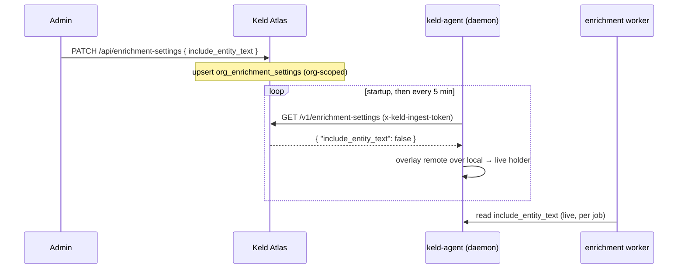

# Org enrichment settings — the keld-agent control plane

`keld-agent` (the local enrichment daemon) is governed **per organization** from
Keld Atlas. An admin sets policy once; every running agent in the org picks it up
within one poll interval — no redeploy, no per-machine config. This is the "org
control plane" the local `~/.keld/agent-config.json` was always meant to grow
into.

Today it governs one setting, `include_entity_text`. The mechanism is
deliberately generic: new keys ride the same document, endpoint, and client with
no protocol change.

## Why this exists

The enrichment daemon derives structure from your prompts (task type, domain,
sensitivity) and forwards it to Atlas. **Sensitive spans are always masked** —
that is not configurable. What *is* governable is whether the daemon also
includes the surrounding **domain-entity surface text** (`include_entity_text`),
which is richer but higher-signal. An org admin should be able to turn that off
for everyone at once, and have it stick. That is what this subsystem provides.

> **Capture surfaces.** Enrichment covers prompts captured two ways: the command
> hook (Claude Code CLI and other hook-capable tools) and the on-device
> transcript watcher (Claude Code on any surface, incl. the Desktop app, plus
> Cowork). Both go through the same masking and settings governance described
> here — `include_entity_text` and always-on span masking apply identically
> regardless of which trigger captured the prompt.

## Governance model

**Remote overrides local, per key present.** For any key the org has set, the
org value wins. Keys the org leaves unset fall back to the machine's local
`~/.keld/agent-config.json`. There is no per-key "enforced" flag — the whole
remote document is authoritative for the keys it contains.

Concretely, each poll recomputes the *effective* settings as:

```
effective = local base  (loaded once at daemon startup)
            with each key present in the remote document overlaid on top
```

So if the org later *unsets* a key, that key reverts to the local base on the
next poll. A remote document that omits a key never forces a value.

## Architecture



The daemon reads the **live** value per job, so a poll update takes effect
without a restart. Fetch failures (network, a 404 on an Atlas that predates the
endpoint, a decode error) are **non-fatal**: the daemon logs and keeps the
last-known effective settings, retrying on the next tick. This means the client
ships safely ahead of the server — before the endpoint exists, the agent simply
runs on local settings.

## HTTP API

The daemon-facing route lives under `/v1` (like the other ingest routes); the
admin routes live under `/api`. All routes are **org-scoped** — a caller only
ever reads or writes its own organization's row.

### `GET /v1/enrichment-settings` — daemon

Read the effective settings for the caller's org. Authenticated with the same
ingest token the daemon already uses to publish (`x-keld-ingest-token`), which
resolves to the org.

Request:

```http
GET /v1/enrichment-settings HTTP/1.1
x-keld-ingest-token: <ingest token>
```

Response `200`:

```json
{ "include_entity_text": false }
```

- Returns the org's stored values, or documented defaults when the org has no row
  (`include_entity_text` defaults to `false`).
- A missing or invalid token → `401` (before any data is returned).
- Clients ignore unknown keys, so the response may grow new keys without breaking
  older agents.

### `GET /api/enrichment-settings` — admin

Read the org's current settings. Requires an authenticated **admin** session
(the `keld_session` cookie); scoped to the admin's org. Same body shape as above.

### `PATCH /api/enrichment-settings` — admin

Set one or more settings for the org. Admin session required; org-scoped;
upserts the org's row.

Request:

```http
PATCH /api/enrichment-settings HTTP/1.1
Content-Type: application/json

{ "include_entity_text": true }
```

Response `200` — the stored settings after the write:

```json
{ "include_entity_text": true }
```

## Data model

One row per organization:

| Table | Column | Type | Notes |
|-------|--------|------|-------|
| `org_enrichment_settings` | `org_id` | uuid (PK) | FK → `organizations.id`, `ON DELETE CASCADE` |
| | `include_entity_text` | bool | `NOT NULL`, server default `false` |
| | `updated_at` | timestamptz | server default `now()`, `onupdate now()` |

Created by Alembic migration `0028_org_enrichment_settings`. When no row exists
for an org, the API returns defaults — a row is created lazily on the first admin
`PATCH`.

## Settings keys

| Key | Type | Default | Meaning |
|-----|------|---------|---------|
| `include_entity_text` | bool | `false` | Include domain-entity **surface text** in enrichments sent to Atlas. Sensitive spans are always masked regardless of this setting. |

**Adding a key** is a small, additive change with no protocol churn: add the
column + a migration and the response field on the Atlas side; add the field to
the client's remote type and overlay it in the live holder on the keld-cli side.
Old agents ignore keys they don't recognize; the server fills defaults for keys
an org hasn't set.

## Client behavior (keld-agent)

- **Poll cadence:** on startup, then every **5 minutes**. Override with
  `KELD_SETTINGS_POLL` (a Go duration like `30s`, `2m`) — intended for tests and
  local development.
- **Endpoint:** derived from the configured ingest endpoint, swapping the
  trailing `/v1/…` segment for `/v1/enrichment-settings`.
- **Live apply:** the enrichment worker reads the current effective value on each
  job; a poll update needs no restart.
- **Non-fatal:** any fetch error keeps the last-known effective settings.
- **Eventual consistency:** a change takes up to one poll interval (5 min) to
  reach an agent. This is acceptable for settings governance and is by design.

## Admin UI

Admins can flip `include_entity_text` from the Atlas admin **Settings** page —
an "Include entity text" toggle wired to `PATCH /api/enrichment-settings`. The
capability is fully available via the API without the UI.

## Security

- **Org isolation:** every query filters by the caller's org (from the ingest
  token for the daemon route, from the authenticated admin's org for the admin
  routes). One org can never read or write another's settings.
- **Auth separation:** the daemon route is not admin-gated; the admin routes are
  not reachable with only an ingest token.
- **Masking is not governed here:** sensitivity spans are always masked in
  enrichments regardless of `include_entity_text`. This setting only controls the
  additional domain-entity surface text.

## Deploying

Apply the migration on the Atlas side before agents start polling in earnest:

```bash
docker compose exec api alembic upgrade head   # creates org_enrichment_settings
```

Until then, agents get a `404` on the endpoint, treat it as non-fatal, and run on
local settings.
