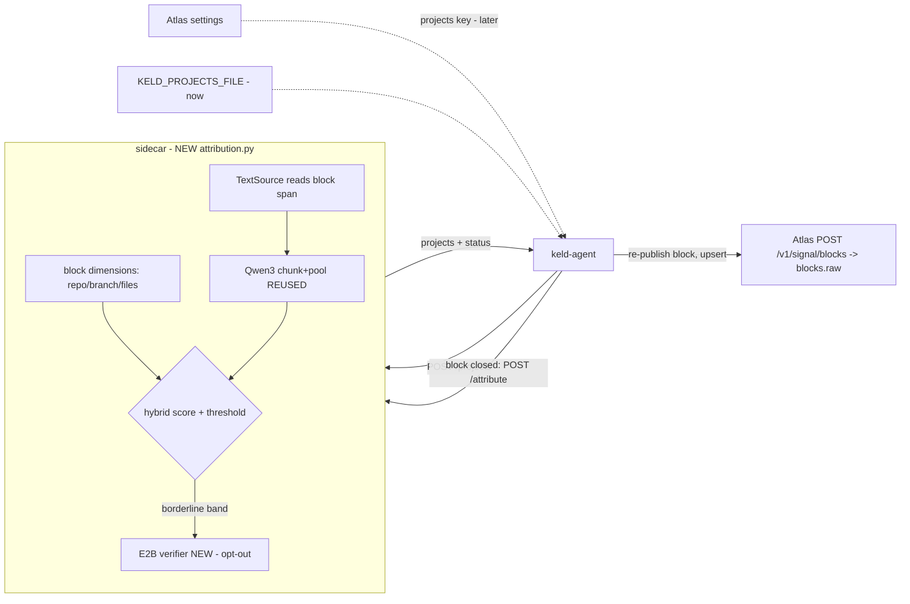
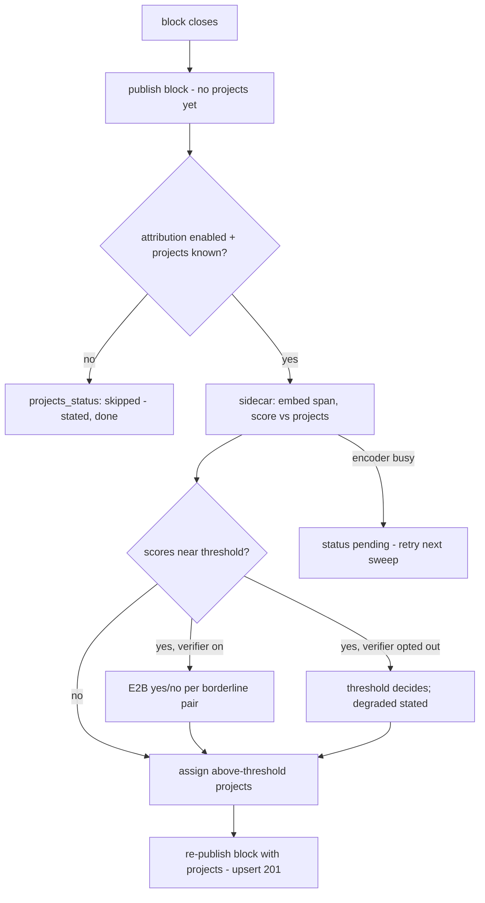

# Block-Level Project Attribution — Light Discovery Document

**Status:** Draft — awaiting sign-off
**Author:** Fable 5 — thinking: medium
**Date:** 2026-09-01

## 1. Hypothesis & Scope Boundaries

### The "Why"
* **Problem:** Atlas knows which repo a block touched, but not which org project it served.
* **Who feels it:** Org admins reading the blocks rail; they see repos, not initiatives.
* **Business value:** Cost and effort reporting by real project, on-device, no prompt text shipped.
* **Hypothesis:** Embedding + metadata + local verifier attributes blocks to projects at useful accuracy. Benchmark: F1 0.929 (`embedding-experiment/report.md`).

### Goals
* **G1:** Every closed block can carry `projects` — multi-label org-project attribution.
* **G2:** Automated tests prove the wire format end-to-end against a local Atlas.
* **G3:** Project definitions arrive via the remote-settings seam, mockable locally.

### Acceptance Criteria

| ID | Criterion | Observable at | Verified by |
|---|---|---|---|
| AC-1 | `settings.Remote` decodes a `projects` key; absent key leaves attribution reporting `skipped:no_projects`. | `internal/agent/settings/remote.go` | Go test `TestRemoteProjectsDecode` |
| AC-2 | `KELD_PROJECTS_FILE` loads mock project definitions when Atlas serves none. | daemon startup log + sidecar `/projects` | Go test + pytest `test_projects_file_override` |
| AC-3 | Sidecar `POST /attribute` returns multi-label `[{id, confidence, source}]` for a block span. Deterministic under a fake encoder. | sidecar HTTP | pytest `test_attribution_end_to_end` |
| AC-4 | A block whose `repo`/`branch`/files match a project's `repos`/`ticket_key` gets a metadata boost. Boost works with the model absent. | attribution scores | pytest `test_metadata_boost_model_free` |
| AC-5 | Verifier runs only on pairs within the borderline band. Its verdict overrides the score. | attribution result `source: verifier` | pytest `test_verifier_band_only` |
| AC-6 | `KELD_ATTRIBUTION_VERIFIER=0` (or config `attribution_verifier: false`) skips the verifier. Result says `facets_degraded: [projects_verifier]`, never silently. | wire payload | pytest + Go test |
| AC-7 | `BlockEnrichment` carries `projects` + `projects_status` + an `attribution` meta object: `{embed_ms, verify_ms, pairs_verified, encoder_state, verifier, model_versions}`. Numbers and enums only — no field can carry message text or vectors. | `internal/agent/publish/block.go` | Go test extending `TestEnrichmentWireShapeCannotCarryAnalysisInternals` pattern |
| AC-8 | First block publish is not delayed by attribution. A re-publish upserts the same `(session, start)` identity with `projects` filled. A pending job survives a daemon restart via the on-disk spool. | emitter → httptest Atlas | Go tests `TestBlockRepublishWithProjects`, `TestAttributionJobSurvivesRestart` |
| AC-9 | Golden block payload POSTs to local Atlas → 201; `blocks.raw->'projects'` matches the golden JSON. | local Atlas Postgres | `scripts/contract_test_atlas.sh` (docker-compose) |
| AC-10 | E2B GGUF provisions via fetch + SHA-256 verify, single-file sentinel. No download when attribution is off. | `internal/agent/provision` | Go test with fake fetcher |
| AC-11 | Smoke runbook exists and works: real session → block in local Atlas with `projects` populated. | `docs/attribution-smoke.md` | manual, together |
| AC-12 | Daemon startup emits one `agent.hardware` client-event: `{cpu_model, logical_cores, mem_total_gb, os_version}`. Envelope already stamps os, arch, and Signal version on every event. | client-events stream | Go test `TestHardwareEventOnStartup` |

### Explicit Exclusions
* No GLiNER sunsetting or removal of unused code paths. Second iteration, per user.
* No Atlas read-side UI for projects (rail/pane display). `raw` JSONB visibility only.
* No Atlas-side serving of real project definitions. The seam ships; the data is mocked.
* No per-prompt attribution. Blocks only — Atlas reads blocks now (`blocks_read.py`).
* No category hierarchy or secondary buckets (see `embedding-experiment/docs/notes/`).

## 2. Proposed Architectural Solution

### Prior Art — what this builds on

| Existing thing | Path | Role in this change |
|---|---|---|
| Qwen3-Embedding-0.6B integration | `sidecar/app/analysis/textembed.py` | reuse: encoder child, sentence chunking, pooling, message cache |
| Transcript text reading | `sidecar/app/analysis/featuretext.py:126` (`TextSource`) | reuse: the ONLY path that opens transcripts for text |
| Block cutting + characterisation | `sidecar/app/analysis/blocks.py`, `internal/agent/blocks/emitter.go` | extend: attribution rides the block |
| Block wire shape + upsert identity | `internal/agent/publish/block.go:65` | extend: `projects` field; re-publish is already idempotent |
| Remote settings seam | `internal/agent/settings/remote.go` | extend: `projects` key, same pattern as `PIIRegions` |
| Model provisioning | `internal/agent/provision/provision.go` | extend: per-model sentinel for single-file GGUF |
| Inference runner + governor | `sidecar/app/runner.py`, `governor.py` | reuse: single-flight, CPU pacing for the verifier |
| Deterministic metadata | block `dimensions` (repo, branch) + `files` inventory | reuse: the hybrid boost's inputs |
| Benchmark + thresholds | `embedding-experiment/` (hybrid+e2b F1 0.929, band ±0.08) | reuse: scoring logic ported to sidecar |

### Reuse Ledger

| Change | Reuse level | Justification |
|---|---|---|
| Embedding + chunking | reuse | `textembed.py` already does chunk → pool with this model |
| Text acquisition | reuse | `TextSource` seam exists; nothing else may open transcripts |
| `/attribute` endpoint | new module | No endpoint answers "score this span against documents" |
| Verifier (llama.cpp + GGUF) | new module | First generative model; nothing comparable exists |
| Projects distribution | extend | `Remote` struct documents this exact adoption pattern |
| Wire field | extend | `BlockEnrichment` + `SchemaVersion` 21 → 22 |

* **New patterns introduced:** llama-cpp-python as a sidecar dependency. Needs sign-off: first GGUF model, first generative inference on-device.
* **Shared-decision helpers:** one `attribution.py` owns scoring, threshold, band. Go never re-implements scoring.

### Technical Design
* **Data:** none in Atlas this iteration. `projects` lands in the existing `blocks.raw` JSONB (`keld-atlas services/api/app/models.py:1403`, `extra="ignore"` + raw stored).
* **API (sidecar):** `POST /projects` (daemon pushes definitions, sidecar caches + embeds once per content hash). `POST /attribute {path, session, start, end}` → `{projects: [...], status}`. Async like textembed: `pending:encoding` is a real status.
* **API (wire):** `projects: [{id, confidence, source: embedding|metadata|verifier}]`, `projects_status: attributed|pending|none|skipped:*|degraded:*`. IDs only. No text, no vectors.
* **Attribution telemetry:** the block also carries `attribution: {embed_ms, verify_ms, pairs_verified, encoder_state: warm|cold, verifier: used|opted_out|unavailable, model_versions}`. Lands in `blocks.raw` with the projects — mineable later without a schema change. A future org-consented Atlas metrics log reads from here (§8).
* **Hardware telemetry:** one `agent.hardware` client-event at startup (`cpu_model`, `logical_cores`, `mem_total_gb`, `os_version` where available). Coarse by design — enough to answer "is the verifier viable on this class of machine", not enough to fingerprint. The client-events envelope already carries os, arch, and Signal `version` on every event; Atlas joins timings (blocks) to hardware (client-events) via `install_id`/`actor`.
* **Flow:** block closes → emitter publishes immediately (unchanged) → daemon schedules attribution → on completion, emitter re-publishes the block with `projects`. Upsert on `(session, start)` makes this free.
* **Durability:** each pending attribution is a spooled job on disk (`internal/spool` pattern, like enrich pointers). Written at first publish, deleted after the attributed re-publish lands. Drained on startup and swept periodically. A laptop closed mid-attribution resumes a day later: the transcript file still holds the span (`TextSource` reads the file, not the pruned store), so the job completes late rather than never.
* **Projects source precedence:** `KELD_PROJECTS_FILE` (tests, smoke) → `Remote.Projects` (Atlas, later) → absent = `skipped:no_projects`.
* **Verifier:** Gemma 4 E2B Q4_K_M via llama-cpp-python. Runs in the recycled worker child under the runner's single-flight. ON when attribution is on; `KELD_ATTRIBUTION_VERIFIER=0` opts out (slow machines). Skipping degrades, never blocks.
* **Feature gate:** `attribution` config key + `KELD_ATTRIBUTION` env, same shape as `blocks` (`emitter.go:489`). Models provision on demand only when the gate is on.
* **Invariants respected:** no text/spans/offsets cross the wire; encoding off the request path; single-flight inference; a skip is stated, never silent; no health-gated fallback between scorers.

### System Diagram



## 3. Alternatives Considered

| Option | Approach | Rejected because |
|---|---|---|
| A | Attribution as a GLiNER custom pass (projects as labels) | Per-prompt, not per-block; GLiNER is absent on fresh installs; benchmark showed embedding+metadata beats description-classification for this task |
| B | Attribute per prompt on the enrichments stream | User chose blocks-only; Atlas reads blocks now; a block is the better unit (bounded, topically coherent) |
| C | Hold block publish until attribution completes | Adds minutes of latency to a stream that ships in ≤5; upsert re-publish costs nothing |
| D | Do nothing | Attribution stays repo-level; initiatives without a repo (SEO, SOC 2 analogues) stay invisible |

* **Closest call:** C. Decided by the upsert identity already existing — re-publish is the designed-for path (`emitter.go`: "prefers re-fetching and re-publishing").

## 4. Behavioral & Data-Driven Testing Specification

### User Flow Diagram



### Behavioral Specs

```gherkin
Feature: Block-level project attribution

  # Covers: AC-3, AC-8
  Scenario: Happy path
    Given a closed block whose span discusses a known project
    When attribution completes
    Then the block is re-published with that project id and projects_status "attributed"

  # Covers: AC-4
  Scenario: Metadata-only machine (no models)
    Given attribution is on but the encoder weights are absent
    When a block's repo matches a project's repos
    Then that project is attributed with source "metadata" and status "degraded:weights_unavailable"

  # Covers: AC-5, AC-6
  Scenario: Verifier opt-out
    Given KELD_ATTRIBUTION_VERIFIER=0
    When a pair lands in the borderline band
    Then the threshold decides alone and facets_degraded names the verifier

  # Covers: AC-1, AC-2
  Scenario: No projects known
    Given no KELD_PROJECTS_FILE and no remote projects key
    When a block closes
    Then the block publishes once with projects_status "skipped:no_projects"

  # Covers: AC-9
  Scenario: Wire contract against local Atlas
    Given docker-compose Atlas with a seeded org token
    When the golden block payload is POSTed
    Then Atlas returns 201 and blocks.raw->'projects' equals the golden value
```

### Decision Table

| # | encoder | metadata match | score vs threshold | verifier | Expected | AC |
|---|---|---|---|---|---|---|
| 1 | ready | yes | clear above | not called | attributed, source embedding+metadata | AC-3 |
| 2 | ready | no | borderline | says YES | attributed, source verifier | AC-5 |
| 3 | ready | no | borderline | opted out | threshold decides; degraded | AC-6 |
| 4 | absent | yes | n/a | n/a | attributed via metadata; degraded | AC-4 |
| 5 | ready | no | clear below (all) | not called | projects: [], status attributed | AC-3 |
| 6 | busy | any | n/a | n/a | pending; re-tried next sweep | AC-8 |
| 7 | daemon restarted mid-job | any | n/a | n/a | spooled job drained on startup; attributed re-publish still lands | AC-8 |

### Test layers

| Layer | Where | What it proves |
|---|---|---|
| pytest, fake encoder | `sidecar/app/test_attribution*.py` | scoring, boost, band, verifier stub, statuses (AC-3..6) |
| pytest, real models, tagged slow | `sidecar/app/test_attribution_quality.py` | F1 ≥ 0.85 on the ported 100-conversation benchmark |
| Go unit | `internal/agent/publish`, `settings`, `provision` | wire shape, settings decode, GGUF provisioning (AC-1, 7, 10) |
| Go + httptest Atlas | `internal/agent/blocks` | publish-then-republish, golden body (AC-8) |
| Contract vs real local Atlas | `scripts/contract_test_atlas.sh` | 201 + raw JSONB round-trip (AC-9) |
| Smoke, manual | `docs/attribution-smoke.md` | live session → local Atlas (AC-11) |

## 5. Integration, Dependencies & Security Surface

### System Contacts

| System | Direction | Change |
|---|---|---|
| Atlas `POST /v1/signal/blocks` | write | additive field; `extra="ignore"` + `raw` storage means zero Atlas change |
| Atlas `GET /v1/enrichment-settings` | read | new optional `projects` key; absent key is fully handled |
| Hugging Face Hub | read | E2B GGUF (~3GB) + Qwen weights (~1.2GB), only when attribution is on, SHA-verified |
| local filesystem | read | transcript spans via `TextSource`; models under `~/.keld/models/` |
| sidecar loopback | both | two new endpoints: `/projects`, `/attribute` |

### Data Privacy
* **New PII:** none. Wire carries project ids, confidences, source enums, statuses.
* **Cross-boundary data:** project definitions flow DOWN. Only ids flow up. Strictly less than the existing textembed path publishes when enabled.
* **Auth surface:** none new. Same ingest token, same loopback-only sidecar.

## 6. Success Metrics (KPIs)

| Metric | Baseline today | Target | Where read |
|---|---|---|---|
| Attribution F1 on ported benchmark | n/a | ≥ 0.85 (bench measured 0.929) | slow pytest output |
| Block first-publish latency | ≤ 5 min after close | unchanged | Go test AC-8 |
| Attribution completion per block (M-series CPU) | n/a | p50 ≤ 60s, stated `pending` otherwise | smoke run log |
| Sidecar worker RSS with both models | ~2.9GB observed ceiling | within existing recycle ceiling | loadtest `embed` + new arm |
| `verify_ms` p50/p95 by hardware class | n/a | reported (no target — data for the opt-out default decision) | blocks.raw × agent.hardware join |

## 7. Risks, Monitoring & Deployment Plan

### Risk Evaluation

| Risk | Likelihood | Impact | Class | Mitigation |
|---|---|---|---|---|
| E2B too slow on old CPUs | M | M | **Med** | opt-out flag (AC-6); per-pass timeout cancels in-flight (existing pattern) |
| Two models breach worker RSS ceiling | M | M | **Med** | verifier runs in the recycled child; load one model at a time; loadtest arm before merge |
| Synthetic-benchmark optimism on real transcripts | H | M | **Med** | smoke phase judges real sessions; thresholds are config, not constants |
| Projects churn forces re-embeds | L | L | Low | embed once per content hash; a handful of docs, ~1s each |
| Fresh-install "no downloads" stance vs default-on verifier | M | M | **Med** | attribution gate off until org enables; verifier default-on only *within* the gate — see §8 |

### Destructive Change Ledger

| Change | Reversible? | Blast radius | Guard |
|---|---|---|---|
| `SchemaVersion` 21 → 22 | yes (additive fields only) | Atlas ingest — `extra="ignore"` proven | AC-9 contract test |
| New model downloads (~4.2GB) on gated machines | yes (delete dir) | disk + first-run bandwidth | gate off by default; SHA-verified |

### Observability
* **Reused signals:** client-events (job retries, sidecar crashes, os/arch/version envelope), `pipeline_status`/`facets_degraded` pattern, loadtest harness.
* **New signals:** `projects_status` + `attribution` timings on every block when the gate is on; one `agent.hardware` event per daemon start. Nothing else.

### Rollback Plan
* **Flag:** `attribution` config key + `KELD_ATTRIBUTION`, default off. `KELD_ATTRIBUTION_VERIFIER` opts the verifier out independently.
* **Steps:** flip the gate off → blocks publish exactly as today; field simply absent. Delete `~/.keld/models/gemma-4-e2b*` to reclaim disk. No data migration either way.

## 8. Open Gaps & Technical Debt

| # | Unknown or debt | Blocks implementation? | Needs |
|---|---|---|---|
| 1 | Real project definitions + Atlas serving the `projects` key | no — file override unblocks | user defines soon; Atlas change is additive |
| 2 | Atlas read-side display of projects (rail/pane) | no | iteration 2, Atlas repo |
| 3 | Org rollout policy: installer default vs org opt-in for the attribution gate | no | user decision before shipping to customers |
| 4 | GLiNER sunset / unused-path cleanup | no | explicitly deferred, iteration 2 |
| 5 | Verifier prompt tuning on real transcripts | no | smoke phase feedback loop |
| 6 | Block span text cache interplay with `KELD_TEXTEMBED_CACHE_SESSIONS` | no | measure during implementation |
| 7 | Atlas-side metrics log aggregating attribution timings across customers (org-consented) | no | later Atlas iteration; reads blocks.raw × agent.hardware, both accumulating from day one |
| 8 | Data-driven verifier default per hardware class (auto opt-out on slow machines, stated as degraded) | no | needs the §6 verify_ms-by-hardware data first |

## 9. Review Log

| AC | Verdict | Evidence |
|---|---|---|
