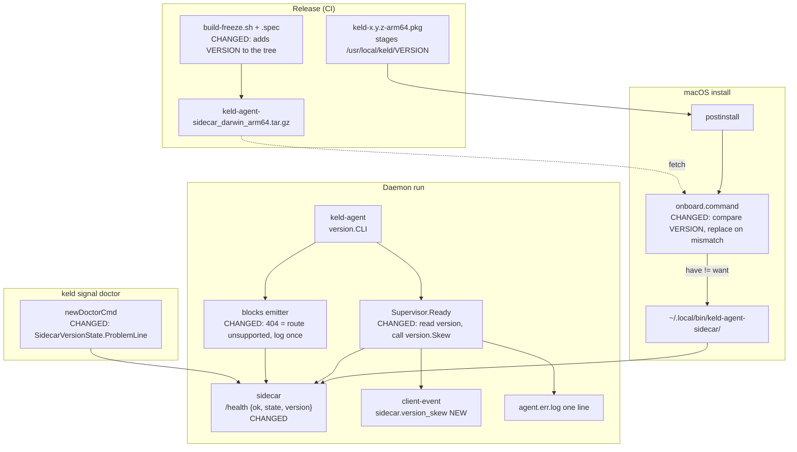
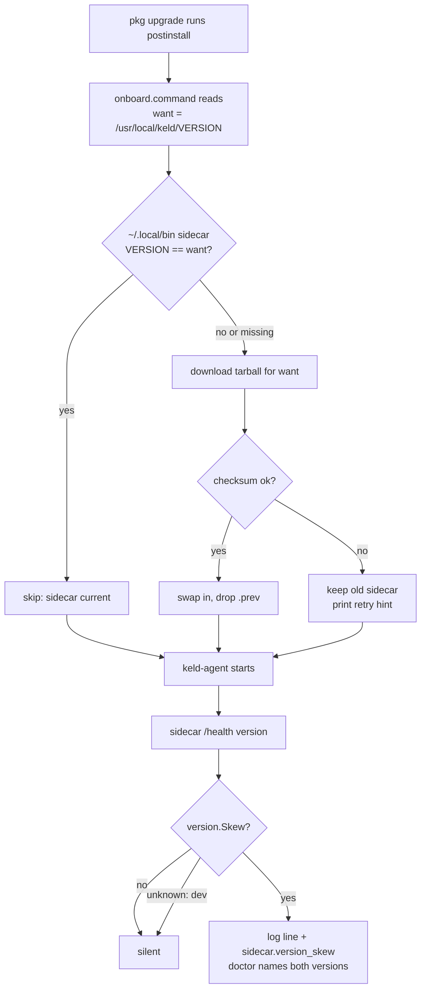

# Sidecar Version Skew — Light Discovery Document

**Status:** Signed off 2026-09-04 · implemented · reviewed (9 MET + 1 closed from PARTIAL)
**Author:** Fable 5.1 — thinking: high
**Date:** 2026-09-04

## 1. Hypothesis & Scope Boundaries

### The "Why"
* **Problem:** The daemon and the frozen sidecar ship as two halves with no version handshake, so a 2.3.0 daemon ran for weeks against an Aug 11 sidecar and published no blocks, silently.
* **Who feels it:** Any macOS user who upgrades via the pkg over an earlier install. They see telemetry in Atlas and no blocks, and `keld signal doctor` says nothing. Windows and Linux do not hit the install half: the Inno payload overwrites the sidecar tree on every install (`installers/windows/keld-agent.iss:22`, `ignoreversion recursesubdirs`) and `install.sh` replaces it unconditionally. The detection half applies on all three.
* **Business value:** Blocks and attribution are the product. A fleet that quietly stops emitting them after an upgrade looks healthy and is not.
* **Hypothesis:** If the sidecar carries its version, the installer compares it, and the daemon reports a mismatch, then a stale sidecar is either replaced at install or visible within one daemon start.

### What happened on this machine

| Time (EEST) | Event | Evidence |
|---|---|---|
| Aug 11 | Frozen sidecar bundle installed to `~/.local/bin/keld-agent-sidecar/` | `ls -la` mtime; routes were `/classify /entities /extract /health /metrics` only |
| Aug 27 | `/blocks` route lands in the sidecar; block emitter ships | `git log -- internal/agent/blocks` |
| Sep 4 01:42 | 2.3.0 pkg installs `keld` and `keld-agent`; `onboard.command` sees a sidecar and skips the fetch | `installers/macos/onboard.command:32` |
| Sep 4, all day | Daemon asks the old sidecar for `/blocks` and `/projects`, gets 404, treats it as "nothing closed" | `internal/agent/blocks/emitter.go:352`; log line `/projects update failed` every 5 min |
| Sep 4 13:57 | Sidecar replaced by hand with the 2.3.0 tarball; first sweep posts two blocks | `blocks` table, `received_at 11:02:17Z` |

The blocks seen the night before came from a second agent run by hand from the repo with a current sidecar, not from the installed daemon.

### Goals
* **G1:** After a pkg install, the sidecar on disk matches the daemon's release.
* **G2:** A mismatch that still occurs is stated by the daemon, the client-events feed, and doctor within one daemon start.
* **G3:** A route the sidecar lacks is never read as an empty answer.

### Acceptance Criteria

| ID | Criterion | Observable at | Verified by |
|---|---|---|---|
| AC-1 | The frozen sidecar tarball contains `keld-agent-sidecar/VERSION` whose content equals the release tag | release asset | `scripts/verify-release-assets_test.sh` (new case: tarball lists `VERSION`) |
| AC-2 | `GET /health` carries `version`, read from that file, and `"dev"` when the file is absent | sidecar `/health` | `PYTHONPATH=. ~/.keld/sidecar-venv/bin/python app/test_main.py` (`test_health_reports_version`) |
| AC-3 | `onboard.command` replaces the sidecar when the installed `VERSION` differs from `$PREFIX/VERSION`, and skips when equal | `~/.local/bin/keld-agent-sidecar/VERSION` | `installers/macos/onboard_command_test.sh` (cases: stale, current) |
| AC-4 | `onboard.command` replaces a sidecar tree that has no `VERSION` file | same | same test, case: legacy |
| AC-5 | The daemon emits `sidecar.version_skew` (warn, floor-exempt) once per run when the sidecar's `version` differs from `version.CLI`; fields `daemon`, `sidecar` | `/v1/signal/client-events` | `go test ./internal/agent/daemon -run TestSidecarVersionSkewEvent` |
| AC-6 | The daemon logs one line naming both versions on skew, and none when equal | `~/.keld/logs/agent.err.log` | same test, log capture |
| AC-7 | `keld signal doctor` prints a problem naming both versions and the remedy on skew; prints nothing for it when equal or when the sidecar is unreachable | doctor stdout | `go test ./internal/cli -run TestDoctorSidecarVersionSkew` |
| AC-8 | `sidecar.Client.Blocks` reports `RouteUnsupported` on 404; the emitter logs `sidecar has no /blocks route` once per run and holds the cursor | agent log; `~/.keld/state/blocks.json` unchanged | `go test ./internal/agent/enrich/sidecar -run TestBlocks404RouteUnsupported` and `go test ./internal/agent/blocks -run TestEmitterRouteUnsupportedLogsOnce` |
| AC-9 | When either side reports `dev`, no skew event and no doctor line | client-events, doctor stdout | `go test ./internal/agent/daemon -run TestSidecarVersionSkewDevIsSilent` |
| AC-10 | `docs/signal-client-events.md` catalog lists `sidecar.version_skew` | doc | `grep -q 'sidecar.version_skew' docs/signal-client-events.md` |

### Explicit Exclusions
* `scripts/install.sh` is unchanged. It already replaces the sidecar unconditionally (`scripts/install.sh:228-240`).
* The Windows installer is not examined here. See section 8.
* The auto-updater and the Atlas `agent_release` pin are unchanged. They already refresh the sidecar when they run (`internal/agent/update/update.go:138`).
* `keld signal restart` rewriting the LaunchAgent to the wrong binary is a separate bug. See section 8.
* No cleanup of `~/.local/bin/keld-agent-sidecar.prev`.

## 2. Proposed Architectural Solution

### Prior Art — what this builds on

| Existing thing | Path | Role in this change |
|---|---|---|
| `fetch_sidecar` skip-if-present | `installers/macos/onboard.command:30-35` | extend: compare versions before skipping |
| `install.sh` swap with `.prev` | `scripts/install.sh:228-240` | reuse: the swap `onboard.command` already mirrors |
| pkg stages `VERSION` | `installers/macos/build-pkg.sh:19` | reuse: the comparison's right-hand side |
| `version.CLI` via ldflags | `internal/version/version.go:6` | reuse: the daemon's own version |
| PyInstaller `datas` | `sidecar/keld-agent-sidecar.spec:97` | extend: add `VERSION` to the frozen tree |
| `/health` handler | `sidecar/app/main.py:1224-1233` | extend: add `version` |
| `Client.Healthy` | `internal/agent/enrich/sidecar/client.go:666` | extend: also return the parsed `version` |
| 404 → `RouteUnsupported` on `/attribute` | `internal/agent/enrich/sidecar/client.go:967` | generalize: same reading for `/blocks` |
| `Blocks` post | `internal/agent/enrich/sidecar/blocks.go:121` | extend: use `postStatus`, map 404 |
| Emitter `!ok` branch | `internal/agent/blocks/emitter.go:352-358` | extend: log once when the route is unsupported |
| `sidecar.unavailable` emit | `internal/agent/daemon/supervisor.go:246` | reuse: the emit idiom for `sidecar.version_skew` |
| `Supervisor.Ready` | `internal/agent/daemon/supervisor.go:208` | reuse: the moment to read the version |
| `localagent.Health` | `internal/localagent/health.go:31` | extend: parse `version` from `/health` |
| `ModelState.ProblemLine` | `internal/localagent/models.go:126` | reuse: the doctor-line idiom |
| `newDoctorCmd` | `internal/cli/status.go:175-270` | extend: one more `ProblemLine` |
| Leading-`v` normalizer | `internal/agent/update/` (pin comparison) | reuse: the same normalization |
| Event catalog | `docs/signal-client-events.md:132` | extend: one row |

### Reuse Ledger

| Change | Reuse level | Justification |
|---|---|---|
| `VERSION` file in the sidecar tree | extend | PyInstaller `datas` already ships files; the pkg already stages a `VERSION` |
| `version` on `/health` | extend | `/health` is what the daemon and doctor already read |
| Version check in `onboard.command` | extend | The swap logic exists; only the skip condition changes |
| Skew report at ready | extend | `Supervisor` already has an emitter and a ready flag |
| `RouteUnsupported` for `/blocks` | generalize | `/attribute` already reads 404 this way |
| Doctor line | extend | `ProblemLine` idiom, one more call in `newDoctorCmd` |
| `version.Skew(a, b)` helper | new module (small) | Two callers need one rule; see below |

* **New patterns introduced:** None.
* **Shared-decision helpers:** `version.Skew(daemon, sidecar string) (skewed bool, known bool)`. Strips one leading `v`. Returns `known=false` when either side is `dev` or empty. The daemon and doctor both call it.

### Technical Design
* **Data:** None. No schema, no store change.
* **API:** `/health` gains `version` (additive). Client-events gain `sidecar.version_skew` (additive, warn, floor-exempt, once per run).
* **Read path:** doctor reads `/health` through the existing `localagent.Health` fetch seam. The daemon reads it once after the supervisor's first ready.
* **Invariants respected:** No text, span or offset crosses. The event carries two version strings. `/health` stays cheap and lock-free. Doctor never invents a problem when the sidecar is unreachable (AC-7).

`onboard.command` rule, in order:

1. Read `want` from `$PREFIX/VERSION`. Empty or `*dryrun*` falls back to the latest-release API, as today.
2. Read `have` from `~/.local/bin/keld-agent-sidecar/VERSION`. Missing file means `have=""`.
3. If `have == want`, skip and say so. Otherwise fetch, verify, swap. The swap is the block that already exists.

### System Diagram



## 3. Alternatives Considered

| Option | Approach | Rejected because |
|---|---|---|
| A | Bundle the sidecar inside the pkg so both halves always install together | Apple notarization scans every file; a 15k-file payload sat 4+ hours in the queue. That is why the pkg ships without it (`AGENTS.md`, macOS signing gotcha). |
| B | Have the daemon fetch the sidecar itself when it detects skew | Unattended binary replacement is the auto-updater's job and is gated on an Atlas pin for a reason. A second downloader is a parallel system. |
| C | Probe routes at spawn (`OPTIONS /blocks`) instead of comparing versions | Tells you one route is missing, not that the whole half is stale. Every new route would need a probe. |
| D | Always re-download in `onboard.command`, like `install.sh` | Correct but costs ~300 MB per re-run of a script that is documented as safe to re-run. The version check makes the re-run free. |
| E | Do nothing | Every pkg upgrade over an existing install keeps the old sidecar. Blocks stop for that user and nothing says so. |

* **Closest call:** D. Unconditional replace is simpler and matches `install.sh`. The version file wins because it also gives the daemon and doctor something to compare, which D does not.

## 4. Behavioral & Data-Driven Testing Specification

### User Flow Diagram



### Behavioral Specs

```gherkin
Feature: Sidecar version skew

  # Covers: AC-3
  Scenario: Upgrade over a stale sidecar
    Given /usr/local/keld/VERSION is "2.3.0"
    And ~/.local/bin/keld-agent-sidecar/VERSION is "2.2.1"
    When onboard.command runs
    Then the sidecar tree is replaced
    And ~/.local/bin/keld-agent-sidecar/VERSION is "2.3.0"

  # Covers: AC-3
  Scenario: Re-run with a current sidecar
    Given both VERSION files read "2.3.0"
    When onboard.command runs
    Then no download happens
    And the output says the sidecar is current

  # Covers: AC-4
  Scenario: Upgrade over a pre-VERSION sidecar
    Given ~/.local/bin/keld-agent-sidecar has no VERSION file
    When onboard.command runs
    Then the sidecar tree is replaced

  # Covers: AC-1, AC-2
  Scenario: Frozen sidecar reports its version
    Given a sidecar started from a tree containing VERSION "2.3.0"
    When GET /health is called
    Then the body contains "version": "2.3.0"

  # Covers: AC-5, AC-6
  Scenario: Daemon detects skew at ready
    Given keld-agent is "2.3.0"
    And the sidecar /health reports version "2.2.1"
    When the supervisor first reports ready
    Then one sidecar.version_skew event is emitted with daemon "2.3.0" and sidecar "2.2.1"
    And one log line names both versions
    And no second event is emitted on later health polls

  # Covers: AC-9
  Scenario: Developer wrapper is not skew
    Given keld-agent is "dev" or the sidecar reports "dev"
    When the supervisor first reports ready
    Then no sidecar.version_skew event is emitted

  # Covers: AC-7
  Scenario: Doctor names the skew and the remedy
    Given keld is "2.3.0" and the sidecar /health reports "2.2.1"
    When keld signal doctor runs
    Then stdout contains a problem line with "2.3.0", "2.2.1" and "onboard.command"

  # Covers: AC-7
  Scenario: Doctor stays quiet when it cannot tell
    Given the sidecar is not answering
    When keld signal doctor runs
    Then no version-skew line is printed

  # Covers: AC-8
  Scenario: Old sidecar has no /blocks route
    Given the sidecar answers 404 to POST /blocks
    When the block emitter sweeps
    Then Blocks returns RouteUnsupported
    And the log says the sidecar has no /blocks route, once
    And the transcript's cursor in blocks.json is unchanged
```

### Decision Table

| # | Installed `VERSION` | Equals pkg `VERSION`? | Network | Expected | AC |
|---|---|---|---|---|---|
| 1 | present | yes | any | skip, "current" | AC-3 |
| 2 | present | no | up | replace | AC-3 |
| 3 | absent | n/a | up | replace | AC-4 |
| 4 | present | no | down | keep old, retry hint; daemon reports skew | AC-3, AC-5, AC-7 |
| 5 | `dev` wrapper | n/a | any | daemon silent | AC-9 |

## 5. Integration, Dependencies & Security Surface

### System Contacts

| System | Direction | Change |
|---|---|---|
| GitHub release assets | read | `onboard.command` fetches when versions differ, not only when absent |
| `~/.local/bin/keld-agent-sidecar/` | write | replaced on mismatch |
| sidecar `/health` | read | one more field |
| `/v1/signal/client-events` | write | one new code |
| `~/.keld/logs/agent.err.log` | write | one line per skewed run |

### Data Privacy
* **New PII:** None.
* **Cross-boundary data:** Two version strings in a client event. No text, span or offset.
* **Auth surface:** None. `/health` stays unauthenticated on loopback, as today.

## 6. Success Metrics (KPIs)

| Metric | Baseline today | Target | Where read |
|---|---|---|---|
| Machines with telemetry but zero blocks in 24h | unknown fleet-wide; 1 of 1 here for ~3 weeks | 0 after upgrade | Atlas: `blocks` vs `tool_events` by `source_id` |
| `sidecar.version_skew` events per org per day | no signal exists | 0 once the fleet is on this release | Atlas `client_events` by code |
| Time from stale sidecar to a human seeing it | weeks, found by hand | one daemon start | doctor stdout, client events |

## 7. Risks, Monitoring & Deployment Plan

### Risk Evaluation

| Risk | Likelihood | Impact | Class | Mitigation |
|---|---|---|---|---|
| Every pkg upgrade now downloads ~300 MB | H | L | **Low** | That is the intended behaviour; the version check makes re-runs free |
| Upgrade with no network keeps the stale sidecar | M | M | **Med** | Daemon and doctor now say so; re-running `onboard.command` retries |
| `VERSION` missing from a release tarball | L | H | **Med** | AC-1 gates it in `verify-release-assets` |
| A dev wrapper is nagged as skew | M | L | **Low** | AC-9: `dev` on either side is silent |
| `/health` version read adds latency to the ready gate | L | L | **Low** | Read once after ready, off the gate's poll |

### Destructive Change Ledger

| Change | Reversible? | Blast radius | Guard |
|---|---|---|---|
| `onboard.command` replaces an existing sidecar tree or dev wrapper at that path | yes, `.prev` exists until the swap completes | one user's `~/.local/bin` | same swap `install.sh` already performs; checksum before swap |
| `/health` response gains a key | yes | all `/health` readers | additive; old readers ignore it |
| Client-event catalog gains a code | yes | Atlas `client_events` consumers | additive |

### Observability
* **Reused signals:** `sidecar.unavailable` idiom, doctor's `ProblemLine` idiom, the daemon log.
* **New signals:** `sidecar.version_skew` (warn, floor-exempt, once per run).

### Rollback Plan
* **Flag:** None. Shell and additive Go/Python changes.
* **Steps:** Revert the commits. A replaced sidecar stays replaced, which is the desired state. No data written.

## 8. Open Gaps & Technical Debt

| # | Unknown or debt | Blocks implementation? | Needs |
|---|---|---|---|
| 1 | ~~Windows Inno installer: does it ship the sidecar in the payload and replace it on upgrade?~~ Answered 2026-09-04: yes, `keld-agent.iss:22` bundles it with `ignoreversion recursesubdirs`, so every install overwrites it | no | nothing |
| 2 | Does prod Atlas serve `agent_release`? If not, the auto-updater never refreshes sidecars either | no | one query against prod settings |
| 3 | `keld signal restart` writes the LaunchAgent with `os.Executable()` of the caller (`internal/agent/service/service_darwin.go:94`), so running it from `keld` registers `keld run` and crash-loops the daemon. Linux and Windows do the same | no | its own fix; the endpoint script calls it on every `use` |
| 4 | The blocks emitter's `!ok` branch swallows every non-503 failure, not only 404 | no | covered for 404 by AC-8; the rest is deferred |
| 5 | `installers/macos/onboard_command_test.sh` is static only; nothing executes `fetch_sidecar` in CI | no | AC-3/AC-4 add executable cases with a stub `curl` |
| 6 | Stale `~/.local/bin/keld-agent-sidecar.prev` (650 MB) on this machine | no | `rm -rf` when convenient |

## 9. Review Log

Graded 2026-09-04 by a read-only reviewer against the implementation diff. The criteria
above were not edited to match the code.

| AC | Verdict | Evidence |
|---|---|---|
| AC-1 | MET (PARTIAL at first grade, then closed) | Stamp: `sidecar/build-freeze.sh` writes `dist/keld-agent-sidecar/VERSION` from `${KELD_VERSION:-dev}`; `installers.yml` feeds it `TAG` on both freezes. First grade was PARTIAL: the gate lived inline in `installers.yml`, which nothing in the repo can execute — "the only unprotected link in a chain built to end a silent failure". Closed by extracting `scripts/check-sidecar-stamp.sh` and `scripts/check-sidecar-stamp_test.sh` (10 cases: stamped, dry-run, unstamped, wrong tag, empty, missing file, no args, and an `_internal/VERSION` decoy that must NOT satisfy it), wired into `ci.yml`'s shell suite. `sidecar/test_build_freeze.sh` additionally pins the write itself, comments stripped. |
| AC-2 | MET | `sidecar/app/main.py` `/health` returns `version`; `app/buildversion.py` reads it beside a frozen `sys.executable`, `dev` otherwise. `app/test_main.py` → 65 passed, including the frozen, missing-file and not-frozen cases. |
| AC-3 | MET | `installers/macos/onboard.command` compares the installed VERSION against `$tag`. `onboard_command_test.sh` passes and was mutation-tested by the reviewer: reverting to a presence-only skip, and dropping just the version comparison, are both caught. |
| AC-4 | MET | A missing VERSION yields an empty `have`, forcing the replace branch. Third case in the same green run. |
| AC-5 | MET | `daemon/versionskew.go` emits `sidecar.version_skew` floor-exempt at warn with both versions, once per run by construction. Wired in `sidecarService`, which both backends call. `TestSidecarVersionSkewEvent` passes. |
| AC-6 | MET | One log line naming both versions; `TestSidecarVersionMatchIsSilent` asserts zero output on agreement. |
| AC-7 | MET | `internal/cli/status.go` appends `localagent.SidecarVersion(...).ProblemLine()`. Silent set covers unreachable, garbage JSON, a pre-field sidecar, `dev`, no daemon and no sidecar. Reviewer note: the tests live in `internal/localagent`, not `internal/cli` as this document named, and the one-line wiring in `status.go` is itself untested. |
| AC-8 | MET | 404 maps to `RouteUnsupported`; the emitter latches one line per run and holds the cursor. Both tests pass, with 403 and 503 pinned as NOT route-unsupported. Reviewer note: test names differ from those named here, behaviour is the same. |
| AC-9 | MET | `version.Skew` returns `known=false` on `dev` or empty on either side. Both suites pass, including a sidecar answering with no `version` field at all. |
| AC-10 | MET | One catalog row in `docs/signal-client-events.md` carrying severity, source, fields and the dev/unreachable refusals. |

### Reviewer findings beyond the criteria

| # | Finding | Status |
|---|---|---|
| 1 | A declared **reuse** became a copy-paste: `version.normalize` was byte-identical to `update.NormalizeVersion`. | FIXED — `version.Normalize` is now the one home and `update.NormalizeVersion` delegates. |
| 2 | The skew read does not extend `Supervisor.Ready` as the Reuse Ledger declared; it runs its own 3s poll. Defensible (it needs the `/health` body, which `Ready()` does not carry) but it is a second poller. | Accepted as built. |
| 3 | The ledger row "`localagent.Health` → extend: parse version from /health" was WRONG: that function reads `/metrics`. The implementation added `SidecarVersion` + `HealthURL` instead. | Document was wrong; code is right. Not amended. |
| 4 | **Undeclared in section 7's ledger:** `BlocksCharacterised` changed signature from three returns to `enrich.BlocksAnswer` across two interfaces and the client. All call sites updated, suite green. | Recorded here rather than by editing the ledger. |
| 5 | **Undeclared in section 7's risk table:** every macOS upgrade now moves the sidecar tree while the daemon is running, because `postinstall` kickstarts the agent before opening `onboard.command`. Mitigated in practice — `keld-agent install` bounces the service immediately after — and Linux's `install.sh` already does this unconditionally. | Recorded here. |
| 6 | `docs/superpowers/.DS_Store` is untracked junk in the working tree; do not commit it. | For the author. |

Pass 2 otherwise clean (no undeclared pattern; the shared rule has one implementation).
Pass 3: all three destructive-change rows hold and the rollback plan still applies.
Pass 4: every explicit exclusion held, and nothing in the diff is untraceable to a criterion.
Pass 5: privacy invariant intact — the event carries two version strings, both primitives;
no text, span or offset crosses; `/health` stays lock-free with the version resolved once at
import.
